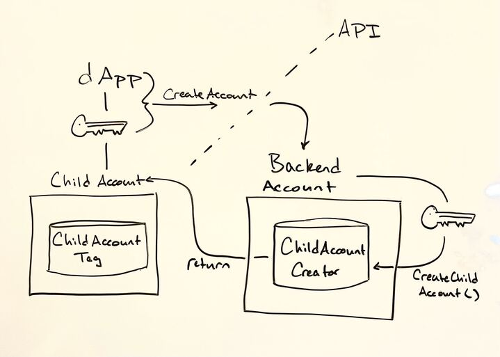

If you’ve built dapps on Flow, or any blockchain for that matter, you’re painfully aware of the user onboarding process and successive pain of prompting user signatures for on-chain interactions. As a developer, this leaves you with two options - custody the user’s private key and act on their behalf or go with the Web3 status quo, hope your new users are native to Flow and authenticate them via their existing wallet. Either choice will force significant compromise, fragmenting user experience and leaving much to be desired compared to the broader status quo of Web2 identity authentication and single-click onboarding flow.

In this doc, we’ll dive into a progressive onboarding flow, including the Cadence scripts & transactions that go into its implementation in your dapp. These components will enable any implementing dapp to create a custodial account, intermediate the user’s on-chain actions on their behalf, and later delegate control of that dapp-created account to the user’s wallet-mediated account. We’ll refer to this custodial pattern as the Hybrid Account Model and the process of delegating control of the dapp account as Account Linking.

# Objectives

- Establish a [walletless onboarding flow](https://flow.com/post/flow-blockchain-mainstream-adoption-easy-onboarding-wallets)
- Create a blockchain-native onboarding flow
- Link an existing app account as a child to a newly authenticated parent account
- Get your dapp to recognize “parent” accounts along with any associated “child” accounts
- View Fungible and NonFungible Token metadata relating to assets across all of a user’s associated accounts - their wallet-mediated “parent” account and any hybrid custody model “child” accounts
- Facilitate transactions acting on assets in child accounts

# Terminology

**Parent-Child accounts** - For the moment, we’ll call the account created by the dapp the “child” account and the account receiving its AuthAccount Capability the “parent” account. Existing methods of account access & delegation (i.e. keys) still imply ownership over the account, but insofar as linked accounts are concerned, the account to which both the user and the dapp share access via AuthAccount Capability will be considered the “child” account. This naming is a topic of community discussion and may be subject to change

**Walletless onboarding** - An onboarding flow whereby a dapp creates an account for a user, onboarding them to the dapp, obviating the need for user wallet authentication

**Blockchain-native onboarding** - Similar to the already familiar Web3 onboarding flow where a user authenticates with their existing wallet, a dapp onboards a user via wallet authentication while additionally creating a dapp account and linking it with the authenticated account, resulting in a hybrid custody model.

**Hybrid Custody Model** - A custodial pattern in which a dapp and a user maintain access to a dapp created account and user access to that account has been mediated by account linking.

**Account Linking** - Technically speaking, account linking in our context consists of giving some other account an AuthAccount Capability from the granting account. This Capability is maintained in (soon to be standard) resource called a `ChildAccountManager`, providing its owning user access to any and all of their linked accounts.

**Progressive Onboarding** - An onboarding flow that walks a user up to self-custodial ownership, starting with walletless onboarding and later linking the dapp account with the user’s authenticated wallet once the user chooses to do so.

# Onboarding Flows

Given the ability to establish an account and later delegate access to a user, dapps are freed from the constraints of dichotomous custodial & self-custodial patterns. A developer can choose to onboard a user via traditional Web2 identity and later delegate access to the user’s wallet account. Alternatively, a dapp can enable wallet authentication at the outset, creating a dapp specific account & linking with the user’s wallet account. As specified above, these two flows are known as walletless and blockchain-native respectively. Developers can choose to implement one for simplicity or both for user flexibility. 

## Walletless

### Account Creation



```jsx
import ChildAccount from "../contracts/ChildAccount.cdc"

/// This transaction creates an account using the signer's ChildAccountCreator,
/// funding creation via the signing account and adding the provided public key.
/// A ChildAccountTag resource is saved in the new account, identifying it as an
/// account created under this construction. This resource also holds metadata
/// related to the purpose of this account.
/// Additionally, the ChildAccountCreator maintains a mapping of addresses created
/// by it indexed on the originatingpublic key. This enables dapps to lookup the
/// address for which they hold a public key. 
///
transaction(
    pubKey: String,
    fundingAmt: UFix64,
    childAccountName: String,
    childAccountDescription: String,
    clientIconURL: String,
    clientExternalURL: String
  ) {
	
	prepare(signer: AuthAccount) {
		// Save a ChildAccountCreator if none exists
		if signer.borrow<&ChildAccount.ChildAccountCreator>(from: ChildAccount.ChildAccountCreatorStoragePath) == nil {
			signer.save(<-ChildAccount.createChildAccountCreator(), to: ChildAccount.ChildAccountCreatorStoragePath)
		}
		// Link the public Capability so signer can query address on public key
		if !signer.getCapability<&{ChildAccount.ChildAccountCreatorPublic}>(ChildAccount.ChildAccountCreatorPublicPath).check() {
			signer.unlink(ChildAccount.ChildAccountCreatorPublicPath)
			signer.link<
				&{ChildAccount.ChildAccountCreatorPublic}
			>(
				ChildAccount.ChildAccountCreatorPublicPath,
				target: ChildAccount.ChildAccountCreatorStoragePath
			)
		}
		// Get a reference to the ChildAccountCreator
		let creatorRef = signer.borrow<&ChildAccount.ChildAccountCreator>(
				from: ChildAccount.ChildAccountCreatorStoragePath
			) ?? panic("Problem getting a ChildAccountCreator reference!")
		// Construct the ChildAccountInfo metadata struct
    let info = ChildAccount.ChildAccountInfo(
          name: childAccountName,
          description: childAccountDescription,
          clientIconURL: MetadataViews.HTTPFile(url: clientIconURL),
          clienExternalURL: MetadataViews.ExternalURL(clientExternalURL),
          originatingPublicKey: pubKey
        )
		// Create the account, passing signer AuthAccount to fund account creation
		// and add initialFundingAmount in Flow if desired
    let newAccount: AuthAccount = creatorRef.createChildAccount(
        signer: signer,
        initialFundingAmount: fundingAmt,
        childAccountInfo: info
	    )
		// At this point, the newAccount can further be configured as suitable for
		// use in your dapp (e.g. Setup a Collection, Mint NFT, Configure Vault, etc.)
		// ...
	}
}
```

### Query Account Address

As mentioned above, the address of any accounts created via the `ChildAccountCreator` are saved  in its mapping, indexed on the originating public key. This feature was included because there is not currently a mechanism to determine a new account’s address without listening for account creation events.

With the `ChildAccountCreatorPublic` Capability configured, we can query the creating `ChildAccountCreator` with the public key we have to determine the corresponding account’s address. For a dapp querying for an address corresponding to a custodied key pair, it’s also relevant to know whether the key is still active (in other words has not been revoked). This is relevant in a situation where another party shares access to the account and has the ability to revoke the dapp’s keys.

```jsx
import ChildAccount from "../contracts/ChildAccount.cdc"

/// Returns the child address associated with a public key if account
/// was created by the ChildAccountCreator at the specified Address and
/// the provided public key is still active on the account.
///
pub fun main(creatorAddress: Address, pubKey: String): Address? {
  // Get a reference to the ChildAccountCreatorPublic Capability from creatorAddress
  if let creatorRef = getAccount(creatorAddress)
    .getCapability<
      &{ChildAccount.ChildAccountCreatorPublic}
    >(
      ChildAccount.ChildAccountCreatorPublicPath
    ).borrow() {
		// Get the address created by the given public key if it exists
    if let address = creatorRef.getAddressFromPublicKey(publicKey: pubKey) {
			// Also check that the given key has not been revoked
      if ChildAccount.isKeyActiveOnAccount(publicKey: pubKey, address: address) {
        return address
      }
    }
    return nil
  }
  return nil
}
```
