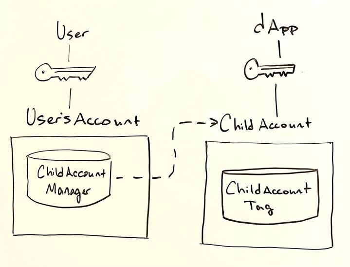

If you’ve built dApps on Flow, or any blockchain for that matter, you’re painfully aware of the user onboarding process and successive pain of prompting user signatures for on-chain interactions. As a developer, this leaves you with two options - custody the user’s private key and act on their behalf or go with the Web3 status quo, hope your new users are native to Flow and authenticate them via their existing wallet. Either choice will force significant compromise, fragmenting user experience and leaving much to be desired compared to the broader status quo of Web2 identity authentication and single-click onboarding flow.

In this doc, we’ll dive into a progressive onboarding flow, including the Cadence scripts & transactions that go into its implementation in your dApp. These components will enable any implementing dApp to create a custodial account, intermediate the user’s on-chain actions on their behalf, and later delegate control of that dApp-created account to the user’s wallet-mediated account. We’ll refer to this custodial pattern as the Hybrid Account Model and the process of delegating control of the dApp account as Account Linking.

# Objectives

- Establish a [walletless onboarding flow](https://flow.com/post/flow-blockchain-mainstream-adoption-easy-onboarding-wallets)
- Create a blockchain-native onboarding flow
- Link an existing app account as a child to a newly authenticated parent account
- Get your dApp to recognize “parent” accounts along with any associated “child” accounts
- View Fungible and NonFungible Token metadata relating to assets across all of a user’s associated accounts - their wallet-mediated “parent” account and any hybrid custody model “child” accounts
- Facilitate transactions acting on assets in child accounts

# Terminology

**Parent-Child accounts** - For the moment, we’ll call the account created by the dApp the “child” account and the account receiving its AuthAccount Capability the “parent” account. Existing methods of account access & delegation (i.e. keys) still imply ownership over the account, but insofar as linked accounts are concerned, the account to which both the user and the dApp share access via AuthAccount Capability will be considered the “child” account. This naming is a topic of community discussion and may be subject to change.

**Walletless onboarding** - An onboarding flow whereby a dApp creates an account for a user, onboarding them to the dApp, obviating the need for user wallet authentication.

**Blockchain-native onboarding** - Similar to the already familiar Web3 onboarding flow where a user authenticates with their existing wallet, a dApp onboards a user via wallet authentication while additionally creating a dApp account and linking it with the authenticated account, resulting in a hybrid custody model.

**Hybrid Custody Model** - A custodial pattern in which a dApp and a user maintain access to a dApp created account and user access to that account has been mediated by account linking.

**Account Linking** - Technically speaking, account linking in our context consists of giving some other account an AuthAccount Capability from the granting account. This Capability is maintained in (soon to be standard) resource called a `ChildAccountManager`, providing its owning user access to any and all of their linked accounts.

**Progressive Onboarding** - An onboarding flow that walks a user up to self-custodial ownership, starting with walletless onboarding and later linking the dApp account with the user’s authenticated wallet once the user chooses to do so.

# Onboarding Flows

Given the ability to establish an account and later delegate access to a user, dApps are freed from the constraints of dichotomous custodial & self-custodial patterns. A developer can choose to onboard a user via traditional Web2 identity and later delegate access to the user’s wallet account. Alternatively, a dApp can enable wallet authentication at the outset, creating a dApp specific account & linking with the user’s wallet account. As specified above, these two flows are known as walletless and blockchain-native respectively. Developers can choose to implement one for simplicity or both for user flexibility. 

## Walletless Onboarding

### Account Creation


*In this account creation scenario, a local dApp makes an API call to its backend account providing a public key along with the call. The backend account creates a new account using its `ChildAccountCreator` resource, funding its creation, and adding the provided public key to the new account.*

The following transaction creates an account using the signer's ChildAccountCreator, funding creation via the signing account and adding the provided public key. A ChildAccountTag resource is saved in the new account, identifying it as an account created under this construction. This resource also holds metadata related to the purpose of this account. Additionally, the ChildAccountCreator maintains a mapping of addresses created by it indexed on the originatingpublic key. This enables dApps to lookup the address for which they hold a public key.

Note that this is just one way to make an account on Flow, and your dApp doesn't necessarily have to implement a `ChildAccountCreator` to support a walletless onboarding flow. Any account can be linked in the 

```jsx
import ChildAccount from "../contracts/ChildAccount.cdc"
import MetadataViews from "../../contracts/utility/MetadataViews.cdc"

transaction(
    pubKey: String,
    fundingAmt: UFix64,
    childAccountName: String,
    childAccountDescription: String,
    clientIconURL: String,
    clientExternalURL: String
  ) {
	
	prepare(signer: AuthAccount) {
    // Save a ChildAccountCreator if none exists
    if signer.borrow<&ChildAccount.ChildAccountCreator>(from: ChildAccount.ChildAccountCreatorStoragePath) == nil {
      signer.save(<-ChildAccount.createChildAccountCreator(), to: ChildAccount.ChildAccountCreatorStoragePath)
    }
    // Link the public Capability so signer can query address on public key
    if !signer.getCapability<
        &ChildAccount.ChildAccountCreator{ChildAccount.ChildAccountCreatorPublic}
      >(ChildAccount.ChildAccountCreatorPublicPath).check() {
      // Unlink & Link
      signer.unlink(ChildAccount.ChildAccountCreatorPublicPath)
      signer.link<
        &ChildAccount.ChildAccountCreator{ChildAccount.ChildAccountCreatorPublic}
      >(
        ChildAccount.ChildAccountCreatorPublicPath,
        target: ChildAccount.ChildAccountCreatorStoragePath
      )
    }
    // Get a reference to the ChildAccountCreator
    let creatorRef = signer.borrow<&ChildAccount.ChildAccountCreator>(
        from: ChildAccount.ChildAccountCreatorStoragePath
      ) ?? panic("Problem getting a ChildAccountCreator reference!")
    // Construct the ChildAccountInfo metadata struct
    let info = ChildAccount.ChildAccountInfo(
        name: childAccountName,
        description: childAccountDescription,
        clientIconURL: MetadataViews.HTTPFile(url: clientIconURL),
        clienExternalURL: MetadataViews.ExternalURL(clientExternalURL),
        originatingPublicKey: pubKey
      )
    // Create the account, passing signer AuthAccount to fund account creation
    // and add initialFundingAmount in Flow if desired
    let newAccount: AuthAccount = creatorRef.createChildAccount(
        signer: signer,
        initialFundingAmount: fundingAmt,
        childAccountInfo: info
      )
    // At this point, the newAccount can further be configured as suitable for
    // use in your dApp (e.g. Setup a Collection, Mint NFT, Configure Vault, etc.)
    // ...
    }
}
```

### Query Account Address

As mentioned above, the address of any accounts created via the `ChildAccountCreator` are saved  in its mapping, indexed on the originating public key. This feature was included because there is not currently a mechanism to determine a new account’s address without listening for account creation events.

With the `ChildAccountCreatorPublic` Capability configured, we can query the creating `ChildAccountCreator` with the public key we have to determine the corresponding account’s address. For a dApp querying for an address corresponding to a custodied key pair, it’s also relevant to know whether the key is still active (in other words has not been revoked). This is relevant in a situation where another party shares access to the account and has the ability to revoke the dApp’s keys.

```jsx
import ChildAccount from "../contracts/ChildAccount.cdc"

/// Returns the child address associated with a public key if account
/// was created by the ChildAccountCreator at the specified Address and
/// the provided public key is still active on the account.
///
pub fun main(creatorAddress: Address, pubKey: String): Address? {
  // Get a reference to the ChildAccountCreatorPublic Capability from creatorAddress
  if let creatorRef = getAccount(creatorAddress).getCapability<
      &ChildAccount.ChildAccountCreator{ChildAccount.ChildAccountCreatorPublic}
    >(ChildAccount.ChildAccountCreatorPublicPath).borrow() {
    // Get the address created by the given public key if it exists
    if let address = creatorRef.getAddressFromPublicKey(publicKey: pubKey) {
      // Also check that the given key has not been revoked
      if ChildAccount.isKeyActiveOnAccount(publicKey: pubKey, address: address) {
        return address
      }
    }
    return nil
  }
  return nil
}
```

## Blockchain-Native Onboarding
Compared to walletless onboarding where a user does not have a Flow account, blockchain-native onboarding assumes a user already has a wallet configured and immediately links it with a newly created dApp account. This enables the dApp to sign transactions on the user's behalf via the new child account while immediately delegating control of that account to the onboarding user's main account.

### Account Creation & Linking
```jsx
import ChildAccount from "../contracts/ChildAccount.cdc"
import MetadataViews from "../contracts/utility/MetadataViews.cdc"

/// This transaction creates an account using the client's ChildAccountCreator,
/// funding creation via the signing account and adding the provided public key.
/// A ChildAccountTag resource is saved in the new account, identifying it as an
/// account created under this construction. This resource also holds metadata
/// related to the purpose of this account.
/// Additionally, the ChildAccountCreator maintains a mapping of addresses created
/// by it indexed on the originatingpublic key. This enables dApps to lookup the
/// address for which they hold a public key. 
///
transaction(
    pubKey: String,
    fundingAmt: UFix64,
    childAccountName: String,
    childAccountDescription: String,
    clientIconURL: String,
    clientExternalURL: String
  ) {

  let managerRef: &ChildAccount.ChildAccountManager
  let info: ChildAccount.ChildAccountInfo
  let childAccountCap: Capability<&AuthAccount>
	
	prepare(parent: AuthAccount, client: AuthAccount) {

    /* --- Get a ChildAccountCreator reference from client's account --- */
    //
    // Save a ChildAccountCreator if none exists
    if client.borrow<&ChildAccount.ChildAccountCreator>(from: ChildAccount.ChildAccountCreatorStoragePath) == nil {
      client.save(<-ChildAccount.createChildAccountCreator(), to: ChildAccount.ChildAccountCreatorStoragePath)
    }
    // Link the public Capability so signer can query address on public key
    if !client.getCapability<
        &ChildAccount.ChildAccountCreator{ChildAccount.ChildAccountCreatorPublic}
      >(ChildAccount.ChildAccountCreatorPublicPath).check() {
      // Link Cap
      client.unlink(ChildAccount.ChildAccountCreatorPublicPath)
      client.link<
        &ChildAccount.ChildAccountCreator{ChildAccount.ChildAccountCreatorPublic}
      >(
        ChildAccount.ChildAccountCreatorPublicPath,
        target: ChildAccount.ChildAccountCreatorStoragePath
      )
    }
    // Get a reference to the ChildAccountCreator
    let creatorRef = client.borrow<&ChildAccount.ChildAccountCreator>(
        from: ChildAccount.ChildAccountCreatorStoragePath
      ) ?? panic("Problem getting a ChildAccountCreator reference!")

    /* --- Create the new account --- */
    //
    // Construct the ChildAccountInfo metadata struct
    self.info = ChildAccount.ChildAccountInfo(
      name: childAccountName,
      description: childAccountDescription,
      clientIconURL: MetadataViews.HTTPFile(url: clientIconURL),
      clienExternalURL: MetadataViews.ExternalURL(clientExternalURL),
      originatingPublicKey: pubKey
      )
    // Create the account, passing signer AuthAccount to fund account creation
    // and add initialFundingAmount in Flow if desired
    let newAccount: AuthAccount = creatorRef.createChildAccount(
      signer: client,
      initialFundingAmount: fundingAmt,
      childAccountInfo: info
      )
    // At this point, the newAccount can further be configured as suitable for
    // use in your dApp (e.g. Setup a Collection, Mint NFT, Configure Vault, etc.)
    // ...

    /* --- Setup parent's ChildAccountManager --- */
    //
    // Check the parent account for a ChildAccountManager
    if parent.borrow<
        &ChildAccount.ChildAccountManager
      >(from: ChildAccount.ChildAccountManagerStoragePath) == nil {
      // Save a ChildAccountManager to the signer's account
      parent.save(<-ChildAccount.createChildAccountManager(), to: ChildAccount.ChildAccountManagerStoragePath)
      }
    // Ensure ChildAccountManagerViewer is linked properly
    if !parent.getCapability<
        &ChildAccount.ChildAccountManager{ChildAccount.ChildAccountManagerViewer}
      >(ChildAccount.ChildAccountManagerPublicPath).check() {
      // Link Cap
      parent.unlink(ChildAccount.ChildAccountManagerPublicPath)
      parent.link<
          &ChildAccount.ChildAccountManager{ChildAccount.ChildAccountManagerViewer}
      >(
          ChildAccount.ChildAccountManagerPublicPath,
          target: ChildAccount.ChildAccountManagerStoragePath
      )
    }
    // Get ChildAccountManager reference from signer
    self.managerRef = parent.borrow<
        &ChildAccount.ChildAccountManager
      >(from: ChildAccount.ChildAccountManagerStoragePath)!
    // Link the new account's AuthAccount Capability
    self.childAccountCap = newAccount.linkAccount(ChildAccount.AuthAccountCapabilityPath)
  }

  execute {
    /* --- Link the parent & child accounts --- */
    //
    // Add account as child to the ChildAccountManager
    self.managerRef.addAsChildAccount(childAccountCap: self.childAccountCap, childAccountInfo: self.info)
  }

  post {
    // Make sure new account was linked to parent's successfully
    self.managerRef.getChildAccountAddresses().contains(self.newAccountAddress):
      "Problem linking accounts!"
  }
}
```

# Account Linking
Linking an account is the process of delegating account access via AuthAccount Capability. Of course, we want to do this in a way that allows the receiving account to maintain that Capability and allows easy identification of the accounts on either end of the linkage - the parent & child accounts. This is accomplished in the (still in flux) `ChildAccount` contract which we'll continue to use in this guidance.



*In this scenario, a user custodies a key for their main account which has a `ChildAccountManager` within it. Their `ChildAccountManager` maintains an AuthAccount Capability to the child account, which the dApp maintains access to via the account’s key.*

Linking accounts can be done in one of two ways. Put simply, the child account needs to get the parent account its AuthAccount Capability, and the parent needs to save that Capability in its `ChildAccountManager` in a manner that represents the linked accounts and their relative associations. We can achieve this in a multisig transaction signed by both the the child account & the parent account, or we can leverage Cadence’s `AuthAccount.Inbox` to publish the Capability from the child account & have the parent claim the Capability in a separate transaction. Let’s take a look at both.

A consideration during the linking process is whether you would like the parent account to be configured with some resources or Capabilities relevant to your dApp. For example, if your dApp deals with specific NFTs, you may want to configure the parent account with Collections for those NFTs so the user can easily transfer them between their linked accounts.

### Multisig Transaction

```jsx
import ChildAccount from "../../contracts/ChildAccount.cdc"

/// Adds the labeled child account as a Child Account in the parent accounts'
/// ChildAccountManager resource. The parent maintains an AuthAccount Capability
/// on the child's account.
/// Note that this transaction assumes we're linking an account created by a
/// ChildAccountCreator and the child account already has a ChildAccountTag.
///
transaction {

  let authAccountCap: Capability<&AuthAccount>
  let managerRef: &ChildAccount.ChildAccountManager
  let info: ChildAccount.ChildAccountInfo

  prepare(parent: AuthAccount, child: AuthAccount) {
      
    /* --- Configure parent's ChildAccountManager --- */
    //
    // Get ChildAccountManager Capability, linking if necessary
    if parent.borrow<
        &ChildAccount.ChildAccountManager
      >(from: ChildAccount.ChildAccountManagerStoragePath) == nil {
      // Save
      parent.save(<-ChildAccount.createChildAccountManager(), to: ChildAccount.ChildAccountManagerStoragePath)
    }
    // Ensure ChildAccountManagerViewer is linked properly
    if !parent.getCapability<
        &ChildAccount.ChildAccountManager{ChildAccount.ChildAccountManagerViewer}
      >(ChildAccount.ChildAccountManagerPublicPath).check() {
      parent.unlink(ChildAccount.ChildAccountManagerPublicPath)
      // Link
      parent.link<
        &ChildAccount.ChildAccountManager{ChildAccount.ChildAccountManagerViewer}
      >(
        ChildAccount.ChildAccountManagerPublicPath,
        target: ChildAccount.ChildAccountManagerStoragePath
      )
    }
    // Get a reference to the ChildAccountManager resource
    self.managerRef = parent.borrow<
        &ChildAccount.ChildAccountManager
      >(from: ChildAccount.ChildAccountManagerStoragePath)!

    /* --- Link the child account's AuthAccount Capability & assign --- */
    //
    // Get the AuthAccount Capability, linking if necessary
    if !child.getCapability<&AuthAccount>(ChildAccount.AuthAccountCapabilityPath).check() {
      // Unlink any Capability that may be there
      child.unlink(ChildAccount.AuthAccountCapabilityPath)
      // Link & assign the AuthAccount Capability
      self.authAccountCap = child.linkAccount(
          ChildAccount.AuthAccountCapabilityPath
        )!
    } else {
      // Assign the AuthAccount Capability
      self.authAccountCap = child.getCapability<&AuthAccount>(ChildAccount.AuthAccountCapabilityPath)
    }

    // Get the child account's Metadata which should have been configured on 
    // creation in context of this dApp
    let childTagRef = child.borrow<
        &ChildAccount.ChildAccountTag
      >(
        from: ChildAccount.ChildAccountTagStoragePath
      ) ?? panic("Could not borrow reference to ChildAccountTag in account ".concat(child.address.toString()))
    self.info = childTagRef.info

  execute {
    // Add child account if it's parent-child accounts aren't already linked
    let childAddress = self.authAccountCap.borrow()!.address
    if !self.managerRef.getChildAccountAddresses().contains(childAddress) {
      // Add the child account
      self.managerRef.addAsChildAccount(
        childAccountCap: self.authAccountCap,
        childAccountInfo: self.info
      )
    }
  }
}
```

## Publish & Claim

### Publish

Here, the account delegating access to itself links its AuthAccount Capability, and publishes it to be claimed by the account it will be linked to.

```jsx
import ChildAccount from "../../contracts/ChildAccount.cdc"

/// Signing account publishes a Capability to its AuthAccount for
/// the specified parentAddress to claim
///
transaction(parentAddress: Address) {

    let authAccountCap: Capability<&AuthAccount>

    prepare(signer: AuthAccount) {
        // Get the AuthAccount Capability, linking if necessary
        if !signer.getCapability<&AuthAccount>(ChildAccount.AuthAccountCapabilityPath).check() {
            self.authAccountCap = signer.linkAccount(ChildAccount.AuthAccountCapabilityPath)!
        } else {
            self.authAccountCap = signer.getCapability<&AuthAccount>(ChildAccount.AuthAccountCapabilityPath)
        }
        // Publish for the specified Address
        signer.inbox.publish(self.authAccountCap!, name: "AuthAccountCapability", recipient: parentAddress)
    }
}
```

### Claim

On the other side, the receiving account claims the published AuthAccount Capability, adding it to the signer's `ChildAccountManager`.

```jsx
import ChildAccount from "../../contracts/ChildAccount.cdc"
import MetadataViews from "../../contracts/utility/MetadataViews.cdc"

/// Signing account claims a Capability to specified Address's AuthAccount
/// and adds it as a child account in its ChildAccountManager, allowing it 
/// to maintain the claimed Capability
/// Note that this transaction assumes we're linking an account created by a
/// ChildAccountCreator and the child account already has a ChildAccountTag.
///
transaction(
    pubKey: String,
    childAddress: Address,
    childAccontName: String,
    childAccountDescription: String,
    clientIconURL: String,
    clientExternalURL: String
  ) {

  let managerRef: &ChildAccount.ChildAccountManager
  let info: ChildAccount.ChildAccountInfo
  let childAccountCap: Capability<&AuthAccount>

  prepare(signer: AuthAccount) {
    // Get ChildAccountManager Capability, linking if necessary
    if signer.borrow<
        &ChildAccount.ChildAccountManager
      >(
        from: ChildAccount.ChildAccountManagerStoragePath
      ) == nil {
      // Save a ChildAccountManager to the signer's account
      signer.save(
        <-ChildAccount.createChildAccountManager(),
        to: ChildAccount.ChildAccountManagerStoragePath
      )
    }
    // Ensure ChildAccountManagerViewer is linked properly
    if !signer.getCapability<
        &ChildAccount.ChildAccountManager{ChildAccount.ChildAccountManagerViewer}
      >(ChildAccount.ChildAccountManagerPublicPath).check() {
      // Link
      signer.link<
        &ChildAccount.ChildAccountManager{ChildAccount.ChildAccountManagerViewer}
      >(
        ChildAccount.ChildAccountManagerPublicPath,
        target: ChildAccount.ChildAccountManagerStoragePath
      )
    }
    // Get ChildAccountManager reference from signer
    self.managerRef = signer.borrow<
        &ChildAccount.ChildAccountManager
      >(from: ChildAccount.ChildAccountManagerStoragePath)!
    // Claim the previously published AuthAccount Capability from the given Address
    self.childAccountCap = signer.inbox.claim<&AuthAccount>(
        "AuthAccountCapability",
        provider: childAddress
      ) ?? panic(
        "No AuthAccount Capability available from given provider"
        .concat(childAddress.toString())
        .concat(" with name ")
        .concat("AuthAccountCapability")
      )
    // Construct ChildAccountInfo struct from given arguments
    self.info = ChildAccount.ChildAccountInfo(
      name: childAccountName,
      description: childAccountDescription,
      clientIconURL: MetadataViews.HTTPFile(url: clientIconURL),
      clienExternalURL: MetadataViews.ExternalURL(clientExternalURL),
      originatingPublicKey: pubKey
    )
  }

  execute {
    // Add account as child to the ChildAccountManager
    self.managerRef.addAsChildAccount(childAccountCap: self.childAccountCap, childAccountInfo: self.info)
  }
}
```

# Funding & Custody Patterns

Aside from implementing onboarding flows & account linking, you'll want to also consider the account funding & custodial pattern appropriate for the dApp you're building. The only one compatible with walletless onboarding (and therefore the only one showcased above) is one in which the dApp custodies the child account's key, funds account creation and uses its `ChildAccountCreator` resource to initiate account creation.

In general, the funding pattern for account creation will determine to some extent the backend infrastructure needed to support your dApp and the onboarding flow your dApp can support. For example, if you want to to create a service-less client (a totally local dApp without backend infrastructure), you could forego walletless onboarding in favor of a user-funded blockchain-native onboarding to achieve a hybrid custody model. Your dApp maintains the keys to the dApp account to sign on behalf of the user, and the user funds the creation of the the account, linking to their main account on account creation. This would be a **user-funded, dApp custodied** pattern.

Here are the patterns you might consider:

## DApp-Funded, DApp-Custodied

If you want to implement walletless onboarding, you can stop here as this is the only compatible pattern. In this scenario, a backend dApp account funds the creation of a new account and the dApp custodies the key for said account either on the user's device or some backend KMS. Creation can occur the same as any Flow account or with the help of the `ChildAccountCreator` resource.

## DApp-Funded, User-Custodied

In this case, the backend dApp account funds account creation, but adds a key to the account which the user custodies. In order for the dApp to act on the user's behalf, it has to be delegated access via AuthAccount Capability which the backend dApp account would maintain in a `ChildAccountManager`. This means that the new account would have two parent accounts - the user's and the dApp. While not comparatively useful now, once `SuperAuthAccount` is ironed out and implemented, this pattern will be the most secure in that the custodying user will have ultimate authority over the child account. Also note that this and the following patterns are incompatible with walletless onboarding in that the user must have a wallet.

## User-Funded, DApp-Custodied

As mentioned above, this pattern unlocks totally service-less architectures - just a local client & smart contracts. An authenticated user signs a transaction creating an account, adding the key provided by the client, and linking the account as a child account. At the end of the transaction, hybrid custody is achieved and the dApp can sign with the custodied key on the user's behalf using the newly created account.

## User-Funded, User-Custodied

While perhaps not useful for most dApps, this pattern may be desirable for advanced users who wish to create a shared access account themselves. The user funds account creation, adding keys they custody, and delegates secondary access to some other account. As covered above in account linking, this can be done via multisig or the publish & claim mechanism.

# Additional Resources

You can find additional Cadence examples in context at the following repos:

- [ChildAccount contract & supporting scripts & transactions](https://github.com/onflow/linked-accounts)
- [Using ChildAccount paradigm in an on-chain Rock, Paper, Scissors game](https://github.com/onflow/sc-eng-gaming/tree/sisyphusSmiling/child-account-auth-acct-cap)