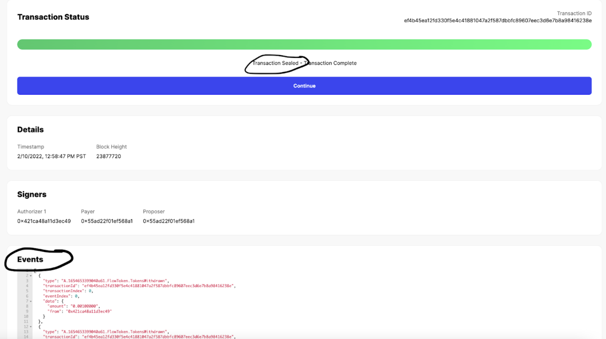

## Accessing Flow mainnet

The Flow Mainnet is available for access at this URL:

```
access.mainnet.nodes.onflow.org:9000
```

For example, to access the network using the [Flow Go SDK](https://github.com/onflow/flow-go-sdk):

```go
import "github.com/onflow/flow-go-sdk/client"

func main() {
  flowAccessAddress := "access.mainnet.nodes.onflow.org:9000"
  flowClient, _ := client.New(flowAccessAddress, grpc.WithInsecure())
  // ...
}
```

## Account creation

You can follow the [Flow Port account creation steps](https://docs.onflow.org/flow-port/#blocto) to create a new mainnet account.

If you prefer watching a video, check out this tutorial:

<iframe
  width="560"
  height="315"
  src="https://www.youtube-nocookie.com/embed/vXui7uO4cIQ"
  title="YouTube video player"
  frameborder="0"
  allow="accelerometer; autoplay; clipboard-write; encrypted-media; gyroscope; picture-in-picture"
  allowfullscreen
></iframe>

## Generating a non-custodial account

A non-custodial account will make sure you are the only one holding the keys to your account.

You can follow the following steps to add a non-custodial account:

First, generate a new key pair with the [Flow CLI](https://github.com/onflow/flow-cli):

```sh
> flow keys generate --network=mainnet

🔴️ Store private key safely and don't share with anyone!
Private Key      5b438...
Public Key       1bdc5...
```

> **Note**: By default, this command generates an ECDSA key pair on the P-256 curve. Keep in mind the CLI is intended for development purposes only and is not recommended for production use. Handling keys using a Key Management Service is the best practice.

Take a note of the public key and go back to Flow Port. Open the ["Create a new account" page](https://port.onflow.org/transaction?hash=a0a78aa7821144efd5ebb974bb52ba04609ce76c3863af9d45348db93937cf98&showcode=false&weight=1000&halg=3).

On the page, enter your public key from the CLI, ensure the hash algorithm is set to `SHA3_256` and the weight is set to `1000`. Finally, check the box confirming correctness and hit 'Submit'.

> **Important**: Your account needs to have at least 0.002 FLOW for the account creation. More details can be found [in this guide](https://docs.onflow.org/flow-token/concepts/#storageaccount-fees).

Once the transaction is sealed, you should scroll down to the events section and locate the `flow.AccountCreated` event with the newly generated address.



Make sure to take a note of the address. If you want to verify the public key for this address, you can visit [flow-view-source](https://flow-view-source.com/).

## Important Mainnet Smart Contract Addresses

You can review [all available core contracts](/core-contracts/) deployed to the mainnet to identify which ones you want to import.