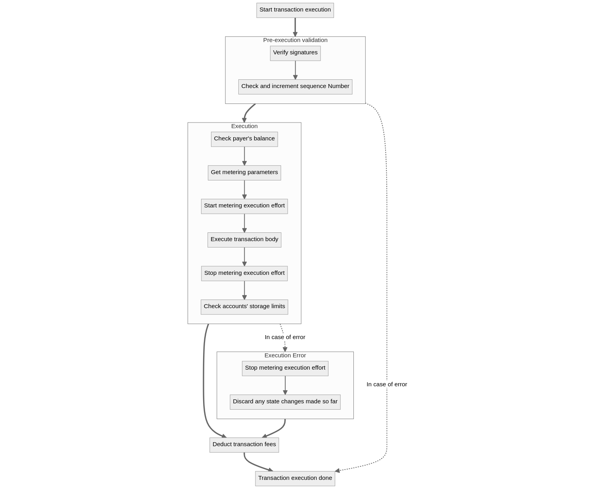

# Transaction Lifecycle

This document walks through each stage of a transaction's lifecycle as it moves through the Flow network.

<!--- START doctoc generated TOC please keep comment here to allow auto update --->
<!--- DON'T EDIT THIS SECTION, INSTEAD RE-RUN doctoc TO UPDATE --->
**Table of Contents**

- [Transaction Lifecycle](#transaction-lifecycle)
	- [Submission](#submission)
		- [Validation](#validation)
		- [Clustering](#clustering)
	- [Block Formation](#block-formation)
		- [Proposal](#proposal)
		- [Finalization](#finalization)
	- [Execution](#execution)
		- [Fee Payment](#fee-payment)
		- [Computation](#computation)
	- [Verification](#verification)
	- [Sealing](#sealing)

<!--- END doctoc generated TOC please keep comment here to allow auto update --->

## Submission

Transactions are submitted to the Flow network via Access Nodes. The Access Node provides a single point of contact to interact with the Flow network, accessible [here](/nodes/access-api#current-mainnet). It implements the [Access API](/nodes/access-api/).
Transactions are received by the Access Node via the [SendTransaction API call](/nodes/access-api#sendtransaction).

### Validation
<!-- add explanation of how txs are checked andd how assignment to Cluster is determined (explain "to which this transaction belongs" point below) -->

### Clustering

The Access Node forwards the transaction to one of the Collection nodes in the Collection node cluster to which this transaction belongs. 

## Block Formation 
### Proposal + Finalization 
Collection Nodes pass the transaction collections to the Consensus Nodes for them agree on the order of transactions. Flow's Consensus Nodes follow the HotStuff consensus protocol, [detailed here](https://github.com/onflow/flow-go/tree/master/consensus/hotstuff). 

## Execution

Once the transaction reaches the execution node as part of a collection it is validated and processed by the Flow Virtual Machine (FVM) following steps illustrated by the image below.

### Pre-execution validation step

Before transaction execution starts all the transaction's signatures are verified (more on that [here](/concepts/transaction-signing)) and the sequence number of the proposer is checked and incremented.
If any of the checks fail the transaction execution fails with an error and no fees are deducted.

### Execution step

The execution step is the heart of the transaction processing in the FVM. It involves the following sub-steps:

#### Check payer's balance
  
The first step is to check that the payer will be able to cover (pay for) the execution of the transaction. The payer must have sufficient balance so 
that their [storage capacity](/concepts/storage#storage-capacity-of-the-payer) exceeds their [storage used](/concepts/storage#storage-used). The Cadence function called to verify this is [FlowFees.verifyPayersBalanceForTransactionExecution](https://github.com/onflow/flow-core-contracts/blob/276863c9af3ff9266c37dd60185cded7ba06cfa2/contracts/FlowFees.cdc#L100). If the payers balance is insufficient an error is produced and the transaction execution continues with the [Execution error step](#execution-error-step).

#### Get metering parameters

Execution of the body of the transaction will be metered. The metered quantities are:

- Execution effort.
- Cadence memory usage.
- interaction usage (how many bytes will be written/read to/from storage)

Some parameters for metering are written in the [FlowServiceAccount](https://github.com/onflow/flow-core-contracts/blob/276863c9af3ff9266c37dd60185cded7ba06cfa2/contracts/FlowServiceAccount.cdc) smart contract. Some of these parameters are:

- execution effort weights (how much execution effort does it cost to call certain methods)
- Cadence memory weights (mow much memory is used during Cadence operations)
- Cadence memory limit

During this step these parameters are read from the smart contract.

#### Start metering execution effort

Until this point in the execution no execution effort was measured. All actions done should be accounted for in the inclusion effort.
In this step we start metering not only execution effort, but also memory consumption, interaction and emitted event size.

See [Segmented Transaction Fees](/concepts/variable-transaction-fees#segmented-transaction-fees) for more details on the different components of effort.

#### Execute transaction body

During this step the users transaction code is executed. In case an error occurs the transaction continues with the [Execution error step](#execution-error-step).

#### Stop metering execution effort

Now that the users part of the transaction is executed, metering is stopped. The metered quantities will be used for fee deduction later.
In case any metering limits were hit during execution, the execution would continue with the [Execution error step](#execution-error-step).

#### Check accounts' storage limits

In this step, all accounts whose storage was changed during the transaction execution, will be checked to ensure their [storage capacity](/concepts/storage#storage-capacity-of-the-payer) does not exceed their [storage used](/concepts/storage#storage-used). If it does, an error is produced and the transaction continues with the [Execution error step](#execution-error-step).

If and error occurs anywhere during this step the execution will continue with the [Execution error step](#execution-error-step).

### Execution error step 

This step is only run when an error occurs during the Execution step. It is meant as a cleanup after the transaction has failed. The following sub-steps are performed.

#### Stop metering execution effort

This step is only relevant if an error occurs during execution of the transaction body, after the metering started and hasn't stopped yet. Otherwise all the metered quantities will still be 0.

#### Discard any state changes made so far

This step rolls back any changes made to the state by the transaction so far.

### Deduct transaction fees

The last step in transaction execution is to deduct the transaction fees. During this step the relevant fees are deducted from the account identified as the `payer` in the transaction. Flow's flexible transaction structure allows accounts other than the user to pay transaction fees. For more info on [transaction structure](https://github.com/onflow/flow/blob/master/docs/content/concepts/accounts-and-keys.md#anatomy-of-a-transaction) and [transaction signing](https://developers.flow.com/learn/concepts/accounts-and-keys). 

Transaction fees are calculated as described in [Segmented Transaction Fees](/concepts/variable-transaction-fees#segmented-transaction-fees) using the execution effort measured during execution and the inclusion effort of the transaction which was already known.

## Verification

_Documentation coming soon..._

## Sealing

_Documentation coming soon..._

## Transaction Results
From the [Access API](https://github.com/onflow/flow-go/blob/master/cmd/access/README.md)

[GetTransactionResult](/nodes/access-api#gettransaction): an execution node is requested for events for the transaction and the transaction status is derived as follows:
* If the collection containing the transaction and the block containing that collection is found locally, but the transaction has expired then its status is returned as `expired`.
* If either the collection or the block is not found locally, but the transaction has not expired, then its status is returned as `pending`
If the transaction has neither expired nor is it pending, but the execution node has not yet executed the transaction, then the status of the transaction is returned as `finalized`.
* If the execution node has executed the transaction, then if the height of the block containing the transaction is greater than the highest sealed block, then the status of the transaction is returned as `executed` else it is returned as `sealed`.
* If the collection, block, or chain state lookup failed then the status is returned as `unknown`
