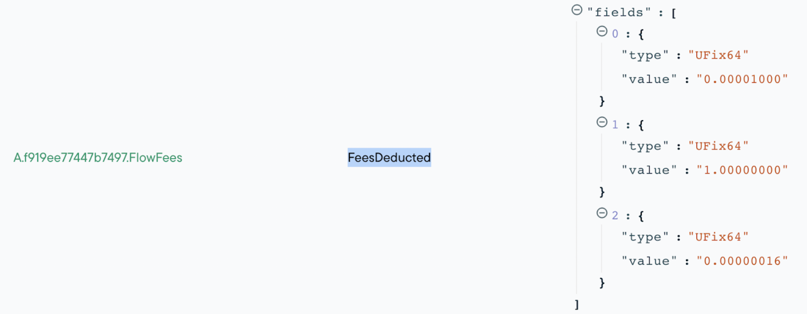

This guide will explain why transaction fees are important, how they are calculated, and how you can handle fees within your implementation. Specifically, it lays out how you can estimate the costs of a transaction, how you can set the limit for costs, and how you can optimize your Cadence code to reduce transaction costs where possible.

The guide will conclude with information on how to educate your users about fees and how to learn more about the implementation of transaction fees.

> **Note**: Transaction cost implementation is based on a community-involved FLIP process. The work is currently ongoing. Jump to the “Learn More” section to participate in the process.

## Understanding the need for transaction fees

Segmented transaction fees are essential to ensure fair pricing based on the impact on the network. For instance, more heavy operations will require more resources to process and propagate transactions. Common operations, however, will stay reasonably priced.

Fees will improve the overall security of the network by making malicious actions (eg spam) on the network less viable.

The unique Flow architecture is targeted at high throughput. It makes it easier to have slack in the system, so short spikes can be handled more gracefully.

## Understanding fee structure

Fees are calculated based on three components: execution fee, inclusion fee, and network surge factor.

Inclusion and execution fees can be expressed as inclusion or execution effort and an associated multiplier to reflect the costs of the inclusion and execution effort. The final transaction fee calculation looks like this:

```
inclusionFee = inclusionEffort * inclusionEffortCost;

executionFee = executionEffort * executionEffortCost;

totalFee = (inclusionFee + executionFee) * surgeFactor;
```

> **Note**: If you want to learn more about the cost function, [take a look at FLIP 753](https://github.com/onflow/flow/blob/c05d847adf2f6fb509e42c17020484d7dd3e89bd/flips/20220111-execution-effort.md#final-execution-effort-feature-weights-and-maximum-execution-effort-limit).

### Execution costs

The execution effort for a transaction is determined by the code path the transaction takes and the actions it does. The actions that have an associated execution effort cost can be separated into four broad buckets:

- Normal lines of cadence, loops, or function calls
- Reading data from storage, charged per byte read
- Writing data to storage, charged per byte written
- Account creation

**Cost overview**

To provide you a better understanding of the cost ranges, here are some common transaction types and their associated execution costs, given the current `executionEffortCost` and `inclusionEffortCost` parameters:

| Transaction Type | Estimated cost (FLOW) | Relative cost to FT transfer |
| ---------------- | :--------------------- | :---------------------------- |
| FT transfer      | 0.00000185            | 1 (baseline)               |
| Mint a small NFT (heavily depends on the NFT size) | 0.0000019    | 1 |
| Empty Transaction| 0.000001 | 0.5 |
| Add key to an account | 0.000001 | 0.5 |
| Create 1 Account | 0.00000315 | 1.7 | 
| Create 10 accounts | 0.00002261 | 12.2 |
| Deploying a contract that is ~50kb | 0.00002965 | 16 |


### Inclusion costs

The inclusion effort of a transaction represents the work needed for:

- Including the transaction in a block
- Transporting the transaction information from node to node
- Verifying transaction signatures

Right now, the inclusion effort is always 1.0 and the inclusion effort cost is fixed to `0.000001`.

> **Note**: Inclusion effort will always be calculable without executing the transaction code.

In the future, costs for inclusion will be impacted by the byte size of the transaction and the number of signatures required.

> **Note**: The changes to variable inclusion costs will be updated in [one of the upcoming sporks](https://docs.onflow.org/nodes/node-operation/upcoming-sporks/).

### Network surge

In the future, a network surge will be applied when the network is busy due to an increased influx of transactions required to be processed or a decrease in the ability to process transactions. Right now, the network surge is fixed to `1.0`.

### Storage fees

Storage fees are implemented differently from transaction fees. Read the [Storing Data on Flow guide](https://docs.onflow.org/concepts/storage/#storage-capacity) for more details. In summary, storage fees are a cost associated with storing data on-chain.

## Estimating transaction costs

Cost estimation is a two-step process. First, you need to gather the execution effort with either the emulator, on testnet, or on mainnet. Second, you use the execution effort for a transaction to calculate the final fees using one of the JavaScript or Go FCL SDKs.

### Understanding execution effort

Execution effort is best determined by running a transaction and reviewing the emitted event details.

**Using Flow Emulator**

You can [start the emulator using the Flow CLI](https://docs.onflow.org/emulator/#running-the-emulator-with-the-flow-cli). Run your transaction and take a look at the events emitted:

```shell
0|emulator | time="2022-04-06T17:13:22-07:00" level=info msg="⭐  Transaction executed" computationUsed=3 txID=a782c2210c0c1f2a6637b20604d37353346bd5389005e4bff6ec7bcf507fac06
```

You should see the `computationUsed` field. Take a note of the value, you will use it in the next step.

**On testnet or mainnet**

Once a transaction is completed, you can use an explorer like [Flowscan](https://flowscan.org/) to review the transaction details and events emitted. For Flowscan, you can open the transaction in question and look for the event `FeesDeducted` from the [`FlowFees`](https://github.com/onflow/flow-core-contracts/blob/master/contracts/FlowFees.cdc) contract:



In the event data on the right side, you will see a set of fields representing [FeeParameters](https://github.com/onflow/flow-core-contracts/blob/master/contracts/FlowFees.cdc#L58):

- surgeFactor
- inclusionEffort
- executionEffort

Take a note of the last value in the list - the `executionEffort` value. You will use it in the next step.

### Calculating final costs

The cost for transactions can be calculated using the following FCL scripts on mainnet/testnet respectively.

**On mainnet**

```cadence
import FlowFees from 0xf919ee77447b7497
pub fun main(
  inclusionEffort: UFix64,
  executionEffort: UFix64
): UFix64 {
  return FlowFees.computeFees(inclusionEffort: inclusionEffort, executionEffort: executionEffort)
}
```

**On testnet**

```cadence
import FlowFees from 0x912d5440f7e3769e
pub fun main(
  inclusionEffort: UFix64,
  executionEffort: UFix64
): UFix64 {
  return FlowFees.computeFees(inclusionEffort: inclusionEffort, executionEffort: executionEffort)
}
```

## Configuring execution limits

FCL SDKs allow you to set the execution effort limit for each transaction. Based on the execution effort limit determined in the previous step, you should set a reasonable maximum to avoid unexpected behavior and protect your users. The final transaction fee is computed from the actual execution effort used up to this maximum.

> **Note**: Keep in mind that the limits are not for the final fees that the user will have to pay. The limits are for the execution efforts specifically.

It is important to set a limit that isn’t too high or too low. If it is set too high, the payer needs to have more funds in their account before sending the transaction. If it is too low, the execution could fail and all state changes are dropped.

**Using FCL JS SDK**

You need to set the `limit` parameter for the `mutate` function, for example:

```js
import * as fcl from "@onflow/fcl"

const transactionId = await fcl.mutate({
  cadence: `
    transaction {
      execute {
        log("Hello from execute")
      }
    }
  `,
  proposer: fcl.currentUser,
  payer: fcl.currentUser,
  limit: 100
})

const transaction = await fcl.tx(transactionId).onceSealed();
console.log(transaction;)
```

**Using FCL Go SDK**

You need to call the `SetGasLimit` method to set the fee limit, for example:

```go
import (
    "github.com/onflow/flow-go-sdk"
    "github.com/onflow/flow-go-sdk/crypto"
)

var (
    myAddress    flow.Address
    myAccountKey flow.AccountKey
    myPrivateKey crypto.PrivateKey
)

tx := flow.NewTransaction().
    SetScript([]byte("transaction { execute { log(\"Hello, World!\") } }")).
    SetGasLimit(100).
    SetProposalKey(myAddress, myAccountKey.Index, myAccountKey.SequenceNumber).
    SetPayer(myAddress)
```

### Maximum transaction fees of a transaction

The maximum possible fees the payer could pay for a transaction can be calculated as the inclusion cost plus the execution cost as if the transaction was executed with execution effort equal to the transactions specified execution effort limit.

The payer will never pay more than this amount for the transaction.

## Optimizing Cadence code to reduce effort

Several optimizations can lead to reduced execution time of transactions. Below is a list of some practices. This list is not exhaustive but rather exemplary.

**Limit functions calls**

Whenever you make function calls, make sure these are absolutely required. In some cases, you might be able to check prerequisites and avoid additional calls:

```cadence
for obj in sampleList {
   /// check if call is required
   if obj.id != nil {
      functionCall(obj)
   }
}
```

**Limit loops and iterations**

Whenever you want to iterate over a list, make sure it is necessary to iterate through all elements as opposed to a subset. Avoid loops to grow in size too much over time. Limit loops when possible.

```cadence
// Iterating over long lists can be costly
pub fun sum(list: [Int]): Int {
 var total = 0
 var i = 0
 // if list grows too large, this might not be possible anymore
 while i < list.length {
   total = total + list[i]
 }
 return total
}

// Consider designing transactions (and scripts) in a way where work can be "chunked" into smaller pieces
pub fun partialSum(list: [Int], start: Int, end: Int): Int {
 var partialTotal = 0
 var i = start
 while i < end {
   partialTotal = partialTotal + list[i]
 }
 return partialTotal
}
```

**Understand the impact of function calls**

Some functions will require more execution efforts than others. You should carefully review what function calls are made and what execution they involve.

```cadence
// be aware functions that call a lot of other functions
// (or call themselves) might cost a lot
pub fun fib(_ x: Int): Int {
 if x == 1 || x== 0 {
   return x
 }
 // + 2 function calls each recursion
 return fib(x-1) + fib(x-2)
}

// consider inlining functions with single statements, to reduce costs
pub fun add(_ a: Int, _ b: Int): Int {
 // single statement; worth inlining
 return a + b
}
```

**Avoid excessive load and save operations**

Avoid costly loading and storage operations and [borrow references](https://docs.onflow.org/cadence/design-patterns/#avoid-excessive-load-and-save-storage-operations-prefer-in-place-mutations) where possible, for example:

```cadence
transaction {

    prepare(acct: AuthAccount) {

        // Borrows a reference to the stored vault, much less costly operation that removing the vault from storage
        let vault <- acct.borrow<&ExampleToken.Vault>(from: /storage/exampleToken)

        let burnVault <- vault.withdraw(amount: 10)

        destroy burnVault

        // No `save` required because we only used a reference
    }
}
```

> **Note**: If the requested resource does not exist, no reading costs are charged.

**Limit accounts created per transaction**

Creating accounts and adding keys are associated with costs. Try to only create accounts and keys when necessary.

**Check user’s balance before executing transactions**

You should ensure that the user’s balance has enough balance to cover the highest possible fees. For FT transfers, you need to cover the amount to transfer in addition to the highest possible fees.

## Educating users

Wallets will handle the presentation of the final transaction costs but you can still facilitate the user experience by educating them within your application.

If your user is using non-custodial wallets, they may have to pay the transaction and want to understand the fees. Here are some suggestions.

**Explain that costs can vary depending on the network usage**

Suggested message: “Fees improve the security of the network. They are flexible to ensure fair pricing based on the impact on the network.”

**Explain that waiting for the network surge to pass is an option**

Inevitably, network surges will cause higher fees. Users who might want to submit a transaction while the network usage is surging should consider sending the transaction at a later time to reduce costs.

**Explain that the wallet might not allow the transaction due to a lack of funds**

If dynamic fees increase to the highest possible level, the user’s fund might not be enough to execute the transaction. Let the users know that they should either add funds or try when the network is less busy.

## How to learn more

There are several places to learn more about transaction fees:

- [FLIP-660](https://github.com/onflow/flow/pull/660)
- [FLIP-753](https://github.com/onflow/flow/pull/753)
- [Flow Fees Contract](https://github.com/onflow/flow-core-contracts/blob/master/contracts/FlowFees.cdc)

> **Note**: If you have thoughts on the implementation of transaction fees on Flow, you can [leave feedback on this forum post](https://forum.onflow.org/t/variable-transaction-fees-are-coming-to-flow/2941).

## FAQs

**When will the fee update go into effect?**

The updates were rolled out with the [Spork on April 6, 2022](https://docs.onflow.org/nodes/node-operation/past-sporks/#mainnet-17), and were enabled on [June 1st](https://forum.onflow.org/t/permissionless-contract-deployment-progress/2981) during the [weekly epoch transition](https://github.com/onflow/service-account/tree/main/transactions/set-execution-effort-weights/2022/jun-1).

**Why are fees collected even when transactions fail?**

Broadcasting and verifying a transaction requires execution, so costs are deducted appropriately.

**What execution costs are considered above average?**

There is no average for execution costs. Every function will vary significantly based on the logic implemented. You should review the optimization best practices to determine if you could reduce your costs.

**Do hardware wallets like Ledger support segmented fees?**

Yes.

**What is the lowest execution cost?**

The lowest execution cost is 1. This means your transaction included one function call or loop that didn't read or write any date.

**Can I determine how much a transaction will cost on mainnet without actually paying?**

You can estimate the costs in a two-way process: 1) determine execution costs for transactions (emulator or testnet) and 2) use an FCL SDK method to calculate the final transaction fees.

**How accurate will testnet fees be to mainnet fees?**

Final fees are determined by the surge factor on the network. The surge factor for the testnet will be different from the factor for the mainnet, so you need to expect a variation between mainnet and testnet estimates.

**I use Blocto and I haven't paid any fees yet. Why is that?**

That is because Blocto is acting as the payer for transactions. Non-custodial wallets may have the user pay the transaction. Additionally, apps can sponsor the transaction if they choose.
