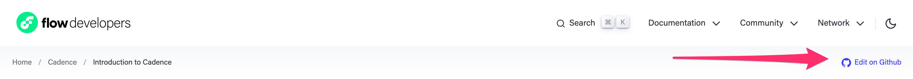
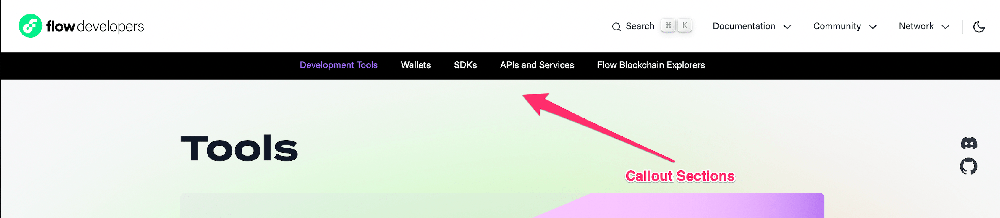
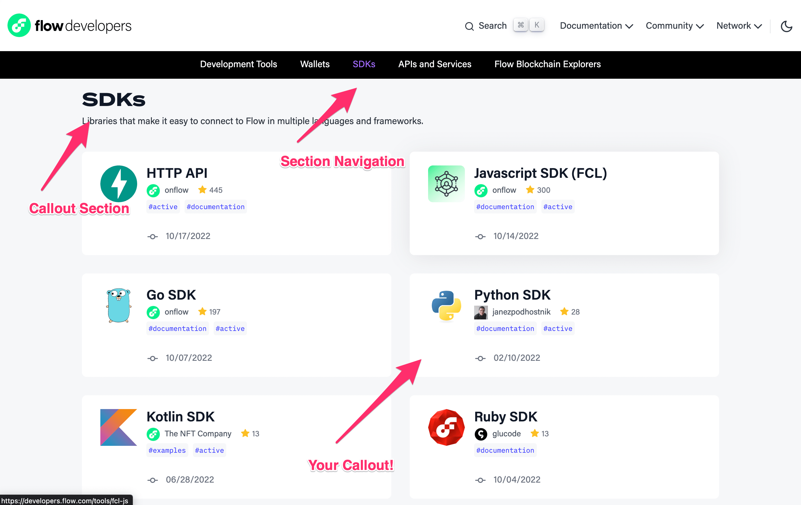
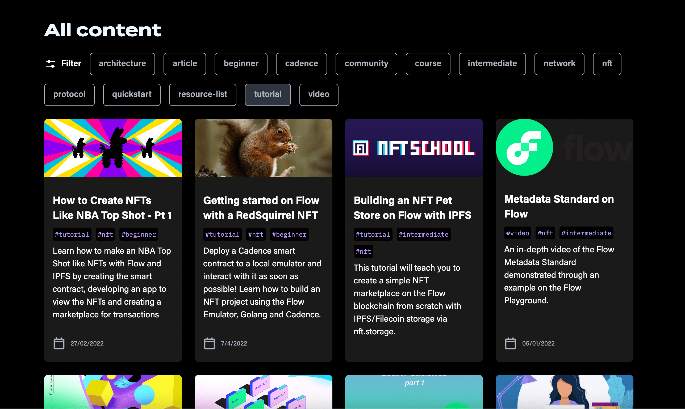
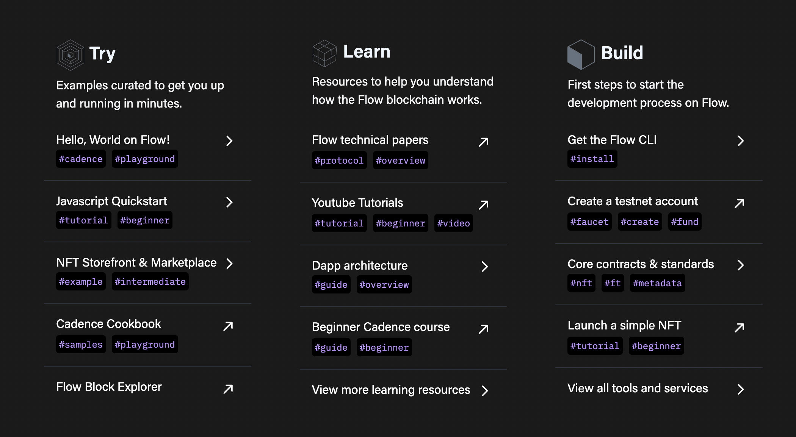
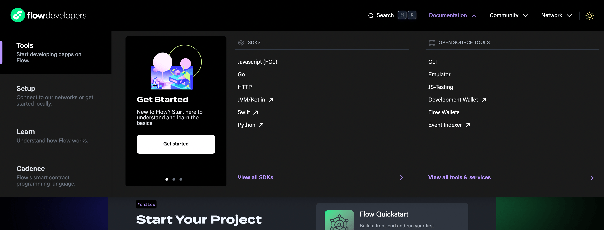

# Contributing Content to the Developer Portal

In most cases you should be able to iterate and deploy changes to your documentation without needing to involved the engineering team that is maintaining the Developer Portal.

## How To Contribute

### Before You Start

Before you can contribute to the Developer Portal, you’ll need a GitHub Account, and you’ll need to be logged into GitHub.

If you don’t have a GitHub account [go here](https://github.com) and sign-up. Once you have a GitHub account you can proceed with the following steps.

---

### Basic Contribution Workflow

The basic contribution workflow is the same for everyone. 

1) Create a PR into the `main` branch of the GitHub repository you’re working with. 

2) Wait for check runs to complete and correct any validation errors. 

3) Provide any redirects indicated in the check run, in your `flow-docs.json` file.

4) Preview your updated pages using the provided preview links to make sure they are rendering and displaying as you wish.

5) Merge your PR, and updates to your docs are immediately available on [https://developers.flow.com](https://developer.flow.com)!

Note: there is no “Staging” environment for your documentation. Previews are rendered by fetching content from a specified Git branch, using a URL query string, 

eg: `?preview=chasefleming%2Fdiscovery-docs-include`

However, only the staging instance of the Developer Portal is configured to process the preview query strings, which is why your previews appear on the “staging” domain `https://flow-docs-staging.fly.dev`. 

If you require help integrating your documentation updates, you can make a request in `#flow-documentation` Slack channel.

---

## Making Updates to Existing Content

Contributing to the Developer Portal is as easy as making a PR to a GitHub repository. To update existing content, look for the “Edit on Github” link in the right-hand side of each page, in the header. Here is what the header looks like. 

Clicking the “Edit in GitHub” link will take you directly to the source code of the document you are viewing.

---

## Contributing New Content

### Before You Start

**Working With Markdown**

For your documentation to be displayed on the Developer Portal, it must be authored in Markdown format. To learn more about how to use Markdown syntax for creating documents, please review the following resources:

- [https://www.markdowntutorial.com/](https://www.markdowntutorial.com/)
- [https://www.markdownguide.org/](https://www.markdownguide.org/)

**From Google Doc → Developer Portal (Markdown)**

Markdown is not the ideal format for authoring documentation that requires collaboration during the editorial process. If you are using Google Docs to create documentation, you can use this tool to automatically generate Markdown files, which can then be submitted to the Developer Portal engineering team, using this browser plugin:

- [https://workspace.google.com/marketplace/app/docs_to_markdown/700168918607](https://workspace.google.com/marketplace/app/docs_to_markdown/700168918607)

---

## Adding a New Developer Tool or SDK

Adding a new Tools or SDK requires some manual intervention from the Flow Developer Portal engineering team. In the future we hope this process can be self-serve. 

Documentation for SDKs and other tools belongs under the “tools” section in the information hierarchy of the Developer Portal. You can review the information hierarchy of the Developer Portal [here](./portal-overview.md): 

### **Adding Your SDK Documentation**

If you are familiar with Github, please follow the rest of this guide, starting with the [Basic Contribution Workflow](#basic-contribution-workflow)

### **Adding Callouts on Feature (Landing) Pages**

The Developer Portal has special sections used to “call out” specific tools or other documentation. For example, the `/tools` landing page contains the following categories.

To make your content easy for users to find, you’ll place your Callout under one of the following categories, seen here in the top-level page navigation: 

 (See [this reference](./contribution-guidelines.md#basic-contribution-workflow) for a list of the specific landing pages and sections available on the Developer Portal) 

Here is an example of a Callout section featuring available SDKs, on the `/tools` landing page:

Data for these sections is currently part of the Developer Portal source code and can be found here: [https://github.com/onflow/developer-portal/blob/main/app/data/tools/index.ts](https://github.com/onflow/developer-portal/blob/main/app/data/tools/index.ts)
To add a link to your too you’ll need to create an object in this file that conforms to the object type defined for listing tools.

A new tool can be added by copying the format of the objects for existing tool. And existing tool descriptions can be modified by updating those objects. 

Once a callout has been created, you can add it to the feature list, as in the image above, by importing your new callout into the `tools` page here:
[https://github.com/onflow/developer-portal/blob/main/app/data/pages/tools.ts](https://github.com/onflow/developer-portal/blob/main/app/data/pages/tools.ts)

Be sure to add your tool under the appropriate category. Follow the pattern established in the source code for existing tools, when adding a new tool.

Your Callout can be added to **Tools** sections on the following feature landing pages 

(in addition to `/tools`): 

- **/getting-started:** [https://github.com/onflow/developer-portal/blob/main/app/data/pages/getting-started.ts](https://github.com/onflow/developer-portal/blob/main/app/data/pages/getting-started.ts)
    - [https://developers.flow.com/getting-started](https://developers.flow.com/getting-started)
- **/community:** [https://github.com/onflow/developer-portal/blob/main/app/data/pages/community.ts](https://github.com/onflow/developer-portal/blob/main/app/data/pages/community.ts)
    - [https://developers.flow.com/community](https://developers.flow.com/community)

---

## Adding a New Tutorial, Guide or Other Learning Content

The primary landing page for Guides and tutorials is `/learn`

### Adding Content

New content can be added in the for of a link to an external or internal page that exists, or by submitting content to the Flow documentation content repository, listed below.

**Linking to existing Content**

- To link to existing content, follow the steps under [Linking To New Content](#linking-to-content)

**Adding New Content**

- New learning content, not hosted in your own repository can be submitted as markdown files here: [https://github.com/onflow/flow/tree/master/docs/content](https://github.com/onflow/flow/tree/master/docs/content). Create a subfolder when necessary. The name of your folder / files will determine the URLs of your content.

- You’ll follow the basic contribution workflow for submitting your content. Once your documents have been integrated, you’ll link to existing content by following the steps under [Linking To New Content](#linking-to-content)

### Linking to Content

To submit a link to learning content to be like the content below, you’ll need to create a new object here: [https://github.com/onflow/developer-portal/blob/main/app/data/articles/index.ts](https://github.com/onflow/developer-portal/blob/main/app/data/articles/index.ts)

Once a link to your content has been added, it can be added to the page by importing it here and adding it to the appropriate collection: 

[https://github.com/onflow/developer-portal/blob/main/app/data/pages/learn.ts](https://github.com/onflow/developer-portal/blob/main/app/data/pages/learn.ts)

---

## Adding a New Community Initiative

The primary landing page for Flow community initiatives is `/community`

### Adding Content

New content can be added in the for of a link to an external or internal page that exists, or by submitting content to the Flow documentation content repository, listed below.

**Adding New Content**

- New learning content, not hosted in your own repository can be submitted as markdown files to this folder in this repository: [https://github.com/onflow/flow/tree/master/docs/content](https://github.com/onflow/flow/tree/master/docs/content)
- You’ll follow the basic contribution workflow for submitting your content. Once your documents have been integrated, you’ll link to existing content by following the steps under [Linking To New Content](#linking-to-content)

### Linking to Content

**Featured Initiatives on the /community Home Page:**

To submit your content as a “Featured Initiative” on the community page, you can submit an update PR to the following file: [https://github.com/onflow/developer-portal/blob/main/app/data/pages/community.ts#L49](https://github.com/onflow/developer-portal/blob/main/app/data/pages/community.ts#L49). 

Be sure top include all of the required information as defined by the Types in this file. 

Use other entries as an example when submitting your own.

---

## Updating “Try, Learn, Build” Link List

Currently there are 2 link feature lists available on the site. 

This list appears on  `/getting-started`

To submit your content as a link in this list, you can submit an update PR to the following file: 

[https://github.com/onflow/developer-portal/blob/main/app/routes/getting-started.tsx#L83](https://github.com/onflow/developer-portal/blob/main/app/routes/getting-started.tsx#L83)

## Updating the Main Navigation Menu

Adding links to your documentation in the main menu, can be done by submitting a PR to update one of the following files: 

**"Developers" Top Nav Menu**

[https://github.com/onflow/developer-portal/blob/main/app/data/nav/documentationTabData.tsx](https://github.com/onflow/developer-portal/blob/main/app/data/nav/documentationTabData.tsx)

**"Community" Top Nav Menu**

[https://github.com/onflow/developer-portal/blob/main/app/data/nav/communityTabData.tsx](https://github.com/onflow/developer-portal/blob/main/app/data/nav/communityTabData.tsx)

Use existing contents of these files to understand how to integrate a link to your documentation into the main navigation of the Developer Portal.

---

## Integrating a New Repository

### **Integrating Documentation From Your Own Repository**

For security and content auditing reasons, it is currently not possible to integrate 3rd party Repositories into the Developer Portal. See the following sections for information about integrating your Documentation.

### Start with the Defaults

To start your integration, create a `/docs` folder in the root of your repository that includes at least one valid Markdown file.

### Adding a `flow-docs.json` Configuration File

The first step to integrating your documentation into the Developer Portal is adding a `flow-docs.json` configuration file in the folder in your repo containing your documentation. This is `/docs` by default. 

 [Read more here](./portal-overview.md#flow-docsjson) about available configuration options.

### Create a PR With Your Integration Proposal

Currently, repositories must be approved and configured manually by the Developer Portal team. If you wish to integrate your repository, create a PR here: 

[https://github.com/onflow/developer-portal](https://github.com/onflow/developer-portal)

**Include the following information:** 

- Which section to locate your docs; read about the information hierarchy [here](./portal-overview.md#information-design).
- A brief section outlining your plans for updating and maintaining your documentation.
- Anything else you think might be relavent to the integration, including questions.

The PR will serve as a place to exchange messages and update progress while the Developer Portal team proceeds with your integration.

---

## General Troubleshooting

- I want to add a link to my content but there are no instructions.
    - Not all sections of the site are customizable by users. Adding links to content is accessible to all, but updating feature sections, main navigation and page headers is the purview of the Developer Portal product team and is being restricted, for the time being.