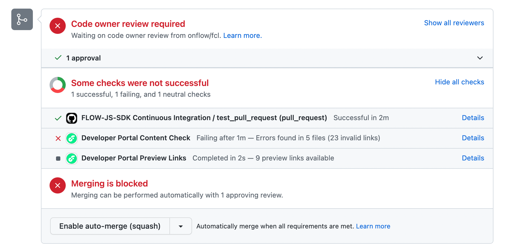
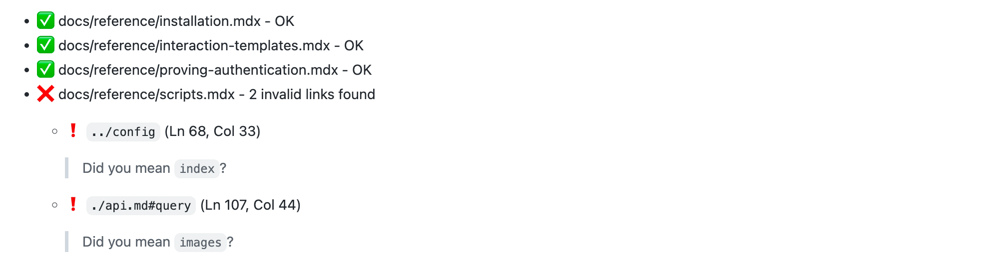
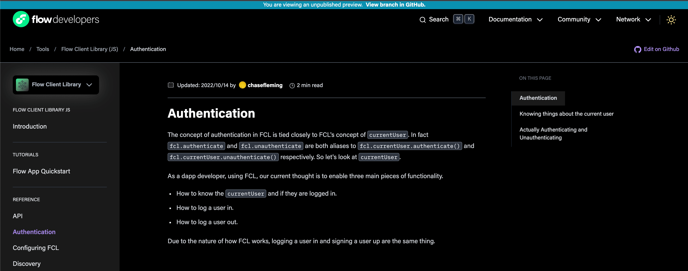

# Contributing to the Developer Portal

Reading this document carefully will help you understand how to contribute your own content to the Developer Portal, and avoid problems along the way.

## Developer Portal Overview

The aim of the Developer Portal is to allow repo owners to publish their content to the Developer Portal website, without needing assistance from theDeveloper Portal engineering team.

### Information Design

The developer portal is divided into 4 top-level sections, containing a specific category of documentation within. All content should be published under one of these sections:

-  **Learn**

     - This section contain tutorials, guides and conceptual documentation. It does not contain  learning content related to *specific* tools.

-  **Tools**

     - All software, SDKs and other *tools* used to build on Flow are published in this section eg. FCL, `flow-cli` … etc. This section includes learning content related to these *specific* tools.

-  **Community**

     - This section is for documents related to community activity on Flow: FLIPS, events, Flow Ecosystem fund, forum content, community built apps … etc.

-  **Cadence**

     - This section is for content related *specifically* to Cadence.

Each of these sections has an individual landing page that [can be customized](#flow-docsjson
).

### Content Aggregation

The Flow Developer Portal downloads and displays markdown documents and other assets hosted in GitHub repositories. The Developer Portal will only render content from a pre-defined list of repositories. Currently, only a specific set of repositories within the `onflow` GitHub organization are part of that list. 

Repositories outside `onflow` GitHub organization are not supported at this time.

**Q**: How can I integrate my repository into the Developer Portal? <br/>
**A**: See the [contribution guidelines](./contribution-guidelines.md#integrating-a-new-repository).

### Content Integration Options

By default, the Developer Portal will display documents from the `docs` folder in the `main` branch your repository.  Once content is merged into the `main` branch of your repository it will be available immediately on [https://developers.flow.com](https://developers.flow.com)

User configured defaults are not currently supported.

### flow-docs.json

The `flow-docs.json` file is strongly reccomended but *not required*, to configure how your documentation displays on the Developer Portal.

This file follows a schema defined here: [https://developers.flow.com/schemas/flow-docs.json](https://developers.flow.com/schemas/flow-docs.json)

A full-featured example of this file *in use* with existing documentation can be found here: [https://github.com/onflow/cadence/blob/master/docs/flow-docs.json](https://github.com/onflow/cadence/blob/master/docs/flow-docs.json)

Repository owners use `flow-docs.json` to control aspects of their documentation:

- **Left-Hand navigation**: `sidebars`
  - Left hand navigation is configured under the `sidebars` property.
  - Individual sidebars can be created for any valid route (path to a document) in your documentation.
- **Optional landing-page content:** `headings`
  - Landing page layout similar to [https://developers.flow.com/cadence](https://developers.flow.com/cadence) can be enabled by adding valid objects under the `headings` property. Similar to left-hand navigation, a custom landing page header can be enabled for any valid route (path to a document) in your documentation.
- **Content redirects:** `redirects`
  - In specific cases, you may want to customize the URL for s given document. This can be done using a valid entry under the `redirects` property. Users must provide the desired URL, as well as the document name to be made available at that URL.

`flow-docs.json` is recomended but not required to integrate your documentation with the Developer Portal. Please read additional documentation contained in the schema itself: [https://developers.flow.com/schemas/flow-docs.json](https://developers.flow.com/schemas/flow-docs.json)

---

## Content URLs

Once a repository is configured to work with the Developer Portal (see above), your content will be immediately available at a URL like this:

`developers.flow.com/{subsection}/{repo}/{document name}`
Or, `developers.flow.com/{subsection}/{repo}/{subfolder name}/{document name}`

Notice the `docs` folder is not included in the final URL.

Make sure your filenames are URL friendly. This will soon be enforced automaticall by the content-checking backend. This means your filename should: 

- Have no uppercase letters
- Have no special characters
- use “kebab-case” when spaces are required, eg: `smart-contracts.md`

There is no limit to the depth of folders within `docs` although it’s recommended to try to keep your information hierarchy as flat as possible, for simplicity.

### Renaming Files & Redirects

Since filenames determine URLs, if you **rename** a file, a redirect from the old (URL) filename to the new (URL) filename *must* be provided.

Don’t worry. When you push content to your repository, the Developer Portal will automatically warn you about this.

More about this in the [document validation](#content-validation) section.

### Customizing URLs

URLs cannot be customized by users. Be sure your documents are well organized without your `docs` folder, because this determines the URLs of your content.

---

## SEO

Basic SEO metadata can be included in markdown `frontmatter`. The developer Portal supports `title` and `description` metadata. If none is provided, a default will be applied.

Example `frontmatter`:

```markdown
---
title: "Hello World"
description: "A Great Document"
---
```

It is not required to supply this SEO metadata. Flow's in-house SEO experts will provide custom search-engine appropriate metadata for each page. Your custom metadata will be used in lieu of metadata supplied by our SEO experts.

---

## Page Content

### Custom Page Header Hero

A custom page header can be enable using `flow-docs.json`.
eg: [https://developers.flow.com/cadence](https://developers.flow.com/cadence)

See the `flow-docs.json` section above for more information.

### Left-Hand Menus

Links defined for menu items using the `href` property must use the *developer portal URL for the specific content,* and not a path to a filename in GitHub. For more information see the `flow-docs.json` section above.

### Table of Contents (Right-Hand Menus)

Table of contents (right-hand side menus) are generated automatically, using available `h2` headings from your markdown document, up to a depth of 2 (meaning, only ‘top-level’ `h2` (`##` in markdown) are rendered in the TOC. It is not possible to modify this behaviour.

### Images and Other Media

Linking to images or other media in folders *within* the `docs` folder of your repo is possible using relative URLs. If your media is viewable in GitHub, then it should display on the Developer Portal.

Linking to images or other media stored in the same repository, but *outside* the `docs` folder, requires using a fully qualified URL, eg:

``

The same rule applies to all other external media.

### Links

Linking to documents within the `docs` folder of your repo can be done in the standard way that is acceptable to GitHub, eg. `[link](./doc-two.md#hash-link)`

Writing links in your documents is easy if you follow this rule-of-thumb: If it works in GitHub it should work on the developer Portal, with one notable exception.

**Links to content outside the `docs` folder** in your repository, or elsewhere on the web must be in the form of a fully-qualified URL, eg: `[link](https://www.google.com)`

### **Callouts & Special Sections**

Many landing pages have callouts and special sections, eg: 


For more information about which special sections you can modify, and the process for adding and updating callouts is described in the [Contribution Guidelines](./contribution-guidelines.md#adding-callouts-on-feature-landing-pages)

---

## Content Validation

Content is validated each time a PR is submitted to your repository that touches any files in the `docs` folder. This is configured when your repository is integrated into the Developer Portal. Want to integrate your repo? [Go here](./contribution-guidelines.md#integrating-a-new-repository
)

Validation status is available in the **check run output** for your PR on GitHub.

Currently, the Developer Portal validates content using the following conditions:

- Do pages render without errors? This check accounts for errors in your markdown syntax.
- Are all links, and asset `src` URLs valid? Broken links make for bad user experience.
- If a file was renamed, was a redirect provided?

Here is an example of check run output when validation fails.



### Dead Links Checks

The Developer Portal automatically scans the links in *all your documents* when you submit changes to your docs. This is done to ensure that cross-links are valid, within your set of documentation.

#### External Links

Links to external websites are fetched to see if they return a non-error HTTP status code.

#### Internal Links

Links to content relative to the current document within the containing repo are validated for non-error codes

Here is an example of link validation hinting:



👆 Here, the output “Did you mean `images`?” is caused by an invalid *relative* link to a folder that does not exist (`api`) as a sibling of the folder of the document where this link is found.

Hints are provided with validation output on a *best-guess* basis. Since it is impossible to determine exactly why a link might be broken, hints may sometimes be inaccurate.

In this case the hinter attempts to locate the nearest sibling folder to provide a hint.

The validation will always be correct, but the hints might not always be helpful. **It is up to content authors to determine why a link is invalid, if the hint is not accurate, and fix the links.**

*Note: some links may not resolve within a given timeout and are hinted as warnings, eg:


These links should be considered *invalid* and should be manually verified by content authors.

### Providing Redirects for Renamed Files

When a file in your `docs` folder is renamed, this is equivalent to moving content from one URL to another. In this case a redirect should be provided to maintain good SEO.

Redirects should be added to your `flow-docs.json` file manually. See the `flow-docs.json` section above for more information. A hint will be provided in the check run output indicating the required redirect.

---

## Content Previews

A special preview link is provided for content PRs as part of the GitHub PR check run, for your PR that modifies any contents in the `docs` folder.

Previews are generated against the **Staging instance of the Developer Portal**, to ensure your content can be integrated with the latest updates to the Developer Portal itself.

Here is an example of preview output for changed documents in a PR


When previewing content, you should see a banner indicating you’re viewing an unpublished version of your page.

Here is an example of a preview page, with banner indicating this page is unpublished:



When you merge updates to documents in your PR, previews will update immediately.

---

## Upcoming Features

### Content Versioning

Content versioning is in progress here:

[https://docs.google.com/document/d/1Au9A0eEGJE_VhVYBcAKVUdwkJn2SsGOVfj2u-ckcTHY/edit#heading=h.qvb387e4t234](https://docs.google.com/document/d/1Au9A0eEGJE_VhVYBcAKVUdwkJn2SsGOVfj2u-ckcTHY/edit#heading=h.qvb387e4t234)

---

## onflow/flow special-case repo

[https://github.com/onflow/flow/tree/master/docs/content](https://github.com/onflow/flow/tree/master/docs/content)

The Developer Portal maintains a strict “one repo per docset” system. This means, each Repo represents a single set or URLs. FOr example, `onflow/cadence` contains docs relating only to Cadence, and all of this content is available under `/cadence` on the Developer Portal, eg: [https://developers.flow.com/cadence/design-patterns](https://developers.flow.com/cadence/design-patterns)

However, there is a special-case repo: `onflow/flow` that contains legacy content, and content not related to a specific tool or repository contents. The documents in the repository can be found at different URLs on the Developer Portal.

The content here is also located in a non-standard folder: `docs/content`

