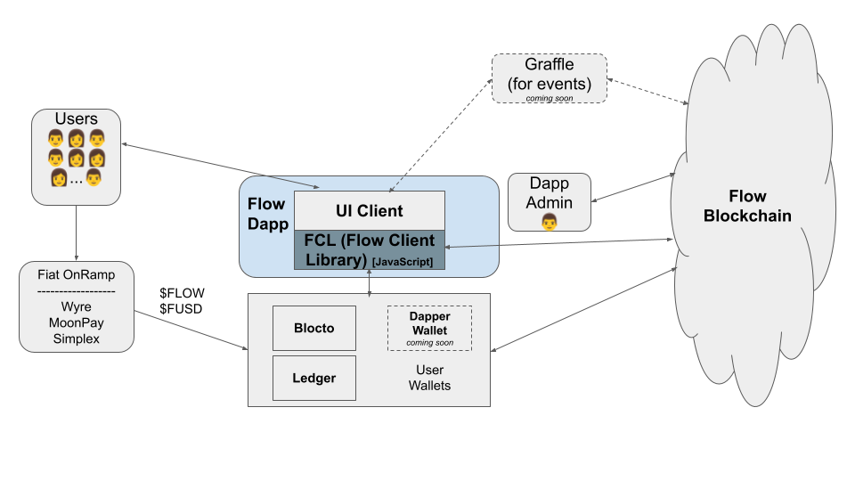
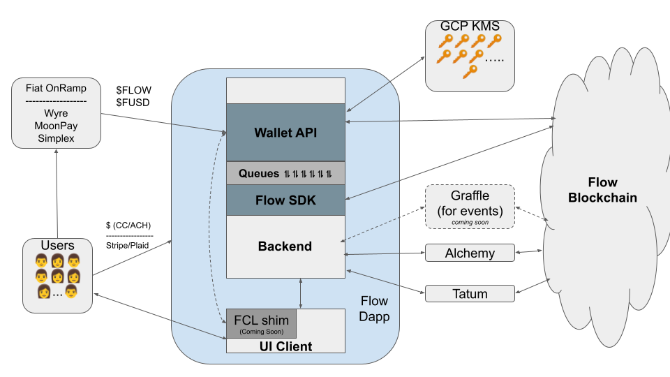
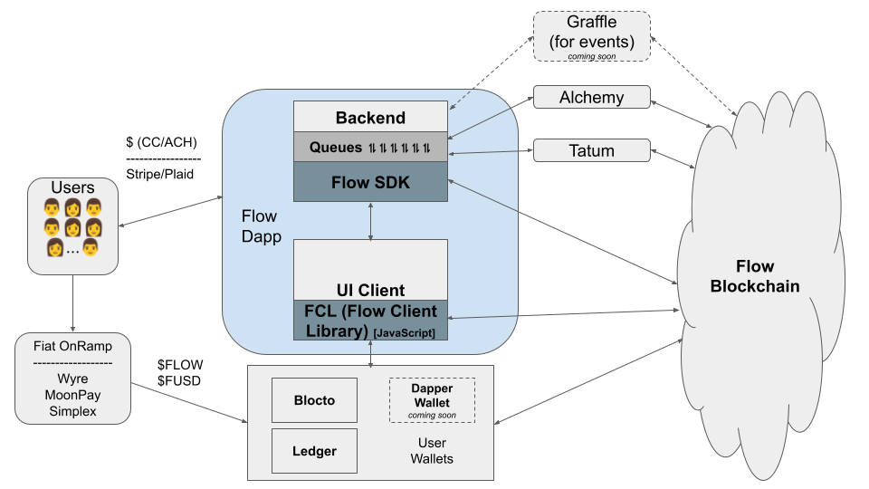
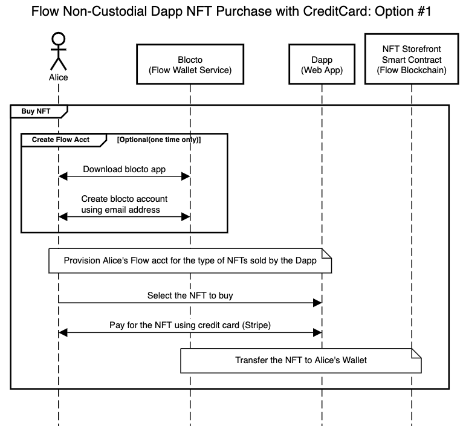
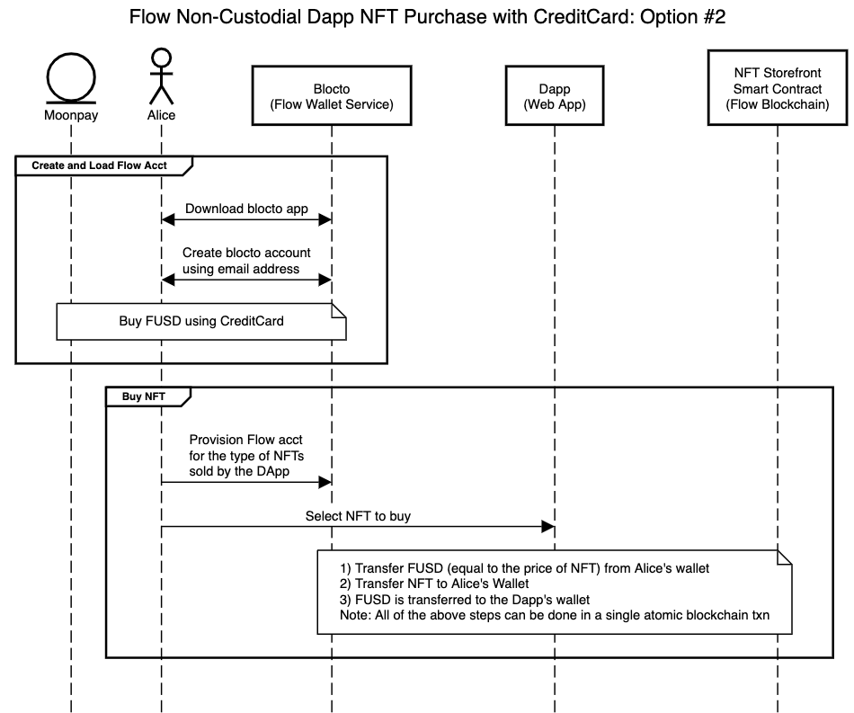
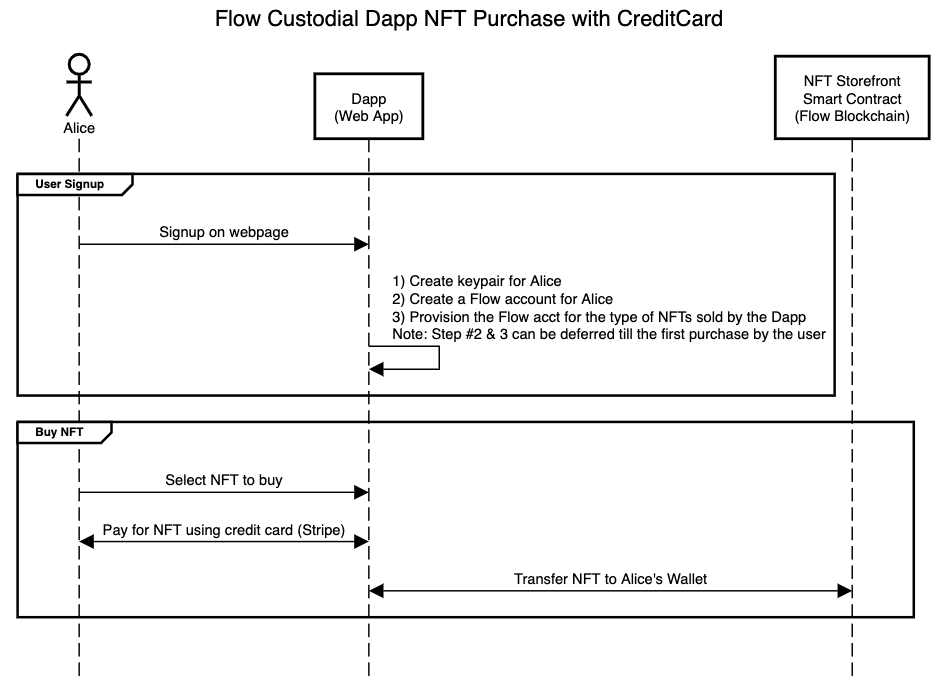
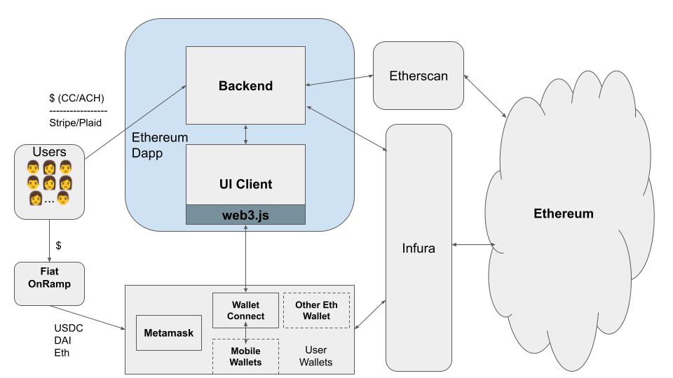
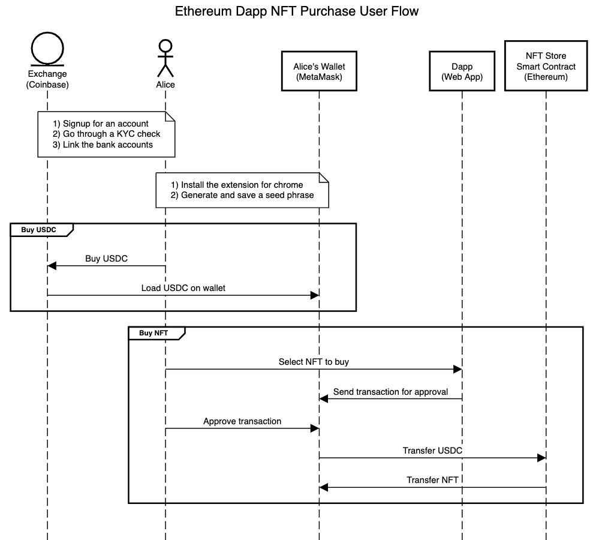

## Introduction
This document showcases the common solution architectures that the Flow blockchain dapps can follow. In addition, it shows interaction sequences between the solution components for the common user journeys.

The audience for this document is someone who is at the beginning of the Flow dapp development process. For developers with Ethereum experience, we also contrast Ethereum dapp architecture with Flow dapp architecture.

Read this document as a companion guide to the [Flow Developer Onboarding Guide](https://docs.google.com/document/d/14eQE0wq60IRgD3N5jtwpW8RxexFt_hB3EHnDg_uBl8k/edit).

<Callout type="info">
We mention various third-party services and software products in this document.That is not an endorsement. Developers should evaluate these products independently according to their needs. 
</Callout>

## Dapp Architectures
### Non-Custodial Flow Dapp Architecture
Non-custodial dapps let their users hold NFTs and other assets in user-controlled wallets like Blocto wallet. 

In non-custodial scenarios, note the following aspects of the dapp design :
- **Interaction with wallets**: Flow Client Library (FCL) abstracts out the wallet interactions for Flow dapps. 
Integrating with FCL makes a dapp wallet-agnostic, and any future FCL-compatible wallet will be able to use it.
- **Managing blockchain transactions**: User transactions will typically be submitted to the blockchain by the FCL code in the UI client after obtaining signatures from the wallet services.
But sometimes, dapps need to submit transactions to the blockchain from their backend (minting NFTs, for example).
Several SDKs are available to interact with the Flow blockchain, including some that are community-run. The SDKs interact with the access nodes of the Flow blockchain.
We recommend maintaining a queuing infrastructure within the dapp’s backend to handle the scalability surge.
There are some third-party services available that make managing transactions from the dapp backend easier :
- [Alchemy](https://www.alchemy.com/flow): To get a dedicated Flow blockchain access node, Alchemy provides a managed access node service for the Flow dapp developers.
Alchemy can allow dapp devs to bypass the rate limits imposed by official Flow access nodes without the operational overhead of running an access node.
- [Tatum](https://tatum.io/apidoc#tag/Blockchain-Flow): Tatum provides REST APIs to let dapps perform high-level blockchain operations like creating Flow accounts, sending NFTs, or FLOW tokens to an address.
In some cases, Tatum will totally obviate the need to use the Flow SDK, or implement your own smart contract.
- [Wallet-API](https://github.com/flow-hydraulics/flow-wallet-api/): Wallet-API can be a convenient way to manage both the transactions and the keys for your admin accounts in the backend.
- **Organizing/accessing blockchain data**: Dapps often have their business logic respond to the current and past events and transactions on the Flow blockchain.
One option is to listen to the events, maintain them, and index them.
Third-party services like [Graffle](https://graffle.io/) and Tatum also provide REST APIs, and programmatic notifications/webhooks to receive Flow blockchain data such as events and transactions.
Specifically, Graffle can provide easy access to the past and real-time events on the Flow blockchain.
These third-party services can insulate your application from the requirement of being aware of [sporks](https://docs.onflow.org/nodes/node-operation/spork/#past-and-upcoming-sporks).
Otherwise, you will have to add logic in your application to navigate across [past sporks](https://docs.onflow.org/nodes/node-operation/spork/#past-and-upcoming-sporks) when looking up past blockchain data.

<Callout type="info">
With any of these payment rails choices, dapp developers should do their own legal/compliance due diligence.
</Callout>

- **Payment rails**: 
- **Dapp-User payments**: If a dapp is selling an item directly to the user, it can use either of these two approaches:
- **Credit Card/ACH**: Dapps can process payments using traditional Web2.0 methods and transfer NFTs if the payment completes successfully. Some payment processors, like [Moonpay](https://www.moonpay.com/buy/flow), offer turnkey solutions to enable simple NFT purchases using credit cards.
- **Crypto/Stablecoin**: Users can pay dapps using FLOW token or stablecoins like FUSD from their wallets.
- **User-User (P2P) payments**: P2P payments (most commonly seen on the marketplace dapps) will involve users paying each other using FLOW tokens or stablecoins like FUSD held in their wallets.

### Custodial Flow Dapp Architecture
Custodial dapps will store keys for the Flow accounts of their users in their backend, which insulates users from managing wallet accounts. 

)

In custodial scenarios, note the following aspects of the dapp design:
- **Interaction with wallets**: Custodial wallets do not involve external user wallets.
But, the dapp backend needs to maintain “wallets” for each user by storing and managing their Flow account keys.
We provide a turnkey solution called Wallet API for managing custodial wallets and submitting/managing transactions for those custodial wallets.
When using “Wallet API”, make sure that your UI client/frontend is integrated with the “FCL shim” for “Wallet API”. This will allow you to easily switch between custodial and non-custodial wallets in the event of a design change.
Always store users’ Flow account private keys in a KMS or a similar secure key vault product. Usage of KMS makes sure the private keys never see the light of the day. “Wallet API” is already integrated with Google Cloud KMS.
- **Managing blockchain transactions**: This is exactly the same as managing blockchain transactions with [non-custodial dapp architecture](#non-custodial-flow-dapp-architecture), note that the “Wallet API” module does most of the heavy lifting for submitting and managing transactions.
- **Organizing/accessing blockchain data**: Accessing blockchain data works exactly the same way as in [non-custodial dapp architecture](#non-custodial-flow-dapp-architecture).
- **Payment rails**: 
With any of these payment rails choices, dapp developers should **do their own legal and compliance due diligence**.
With payment providers like Stripe, there might be a risk of being de-platformed at the payment providers' whim.
Also, when hosting a P2P marketplace, there may be Money Service Business (MSB) licensing issues.
- **Dapp-User payments**: If a dapp is selling an item to the user, the dapp can follow either of two approaches:
- **Credit Card/ACH**: Dapps can process payments using traditional Web2.0 methods and transfer NFTs if the payment is successful.
- **Crypto/Stablecoin**: This can work in two ways:
Load Crypto/Stablecoin in the Flow account: Dapps will have to expose the Flow account details to the user, and the user will load up crypto/stablecoin in that account using an on-ramp like [MoonPay](https://www.moonpay.com/buy/flow). 
- **Send Crypto/Stablecoin to the payment processor**: If the dapp’s payment processor also accepts crypto, then the dapp developer will be able to accept payment in crypto from the user without saddling the user with the Flow account details.
- **User-to-User (P2P) payments**: 
**Credit Card/ACH**: With this approach, sellers are on-boarded onto the payment processor’s system, potentially as sub-merchants, and the buyers pay using a credit card or ACH through the payment processor.
All the money settlement happens in FIAT.
Only NFT gets transferred on the blockchain upon successful transaction completion. 
- **Crypto/Stablecoin** With this approach, buyers will directly send FUSD or FLOW to the sellers.
Dapps will have to expose the flow account details to the user and the users will load up crypto/stablecoin in their account using on-ramps like [MoonPay](https://www.moonpay.com/buy/flow).
### Backend-less Flow Dapp Architecture
For some use-cases, developers can create a backend-less dapp.
To interact with a dapp without a backend, a user typically interacts with a static webpage.

For such a dapp all the business logic will reside on the blockchain smart contracts and the frontend. Dapp state however, is saved on the blockchain.  For efficiently querying past blockchain data, these dapps can rely on external services like Graffle. 

Dapp developers and admins will configure and update their dapps by directly interacting with the blockchain.
Backend-less dapps provide a high degree of decentralization. These dapps can continue providing services to their users even when the dapp development teams are no longer around.

## Dapp Interaction Sequences
### NFT Purchase in a Non-Custodial Dapp
The following sequence diagrams show how two different NFT purchase flows can happen in a non-custodial dapp:
1. NFT buyer pays using a credit card through the dapp’s payment processor, and the dapp developer receives payment in FIAT.
2. NFT buyer pays the dapp developer using crypto/stablecoin tokens.

You can find the diagram [source here](https://sequencediagram.org/index.html#initialData=C4S2BsFMAIDFwPYHdoDkEDsC0BhArgM7AIAmIAhuNACLkAOdasAKtAAp4BOAxgBbkEYSML2g5OkMsBzlOJAFzQA8nVCZoAYgCMAKD3luxTtACC4EN0h66s0NxA2MwaACIAQokMIAOhgAU8MjQAOqUUM4AypCcAG4WkACULtAC0EhhkMB6Ojacdg7kTq60DL5+wZAARqYMSSkENPR01rYWBUUuqCzQEUaQAGacmMC+EQC2tmLDnAYj-oEoHgjcANZ85CAYdaldzNkA5kN4jG54AJ5MezqHCMdiEuTAMAum3IbQANoqahiUfpgwUBjGCYcBnBIAXR0ZniAB4sAA+dLgcKKajIDCIcgkaCVTzEFIMaHmSzwpEZYCKcSQR4wPHLAkGbi3Jy+QibfbQSATEBUbEkCQEAg6SAYEh6DAIJ7QBAxaKmEmQAA0jQYijYQziBBA6hhlgA5A0XkznP0EMZgLxAWc6CD+pcGgQEOAcZULpaYCVmnrIIivYoolB3h7LtACZVzsS4X6muryBczRaraH2RhOdwJFJoNxZDi-L1OA5EjpJdLZfLkeEVbtFMwZhgCP15SHdmGEAr4oaQhTsqKSEA)

You can find the diagram [source here](https://sequencediagram.org/index.html#initialData=C4S2BsFMAIDFwPYHdoDkEDsC0BhArgM7AIAmIAhuNACLkAOdasAKtAAp4BOAxgBbkEYSML2g5OkMsBzlOJAFzQA8nVCZoAYgBMAKD2QMoYAE9oAWQSY65Y3vLdinaAEFwIbpD3XOobiGuG0ABEAEKIDggAOhgAFPDI0ADqlFDA0ADKkJwAbu6QAJRB0ALQSCmQwHo63r7+5IFBtAzRMYmQAEYuDIXFBDT0dF6ytQFpQagsGY6QAGacmMDR6QC2w2ILnPaLsfEoYQjcANZ85CAYPSUTzFUA5vN4jOKQ5MAw9STQADII5B+7LtwHDpXHkADxYAB8ZXAqUU1GQGEQv2g7XCxGKDGBbg84Kh5WAiieLxgqIO6Ps3AQeEM0UIZxu0EgqxAVF+JAkBAIegwCFe0AQ2Sy5ksGGsxgANKV8YoQnhTLAAKrpajQOkYBlPKQyOQ6AwkPR3KmMWWmK5VLF5SHQ2Hsea5AggdT-CnbGYIJzAXgwEx0GAIGZMZgEaIEBDgD7tUyemDUZyYkEeSFNOiKTJQByB6Do9py7m8v2CpzWiqSq6KACM+WgzE2GAIMyFiuV0BikAAjnhKFmEFmvdA6Jw8vyA1cq3MEMsXNjIAByPrF7ZaKs1+r1oVXbtTvJzpL46IAZirTZVID6wFra84Eg+6Oj-QYO4X0XQr0Urio-t7b3aApgREgdB9Nw9QojAJCYDAZzFNADrqlAxTEMs7gouExz8FBwAAB4YFUepAA)

<Callout type="info">
NFT buyers may also use on-ramp providers like Moonpay, Wyre, or Ramp to purchase crypto using their credit cards.  
</Callout>

The sequence diagrams above show interactions with the mobile app version of the Blocto wallet.
You can use the Blocto wallet purely from the web as well, inside of the dapp, giving a compelling user experience (see [Vault by CNN](https://vault.cnn.com/)).
### NFT Purchase in a Custodial App
The following diagram shows NFT purchases using a credit card in a custodial dapp environment. Payment processing is done off-chain and the dapp collects the payment in FIAT.
The only transactions that happen on the blockchain are the NFT minting (and storage for those dapps holding an inventory), and transfers to the buyer’s account.

You can find the diagram [source here](https://sequencediagram.org/index.html#initialData=C4S2BsFMAIDFwPYHdoDkEDsC0BhArgM7AIAmIAhuNACLkAOdasAKtAAp4BOAxgBbkEYSML2g5OkMsBzlOJAFzQA8nVCZoAYgBMAKD2QMoYAE9oAWQSY65Y3vLdinaAEFwIbpD3XOobiGuG0ABEAEKIDggAOhgAFPDI0ADqlFDA0ADKkJwAbu6QAJRB0ALQSCmQwHo63r7+5IFBtAzRMYmQAEYuDIXFBDT0dF6ytQFpQagsGY6QAGacmMDR6QC2w2ILnPaLsfEoYQjcANZ85CAYPSUTzFUA5vN4jOKQ5MAw9STQADII5B+7LtwHDpXHkADxYAB8ZXAqUU1GQGEQv2g7XCxGKDGBbg84Kh5WAiieLxgqIO6Ps3AQeEM0UIZxu0EgqxAVF+JAkBAIegwCFe0AQ2Sy5ksGGsxgANKV8YoQnhTLAAKrpajQOkYBlPKQyOQ6AwkPR3KmMWWmK5VLF5SHQ2Hsea5AggdT-CnbGYIJzAXgwEx0GAIGZMZgEaIEBDgD7tUyemDUZyYkEeSFNOiKTJQByB6Do9py7m8v2CpzWiqSq6KACM+WgzE2GAIMyFiuV0BikAAjnhKFmEFmvdA6Jw8vyA1cq3MEMsXNjIAByPrF7ZaKs1+r1oVXbtTvJzpL46IAZirTZVID6wFra84Eg+6Oj-QYO4X0XQr0Urio-t7b3aApgREgdB9Nw9QojAJCYDAZzFNADrqlAxTEMs7gouExz8FBwAAB4YFUepAA)
## Appendix
### Ethereum Dapp Architecture
Ethereum is one of the major general-purpose smart contract blockchain platforms. Dapps developing on Ethereum are primarily focused on decentralization. We discuss some of the common patterns with Ethereum dapps and what are their equivalents on the Flow blockchain.

Common themes among dapps built on Ethereum:
- **Interaction with wallets**: Most Ethereum dapps integrate with the web3js library in the frontend to abstract out interaction with wallets. Due to web3js, the dapps do not have to be aware of the intricacies of individual wallets. On the Flow blockchain, the equivalent of web3js is FCL. 
- **Managing blockchain transactions**: There is no official Ethereum node offering access APIs for submitting transactions. Ethereum dapp projects generally do not run their own full node. Instead, they rely on a service like that from Infura (or Alchemy) to reliably submit and manage their transactions. Alchemy provides services for the Flow blockchain as well. Tatum and Graffle provide equivalent services on the Flow blockchain as Infura on Ethereum.
- **Organizing/accessing blockchain data**: There are many mature Ethereum ecosystem projects like Etherscan that collect, maintain, and index blockchain data, and provide blockchain access services through APIs. Most Ethereum dapps use these services for querying the blockchain. Graffle and Flowscan are the equivalents of Etherscan on the Flow blockchain.
- **Payment rails**: Due to the focus on decentralization Ethereum dapps mostly rely on tokens including stablecoins for payment on-ramp/off-ramp. 

The following diagram shows an example interaction sequence with an Ethereum Dapp.

You can find the diagram [source here](https://sequencediagram.org/index.html#initialData=C4S2BsFMAIFFgBaQE6QK4FtoBECGAHfaAOQDEAVaABTWQGMFcBnGAVReWlPAHsB3AFADIAO1DAAntABEsAB4NcIgOaQAOiIAUAYR4gRAI2aQAlNOjM4CxisgDoA3HWA9OAQXAg6d-LmSg6EF8xGQ8vSAByJmgAdVxwKGANTQBZSGBcFOYAazMLaLSMrKZsoV9-LyClYBk8QmSYyANoN0I8yzr8Mr8AqpDpMkoAZRdUDSGMHuhdMWQnJK14JFRMdujBoREeYBgeADcUFs9vABorRVsALmgARhNoIZBlETQiADNXCxELOjoeNDEGgATPcAOI8aCIZD-ZQICzQADSAE1tNAGJA6NkNABme4AGX02UhSGgRhERKcfwBwCYm22uwO7mOkDOhUyOWud2gAEkREwMgliTBIHIdnyQDxvh9OAxoRh1CIQdBQaIULgdl8ACbQJi4A7wliQbX4BBzFgCZTQ17QABCaCkrCG2G0AjC3gAtAA+eQXVTXO0Op0un02VRe6Bs4rZa54ni4bWO53QSXQPjxRLCESaoQWq1EAMkCiu5lezrXIaQKDOQuUFyk+0CTpeyMch6ibXAOZ8+YSqWfAj4aF7eLF8LN9LskrXVqD-YwTtKXXOXsCFslL2Da7kLtMN6HRMuwbjoqt7eLvecDbthxAA)
