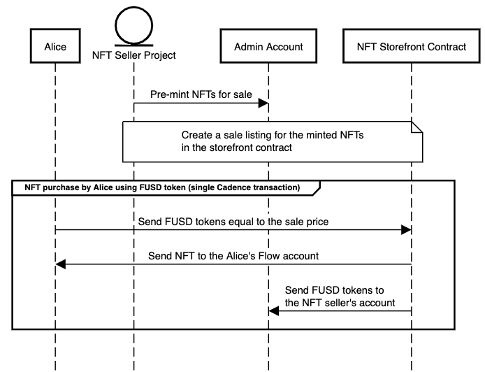
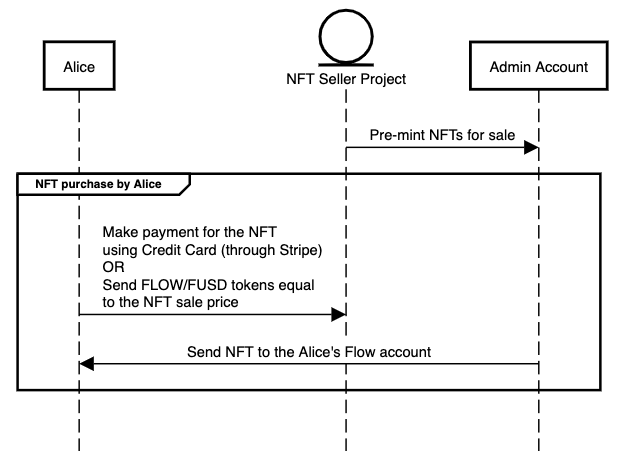
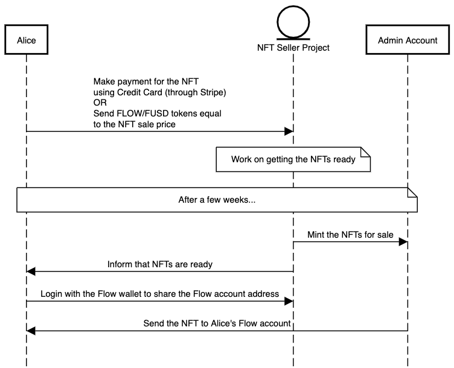
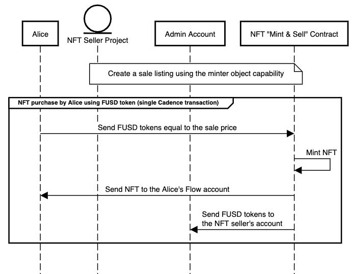
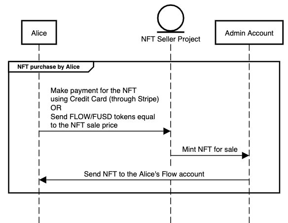
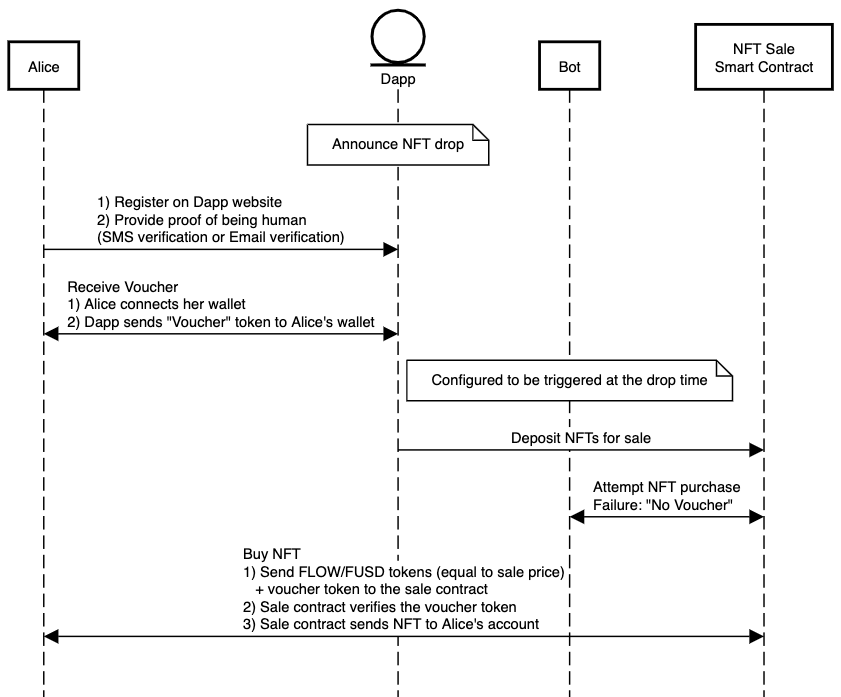

## Exploring Different Strategies for NFT Drops

This is a brief overview of different strategies for releasing NFTs.
Each strategy focuses on a few key aspects of NFT drops:
- Where are the NFTs sold?
- When are the NFTs minted?
- Who is responsible for payment processing?
- When do buyers receive their NFTs?
- How much do buyers trust your project?
- How much do you trust NFT buyers?
  
## On-chain Sale of Pre-Minted NFTs

With this strategy, the NFTs are pre-minted, so they are all minted before being sold.
Then they are bought and sold in an on-chain storefront, this means that completed transactions are reflected on the blockchain. 

This allows a dapp to grow without dealing with additional payment rails because the blockchain handles the payment.
NFT buyers like this strategy because they don't have to trust the dapp to complete a transaction successfully, all they need is their wallet.
This strategy doesn't need a backend, which lowers the costs and complexity for developers.
However, while the lack of Know Your Customer (KYC) makes this strategy frictionless for buyers and developers, it also leaves the dapp susceptible to bot attacks because the developer can't verify that the customers are real people.

Real-world examples of dapps using this strategy include: [Viv3](https://viv3.com/), [BloctoBay](https://bay.blocto.app/), [Chainmonsters](https://chainmonsters.com/), and [NBA Topshot](https://nbatopshot.com/).

## Off-chain Sale of Pre-Minted NFTs

Pre-minting the NFTs and selling them through the dapp’s website is a similar alternative strategy.
This allows the dapp developers to have greater control over the NFT sale process, allowing developers to prevent bots from accessing the storefront. 

Another benefit to this strategy is that developers can implement traditional payment rails, like credit cards, into the storefront in addition to crypto payments.
This benefits both NFT sellers and buyers because they can use whichever payment method is most convenient, which opens up an NFT storefront to a broader buying audience.

This strategy requires NFT buyers to trust the dapp more, especially with crypto payments, because they are irreversible.
Integrating payment processors for traditional payment rails may also be a challenge in some markets, leading to very different user experiences for NFT buyers.
As a storefront owner, you also risk chargeback issues when you implement traditional payment rails.

Real-world examples include [CNN Vault](https://vault.cnn.com/) and [RCRDSHP](https://app.rcrdshp.com/).

## Pre-sale of NFTs With Deferred Delivery

Pre-selling claims to NFTs and agreeing to deliver them at a later date is also a popular strategy.
This is a great way to gauge interest in your project before investing in content or technology.
Buyers receive their NFTs when your dapp is built, and you're ready to deliver content.
You can implement smart contracts for NFT pre-sales, and you can handle the transaction either on-chain or off-chain.

For this strategy to succeed, NFT buyers need to have a lot of trust in your project.
Buyers can't choose which NFT they buy because it doesn't exist yet, and this strategy doesn't leave much room for secondary markets.

## On-chain On-demand Mint and Sale of NFTs

With this strategy, NFTs are minted and sold when a buyer wants to buy them.
This strategy is less common than others because building it can be complex.
To accomplish this you need to have custom NFT sale contracts for each buyer, and you need to generate unique content for each user.
Generating purely random and unique content is challenging, and managing content drops is also a difficult problem to solve.
Also, because transactions are on-chain, your dapp will be susceptible to bot attacks.

But, there are some very unique benefits to this strategy.
The scarcity of the NFTs is predictable, and your dapp will never have unsold inventory.
This strategy also makes your project as decentralized as possible, because you don't need to maintain a centralized inventory or payment process.

Real-world examples include: [Bitku](https://bitku.art), AMM driven NFT minting, and [CryptoPiggos](https://www.flowverse.co/applications/cryptopiggos)

## Off-chain On-demand Mint and Sale of NFTs 

This strategy also uses on-demand minting, however, transactions are made off-chain so that developers can have greater control over the NFT sale process.
With on-demand minting, a dapp using this strategy will never have unsold inventory, and it benefits from the ability to implement traditional payment rails, like credit cards.
Developers can also use KYC to prevent bots or other unauthorized buyers, from buying NFTs.

While this strategy has some very unique benefits, it is complex to set up, which leads to unique challenges.
The combination of off-chain transactions and on-demand minting means that this strategy needs more blockchain transactions to complete the NFT purchase flow.
Also, like other off-chain strategies, NFT buyers need to trust the dapp, and payment processors may be challenging to implement in some markets.

A real-world example of this strategy is [Dooverse](https://dooverse.io/).

## On-chain Sale of NFTs Gated by Vouchers

The final strategy we're looking at allows NFT buyers to register on your website for vouchers that they can exchange for NFTs.
The vouchers act as authorization for a buyer, allowing your website to control who is allowed to buy your NFTs, while still gaining the benefits of on-chain transactions.
This is a great way to implement on-chain transactions while preventing bots and unauthorized buyers from accessing your NFTs.

However, this 2-step process may be too much friction for some NFT buyers, which may limit your NFT sales.
Additionally, the voucher system is imperfect, and there may be an unauthorized secondary market for your project's vouchers.
Real-world examples of this strategy include [JAMBB](https://www.jambb.com/) and [RoundLabs/Faze](https://www.onflow.org/post/alpha-innovation-series-round-labs-on-cadence-and-building-on-flow).

## Conclusion

Choosing an NFT drop strategy can be challenging.
Each strategy comes with its own benefits and challenges, and it's important to weigh which factors are most important for your project.
For more examples of real-world NFT projects using a variety of different strategies, have a look at [Flowverse](https://www.flowverse.co/)
