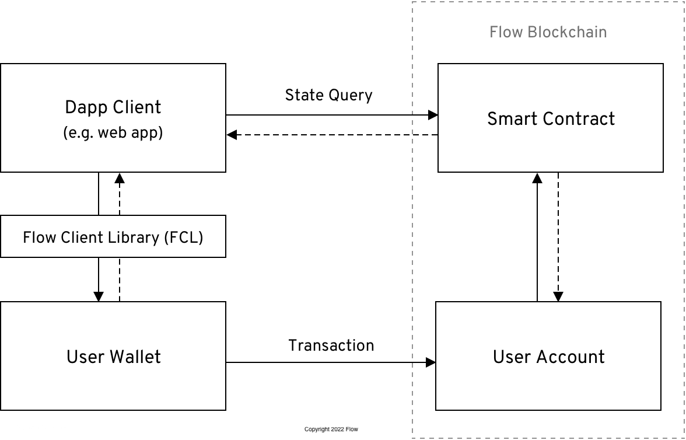

The diagram below outlines the components of a typical dapp built on the Flow blockchain. While many dapps are structured differently, this architecture introduces fundamental concepts that will be discussed throughout this guide.

## Dapp Client

The dapp client is the interface through which users interact with your dapp. Web and mobile applications are common examples of dapp clients.

## Smart Contract

A smart contract is a collection of code, deployed to a permanent location on the blockchain, that defines the core logic for a dapp.

## User Account

A user account is a record on the blockchain that stores the digital assets owned by a single user.

## Transaction

A transaction is a piece of code submitted to the blockchain that mutates the state of one or more user accounts and smart contracts. All transactions originate from at least one user account. In most cases, a transaction passes data between a user account and a smart contract.

## State Query

A state query is a request made to the blockchain that returns information about the state of your dapp’s smart contracts.

## User Wallet

A user wallet is software or hardware that controls access to a user’s account on the blockchain. The application client typically connects to the user’s wallet in order to send transactions to the blockchain. In many cases, the dapp physically transmits the transaction to the blockchain on behalf of the user. However, it’s important to note that the wallet has final say on what is signed or not, and therefore, has control over any transactions that interact with the user’s account.

## Flow Client Library (FCL)

The Flow Client Library is a framework that provides a standard interface to connect client applications and user wallets.

THanks for reading and happy hacking! 🚀
