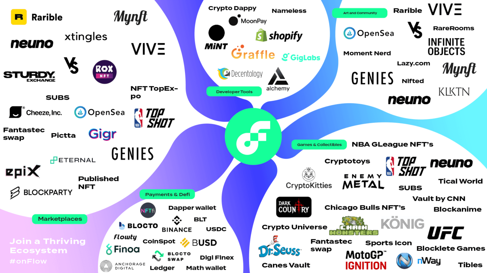

# How to Launch a Fungible Token on Flow

*DISCLAIMER:  PLEASE READ THE ENTIRETY OF THIS "DISCLAIMER" SECTION CAREFULLY BEFORE READING THIS GUIDE.  THE INFORMATION CONTAINED WITHIN IS FOR COMMUNITY DISCUSSION AND CONTAINS GENERAL INFORMATION ONLY.  NOTHING HEREIN CONSTITUTES LEGAL, FINANCIAL, BUSINESS, REGULATORY, OR TAX ADVICE OR GUIDANCE AS TO ANY POTENTIAL TOKEN LAUNCH OR PROJECT IN ANY SPECIFIC JURISDICTION.  ANYONE READING THIS GUIDE MUST CONSULT LEGAL, FINANCIAL, TAX, REGULATORY, AND OTHER PROFESSIONAL ADVISORS OR EXPERTS FOR FURTHER GUIDANCE BEFORE LAUNCHING ANY TOKEN OR TOKEN-RELATED PROJECT.  IT IS IMPERATIVE THAT INDEPENDENT LEGAL ADVICE IS SOUGHT TO DETERMINE THE LEGAL, REGULATORY, SECURITIES, OR OTHER REQUIREMENTS RELATED TO ANY AND ALL JURISDICTIONS WHERE A TOKEN LAUNCH OR SALE MAY OCCUR.*  

## Introduction
Launching a token is no easy feat. There is a lot that goes into bringing a token from nothing to market: strong tokenomics, private or public sale, distribution, and finally an organized launch on centralized and decentralized exchanges. 

Many dApp teams we speak to on a daily basis are somewhat humbled by the magnitude of the work ahead of them. We have spent many hours breaking down this process into manageable chunks and accompanying teams from their tokenomics design to their negotiations with market-makers. This guide is our attempt to make this knowledge more broadly available to help dApps realize their full potential on Flow.

In this guide, we will explore everything you need to know when launching a token, from the why to the how. The guide will be broken down into 4 parts:

1) **Prep work**: what you need to think about before you launch your token.
2) **Token allocation**: the process by which you will decide who gets how many tokens.
3) **Token distribution**: when and how you are going to get your tokens in your community’s hands.
4) **Token launch:** (nearly) everything you need to know to maximize the chances of success of your token listing.

Let’s dive in.

## Step 0: Prep Work

### Define Your Universe

Before launching your token, you will first need to take a step back and take an objective look at your dApp.

**So, what does your dApp do?**
Let’s start with something easy: what is the problem you are trying to solve and how are you solving it? Why is it crucial for your dApp to leverage a blockchain, instead of being a standard web2 application? You should be able to explain what you do in one or two concise sentences.

**Who are your users?**
You may have more than one type of user. Understanding each user’s journey on your dApp will be key in defining incentives that will make each user type “tick”.

For example, your users could be categorized in any of the following, non-exhaustive buckets: 

- Developers / builders
- Creators / content producers
- Curators
- Consumers
- Merchants
- Promoters
- Gamers
- Voters

You can also draw inspiration from this map of the Flow ecosystem. 

Write down the list that is most relevant to your dApp and for each type of user, outline succinctly what behavior is expected of them, and what will incentivize them to display this behavior. A good way to summarize the way users interact with your dApp (and with one another) is to draw up a flowchart showing the flow of incentives and behaviors for each user type. For now, ignore the token and only focus on the high-level behaviors/incentives.

**What Are Your Token’s Objectives?**

**Why do you need a token for your dApp?**

Not all dApps need a token! In many instances, a token is not necessary for a dApp to be successful. Before you start designing your tokenomics and planning for the token launch, list the problems that your token will help solve.

**How will your token enable network dynamics?**

A successful token should be able to allow network effects to flourish on your dApp. An endless stream of new users buying your token and engaging with your dApp should not be a requisite for your token to succeed, but a consequence of carefully designed tokenomics. 

A simple way to lay out the expected network effects is to draw a flywheel: what would it look like? Which category of user is most crucial for the flywheel to function? 

## Tokenomics

Now that you have a clear understanding of your dApp’s objectives, it’s time to look at how your token will fit into the picture. This is where tokenomics come in. At a high level, tokenomics is the process by which you define the supply and plan for the demand dynamics of your token.

## Supply

A token’s supply, and how that supply evolves over time, is one of the most important factors in your token’s ability to provide and sustain substantial value to your users. Keep in mind that you, as the creator of the dApp, have more or less absolute control over such supply as long as you are transparent from the start over the evolution of such supply. 

A token supply is typically born from:

1) Tokens sold - privately or publicly
2) Tokens given for free - a.k.a. airdropped tokens 
3) Tokens earned - typically from performing certain actions beneficial to the dApp
4) Fixed or growing supply?

One of the first questions you will face when determining your token supply is whether to have a fixed or growing supply.

Let’s take a first look at the pros and cons of each option:

|     |  Fixed Supply   | Variable Supply    |
| --- | --- | --- |
|  Pros   |  <ul><li>A growth of the network value goes directly to existing token holders</li></ul>   | <ul><li>Strong mechanism to onboard new users due to inflation (aka new tokens being created and distributed, usually for free)</li><li>Powerful tool to increase token supply as dApp demand rises</li></ul>     |
|  Cons   |  <ul><li>Token price may become prohibitively high for new entrants, hampering your user growth - may or may not be a problem, depending on how you denominate the assets on your dApp (USD or your token)</li><li>Potential for early adopters to yield an outsized influence</li></ul>   | <ul><li>Potential downward pressure on the value of the token as new demand needs to be created to match the new supply</li><li>Dilutes existing holders</li></ul>     |

Think about the pros and cons of each, as outlined above, and what fits best your dApp’s objectives. 

It has been common to see dApps that did not want to choose between each model and eventually opted for a dual token model: 
- The “in-app currency” token that has an increasing supply
- The “network/governance” token that has a fixed supply and is supposed to capture the network growth

We go into further detail in the section “One Token vs. Two Token Model”.

## Airdrops

Airdrops can be very advantageous in the early days of a token launch, as they reward your community and incentivize early users to start utilizing your token. However, it is not uncommon to see recipients of airdrops simply turn around and liquidate, therefore hurting the token value. To protect against this eventuality, you may want to introduce features that encourage your users to behave in a way that is supportive of the growth of your network. 

Some examples of this include: 

- Limiting your airdropped tokens to **only be used internally within your dApp**, akin to airline miles. A token that is not withdrawable is a token that cannot be sold. This limitation can be lifted once the supply/demand dynamics are more established.
- Introduce a **lockup period or vesting** that users will have to wait out before coming into full possession of their tokens. You can also add a spin to this by tying the unlock to a specific behavior: participation, engagement etc.
- **Dividing your airdrop** into multiple smaller airdrops, and make each airdrop dependent on the previous one. For example, if a user has liquidated tokens from the first airdrop, then they are no longer eligible to receive the second airdrop.

On Flow, creating an airdrop is easy: you can utilize tools like [Drizzle](https://www.drizzle33.app/) to easily airdrop and raffle fungible tokens and NFTs on the Flow blockchain, and even set your own requirements when establishing which users will be able to participate in the drop.

If you are interested in digging in deeper, please check out [Drizzle’s Github page](https://github.com/33-Labs/drizzle) for sample transactions on how to create an airdrop, determine who’s eligible for the drop,  and more.

## Demand

We usually recommend starting the tokenomics work by defining the vectors of demand for your token. ** Creating supply is easy, creating demand is hard.**

_How will you generate sustainable demand for your tokens?_

When thinking about the demand vectors for your token, think about the benefits you are providing with your token, and how your tokens can be used to pay for these benefits. Conceptually, the actions that provide the most value/enjoyment to your users should be where the demand for your token should be the highest. 

Let’s use an example to dig further into this. 

Your dApp is a racing car game. Through user testing, you notice that users spend a lot more time playing the game once they start upgrading their vehicles. Naturally, you decide to require your own token to pay for such upgrades. Did you just create net new demand for your token?

The answer is, it depends on where those spent tokens go:

- If the dApp collects the tokens as payments, and uses those as revenue to finance further development, you have not created any demand. Indeed:
  - The user bought your tokens on an exchange
  - The user sent the dApp the tokens to purchase the upgrades
  - The dApp sold these tokens on an exchange to finance its activity
  - Net net, a token was bought, a token was sold, nothing has changed!

If some or all of the tokens spent by users are destroyed or placed in long-term holds, then you have created net new demand. Remember, the more intense the token supply is, the stronger your demand mechanisms will need to be.

By matching net new supply (aka faucets) with net new demand (aka sink) mechanisms like burning or long-term locking, you will then be able to keep your supply and demand balance in check which will go a long way to reduce the long-term volatility of your token.

## One Token vs. Two Token Model

|     |  One Token Model   | Two Token Model |
| --- | --- | --- |
|  Pros   |  <ul><li>Easier to launch</li><li>Only one supply/demand model to optimize for</li></ul>   | <ul><li>Ability to segregate the distribution strategies to suit the purpose (e.g.,  currency vs governance)</li></ul>     |
|  Cons   |  <ul><li>May limit accessibility of the token to target audience</li></ul>   | <ul><li>Contagion risk: if token1 has poor S/D dynamics, may take token2 with it</li></ul>     |

While a two-token model can work if done properly, many dApps have proven in the past that this is a tough feat to achieve.

As mentioned earlier, dual-token models are made of one currency token for which supply can grow indefinitely and one governance token for which supply is fixed. Dapps often make the mistake to concentrate value capture towards the governance token and consider the currency token as an afterthought. The very real risk of such a construct is that the currency token starts suffering from hyperinflation and enters a death spiral, forming a sort of black hole that swallows everything around it: governance token first, and then currency token after.

However, there are precedents that have launched a dual-token model successfully. MakerDAO, for one, is a great example of this. 

[MakerDAO](https://makerdao.com/en/) is an open-source project on the Ethereum blockchain and DAO (Decentralized Autonomous Organization) that manages the Maker Protocol and the MKR and DAI currencies. While MKR is the governance token that gives holders executive voting and governance polling rights for all things related to the Maker Protocol (and thus the DAI token), the DAI stablecoin acts as a decentralized, unbiased, collateral-backed cryptocurrency that is soft-pegged to the US Dollar. 

MKR holders manage the Maker Protocol and the financial risks of DAI to ensure its stability, transparency, and overall efficiency. MKR voting weight is designed to be proportional to the amount of MKR a voter stakes in the voting contract, and voting rights in return allow holders to decide on key parameters of the DAI stablecoin, like stability fees and collateral types/rates. 

DAI’s first mover status, and its lack of off-market yield opportunities (like the ones offered on UST) have undoubtedly been the bedrock of DAI/MKR success. DAI careful supply scaling - by adding collateral assets slowly and thoughtfully - have allowed DAI to maintain its peg without threatening the stability of its ecosystem.

While designing a successful dual-token model can be challenging, we cannot repeat this enough: if you do not do the necessary prep work on how to best balance your supply and demand, then the market will eventually find this balance for you.

## Step 1: Token Allocation

### Industry Standards
While there are a number of ways you can split your token allocation. We have recorded for you the range we typically see across the industry:

- **Community**: 40-75%
- **Public Sales**: 0-10%
- **Airdrops**: 0-10%
- **Investors**: 5-15%
- **Team**: 5-20%
- **Advisors**: 0-5%

Importantly, this type of pie chart only captures **half** of the allocation picture. The other half consists of showing how each slice of the pie receives that allocation **over time**. This is where vesting/unlock comes in. Typically we see, an allocation over time that looks something like this:

In the example above, we’re using a 100 million fixed token supply model, and distributing the tokens on a 6-year timeline. The x-axis represents the years since launch, and the y-axis represents the token supply in circulation. As you can see, the number of tokens in circulating supply increases gradually over time and starts to taper off as we get closer to the 6-year mark. Token allocations for team members, investors, and advisors start vesting a year after launch at the cliff date, while airdrop, public sale, and community allocations unlock right at launch, at year zero.

Keep in mind that this is only an example, and there is no hard requirement to follow cliffs, multi-year unlocks, or any other locking/vesting features. These are just tools at your disposal that will allow you to fine tune the rate at which tokens enter the circulating supply.

## Private vs. Public Sales

A private sale is usually the first way a dApp fundraises, typically before a potential public fundraise. Not anyone can invest in a private sale - usually, anyone participating in these sales have conversed with and have some sort of relationship with the fundraising team. Investors in private sales are usually angel investors, VCs, family offices, or other investment funds.

In private sales, token sales can either take place on their own or alongside equity investments in the dApp. If a token sale is done alongside an equity investment, then a [SAFT](https://www.investopedia.com/terms/s/simple-agreement-future-tokens-saft.asp) (simple agreement for future token) is signed alongside a [SAFE](https://www.finra.org/investors/insights/safe-securities) (simple agreement for future equity). 

With a SAFT, the dApp team is agreeing to allocate a certain amount of tokens to investors alongside with an equity investment. In the case of a pre-existing token, the investor may agree to purchase the tokens at a discounted price. If the token has yet to launch, then both parties can work towards favorable terms.

The reasons for going private before a public sale are two-fold:

1) **Operationally**, it is much easier to handle a small number of investors,
2) **Logistically**, it is much less risky to face a handful of accredited investors than to face a myriad of retail investors located in multiple jurisdictions.

A public sale, on the other hand, is the first time a token can be purchased by the general public. Anyone interested in the token can purchase it through centralized platforms (a.k.a. ICO platforms) such as CoinList or TokenSoft or decentralized platforms (a.k.a. IDO) such as Blocto Launchpad or Metapier.

During a public sale, anyone purchasing a token is basically subscribing to buy a predetermined number of tokens at a specific price and signing a token purchase agreement, which is a contract with future rights to a specific unit of tokens on a future date.

## Token Sale: Dynamic vs. Fixed Price

A question that will invariably come up if you decide to undergo a token sale is what price you should sell your token at. 

There are two avenues you can take when it comes to determining the price at which your token will be sold during such a sale:

1) Dynamic price
2) Fixed price

When you choose to use a dynamic price, you are basically letting the market determine the price of your token. One of the most popular ways to achieve such price discovery is by holding a reverse dutch auction, during which time you are agreeing to sell a set amount of tokens, for which the initial bid price is set by the highest bidder. As bidding progresses, the bid price goes down until there are no more tokens left to sell. The last bid price is the final clearing price of the auction and all bidders receive their tokens at that set clearing price. 

If you choose to go with a fixed price for your launch, then you are setting the initial price. That initial price typical is obtained via a mix of:

  1) Analyzing the tokenomics of dApps with similar business models as yours. What does their market value look like? How does your project compare to it? From there, adjust for differences in market sizes and product offerings to estimate your market value and price.
  2) Using your last fundraise price (if you did conduct a fundraise) to help set your initial token price.

## ICO vs. IDO

An ICO (initial coin offering) is a popular method for fundraising involving the public sale of a token. Usually, in an ICO, tokens are sold to the public in exchange for stablecoins. The  process often involves creating a website for the token that includes the whitepaper and details of the token launch, followed by an intensive period of marketing and community engagement efforts to drum up pre-launch interest. The ICO platform is usually responsible for the operational aspects of the sale (KYC, payment rails, token allocation and tracking), while the dApp is responsible for marketing and community engagement.

An IDO (initial DEX offering), on the other hand, is a public sale that is made via a smart contract. While an IDO is a powerful tool for fundraising, remember that is not the same as getting listed on a DEX, which we will cover in the next section. You can easily organize your own IDO on Flow by using a Launchpad like [Metapier](https://docs.google.com/forms/d/1lP72QLwODk3_Yx5Zcy0LSWFAQ5n5tu6rFAPnTw-E4LU/viewform?edit_requested=true).

To illustrate an example of an IDO, let’s look at the launch of $BLT ([Blocto Token](https://token.blocto.app/)), the [Blocto](https://swap.blocto.app/#/IDO) app’s native token: 

When Blocto was initially launching their $BLT token, they conducted an IDO on their [launchpad](https://swap.blocto.app/#/IDO) that allowed any token buyers to see the terms and requirements for the token sale, and the details (number of tokens offered, sale terms, payment terms, and admission fees). From there, anyone interested in the IDO was able to buy a predetermined amount of $BLT tokens at the specified price. 

Since then, Blocto has [expanded its offerings](https://swap.blocto.app/#/IDO) to include IDOs for other tokens launching on Flow, such as $STARLY in addition to their own $BLT token. Another launchpad option on Flow is [Metapier](https://docs.google.com/forms/d/1lP72QLwODk3_Yx5Zcy0LSWFAQ5n5tu6rFAPnTw-E4LU/viewform?edit_requested=true), built by the team behind the ultra successful DoDo.

## Step 2: Token Distribution

Token distribution describes the process by which tokens allocated to various users during Step 1 get transferred to users’ wallets.

It is a common misconception to think that token distribution has to happen at the same time as token launch (the time at which the token starts trading on a CEX and/or DEX). In fact, we strongly recommend dApps to separate those steps. The logic behind this is that token distribution and token launch are significant events in the life of a dApp that need the full focus of the G2M team. 

Dapps often ask us how to keep distribution and launch separate in a world where anybody can start a new liquidity pool with a dApp token and FLOW. Indeed, the creation of such a liquidity pool would effectively get secondary trading going on the same day as the token distribution, thus preventing the dApp from taking things at their own speed. This is a major risk that can be managed with a bit of planning. Let us show you how.

## On-Chain vs. Off-Chain Distribution

There are two types of distribution you can choose:

1) **On-Chain Distribution**: the traditional way of distributing tokens. Tokens are transferred to users’ wallets on-chain.
2) **Off-Chain Distribution**: a mock distribution where tokens appear in the user’s wallet once they are connected to the dApp, but do not actually exist on-chain. The logic is similar to that of airline miles.

For an off-chain distribution, preventing users from sending their token to a DEX is easy, because tokens do not exist on-chain but only in a database run centrally by the dApp.

For an on-chain distribution, the objective is to let users spend the token on the dApp but forbid them to withdraw to any other address. This can be done on Flow by requiring a certain block height to be reached to unlock tokens on Flow. If interested in learning more about how you can build this into your smart contract, please reach out to the Flow team on [Discord](https://discord.com/invite/flow).  

## Vesting/Unlock Schedules

Distributions do not need to make all tokens allocated available immediately. That is where vesting/unlock schedules come in.

As mentioned in [Step 0: Prep Work](#step-0-prep-work), successful token launches achieve a balance between supply and demand early. Using an intentional vesting schedule for your token will allow you to fine-tune the rate at which new tokens enter the circulating supply, thereby helping you only introduce the quantity needed by your dApp at this point in time. 

How many tokens do you need circulating on the first day of launch to meet the forecasted demand? What about one week, one month, and one year post-launch? Figure out what circulating supply is actually needed by your dApp at these various dates, and from there, walk back the number of tokens that need to enter the circulating supply.

On Flow, implementing a vesting or unlock schedule in a smart contract is easy as cake. You can use [this link](https://docs.onflow.org/flow-token/locked-account-setup/#introduction) for more information on how to do this.

## Step 3: Token Launch

### Launching a Token: What Does It Mean?

Launching a token basically involves everything needed to get a token trading on a CEX and/or a DEX. This means figuring out what type of exchange to list on, what market makers to work with, if any, and plan for the changes for your dApp once your token is freely trading.
Exchange Listings

When it comes to listing on exchanges, you can choose to list on centralized exchanges (CEX), decentralized exchanges (DEX), or both.

|     |  CEX   | DEX |
| --- | --- | --- |
|  Pros   |  <ul><li>Increases the reach of your token</li><li>Easier for non-crypto users to discover and buy your token</li><li>Maximizes trading volumes</li><li>Makes price discovery more efficient</li><li>Brings legitimacy to your dApp</li></ul>   | <ul><li>Fast and easy launch</li><li>Users can buy tokens without KYC/ID verification</li></ul>     |
|  Cons   |  <ul><li>Takes more time to launch on a CEX</li><li>Longer due diligence process</li><li>Usually requires hiring a market maker</li><li>Might require paying a fee to the exchange</li></ul>   | <ul><li>Exposure to impermanent loss</li><li>Lower liquidity requirement compared to CEX</li><li>Lack of demonstrating KYC compliance</li></ul>     |

While listing on a DEX is very fast and easy, it is ultimately more beneficial to line up your listings and launch on CEXs on the same day as DEX launches. 

Being available on a variety of CEXs is very beneficial to increase the reach of your token, CEX makes price discovery more efficient, they also tends to increase trading volumes as CEX and DEX are constantly arbitraged against one another, finally many users look to the list of CEXs a token list on to get a sense of its legitimacy.

## DEX launches

Launching on a DEX simply means creating a liquidity pool that will hold a certain quantity of your token, as well as a certain quantity of another token of your choosing. On Flow, the most logical choice is to take advantage of FLOW’s pre-existing liquidity on BloctoSwap or IncrementFi.

The quantity of your token vs. the quantity of FLOW that you deposit will determine the initial price for your token. This is because liquidity pools assume equal USD value of each token. Thus, if you deposit $50,000 worth of FLOW in the pool and 10,000 of your own token, the initial price will start at $5 per token.

Of course, the price will not stay static! As users buy and sell your token, the inventory of both tokens will change, thereby changing the price of your token. For more details, you can read about AMMs here.

### Liquidity requirements

As described above, the price at which your token will trade will be determined by the quantity available in the pool vs. FLOW. Thus, the lower the quantity of the FLOW used to pair with your token, the more volatility your token will experience.

Let’s go through an example to clarify this, using an imaginary liquidity pool made of FLOW and a new token named TKN:
**FLOW/USD** = $2
**TKN/USD** = $1 

Liquidity pool **FLOW/TKN** is made of 5,000 **FLOW** and 10,000 **TKN**, for a Total Value Locked = 5,000 x $2 + 10,000 x $1 = $20,000

In the case of a constant product AMM, we have **x * y = k**, where **x** and **y** are the quantity of respectively **FLOW** and **TKN** in the liquidity pool.

k = 5,000 x 10,000 = 50,000,000 (k is a constant here).

Alice comes in to buy **TKN** with 2,500 **FLOW** tokens, the new **FLOW** inventory becomes 7,500 **FLOW** (2,500 new **FLOW** tokens + 5,000 original **FLOW** tokens). 

Now, let’s figure out the **TKN** inventory: 

**TKN** inventory = 50,000,000 / 7,500 **FLOW** = 6,666 **TKN** - or 3,334 **TKN** received by Alice in exchange for her 2,500 **FLOW**

This means that the user has paid 2,500 **FLOW** (equivalent to $5,000) to receive 3,334 **TKN**, which means that Alice bought **TKN** at $5,000 / 3,334 = $1.5 per **TKN**. This is 50% higher than the price Alice saw when browsing **TKN** on the DEX!

This price difference is called slippage, and is directly proportional to the size of the TVL in the pool.

As a result, we recommend dApps to launch a liquidity pool with at least $100,000 worth of tokens per side (i.e. a Total Value Locked of $200,000 at minimum). This means that the dApp should come up with $100,000 worth of FLOW prior to listing, which is not a trivial amount. Thankfully, a dApp can easily borrow FLOW while paying an interest rate in their own token using [boolean.xyz](https://docs.google.com/forms/d/e/1FAIpQLSeyMnRWSTtQv0YiK1-Qwc0xoKdBHFhVX3hQZk8s9BsT7-5LCQ/viewform).

### Do you need a Market Maker to be listed on a DEX?
While you do not necessarily need a Market Maker to create a liquidity pool (LP), remember that any liquidity deposited in an LP will have exposure to impermanent loss. And the greater the exposure, the greater the risk of impermanent loss. 

_Ask yourself_: are you okay with taking this risk, and what are the tradeoffs if you do decide to take it? This is a complex topic that will be the subject of a future post.

## CEX launches

### The role of Market-Makers
If you choose to list on a centralized exchange, then you will be required to hire a market maker, whose job will be to populate the order book of the various trading pairs supported on each CEX. Hiring a market-maker typically takes up to 6 weeks. 

### Exchange listing negotiations
Listing on a centralized exchange can take anywhere between 1 to 2 months between initial conversation and full due diligence. Typically exchanges will be interested in seeing your whitepaper, your effective token allocation, the vesting and unlock schedule for each category of holders of your token as well as any metric that captures the vibrancy and engagement of your community.

Some exchanges require payment of listing fees, but many do not. As a result, make sure that before agreeing to a listing fee you have a good understanding of the benefits you will gain from listing on a given exchange.

## Getting your Flow token created

While this guide does not cover the technicals of creating your fungible token, please find a couple of resources that may be helpful as you get ready to launch your token: 

- [Flow Token List](https://github.com/FlowFans/flow-token-list) - how to add a token to the Flow native token list
- [Flowscan Request Form](https://docs.google.com/forms/d/e/1FAIpQLSdMiIkj2goF3Ib7wJHRb-YNvruwBghq1NP1IOfz4p2smIFp0w/viewform) | Token Metadata - please fill this out to update your token metadata on Flowscan
- [Flow Developer Portal](https://developers.flow.com/?utm_source=Flowverse&utm_medium=Website&utm_campaign=Dapp) - documentation, guides, and resources for developers building on Flow

## Final Words

We have given in this guide a number of guidelines and templates to help you get around the cold start problem. You should not consider them as hard rules that you have to follow to ensure a successful token launch. Web 3.0 allows a near infinite creativity space, and we hope you take maximum advantage of that, especially when designing your tokenomics. If you have an idea that sounds crazy, or that you are concerned it might not work, we would love to hear about it and brainstorm with you.

Building a token on Flow unleashes a world of opportunities - for your users, for your team, and for those that believe in bringing your vision to life in a decentralized, permissionless way. Moreover, creating a token for your community is an incredible opportunity to create a macroeconomic landscape in a micro setting. This is a great way to test out what works best for your community and your product, and put the power back in the hands of your largest supporters. 
