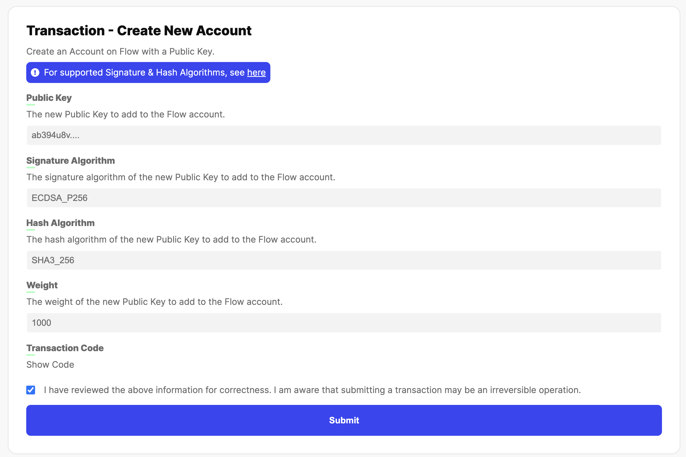
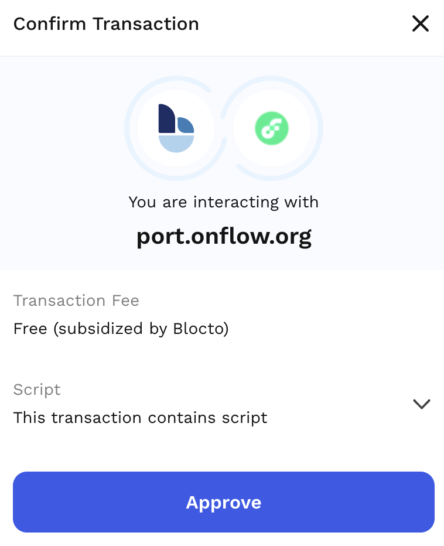
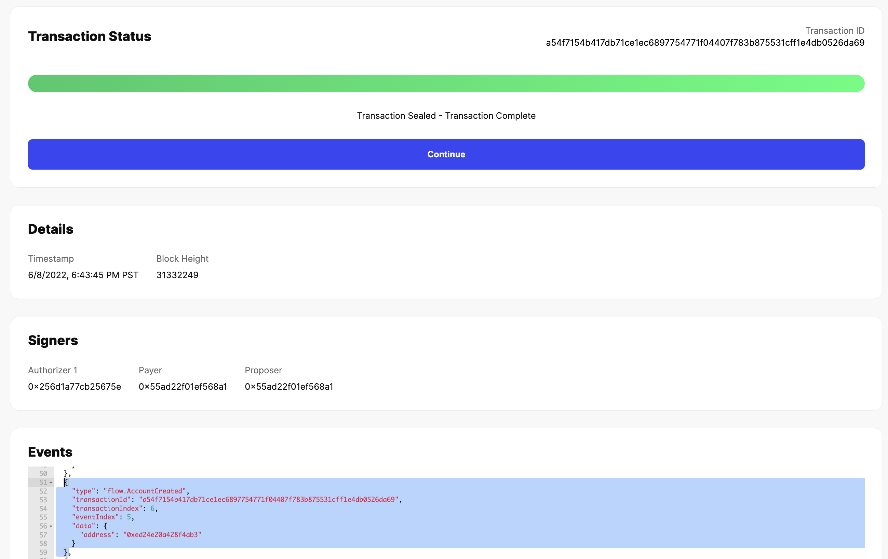
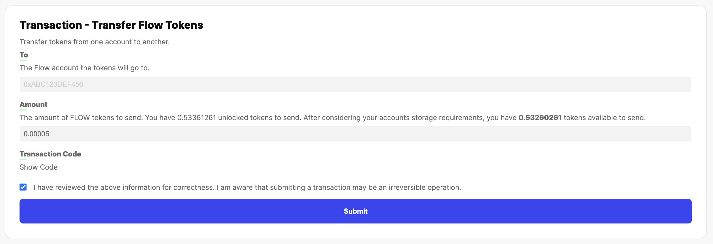

In order to deploy your smart contracts to the mainnet, you need to register, fund, and setup a new account.

At the time of writing, the most convenient way to setup a new mainnet account is by using [Flow Port](/flow-port/).

> **Note**: This account will be used for production purposes. Make sure you handle keys appropriately.

## Pre-requisites

What you need before you start:

- Blocto account: You need a Blocto to interact with [Flow Port](https://port.onflow.org/)
- FLOW tokens: The default amount of the FLOW token (0.001) in Blocto accounts is **NOT** sufficient to create an additional Flow account. You should at least have 0.002 FLOW in your Blocto account
- [Flow CLI](https://github.com/onflow/flow-cli): You need the CLI to generate a non-custodial key pair

> **Note**: If you do not have enough FLOW, please refer to the [Buy FLOW instructions](https://flow.com/#buyflow).

## Step by step guide

> **Note**: If you prefer watching a video, check out [this tutorial by Jacob Tucker](https://www.youtube.com/watch?v=vXui7uO4cIQ)

### Step 1: Access Flow Port

Open [Flow Port](https://port.onflow.org/) on your browser and "Sign In" using Blocto.


Next, select "Blocto" as the provider and follow the instructions to either sign up or sign in to your existing account.


> **Note**: If you have an exsiting account, you will be asked to confirm your login request. If you create a new account, you will need to complete a transaction to prepare your account for Flow Port usage.

Once you successfully logged in, you will see the dashboard. Locate the left side naviagtion and open the "Advanced" menu.


Next, click on "Create New Account".

> **Note**: You can open [this direct link to the "Create New Account" screen](https://port.onflow.org/transaction?hash=a0a78aa7821144efd5ebb974bb52ba04609ce76c3863af9d45348db93937cf98&showcode=false&weight=1000&halg=3).

### Step 2: Generate non-custodial account

A non-custodial account will make sure you are the only one holding the keys to your account.

To generate a new key pair with the [Flow CLI](https://github.com/onflow/flow-cli), run the following command:

```sh
> flow keys generate --network=mainnet

🔴️ Store private key safely and don't share with anyone!
Private Key      5b438...
Public Key       1bdc5...
```

> **Note**: By default, this command generates an ECDSA key pair on the P-256 curve. Keep in mind the CLI is intended for development purposes only and is not recommended for production use.

Take a note of the public key and go back to the ["Create a new account" screen](https://port.onflow.org/transaction?hash=a0a78aa7821144efd5ebb974bb52ba04609ce76c3863af9d45348db93937cf98&showcode=false&weight=1000&halg=3) on Flow Port.

Enter your public key from the CLI, ensure the hash algorithm is set to `SHA3_256` and the weight is set to `1000`. Finally, check the box confirming correctness and hit 'Submit'.



> **Important**: Your account needs to have at least 0.002 FLOW for the account creation. More details can be found [in this guide](https://docs.onflow.org/flow-token/concepts/#storageaccount-fees).

You will be prompted to confirm the transaciont, hit "Approve".



Once the transaction is sealed, you will see a confirmation: `Transaction Sealed - Transaction Complete`.

Next, scroll down to the events section and locate the `flow.AccountCreated` event with the newly generated address.



**Make sure to take a note of the address - you will need it for the next step**. If you want to verify the public key for this address, you can visit [flow-view-source](https://flow-view-source.com/) or run the [Flow CLI get account command](/flow-cli/get-accounts/).

### Step 3: Send FLOW to non-custodial account

You will use your new non-custodial account to deploy smart contracts to the mainnet. This action will require you to pay a transaction fee ([more details on fees](/concepts/variable-transaction-fees)). The fees you will have to pay are dependent on the amount and size of the contracts. Deploying a single contract that is ~50kb will cost ~0.00002965 FLOW.

Determine the minimum FLOW amount for your needs and transfer as follows.

On the left side navigation, locate and open the menu item ["Send FLOW"](https://port.onflow.org/transaction?hash=47851586d962335e3f7d9e5d11a4c527ee4b5fd1c3895e3ce1b9c2821f60b166&showcode=false)

On the next screen, enter the non-custodial address you generated in the previous step, set the determined amount, check the box for correctness, and hit "Submit".



A Blocto view will show up, review the details and hit "Approve". The transaction will be broadcasted and processed - this may take a few seconds.

Finally, a screen confirmation will be displayed with the status `Transaction Sealed - Transaction Complete`. You can verify the correctness by reviewing the events. Locate the event type `FlowToken.TokensDeposited` and confirm the recipient, it should be your non-custodial address.
