This guide provides step-by-step instructions for using the Flow Port to stake your FLOW tokens and start earning rewards.
Currently, Flow Port only supports staking or delegating using tokens held in Blocto or Ledger wallets.
If you're new to the concepts of staking and delegating you can [read this guide](/staking) to learn more.

## First Step

When you arrive in Port, select **Stake & Delegate** from the left-hand menu. You should be taken to this page.

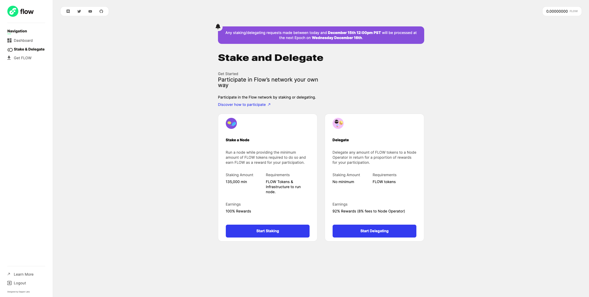

From here you can decide whether to stake or delegate.

- Select **Stake** if you plan to stake a node you're running.
- Select **Delegate** to delegate your stake to another Node Operator. You don't need to know which Node Operator, you'll be provided with a list to choose from. If you are not running your own node you scan skip directly to the [delegation section](#delegating)

## Stake a Node

Users who will be running their own nodes can stake them using the Flow Port.

#### Pre-requisites

In order to stake your node, you'll need to have the required amount of FLOW for your node type.
You'll also need the following information about your node:

- Node ID
- Network Address
- Networking Key
- Staking Key
- Machine Account Public Key (for collection/consensus nodes only)

If you don't have this information, go [here](https://docs.onflow.org/concepts/nodes/node-operation/quickstart/#step-1---run-genesis-bootstrap) for instructions on how to acquire it.

### Begin Staking

First, select the type of node you'll be running by choosing from the list. You must have the required amount of locked FLOW in your account.

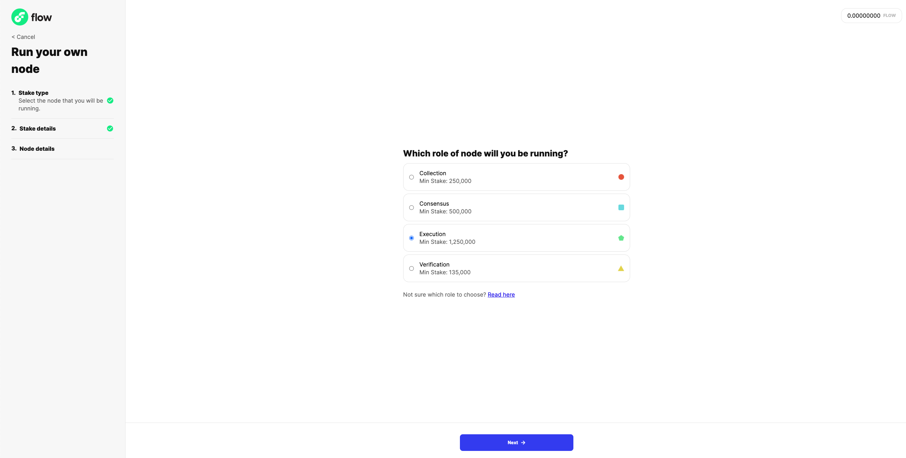

Once you selected your node type, click next and specify how much you'd like to stake. The minimum amount for your node type is required,
but you may stake as much as you like beyond that. Here's the screen you should see:

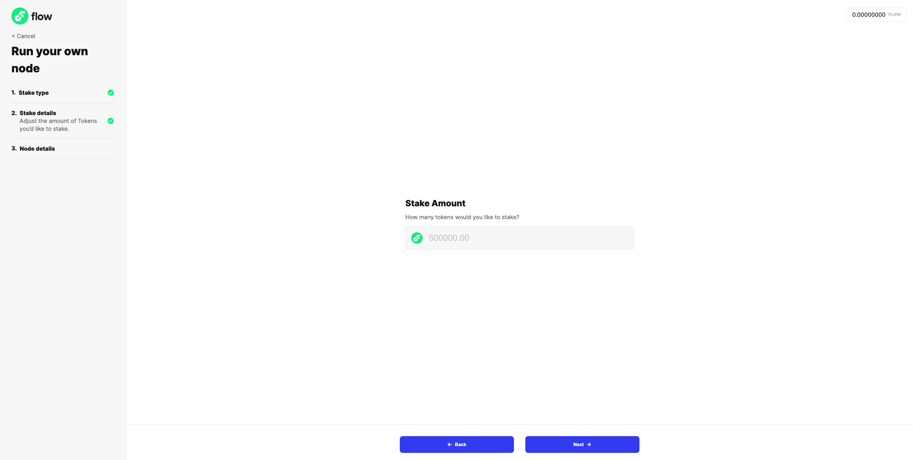

Clicking next will take you to the final screen, where you'll need to enter information about your node you previously obtained.
If you don't have this information, go [here](https://docs.onflow.org/concepts/nodes/node-operation/quickstart/#step-1---run-genesis-bootstrap) for instructions on how to acquire it.
Here's the screen you should see:

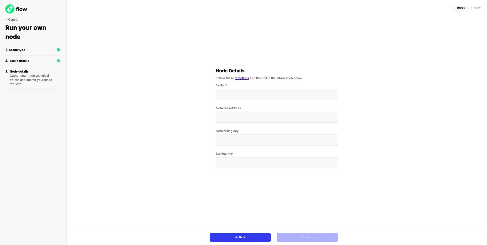

Clicking next will take you to a confirmation screen. This is your chance to double-check that you've entered your information correctly. If you're ready, check the
box confirming your information and click submit to send the transaction that will stake your node! You should see a transaction status screen like this:

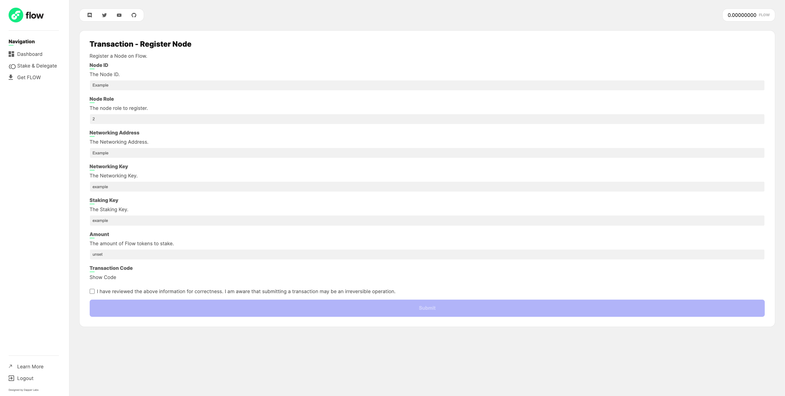

**Note:** If your transaction fails, double-check the information you provided.    

If you return to the home screen, you'll be able to see your staking request in progress!

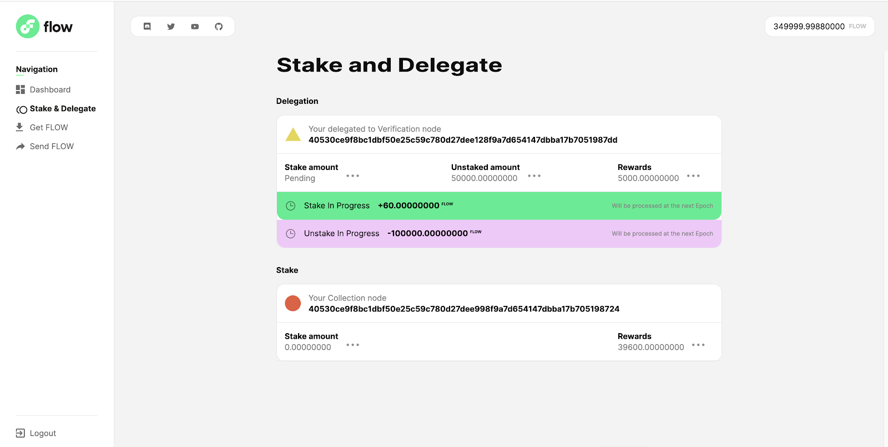

### Existing Node Operators

If you are already a node operator with a staked node, you will first need to upgrade your account to a Staking Collection. On the Stake & Delegate page you will see a card which will walk you through submitting the transaction to upgrade your account to Staking Collection.

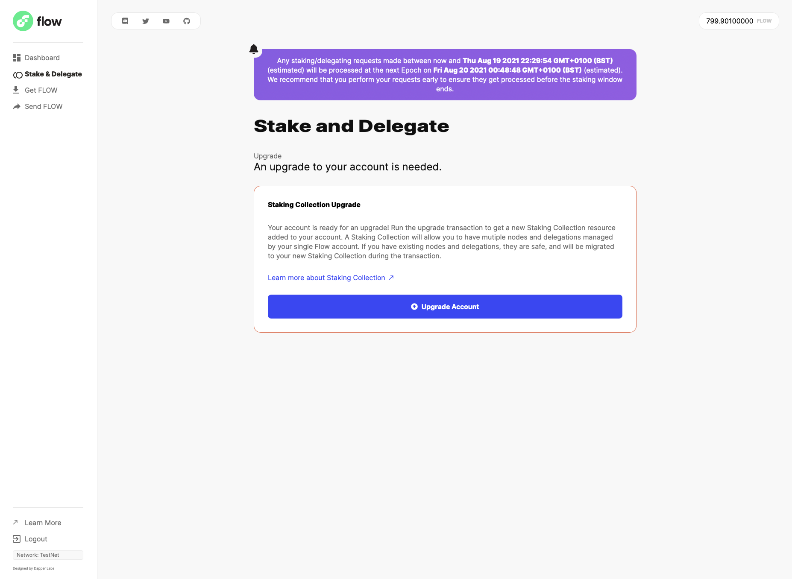

Once this is done, you can now create a [Machine Account](/nodes/node-operation/machine-existing-operator) by clicking the "Upgrade Node" button on the Stake & Delegate page.

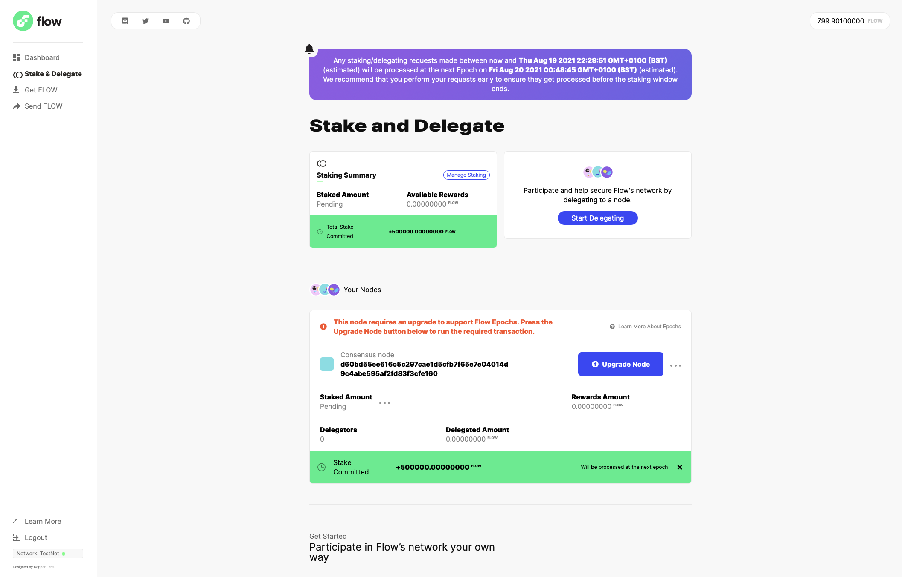

You can follow the guide [here](/nodes/node-operation/machine-existing-operator) to create your Machine Account.

## Delegating

Delegating is the process of staking your locked FLOW to nodes which are being run by another party.

#### Pre-requisites

In order to delegate your stake to another node, you'll need to know the **node operator ID** of the operator who is running the nodes you wish to stake.
Here is a list of node operator IDs you can delegate to: [List of Available Node Operators](https://github.com/onflow/flow/blob/master/nodeoperators/NodeOperatorList.md)

### Enter a Node Operator ID

Simply enter the ID of the node operator of your choice and click next.

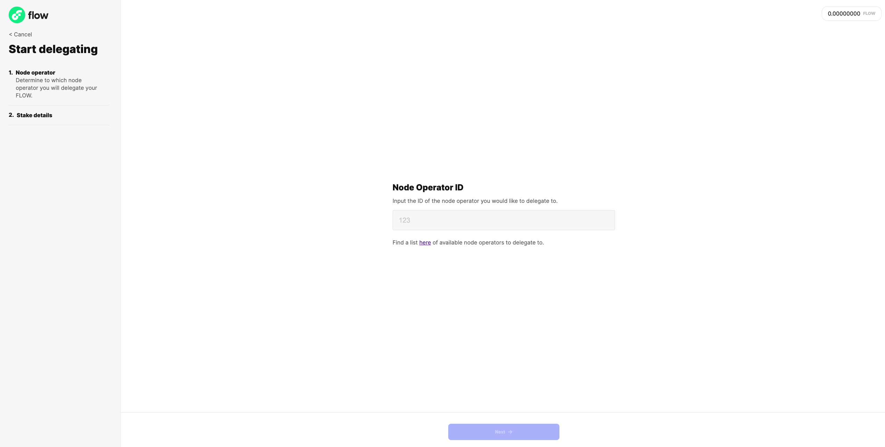

### Enter an amount

Next you'll enter an amount of FLOW you would like to delegate. When delegating you may send any amount to the node operator.

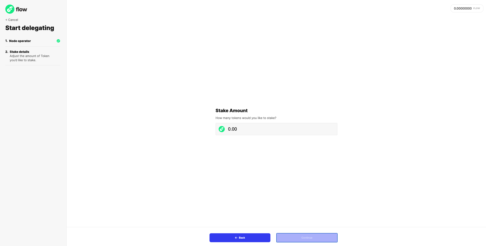

Click next to reach the confirmation screen. Confirm the details of your delegation request and click submit!

Once your transaction is submitted, you can monitor its status from this screen, or return to the Flow Port home screen.

**Note:** If you transaction fails, double-check the information you provided.    

That's it! You've successfully delegated stake to your chosen node operator!

## Returning to Port

Within Flow Port, navigate to the ‘Stake & Delegate’ page to see details about your existing staked and/or delegated tokens.
This will also show you the rewards you have earned for your staked/delegated tokens.

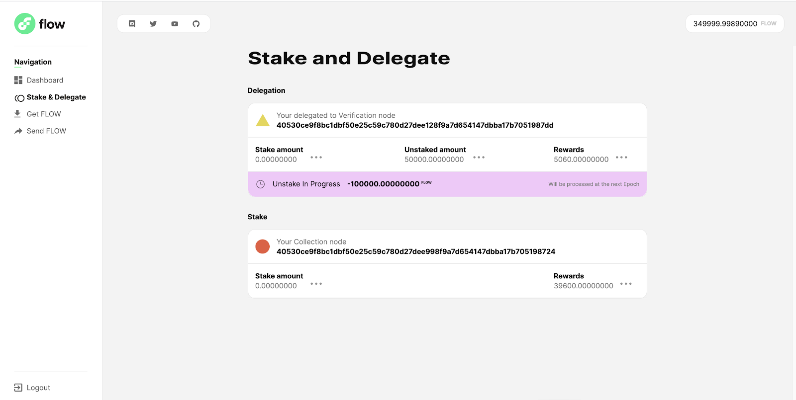

From here, you can do a few different things with your rewards:

- You can choose to **re-stake** them to the associated node.
- You can choose to **withdraw** them to your wallet.

## Re-staking

Flow Port will not automatically re-stake your rewards.
To re-stake your rewards, simply hover your cursor over the 3 dots next to the rewards field:

Click on the Restake option. This will take you to a screen that looks like the below. Input the amount of rewards you want to re-stake, acknowledge the transaction inputs and click submit:

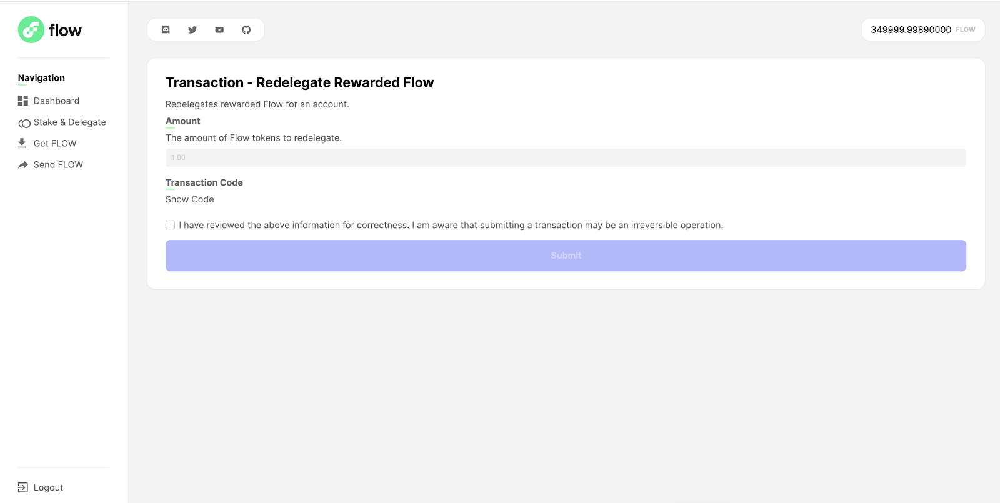

Once the transition is processed, you can reference the Stake & Delegate page again to see the pending stake now:

## Withdraw your Rewards

To withdraw your rewards, simply hover your cursor over the 3 dots next to the rewards field, and click on ‘Withdraw’.

Input the amount that you want to withdraw to your wallet, acknowledge the transaction inputs and click submit:

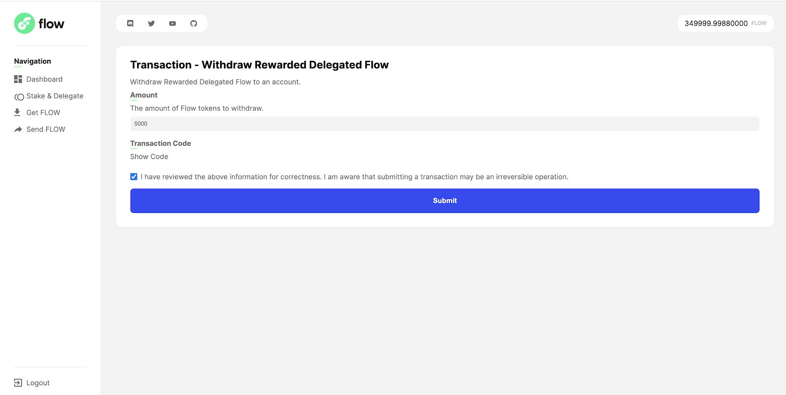

Once the transition is processed, you can now see the withdrawn rewards in your balance and you are now free to do other actions with them (send them to other accounts, delegate to a node, etc).
