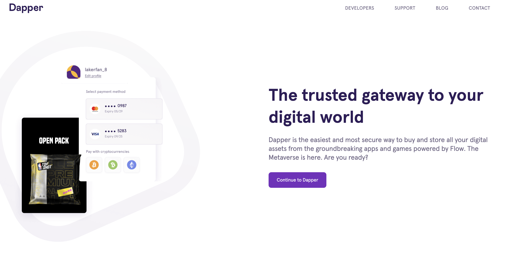
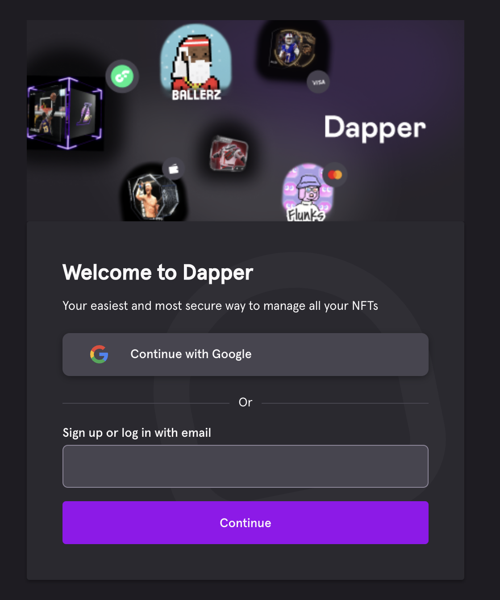

# Overview

You need a wallet to manage your Flow account and digital assets like NFTs or crypto currencies.

## What is a wallet?

Flow Wallets are applications that give access to your Flow accounts, allow you to send and receive funds, and enable you to interact with Flow applications.

## What features do wallets provide?

A variety of wallets are available. Most commonly, they allow you to …

- Create Flow accounts
- Read address, balance, and transaction history
- Transfer tokens from one account to another
- Display NFTs and discover NFT collections
- Authenticate with Flow applications
- Send transactions

## What types of wallets exist?

A wallet is only a tool to manage your Flow account. You can manage your account from different wallets.

A wallet is build for a specific platform:

- A hardware wallet is a physical device that lets you keep your crypto offline
- A web wallet allows you to manage your account through the web browser. It is either integrated into a website or into your web browser itself. Web browser wallets need to be installed separately (Chrome, Firefox, or Opera)
- A desktop wallet allows you to manage your account on your computer (macOS, Windows or Linux)
- A mobile wallet makes your account accessible on your mobile device (Android or iOS)

Wallets come in different ownership models:

- Some wallets will require you to be the “Custodian” (aka “non-custodial”). With that, you have the responsibility to securely store your private key, which is used to control your Flow account. If you lose your key, there is no-one that can retrieve them for you.
- Other wallets are “custodial”. In that case, the secure account storage is handled by the wallet provider on behalf of the account owner. You will create an account with login credentials - very similar to traditional web applications. If you forget your account credentials, you can reach out to the customer support of the wallet provider to retrieve your account.

## What wallets can I choose from?

There are different Flow wallets you can choose from. They all serve the same purpose, but each one takes a different approach, supports different features, and makes different tradeoffs.

- [Blocto](https://blocto.portto.io/en/) is a custodial web, iOS and Android wallet
- [Ledger](https://www.ledger.com/) offers hardware wallets
- [Dapper Wallet](https://www.meetdapper.com/) is a custodial web wallet
- [NuFi](https://nu.fi/) is a non-custodial wallet with NFT, staking and Ledger support
- [Lilico](https://lilico.app/) is a non-custodial web wallet focused on NFTs
- [Finoa](https://www.finoa.io/flow/) offers a institutional-grade custodial wallet
- [Flipper](https://flipper.org) is a non-custodial browser extension wallet
- [Dapper Self Custody](https://www.meetdapper.com/dapper-self-custody) is a non-custodial mobile wallet (BETA)

# How Tos

The following sectiong explain how to use a specific wallet.

## How to use Blocto

You can create a Blocto account to hold FLOW in 2 different ways:

1.  Through Flow Port
2.  Through Blocto's mobile application.

Both of these options are shown below.

### Creating Account through Flow Port: Navigate to Flow Port

1.  Using Google Chrome, Navigate to [Flow Port](https://port.onflow.org/).

2.  Click on 'Sign Up'.

3.  Click on Blocto. Please disable any ad blockers you have before logging in using Blocto:

4.  Follow the user interface prompts to create a new Flow Account Address.

5.  After you create your account, you should be logged into Flow Port. You can now see your account address in Flow Port:

### Creating an Account through Blocto's Mobile Application

1.  Sign-up for a Blocto account. This will be done through Blocto's phone app. Blocto download link: https://blocto.app.link/download

2.  Once the application is downloaded, open it and click on the WALLET button.

3.  Scroll over to the FLOW wallet and click it.

4.  Follow the process of signing up and creating a new account. You will do this process by signing up with an e-mail address.

5.  Once you have confirmed your e-mail address, you now have a valid account. If you click on the FLOW wallet again, you will be able to see your Flow Address.

- a.) If you have any questions regarding the process of generating your FLOW address on Blocto, you can reach out to our support team here: support@blocto.app.

## How to use Dapper Wallet

You can create a Dapper account to purchase and display NFTs from some of the top marketplaces on Flow, like NBA Top Shot, NFL ALL DAY, UFC Strike and more.

Follow these steps to create your Dapper account

Visit www.meetdapper.com and click “Continue to Dapper”

Sign-up with an email address or your Google account

Once your account is created, it is strongly recommended that you take the following actions to get the most out of Dapper:

- Complete your identity check
- Add a payment method, such as a bank account or credit card
- Secure your account with 2-step verification

> **Note**: If you encounter any issues during account creation or afterwards, you should [file a ticket with the Dapper support team](https://support.meetdapper.com/hc/en-us/requests/new?)

## How to use Ledger

### Note for users of Flow Ledger before v0.10.0

The June 15th Secure Cadence Spork changes two transactions in a way that will make them no longer compatible with the Ledger app with version before v0.10.0. At the time of the spork, v0.10.0 is yet to be released to the Ledger Live app store, and as such the [following transactions will be unsupported](https://github.com/onflow/ledger-app-flow/pull/83) until the time it is released.

1. Staking Collection - Register Node
2. Staking Collection - Create Machine Account

### Before You Start

1.  Ensure you have:

- a.) [Ledger Live](https://support.ledger.com/hc/en-us/articles/4404389606417-Download-and-install-Ledger-Live?docs=true) installed on your computer.

- b.) [Initialize](https://support.ledger.com/hc/en-us/articles/360000613793) your Ledger Device.

- c.) Your Flow Ledger App is completely up to date. You can see this by accessing Ledger Live where it will bring to your attention your applications that need to be updated.

2.  With choosing Ledger, please be aware that if you lose your Ledger Device, we will not be able to support any type of device recovery. Refer to Ledger supported documentation in case of any questions:

    - a.) [Recovery Phrase Information](https://www.ledger.com/academy/crypto/what-is-a-recovery-phrase)

### Install the Flow App

1.  Connect your Ledger Device to your computer and open Ledger Live.

2.  Make sure your Ledger device firmware is up to date. You can check this by clicking on **‘Manager’** from the side navigation bar.

    Choose to install the update if one is available:

    

- a.) NOTE: Sometimes the install option doesn't show up, or it is not clickable. If this is the case, wait for a little bit of time to see if it appears, or restart the ledger live app if necessary.

3.  On the Manager screen in Ledger Live and search for ‘Flow’.

4.  You should see the Flow App. Install it and follow the instructions on the device.
    

- a.) NOTE: If the Flow App does not appear, it may be because you are on an outdated version. Please ensure you are on the most updated version.

### Navigate to Flow Port to Create an Address

1.  Using Google Chrome, Navigate to [Flow Port](https://port.onflow.org/)

2.  Click on 'Sign Up' if you need to create a new Flow Account.

3.  Click on Ledger:

4.  Follow the prompts on the screen. Plug in your Ledger device and open the Flow App:

5.  Click on Create an account. And follow the prompts on your ledger device.

6.  Once your account address is created, you will be automatically logged into Flow Port.

7.  You can copy it from the ‘Dashboard’ screen, as shown below:

    

## How to use Finoa

1. If you do not have a Finoa account already, you can create one [here](https://finoa.io/flow).

2. Once you've sent an email to flow@finoa.io, the Finoa team will guide you through their KYC and onboarding process and help you set up an Account with a FLOW wallet.

3. If you have any further questions regarding the process of generating your FLOW address on Finoa, you can reach out to their support team at support@finoa.io.

4. Once onboarded, Finoa will provide you with your personal FLOW deposit address.

## How to use Flipper

- [Video guide for creating a new wallet using Flipper](https://twitter.com/flipper/status/1587821841544089602)
- [Video guide for importing an existing wallet using Flipper](https://twitter.com/flipper/status/1590358560558432262)

## How to use Kraken

_Please note: claiming and staking of FLOW will not be available with Kraken for residents of the US or Canada._

Follow these steps to receive and use FLOW in your Kraken account:

1. If you do not have a Kraken account already, [sign up here](https://www.kraken.com/sign-up).

2. Once you have your Kraken account, sign in to your account and select Funding.
   

3. Under the list of all assets, locate Flow (FLOW) and select Deposit.
   

4. Select GENERATE NEW ADDRESS to create your deposit wallet address.
   
5. If you have any further questions regarding the process of generating your FLOW address on Kraken, you can reach out to the support team [here](https://support.kraken.com/hc/en-us/requests/new).
