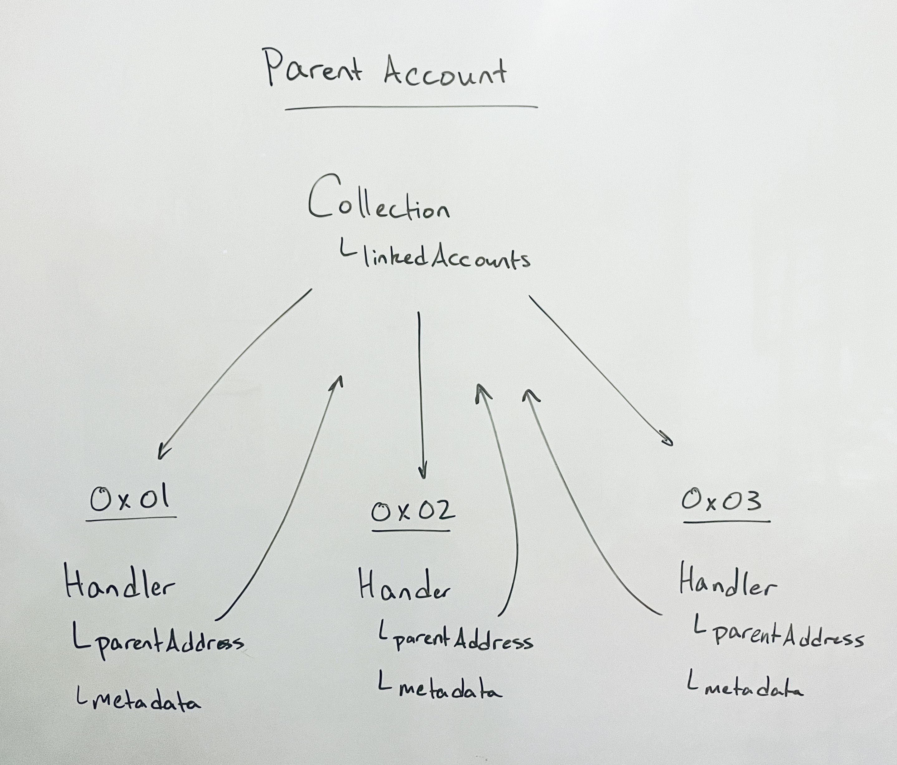
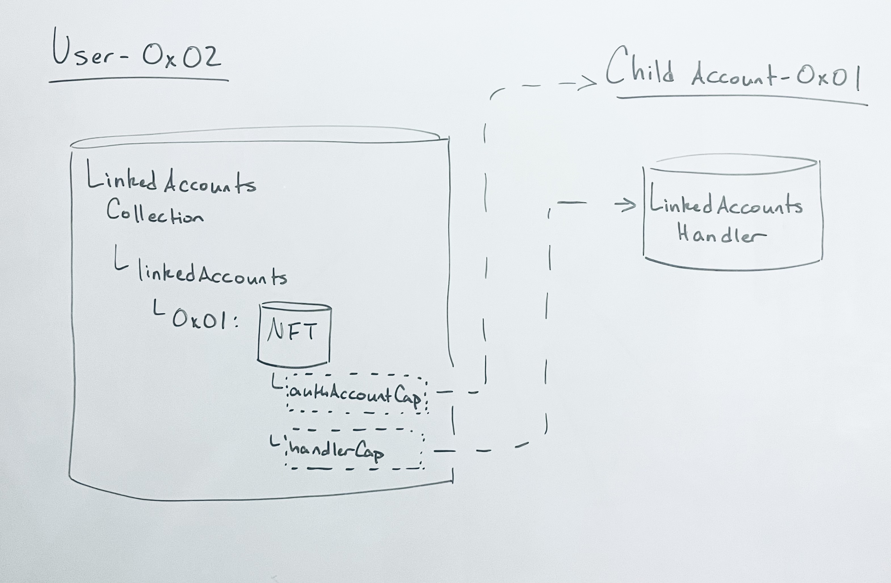
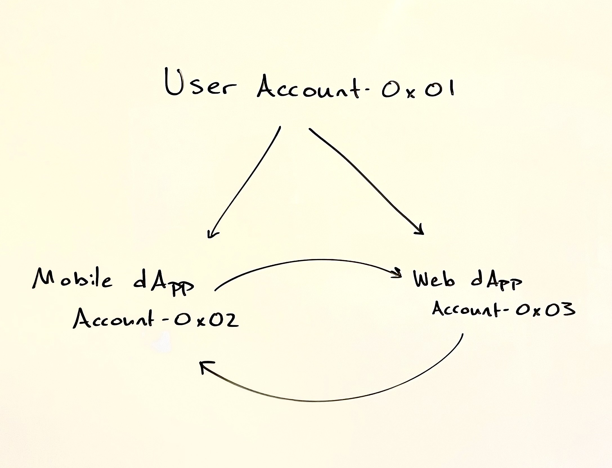

This doc serves as developer guidance to support Hybrid Custody apps by leveraging Account Linking. While account linking as a feature is a language level API, supporting linked accounts such that users achieve Hybrid Custody has a bit more nuance, namely apps should build on the [LinkedAccounts standard FLIP](https://github.com/onflow/flips/pull/72). Implementing this standard will allow dapps to facilitate a user experience based not on a single authenticated account, but on the global context of all accounts linked to the authenticated user.

We believe multi-account linking and management, technical initiatives in support of [Walletless](https://forum.onflow.org/t/hybrid-custody/4016) [Onboarding](https://flow.com/post/flow-blockchain-mainstream-adoption-easy-onboarding-wallets), will enable in-dapp experiences far superior to the current Web3 status quo and allow for industry UX to finally reach parity with traditional Web2 authentication and onboarding flows, most notably on mobile.

A new user will no longer need a preconfigured wallet to interact with Flow. When they do decide to create a wallet and link with a dapp; however, the associated accounts and assets within them will need to be accessible the same as if they were in a single account.

In order to realize a multi-account world that makes sense to users - one where they don’t have to concern themselves with managing assets across their network of accounts - we’re relying on Flow builders to cast their abstractive magic. Consider this your grimoire, fellow builder, where we’ll continue from the perspective of a wallet or marketplace dapp seeking to facilitate a unified account experience, abstracting away the partitioned access between accounts into a single dashboard for user interactions on all their owned assets.

> :warning: Note that the documentation on Hybrid Custody covers the current state and will likely differ from the final implementation. Builders should be aware that breaking changes will deploy between current state and the stable version. Interested in shaping the conversation? [Join in!](https://github.com/onflow/flips/pull/72)

# Objective

- Understand the linked account model
- Create a blockchain-native onboarding flow
- Link an existing app account as a child to a newly authenticated parent account
- Get your dapp to recognize “parent” accounts along with any associated “child” accounts
- View Fungible and NonFungible Token metadata relating to assets across all of a user’s associated accounts - their wallet-mediated “parent” account and any hybrid custody model “child” accounts
- Facilitate transactions acting on assets in child accounts

# Design Overview

The basic idea in the [(currently proposed) standard](https://forum.onflow.org/t/account-linking-authaccount-capabilities-management/4314) is relatively simple. A parent account is one that has delegated authority on another account. The account which has delegated authority over itself to the parent account is the child account.

In the [Hybrid Custody Model](https://forum.onflow.org/t/hybrid-custody/4016), this child account would have shared access between the dapp which created the account and the linked parent account.

How does this delegation occur? Typically when we think of shared account access in crypto, we think keys. However, Cadence recently enabled an [experimental feature](https://github.com/onflow/cadence/issues/2151) whereby an account can link a Capability to its AuthAccount.

We’ve leveraged this feature in a (proposed) standard so that dapps can implement a hybrid custody model whereby the dapp creates an account it controls, then later delegates authority over that account to the user once they’ve authenticate with their wallet. All related constructs are defined in the `LinkedAccounts` contract. The delegation of that account authority is mediated by the parent account's `Collection`, and `Handler`, residing in the linked child account. 



Therefore, the presence of a `Collection` in an account implies there are potentially associated accounts for which the owning account has delegated authority. This resource is intended to be configured with a pubic Capability enabling querying of an accounts child account addresses via `getLinkedAccountAddresses()`.

A wallet or marketplace wishing to discover all of a user’s accounts and assets within them can do so by first looking to the user’s `Collection`.

## Identifying Account Hierarchy

To clarify, insofar as the standard is concerned, an account is a parent account if it contains a `Collection` resource, and an account is a child account if it contains a `Handler` resource.



We can see that the user’s `Collection.linkedAccounts` point to the address of its child account. Likewise, the child account’s `Handler.parentAddress` point to the user’s account as its parent address. This makes it easy to both identify whether an account is a parent, child, or both, and its associated parent/child account(s).

## Consideration

Do note that this construction does not prevent an account from having multiple parent accounts or a child account from being the parent to other accounts. While initial intuition might lead one to believe that account associations are a tree with the user at the root, the graph of associated accounts among child accounts may lead to cycles of association. 

We believe it would be unlikely for a use case to demand a user delegates authority over their main account (in fact we’d discourage such constructions), but delegating access between child accounts could be useful. As an example, consider a set of local game clients across mobile and web platforms, each with self-custodied app accounts having delegated authority to each other while both are child accounts of the user’s main account.




The user’s account is the root parent account while both child accounts have delegated access to each other. This allows assets to be easily transferable between dapp accounts without the need of a user signature to facilitate transfer.

Ultimately, it’ll be up to the implementing wallet/marketplace how far down the graph of account associations they’d want to traverse and display to the user.

# Implementation

From the perspective of a wallet or marketplace dapp, some relevant things to know about the user are:

- Does this account have associated linked accounts?
- What are those associated linked accounts, if any?
- What NFTs are owned by this user across all associated accounts?
- What are the balances of all FungibleTokens across all associated accounts?

And with respect to acting on the assets of child accounts and managing child accounts themselves:

- Spending FungibleTokens from a linked account’s Vault
- Creating a user-funded linked account
- Removing a linked account

## Examples

### Query Whether an Address Has Associated Accounts

This script will return `true` if a `LinkedAccounts.Collection` is stored and `false` otherwise

```js
import MetadataViews from "../contracts/utility/MetadataViews.cdc"
import NonFungibleToken from "../contracts/utility/NonFungibleToken.cdc"
import LinkedAccounts from "../contracts/LinkedAccounts.cdc"

/// This script allows one to determine if a given account has a LinkedAccounts.Collection configured as expected
///
/// @param address: The address to query against
///
/// @return True if the account has a LinkedAccounts.Collection configured at the canonical path, false otherwise
///
pub fun main(address: Address): Bool {
    // Get the account
    let account = getAuthAccount(address)
    // Get the Collection's Metadata
    let collectionView: MetadataViews.NFTCollectionData = (
            LinkedAccounts.resolveView(Type<MetadataViews.NFTCollectionData>()) as! MetadataViews.NFTCollectionData?
        )!
    // Assign public & private capabilities from expected paths
    let collectionPublicCap = account.getCapability<
            &LinkedAccounts.Collection{LinkedAccounts.CollectionPublic, MetadataViews.ResolverCollection}
        >(collectionView.publicPath)
    let collectionPrivateCap = account.getCapability<
            &LinkedAccounts.Collection{LinkedAccounts.CollectionPublic, NonFungibleToken.CollectionPublic, NonFungibleToken.Receiver, NonFungibleToken.Provider, MetadataViews.ResolverCollection}
        >(collectionView.providerPath)
    
    // Return whether account is configured as expected
    return account.type(at: collectionView.storagePath) == Type<@LinkedAccounts.Collection>() &&
        collectionPublicCap.check() && collectionPrivateCap.check()
}
```

### Query All Accounts Associated with Address

The following script will return an array addresses associated with a given account’s address, inclusive of the provided address.

```js
import LinkedAccounts from "../contracts/LinkedAccounts.cdc"

pub fun main(address: Address): [Address] {
	// Init return variable
	let addresses: [Address] = [address]
	// Get the AuthAccount of the specified Address
	let account: AuthAccount = getAuthAccount(address)
	// Get a reference to the account's Collection if it exists at the standard path
	if let collectionRef = account.borrow<&LinkedAccounts.Collection>(
    from: LinkedAccounts.CollectionStoragePath
  ) {
		// Append any child account addresses to the return value
		addresses.appendAll(
		 collectionRef.getLinkedAccountAddresses()
		)
	}
	// Return the final array, inclusive of specified Address
	return addresses
}
```

### Query All Owned NFT Metadata

While it is possible to iterate over the storage of all associated accounts in a single script, memory limits prevent this approach from scaling well. Since some accounts hold thousands of NFTs, we recommend breaking up iteration, utilizing several queries to iterate over accounts and the storage of each account. Batching queries on individual accounts may even be required based on the number of NFTs held.

1. Get all associated account addresses (see above)
2. Looping over each associated account address client-side, get each address’s owned NFT metadata

```js
import NonFungibleToken from "../contracts/utility/NonFungibleToken.cdc"
import MetadataViews from "../contracts/utility/MetadataViews.cdc"
import LinkedAccounts from "../contracts/LinkedAccounts.cdc"

/// Custom struct to make interpretation of NFT & Collection data easy client side
pub struct NFTData {
    pub let name: String
    pub let description: String
    pub let thumbnail: String
    pub let resourceID: UInt64
    pub let ownerAddress: Address?
    pub let collectionName: String?
    pub let collectionDescription: String?
    pub let collectionURL: String?
    pub let collectionStoragePathIdentifier: String
    pub let collectionPublicPathIdentifier: String?

    init(
        name: String,
        description: String,
        thumbnail: String,
        resourceID: UInt64,
        ownerAddress: Address?,
        collectionName: String?,
        collectionDescription: String?,
        collectionURL: String?,
        collectionStoragePathIdentifier: String,
        collectionPublicPathIdentifier: String?
    ) {
        self.name = name
        self.description = description
        self.thumbnail = thumbnail
        self.resourceID = resourceID
        self.ownerAddress = ownerAddress
        self.collectionName = collectionName
        self.collectionDescription = collectionDescription
        self.collectionURL = collectionURL
        self.collectionStoragePathIdentifier = collectionStoragePathIdentifier
        self.collectionPublicPathIdentifier = collectionPublicPathIdentifier
    }
}

/// Helper function that retrieves data about all publicly accessible NFTs in an account
///
pub fun getAllViewsFromAddress(_ address: Address): [NFTData] {
    // Get the account
    let account: AuthAccount = getAuthAccount(address)
    // Init for return value
    let data: [NFTData] = []
    // Assign the types we'll need
    let collectionType: Type = Type<@{NonFungibleToken.CollectionPublic, MetadataViews.ResolverCollection}>()
    let displayType: Type = Type<MetadataViews.Display>()
    let collectionDisplayType: Type = Type<MetadataViews.NFTCollectionDisplay>()
    let collectionDataType: Type = Type<MetadataViews.NFTCollectionData>()

    // Iterate over each public path
    account.forEachStored(fun (path: StoragePath, type: Type): Bool {
        // Check if it's a Collection we're interested in, if so, get a reference
        if type.isSubtype(of: collectionType) {
            if let collectionRef = account.borrow<
                &{NonFungibleToken.CollectionPublic, MetadataViews.ResolverCollection}
            >(from: path) {
                // Iterate over the Collection's NFTs, continuing if the NFT resolves the views we want
                for id in collectionRef.getIDs() {
                    let resolverRef: &{MetadataViews.Resolver} = collectionRef.borrowViewResolver(id: id)
                    if let display = resolverRef.resolveView(displayType) as! MetadataViews.Display? {
                        let collectionDisplay = resolverRef.resolveView(collectionDisplayType) as! MetadataViews.NFTCollectionDisplay?
                        let collectionData = resolverRef.resolveView(collectionDataType) as! MetadataViews.NFTCollectionData?
                        // Build our NFTData struct from the metadata
                        let nftData = NFTData(
                            name: display.name,
                            description: display.description,
                            thumbnail: display.thumbnail.uri(),
                            resourceID: resolverRef.uuid,
                            ownerAddress: resolverRef.owner?.address,
                            collectionName: collectionDisplay?.name,
                            collectionDescription: collectionDisplay?.description,
                            collectionURL: collectionDisplay?.externalURL?.url,
                            collectionStoragePathIdentifier: path.toString(),
                            collectionPublicPathIdentifier: collectionData?.publicPath?.toString()
                        )
                        // Add it to our data
                        data.append(nftData)
                    }
                }
            }
        }
        return true
    })
    return data
}

/// Script that retrieve data about all publicly accessible NFTs in an account and any of its
/// child accounts
///
/// Note that this script does not consider accounts with exceptionally large collections 
/// which would result in memory errors. To compose a script that does cover accounts with
/// a large number of sub-accounts and/or NFTs within those accounts, see example 5 in
/// the NFT Catalog's README: https://github.com/dapperlabs/nft-catalog and adapt for use
/// with LinkedAccounts.Collection
///
pub fun main(address: Address): {Address: [NFTData]} {
    let allNFTData: {Address: [NFTData]} = {}
    
    // Add all retrieved views to the running mapping indexed on address
    allNFTData.insert(key: address, getAllViewsFromAddress(address))
    
    /* Iterate over any child accounts */ 
    //
    // Get reference to LinkedAccounts.Collection if it exists
    if let collectionRef = getAccount(address).getCapability<
            &LinkedAccounts.Collection{LinkedAccounts.CollectionPublic}
        >(
            LinkedAccounts.CollectionPublicPath
        ).borrow() {
        // Iterate over each linked account in LinkedAccounts.Collection
        for childAddress in collectionRef.getLinkedAccountAddresses() {
            if !allNFTData.containsKey(childAddress) {
                // Insert the NFT metadata for those NFTs in each child account
                // indexing on the account's address
                allNFTData.insert(key: childAddress, getAllViewsFromAddress(childAddress))
            }
        }
    }
    return allNFTData 
}

```

After iterating over all associated accounts, the client will have an array of `NFTData` structs containing relevant information about each owned NFT including the address where the NFT resides. Note that this script does not take batching into consideration and assumes that each NFT resolves at minimum the `MetadataViews.Display` view type. 

### Query All Account FungibleToken Balances

Similar to the previous example, we recommend breaking up this task due to memory limits.

1. Get all linked account addresses (see above)
2. Looping over each associated account address client-side, get each address’s owned FungibleToken Vault metadata

```js
import FungibleToken from "../contracts/utility/FungibleToken.cdc"
import FungibleTokenMetadataViews from "../contracts/utility/FungibleTokenMetadataViews.cdc"
import MetadataViews from "../contracts/utility/MetadataViews.cdc"
import LinkedAccounts from "../contracts/LinkedAccounts.cdc"

/// Custom struct to easily communicate vault data to a client
pub struct VaultInfo {
    pub let name: String?
    pub let symbol: String?
    pub var balance: UFix64
    pub let description: String?
    pub let externalURL: String?
    pub let logos: MetadataViews.Medias?
    pub let storagePathIdentifier: String
    pub let receiverPathIdentifier: String?
    pub let providerPathIdentifier: String?

    init(
        name: String?,
        symbol: String?,
        balance: UFix64,
        description: String?,
        externalURL: String?,
        logos: MetadataViews.Medias?,
        storagePathIdentifier: String,
        receiverPathIdentifier: String?,
        providerPathIdentifier: String?
    ) {
        self.name = name
        self.symbol = symbol
        self.balance = balance
        self.description = description
        self.externalURL = externalURL
        self.logos = logos
        self.storagePathIdentifier = storagePathIdentifier
        self.receiverPathIdentifier = receiverPathIdentifier
        self.providerPathIdentifier = providerPathIdentifier
    }

    pub fun addBalance(_ addition: UFix64) {
        self.balance = self.balance + addition
    }
}

/// Returns a dictionary of VaultInfo indexed on the Type of Vault
pub fun getAllVaultInfoInAddressStorage(_ address: Address): {Type: VaultInfo} {
    // Get the account
    let account: AuthAccount = getAuthAccount(address)
    // Init for return value
    let balances: {Type: VaultInfo} = {}
    // Assign the type we'll need
    let vaultType: Type = Type<@{FungibleToken.Balance, MetadataViews.Resolver}>()
    let ftViewType: Type= Type<FungibleTokenMetadataViews.FTView>()
    // Iterate over all stored items & get the path if the type is what we're looking for
    account.forEachStored(fun (path: StoragePath, type: Type): Bool {
        if type.isSubtype(of: vaultType) {
            // Get a reference to the vault & its balance
            if let vaultRef = account.borrow<&{FungibleToken.Balance, MetadataViews.Resolver}>(from: path) {
                let balance = vaultRef.balance
                // Attempt to resolve metadata on the vault
                if let ftView = vaultRef.resolveView(ftViewType) as! FungibleTokenMetadataViews.FTView? {
                    // Insert a new info struct if it's the first time we've seen the vault type
                    if !balances.containsKey(type) {
                        let vaultInfo = VaultInfo(
                            name: ftView.ftDisplay?.name ?? vaultRef.getType().identifier,
                            symbol: ftView.ftDisplay?.symbol,
                            balance: balance,
                            description: ftView.ftDisplay?.description,
                            externalURL: ftView.ftDisplay?.externalURL?.url,
                            logos: ftView.ftDisplay?.logos,
                            storagePathIdentifier: path.toString(),
                            receiverPathIdentifier: ftView.ftVaultData?.receiverPath?.toString(),
                            providerPathIdentifier: ftView.ftVaultData?.providerPath?.toString()
                        )
                        balances.insert(key: type, vaultInfo)
                    } else {
                        // Otherwise just update the balance of the vault (unlikely we'll see the same type twice in
                        // the same account, but we want to cover the case)
                        balances[type]!.addBalance(balance)
                    }
                }
            }
        }
        return true
    })
    return balances
}

/// Takes two dictionaries containing VaultInfo structs indexed on the type of vault they represent &
/// returns a single dictionary containg the summed balance of each respective vault type
pub fun merge(_ d1: {Type: VaultInfo}, _ d2: {Type: VaultInfo}): {Type: VaultInfo} {
    for type in d1.keys {
        if d2.containsKey(type) {
            d1[type]!.addBalance(d2[type]!.balance)
        }
    }

    return d1
}

/// Queries for FT.Vault info of all FT.Vaults in the specified account and all of its linked accounts
///
/// @param address: Address of the account to query FT.Vault data
///
/// @return A mapping of VaultInfo struct indexed on the Type of Vault
///
pub fun main(address: Address): {Type: VaultInfo} {
    // Get the balance info for the given address
    var balances: {Type: VaultInfo} = getAllVaultInfoInAddressStorage(address)
    
    /* Iterate over any linked accounts */ 
    //
    // Get reference to LinkedAccounts.Collection if it exists
    if let collectionRef = getAccount(address).getCapability<
            &LinkedAccounts.Collection{LinkedAccounts.CollectionPublic}
        >(
            LinkedAccounts.CollectionPublicPath
        ).borrow() {
        // Iterate over each linked account in Collection
        for linkedAccount in collectionRef.getLinkedAccountAddresses() {
            // Ensure all vault type balances are pooled across all addresses
            balances = merge(balances, getAllVaultInfoInAddressStorage(linkedAccount))
        }
    }
    return balances 
}

```

The above script returns a dictionary of `VaultInfo` structs indexed on the Vault Type and containing relevant Vault metadata. If the Vault doesn’t resolve `FungibleTokenMetadataViews`, your client will at least be guaranteed to receive the Type, storagePathIdentifier and balance of each Vault in storage.

The returned data at the end of address iteration should be sufficient to achieve a unified balance of all Vaults of similar types across all of a user’s associated account as well as a more granular per account view.

### Use Child Account FungibleTokens Signing As Parent

A user with tokens in one of their linked accounts will likely want to utilize said tokens. In this example, the user will sign a transaction a transaction with their authenticated account that retrieves a reference to a linked account’s Flow Provider, enabling withdrawal from the linked account having signed with the main account.

```js
import FungibleToken from "../../contracts/utility/FungibleToken.cdc"
import FlowToken from "../../contracts/FlowToken.cdc"
import LinkedAccounts from "../../contracts/LinkedAccounts.cdc"

transaction(fundingChildAddress: Address, withdrawAmount: UFix64) {

    let paymentVault: @FungibleToken.Vault

    prepare(signer: AuthAccount) {
        // Get a reference to the signer's LinkedAccounts.Collection from storage
        let collectionRef: &LinkedAccounts.Collection = signer.borrow<&LinkedAccounts.Collection>(
                from: LinkedAccounts.CollectionStoragePath
            ) ?? panic("Could not borrow reference to LinkedAccounts.Collection in signer's account at expected path!")
        // Borrow a reference to the signer's specified child account
        let childAccount: &AuthAccount = collectionRef.getChildAccountRef(address: fundingChildAddress)
            ?? panic("Signer does not have access to specified account")
        // Get a reference to the child account's FlowToken Vault
        let vaultRef: &TicketToken.Vault = childAccount.borrow<&FlowToken.Vault>(
                from: /storage/flowToken
            ) ?? panic("Could not borrow a reference to the child account's TicketToken Vault at expected path!")
        self.paymentVault <-vaultRef.withdraw(amount: withdrawAmount)
    }

    execute {
      // Do stuff with the vault...(e.g. mint NFT)
    }
}

```

At the end of this transaction, you’ve gotten a reference to the specified account’s Flow Provider. You could continue for a number of use cases - minting or purchasing an NFT with funds from the linked account, transfer between accounts, etc. A similar approach could get you reference to the linked account’s `NonFungibleToken.Provider`, enabling NFT transfer, etc.

### Revoking Secondary Access on a Linked Account

The expected uses of child accounts for progressive onboarding implies that they will be accounts with shared access. A user may decide that they no longer want secondary parties to have access to the child account. 

There are two ways a party can have delegated access to an account - keys and AuthAccount Capability. To revoke access via keys, a user would iterate over account keys and revoke any that the user does not custody.

Things are not as straightforward respect to AuthAccount Capabilities, at least not until Capability Controllers enter the picture. This is discussed in more detail in [the Flip](https://forum.onflow.org/t/account-linking-authaccount-capabilities-management/4314). For now, we recommend that if users want to revoke secondary access, they transfer any assets from the relevant child account and remove it altogether.

### Remove a Child Account

As mentioned above, if a user no longer wishes to share access with another party, it’s recommended that desired assets be transferred from that account to either their main account or other linked accounts and the linked account be removed from their `LinkedAccounts.Collection`. Let’s see how to complete that removal.

```js
import LinkedAccounts from "../../contracts/LinkedAccounts.cdc"

/// This transaction removes access to a linked account from the signer's LinkedAccounts Collection.
/// **NOTE:** The signer will no longer have access to the removed child account via AuthAccount Capability, so care
/// should be taken to ensure any assets in the child account have been first transferred as well as checking active
/// keys that need to be revoked have been done so (a detail that will largely depend on you dApps custodial model)
///
transaction(childAddress: Address) {

    let collectionRef: &LinkedAccounts.Collection
    
    prepare(signer: AuthAccount) {
        // Assign a reference to signer's LinkedAccounts.Collection
        self.collectionRef = signer.borrow<&LinkedAccounts.Collection>(
                from: LinkedAccounts.CollectionStoragePath
            ) ?? panic("Signer does not have a LinkedAccounts Collection configured!")
    }

    execute {
        // Remove child account, revoking any granted Capabilities
        self.collectionRef.removeLinkedAccount(withAddress: childAddress)
    }
}
 
```

After removal, the signer no longer has delegated access to the removed account via their `Collection`. Also note that currently a user can grant their linked accounts generic Capabilities. During removal, those Capabilities are revoked, removing the linked account’s access via their `Handler`.