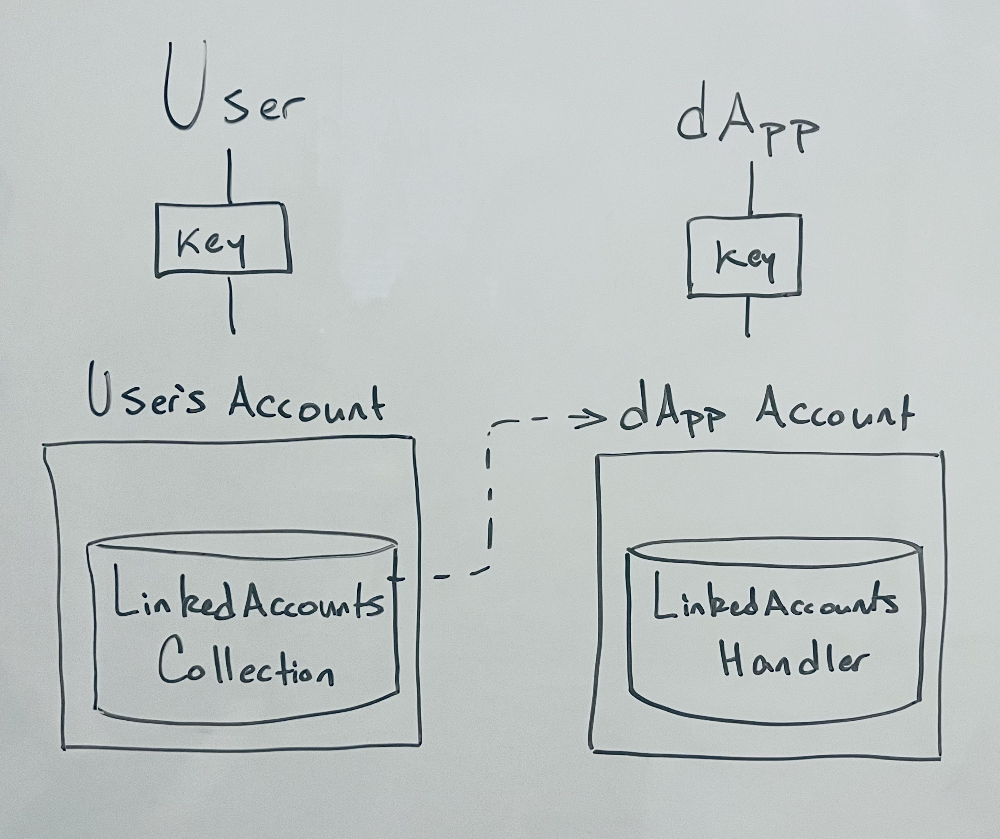

If you’ve built dApps on Flow, or any blockchain for that matter, you’re painfully aware of the user onboarding process and successive pain of prompting user signatures for on-chain interactions. As a developer, this leaves you with two options - custody the user’s private key and act on their behalf or go with the Web3 status quo, hope your new users are native to Flow and authenticate them via their existing wallet. Either choice will force significant compromise, fragmenting user experience and leaving much to be desired compared to the broader status quo of Web2 identity authentication and single-click onboarding flow.

In this doc, we’ll dive into a progressive onboarding flow, including the Cadence scripts & transactions that go into its implementation in your dApp. These components will enable any implementing dApp to create a custodial account, intermediate the user’s on-chain actions on their behalf, and later delegate control of that dApp-created account to the user’s wallet-mediated account. We’ll refer to this custodial pattern as the Hybrid Account Model and the process of delegating control of the dApp account as Account Linking.

> :warning: Note that the documentation on Hybrid Custody covers the current state and will likely differ from the final implementation. Builders should be aware that breaking changes will deploy between current state and the stable version. Interested in shaping the conversation? [Join in!](https://github.com/onflow/flips/pull/72)

# Objectives

- Establish a [walletless onboarding flow](https://flow.com/post/flow-blockchain-mainstream-adoption-easy-onboarding-wallets)
- Create a blockchain-native onboarding flow
- Link an existing app account as a child to a newly authenticated parent account
- Get your dApp to recognize “parent” accounts along with any associated “child” accounts
- View Fungible and NonFungible Token metadata relating to assets across all of a user’s associated accounts - their wallet-mediated “parent” account and any hybrid custody model “child” accounts
- Facilitate transactions acting on assets in child accounts

# Point of Clarity

Before diving in, let's make a distinction between **"account linking"** and **"linking accounts"**.

## Account Linking

Very simply, account linking is a [feature in Cadence](https://github.com/onflow/flips/pull/53) that let's an [AuthAccount](https://developers.flow.com/cadence/language/accounts#authaccount) create a [Capability](https://developers.flow.com/cadence/language/capability-based-access-control) on itself. You can do so in the following transaction:

```js
#allowAccountLinking

transaction(linkPathSuffix: String) {
    prepare(signer: AuthAccount) {
        // Create the PrivatePath where we'll create the link
        let linkPath = PrivatePath(identifier: linkPathSuffix)
            ?? panic("Could not construct PrivatePath from given identifier: ".concat(linkPathSuffix))
        // Check if an AuthAccount Capability already exists at the specified path
        if !signer.getCapability<&AuthAccount>(linkPath).check() {
            // If not, unlink anything that may be there and link the AuthAccount Capability
            signer.unlink(linkpath)
            signer.linkAccount(linkPath)
        }
    }
}
```

From there, the signing account can retrieve the privately linked AuthAccount Capability and delegate it to another account, unlinking the Capability if they wish to revoke delegated access.

Note that in order to link an account, a transaction must state the `#allowAccountLinking` as a pragme in the top line of the transaction. This is an interim safety measure so that wallet providers can notify users they're about to sign a transaction that may create and use a Capability on their AuthAccount.

## Linking Accounts

Linking accounts uses an account link, otherwise known as an **AuthAccount Capability**, and encapsulates it in an object that is then kept in the a collection of linked account. The [components and actions](https://github.com/onflow/flips/pull/72) involved in this process - what the Capabity is encapsulated in, the collection that holds those encapsulations, etc. is what we'll dive into in this doc.

# Terminology

**Parent-Child accounts** - For the moment, we’ll call the account created by the dApp the “child” account and the account receiving its AuthAccount Capability the “parent” account. Existing methods of account access & delegation (i.e. keys) still imply ownership over the account, but insofar as linked accounts are concerned, the account to which both the user and the dApp share access via AuthAccount Capability will be considered the “child” account. This naming is a topic of community discussion and may be subject to change.

**Walletless onboarding** - An onboarding flow whereby a dApp creates an account for a user, onboarding them to the dApp, obviating the need for user wallet authentication.

**Blockchain-native onboarding** - Similar to the already familiar Web3 onboarding flow where a user authenticates with their existing wallet, a dApp onboards a user via wallet authentication while additionally creating a dApp account and linking it with the authenticated account, resulting in a hybrid custody model.

**Hybrid Custody Model** - A custodial pattern in which a dApp and a user maintain access to a dApp created account and user access to that account has been mediated by account linking.

**Account Linking** - Technically speaking, account linking in our context consists of giving some other account an AuthAccount Capability from the granting account. This Capability is maintained in (soon to be standard) resource called a `LinkedAccounts.Collection`, providing its owning user access to any and all of their linked accounts.

**Progressive Onboarding** - An onboarding flow that walks a user up to self-custodial ownership, starting with walletless onboarding and later linking the dApp account with the user’s authenticated wallet once the user chooses to do so.

# Onboarding Flows

Given the ability to establish an account and later delegate access to a user, dApps are freed from the constraints of dichotomous custodial & self-custodial patterns. A developer can choose to onboard a user via traditional Web2 identity and later delegate access to the user’s wallet account. Alternatively, a dApp can enable wallet authentication at the outset, creating a dApp specific account & linking with the user’s wallet account. As specified above, these two flows are known as walletless and blockchain-native respectively. Developers can choose to implement one for simplicity or both for user flexibility. 

## Walletless Onboarding

### Account Creation

The following transaction creates an account, funding creation via the signer and adding the provided public key. You'll notice this transaction is pretty much your standard account creation. The magic for you will be how you custody the key for this account (locally, KMS, wallet service, etc.) in a manner that allows your dapp to mediate on-chain interactions on behalf of your user.

```js
import FlowToken from "../../contracts/utility/FlowToken.cdc"
import FungibleToken from "../../contracts/utility/FungibleToken.cdc"

/// Taken from the onflow/linked-accounts repo
/// https://github.com/onflow/linked-accounts
///
transaction(
    pubKey: String,
    initialFundingAmt: UFix64,
  ) {
	
	prepare(signer: AuthAccount) {

		/* --- Account Creation (your dApp may choose to separate creation depending on your custodial model) --- */
		//
		// Create the child account, funding via the signer
		let newAccount = AuthAccount(payer: signer)
		// Create a public key for the proxy account from string value in the provided arg
		// **NOTE:** You may want to specify a different signature algo for your use case
		let key = PublicKey(
			publicKey: pubKey.decodeHex(),
			signatureAlgorithm: SignatureAlgorithm.ECDSA_P256
		)
		// Add the key to the new account
		// **NOTE:** You may want to specify a different hash algo & weight best for your use case
		newAccount.keys.add(
			publicKey: key,
			hashAlgorithm: HashAlgorithm.SHA3_256,
			weight: 1000.0
		)

		/* --- (Optional) Additional Account Funding --- */
		//
		// Fund the new account if specified
		if initialFundingAmt > 0.0 {
			// Get a vault to fund the new account
			let fundingProvider = signer.borrow<&FlowToken.Vault{FungibleToken.Provider}>(
					from: /storage/flowTokenVault
				)!
			// Fund the new account with the initialFundingAmount specified
			newAccount.getCapability<&FlowToken.Vault{FungibleToken.Receiver}>(
				/public/flowTokenReceiver
			).borrow()!
			.deposit(
				from: <-fundingProvider.withdraw(
					amount: initialFundingAmt
				)
			)
		}

		/* Continue with use case specific setup */
		//
		// At this point, the newAccount can further be configured as suitable for
		// use in your dapp (e.g. Setup a Collection, Mint NFT, Configure Vault, etc.)
		// ...
	}
}
```

## Blockchain-Native Onboarding

Compared to walletless onboarding where a user does not have a Flow account, blockchain-native onboarding assumes a user already has a wallet configured and immediately links it with a newly created dApp account. This enables the dApp to sign transactions on the user's behalf via the new child account while immediately delegating control of that account to the onboarding user's main account.

After this transaction, both the custodial party (presumably the client/dApp) and the signing parent account will have access to the newly created account - the custodial party via key access and the parent account via their `LinkedAccounts.Collection` maintaining the new account's AuthAccount Capability.

### Account Creation & Linking
```js
#allowAccountLinking

import FungibleToken from "../../contracts/utility/FungibleToken.cdc"
import FlowToken from "../../contracts/utility/FlowToken.cdc"
import MetadataViews from "../../contracts/utility/MetadataViews.cdc"
import NonFungibleToken from "../../contracts/utility/NonFungibleToken.cdc"
import LinkedAccountMetadataViews from "../../contracts/LinkedAccountMetadataViews.cdc"
import LinkedAccounts from "../../contracts/LinkedAccounts.cdc"

/// Taken from the onflow/linked-accounts repo
/// https://github.com/onflow/linked-accounts
///
transaction(
    pubKey: String,
    fundingAmt: UFix64,
    linkedAccountName: String,
    linkedAccountDescription: String,
    clientThumbnailURL: String,
    clientExternalURL: String,
    authAccountPathSuffix: String,
    handlerPathSuffix: String
  ) {

	let collectionRef: &LinkedAccounts.Collection
    let info: LinkedAccountMetadataViews.AccountInfo
    let authAccountCap: Capability<&AuthAccount>
	let newAccountAddress: Address
	
	prepare(parent: AuthAccount, client: AuthAccount) {
		
		/* --- Account Creation (your dApp may choose to handle creation differently depending on your custodial model) --- */
		//
		// Create the child account, funding via the signer
		let newAccount = AuthAccount(payer: client)
		// Create a public key for the proxy account from string value in the provided arg
		// **NOTE:** You may want to specify a different signature algo for your use case
		let key = PublicKey(
			publicKey: pubKey.decodeHex(),
			signatureAlgorithm: SignatureAlgorithm.ECDSA_P256
		)
		// Add the key to the new account
		// **NOTE:** You may want to specify a different hash algo & weight best for your use case
		newAccount.keys.add(
			publicKey: key,
			hashAlgorithm: HashAlgorithm.SHA3_256,
			weight: 1000.0
		)

		/* (Optional) Additional Account Funding */
		//
		// Fund the new account if specified
		if fundingAmt > 0.0 {
			// Get a vault to fund the new account
			let fundingProvider = client.borrow<&FlowToken.Vault{FungibleToken.Provider}>(
					from: /storage/flowTokenVault
				)!
			// Fund the new account with the initialFundingAmount specified
			newAccount.getCapability<&FlowToken.Vault{FungibleToken.Receiver}>(
				/public/flowTokenReceiver
			).borrow()!
			.deposit(
				from: <-fundingProvider.withdraw(
					amount: fundingAmt
				)
			)
		}
		self.newAccountAddress = newAccount.address

		// At this point, the newAccount can further be configured as suitable for
		// use in your dapp (e.g. Setup a Collection, Mint NFT, Configure Vault, etc.)
		// ...

		/* --- Setup parent's LinkedAccounts.Collection --- */
		//
		// Check that Collection is saved in storage
        if parent.type(at: LinkedAccounts.CollectionStoragePath) == nil {
            parent.save(
                <-LinkedAccounts.createEmptyCollection(),
                to: LinkedAccounts.CollectionStoragePath
            )
        }
        // Link the public Capability
        if !parent.getCapability<
                &LinkedAccounts.Collection{LinkedAccounts.CollectionPublic, MetadataViews.ResolverCollection}
            >(LinkedAccounts.CollectionPublicPath).check() {
            parent.unlink(LinkedAccounts.CollectionPublicPath)
            parent.link<&LinkedAccounts.Collection{LinkedAccounts.CollectionPublic, MetadataViews.ResolverCollection}>(
                LinkedAccounts.CollectionPublicPath,
                target: LinkedAccounts.CollectionStoragePath
            )
        }
        // Link the private Capability
        if !parent.getCapability<
                &LinkedAccounts.Collection{LinkedAccounts.CollectionPublic, NonFungibleToken.CollectionPublic, NonFungibleToken.Receiver, NonFungibleToken.Provider, MetadataViews.ResolverCollection}
            >(LinkedAccounts.CollectionPrivatePath).check() {
            parent.unlink(LinkedAccounts.CollectionPrivatePath)
            parent.link<
                &LinkedAccounts.Collection{LinkedAccounts.CollectionPublic, NonFungibleToken.CollectionPublic, NonFungibleToken.Receiver, NonFungibleToken.Provider, MetadataViews.ResolverCollection}
            >(
                LinkedAccounts.CollectionPrivatePath,
                target: LinkedAccounts.CollectionStoragePath
            )
        }
		// Assign a reference to the Collection we now know is correctly configured
		self.collectionRef = parent.borrow<&LinkedAccounts.Collection>(from: LinkedAccounts.CollectionStoragePath)!

		/* --- Link the child account's AuthAccount Capability & assign --- */
        //
		// Assign the PrivatePath where we'll link the AuthAccount Capability
        let authAccountPath: PrivatePath = PrivatePath(identifier: authAccountPathSuffix)
            ?? panic("Could not construct PrivatePath from given suffix: ".concat(authAccountPathSuffix))
		// Link the new account's AuthAccount Capability
		self.authAccountCap = newAccount.linkAccount(authAccountPath)
		
		/** --- Construct metadata --- */
        //
        // Construct linked account metadata from given arguments
        self.info = LinkedAccountMetadataViews.AccountInfo(
            name: linkedAccountName,
            description: linkedAccountDescription,
            thumbnail: MetadataViews.HTTPFile(url: clientThumbnailURL),
            externalURL: MetadataViews.ExternalURL(clientExternalURL)
        )
	}

	execute {
		/* --- Link the parent & child accounts --- */
		//
		// Add the child account
		self.collectionRef.addAsChildAccount(
			linkedAccountCap: self.authAccountCap,
			linkedAccountMetadata: self.info,
			linkedAccountMetadataResolver: nil,
			handlerPathSuffix: handlerPathSuffix
		)
	}

	post {
		// Make sure new account was linked to parent's successfully
		self.collectionRef.getLinkedAccountAddresses().contains(self.newAccountAddress):
			"Problem linking accounts!"
	}
}

```

# Account Linking

Linking an account is the process of delegating account access via AuthAccount Capability. Of course, we want to do this in a way that allows the receiving account to maintain that Capability and allows easy identification of the accounts on either end of the linkage - the user's main "parent" account and the linked "child" account. This is accomplished in the (still in flux) `LinkedAccounts` contract which we'll continue to use in this guidance.

> :warning: Note that since account linking is a sensitive action, transactions where an account may be linked are designated by a topline pragma `#allowAccountLinking`. This lets wallet providers inform users that their account may be linked in the signing transaction.



*In this scenario, a user custodies a key for their main account which has a `LinkedAccounts.Collection` within it. Their `LinkedAccounts.NFT` maintains an AuthAccount Capability to the child account, which the dApp maintains access to via the account’s key and within which a `LinkedAccounts.Handler`.*

Linking accounts can be done in one of two ways. Put simply, the child account needs to get the parent account its AuthAccount Capability, and the parent needs to save that Capability in its `LinkedAccounts.Collection` in a manner that represents the linked accounts and their relative associations. We can achieve this in a multisig transaction signed by both the the accounts on either side of the link, or we can leverage Cadence’s `AuthAccount.Inbox` to publish the Capability from the child account & have the parent claim the Capability in a separate transaction. Let’s take a look at both.

> A consideration during the linking process is whether you would like the parent account to be configured with some resources or Capabilities relevant to your dApp. For example, if your dApp deals with specific NFTs, you may want to configure the parent account with Collections for those NFTs so the user can easily transfer them between their linked accounts.

### Multisig Transaction

```js
#allowAccountLinking

import MetadataViews from "../../contracts/utility/MetadataViews.cdc"
import NonFungibleToken from "../../contracts/utility/NonFungibleToken.cdc"
import LinkedAccountMetadataViews from "../../contracts/LinkedAccountMetadataViews.cdc"
import LinkedAccounts from "../../contracts/LinkedAccounts.cdc"

/// Links thie signing accounts as labeled, with the child's AuthAccount Capability
/// maintained in the parent's LinkedAccounts.Collection
///
transaction(
    linkedAccountName: String,
    linkedAccountDescription: String,
    clientThumbnailURL: String,
    clientExternalURL: String,
    authAccountPathSuffix: String,
    handlerPathSuffix: String
) {

    let collectionRef: &LinkedAccounts.Collection
    let info: LinkedAccountMetadataViews.AccountInfo
    let authAccountCap: Capability<&AuthAccount>
    let linkedAccountAddress: Address

    prepare(parent: AuthAccount, child: AuthAccount) {
        
        /** --- Configure Collection & get ref --- */
        //
        // Check that Collection is saved in storage
        if parent.type(at: LinkedAccounts.CollectionStoragePath) == nil {
            parent.save(
                <-LinkedAccounts.createEmptyCollection(),
                to: LinkedAccounts.CollectionStoragePath
            )
        }
        // Link the public Capability
        if !parent.getCapability<
                &LinkedAccounts.Collection{LinkedAccounts.CollectionPublic, MetadataViews.ResolverCollection}
            >(LinkedAccounts.CollectionPublicPath).check() {
            parent.unlink(LinkedAccounts.CollectionPublicPath)
            parent.link<&LinkedAccounts.Collection{LinkedAccounts.CollectionPublic, MetadataViews.ResolverCollection}>(
                LinkedAccounts.CollectionPublicPath,
                target: LinkedAccounts.CollectionStoragePath
            )
        }
        // Link the private Capability
        if !parent.getCapability<
                &LinkedAccounts.Collection{LinkedAccounts.CollectionPublic, NonFungibleToken.CollectionPublic, NonFungibleToken.Receiver, NonFungibleToken.Provider, MetadataViews.ResolverCollection}
            >(LinkedAccounts.CollectionPrivatePath).check() {
            parent.unlink(LinkedAccounts.CollectionPrivatePath)
            parent.link<
                &LinkedAccounts.Collection{LinkedAccounts.CollectionPublic, NonFungibleToken.CollectionPublic, NonFungibleToken.Receiver, NonFungibleToken.Provider, MetadataViews.ResolverCollection}
            >(
                LinkedAccounts.CollectionPrivatePath,
                target: LinkedAccounts.CollectionStoragePath
            )
        }
        // Get Collection reference from signer
        self.collectionRef = parent.borrow<
                &LinkedAccounts.Collection
            >(
                from: LinkedAccounts.CollectionStoragePath
            )!

        /* --- Link the child account's AuthAccount Capability & assign --- */
        //
        // Assign the PrivatePath where we'll link the AuthAccount Capability
        let authAccountPath: PrivatePath = PrivatePath(identifier: authAccountPathSuffix)
            ?? panic("Could not construct PrivatePath from given suffix: ".concat(authAccountPathSuffix))
        // Get the AuthAccount Capability, linking if necessary
        if !child.getCapability<&AuthAccount>(authAccountPath).check() {
            // Unlink any Capability that may be there
            child.unlink(authAccountPath)
            // Link & assign the AuthAccount Capability
            self.authAccountCap = child.linkAccount(authAccountPath)!
        } else {
            // Assign the AuthAccount Capability
            self.authAccountCap = child.getCapability<&AuthAccount>(authAccountPath)
        }
        self.linkedAccountAddress = self.authAccountCap.borrow()?.address ?? panic("Problem with retrieved AuthAccount Capability")

        /** --- Construct metadata --- */
        //
        // Construct linked account metadata from given arguments
        self.info = LinkedAccountMetadataViews.AccountInfo(
            name: linkedAccountName,
            description: linkedAccountDescription,
            thumbnail: MetadataViews.HTTPFile(url: clientThumbnailURL),
            externalURL: MetadataViews.ExternalURL(clientExternalURL)
        )
    }

    execute {
        // Add child account if it's parent-child accounts aren't already linked
        if !self.collectionRef.getLinkedAccountAddresses().contains(self.linkedAccountAddress) {
            // Add the child account
            self.collectionRef.addAsChildAccount(
                linkedAccountCap: self.authAccountCap,
                linkedAccountMetadata: self.info,
                linkedAccountMetadataResolver: nil,
                handlerPathSuffix: handlerPathSuffix
            )
        }
    }

    post {
        self.collectionRef.getLinkedAccountAddresses().contains(self.linkedAccountAddress):
            "Problem linking accounts!"
    }
}

```

## Publish & Claim

### Publish

Here, the account delegating access to itself links its AuthAccount Capability, and publishes it to be claimed by the account it will be linked to.

```js
#allowAccountLinking

/// Signing account publishes a Capability to its AuthAccount for
/// the specified parentAddress to claim
///
transaction(parentAddress: Address, authAccountPathSuffix: String) {

    let authAccountCap: Capability<&AuthAccount>

    prepare(signer: AuthAccount) {
        // Assign the PrivatePath where we'll link the AuthAccount Capability
        let authAccountPath: PrivatePath = PrivatePath(identifier: authAccountPathSuffix)
            ?? panic("Could not construct PrivatePath from given suffix: ".concat(authAccountPathSuffix))
        // Get the AuthAccount Capability, linking if necessary
        if !signer.getCapability<&AuthAccount>(authAccountPath).check() {
            signer.unlink(authAccountPath)
            self.authAccountCap = signer.linkAccount(authAccountPath)!
        } else {
            self.authAccountCap = signer.getCapability<&AuthAccount>(authAccountPath)
        }
        // Publish for the specified Address
        signer.inbox.publish(self.authAccountCap!, name: "AuthAccountCapability", recipient: parentAddress)
    }
}
```

### Claim

On the other side, the receiving account claims the published AuthAccount Capability, adding it to the signer's `LinkedAccounts.Collection`.

```js
import MetadataViews from "../../contracts/utility/MetadataViews.cdc"
import NonFungibleToken from "../../contracts/utility/NonFungibleToken.cdc"
import LinkedAccountMetadataViews from "../../contracts/LinkedAccountMetadataViews.cdc"
import LinkedAccounts from "../../contracts/LinkedAccounts.cdc"

/// Signing account claims a Capability to specified Address's AuthAccount
/// and adds it as a child account in its LinkedAccounts.Collection, allowing it 
/// to maintain the claimed Capability
///
transaction(
        linkedAccountAddress: Address,
        linkedAccountName: String,
        linkedAccountDescription: String,
        clientThumbnailURL: String,
        clientExternalURL: String,
        handlerPathSuffix: String
    ) {

    let collectionRef: &LinkedAccounts.Collection
    let info: LinkedAccountMetadataViews.AccountInfo
    let authAccountCap: Capability<&AuthAccount>

    prepare(signer: AuthAccount) {
        /** --- Configure Collection & get ref --- */
        //
        // Check that Collection is saved in storage
        if signer.type(at: LinkedAccounts.CollectionStoragePath) == nil {
            signer.save(
                <-LinkedAccounts.createEmptyCollection(),
                to: LinkedAccounts.CollectionStoragePath
            )
        }
        // Link the public Capability
        if !signer.getCapability<
                &LinkedAccounts.Collection{LinkedAccounts.CollectionPublic, MetadataViews.ResolverCollection}
            >(LinkedAccounts.CollectionPublicPath).check() {
            signer.unlink(LinkedAccounts.CollectionPublicPath)
            signer.link<&LinkedAccounts.Collection{LinkedAccounts.CollectionPublic, MetadataViews.ResolverCollection}>(
                LinkedAccounts.CollectionPublicPath,
                target: LinkedAccounts.CollectionStoragePath
            )
        }
        // Link the private Capability
        if !signer.getCapability<
                &LinkedAccounts.Collection{LinkedAccounts.CollectionPublic, NonFungibleToken.CollectionPublic, NonFungibleToken.Receiver, NonFungibleToken.Provider, MetadataViews.ResolverCollection}
            >(LinkedAccounts.CollectionPrivatePath).check() {
            signer.unlink(LinkedAccounts.CollectionPrivatePath)
            signer.link<
                &LinkedAccounts.Collection{LinkedAccounts.CollectionPublic, NonFungibleToken.CollectionPublic, NonFungibleToken.Receiver, NonFungibleToken.Provider, MetadataViews.ResolverCollection}
            >(
                LinkedAccounts.CollectionPrivatePath,
                target: LinkedAccounts.CollectionStoragePath
            )
        }
        // Get Collection reference from signer
        self.collectionRef = signer.borrow<
                &LinkedAccounts.Collection
            >(
                from: LinkedAccounts.CollectionStoragePath
            )!
        
        /** --- Prep to link account --- */
        //
        // Claim the previously published AuthAccount Capability from the given Address
        self.authAccountCap = signer.inbox.claim<&AuthAccount>(
                "AuthAccountCapability",
                provider: linkedAccountAddress
            ) ?? panic(
                "No AuthAccount Capability available from given provider"
                .concat(linkedAccountAddress.toString())
                .concat(" with name ")
                .concat("AuthAccountCapability")
            )
        
        /** --- Construct metadata --- */
        //
        // Construct linked account metadata from given arguments
        self.info = LinkedAccountMetadataViews.AccountInfo(
            name: linkedAccountName,
            description: linkedAccountDescription,
            thumbnail: MetadataViews.HTTPFile(url: clientThumbnailURL),
            externalURL: MetadataViews.ExternalURL(clientExternalURL)
        )
    }

    execute {
        // Add account as child to the signer's LinkedAccounts.Collection
        self.collectionRef.addAsChildAccount(
            linkedAccountCap: self.authAccountCap,
            linkedAccountMetadata: self.info,
            linkedAccountMetadataResolver: nil,
            handlerPathSuffix: handlerPathSuffix
        )
    }
}
 
```

# Funding & Custody Patterns

Aside from implementing onboarding flows & account linking, you'll want to also consider the account funding & custodial pattern appropriate for the dApp you're building. The only one compatible with walletless onboarding (and therefore the only one showcased above) is one in which the dApp custodies the child account's key and funds account creation.

In general, the funding pattern for account creation will determine to some extent the backend infrastructure needed to support your dApp and the onboarding flow your dApp can support. For example, if you want to to create a service-less client (a totally local dApp without backend infrastructure), you could forego walletless onboarding in favor of a user-funded blockchain-native onboarding to achieve a hybrid custody model. Your dApp maintains the keys to the dApp account to sign on behalf of the user, and the user funds the creation of the the account, linking to their main account on account creation. This would be a **user-funded, dApp custodied** pattern.

Again, custody may deserve some regulatory insight depending on your jurisdiction. If building for production, you'll likely want to consider these non-technical implications in your technical decision-making. Such is the nature of building in crypto...

Here are the patterns you might consider:

## DApp-Funded, DApp-Custodied

If you want to implement walletless onboarding, you can stop here as this is the only compatible pattern. In this scenario, a backend dApp account funds the creation of a new account and the dApp custodies the key for said account either on the user's device or some backend KMS.

## DApp-Funded, User-Custodied

In this case, the backend dApp account funds account creation, but adds a key to the account which the user custodies. In order for the dApp to act on the user's behalf, it has to be delegated access via AuthAccount Capability which the backend dApp account would maintain in a `LinkedAccounts.Collection`. This means that the new account would have two parent accounts - the user's and the dApp. While not comparatively useful now, once [`SuperAuthAccount`](https://forum.onflow.org/t/super-user-account/4088) is ironed out and implemented, this pattern will be the most secure in that the custodying user will have ultimate authority over the child account. Also note that this and the following patterns are incompatible with walletless onboarding in that the user must have a wallet.

## User-Funded, DApp-Custodied

As mentioned above, this pattern unlocks totally service-less architectures - just a local client & smart contracts. An authenticated user signs a transaction creating an account, adding the key provided by the client, and linking the account as a child account. At the end of the transaction, hybrid custody is achieved and the dApp can sign with the custodied key on the user's behalf using the newly created account.

## User-Funded, User-Custodied

While perhaps not useful for most dApps, this pattern may be desirable for advanced users who wish to create a shared access account themselves. The user funds account creation, adding keys they custody, and delegates secondary access to some other account. As covered above in account linking, this can be done via multisig or the publish & claim mechanism.

# Additional Resources

You can find additional Cadence examples in context at the following repos:

- [LinkedAccounts contract & supporting scripts & transactions](https://github.com/onflow/linked-accounts)
- [Using ChildAccount paradigm in an on-chain Rock, Paper, Scissors game](https://github.com/onflow/sc-eng-gaming/tree/sisyphusSmiling/child-account-auth-acct-cap)