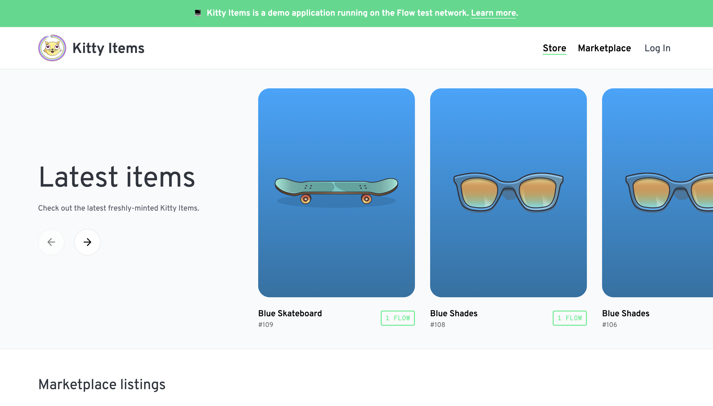
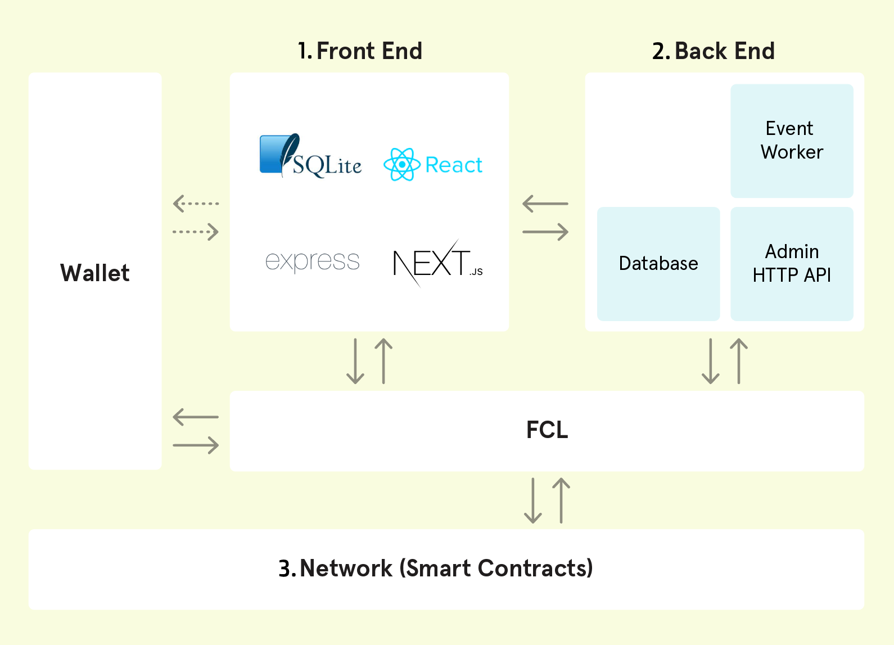

Kitty Items is a complete NFT marketplace inspired by [CryptoKitties](https://www.cryptokitties.co/), a web3 game that put NFTs on the map. You can use it as a blueprint for your own marketplace and to learn how to develop on Flow.

The following chapters use the project to explain the components and concepts of the Flow blockchain and its programming language [Cadence](/cadence/). At the end, you will be able to:

- deploy and update smart contracts
- mint and transfer NFTs
- add a new kind of NFT to the marketplace
- interact with the Flow blockchain from within a web application

## Video Walkthrough

Below is a 5-part video walkthrough that covers all the contents of this tutorial. You are welcome to watch or skip the video walkthrough depending on your style of learning. The embed below contains the whole series as a playlist, and the first video is dedicated to this introductory section. Each of the following pages will directly embed the corresponding video in the series.

<iframe width="100%" height="450" src="https://www.youtube.com/watch?v=0oWWcuoZ6EI" title="YouTube video player" frameborder="0" allow="accelerometer; autoplay; clipboard-write; encrypted-media; gyroscope; picture-in-picture" allowfullscreen></iframe>

## Live Demo

By the end of the tutorial, you will have your own instance of Kitty Items. You can use our [deployed demo instance](https://kitty-items.onflow.org/) to explore the project.

## Project overview

The project consists of 3 key components:

### 1. Front End

This is a complete web application built with NextJS and React that demonstrates how to build a website that connects directly to the Flow blockchain using [FCL](/fcl/). FCL handles authentication and authorization of [Flow accounts](/concepts/accounts-and-keys/), [signing transactions](/concepts/transaction-signing/), and querying data using using Cadence scripts.

### 2. Back End

We love decentralization, but servers are still very useful, and this one's no exception. The backend API helps preserve the separation of concerns, so that your process and business logic doesn't have to implemented on the front-end. Backend operations are necessary to ensure secure handling of accounts and associated keys and to streamline blockchain interactions.

The code in this project demonstrates how to connect to Flow using [FCL](/fcl/) from a Node JS backend. It's also chock-full of handy patterns you'll probably want to use for more complex and feature-rich blockchain applications, like storing and querying events using a SQL database (SQLite). The API demonstrates how to send transactions to the Flow blockchain, specifically for minting [Kitty Items](https://github.com/onflow/kitty-items/blob/master/cadence/contracts/KittyItems.cdc) (non-fungible tokens).

### 3. Flow Network (Smart Contracts)

[Cadence](/cadence) smart contracts, scripts & transactions for your viewing pleasure. This is where all of the blockchain logic for the marketplace application lives. Here you will find examples of [fungible token](https://github.com/onflow/flow-ft) and [non-fungible token (NFT)](https://github.com/onflow/flow-nft) smart contract implementations, as well as the scripts and transactions that interact with them. It also contains examples of how to _test_ your Cadence code.

