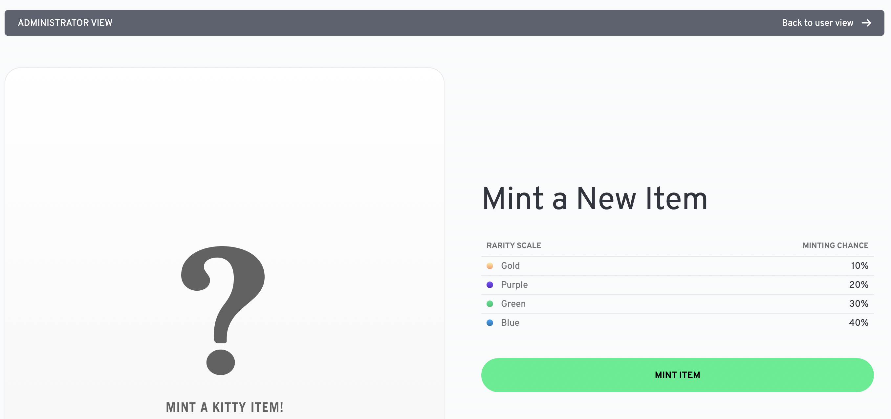

The following steps will guide you through a modification of the Kitty Items project. You will add a new NFT kind, representing an exclusive collection of rare NFTs of sunglasses:


## Video Walkthrough

<iframe width="100%" height="450" src="https://www.youtube.com/embed/xLRI4F6X89I" title="YouTube video player" frameborder="0" allow="accelerometer; autoplay; clipboard-write; encrypted-media; gyroscope; picture-in-picture" allowfullscreen></iframe>

## Start in emulator

In the last step, you started the project on the testnet. For local development, however, it is recommended to emulate the blockchain network locally using the [Flow Emulator](/emulator/). Once changes are implemented and tested locally, you will deploy the updates to the testnet.

Let's start the project in the emulator by running the command below in the root project folder.

> **Important**: You will notice that the previous script execution finished once all services successfully started. You **do not need to stop the previous process**. By running the next command, existing services will be configured to communicate with the emulator instead of the testnet.

```sh
npm run dev:emulator
```

You should see similar logs as in the last step:

```sh
✔ Emulator started
ℹ Flow Emulator is running at: http://localhost:8080
ℹ View log output: npx pm2 logs emulator

✔ Developer Wallet started
ℹ FCL Dev Wallet running at: http://localhost:8701
ℹ View log output: npx pm2 logs dev-wallet

✔ Contracts deployed
ℹ Contracts were deployed to: 0xf8d6e0586b0a20c7 (emulator)

✔ Admin account initialized
ℹ ./cadence/transactions/nftStorefront/setup_account.cdc was executed successfully.
ℹ ./cadence/transactions/kittyItems/setup_account.cdc was executed successfully.

✔ API server started
ℹ Kitty Items API is running at: http://localhost:3000
ℹ View log output: npx pm2 logs api

✔ Storefront web app started
ℹ Kitty Items Web App is running at: http://localhost:3001
ℹ View log output: npx pm2 logs web

KITTY ITEMS HAS STARTED


Visit: http://localhost:3001

? Would you like to view the logs for all processes? (Y/n)
```

Once again, you will be asked if you want to show all logs. You can enter `n` for now.

You may notice that you were not prompted for an account. This is because the local setup includes a [developer wallet](https://github.com/onflow/fcl-dev-wallet) that simulates user accounts.

## Add new NFT collection

To add the new NFT collection, we will have to make changes to several components of the project:

- Backend API: Add the new collection to the list of available collections
- Web application: Define the new collection name and add it to the map of available collections
- Cadence: Define the new collection name, add it to the map of available collections, set the content hash for the images ([stored on IPFS](/dapp-development/smart-contracts/#external-storage-networks))

To start making your changes, it is recommended to open the project in a code editor like [Visual Studio Code](https://code.visualstudio.com/).

> **Recommended**: Install the [VSCode extension for Cadence](https://marketplace.visualstudio.com/items?itemName=onflow.cadence) to get syntax highlighting, type checking, and code completion support. If you have VSCode in your `$PATH`, you can use the CLI to install the extension: `flow cadence install-vscode-extension`.

### Update the backend API

Open the file `/api/src/services/kitty-items.ts` and add new element (`Shades`) at the bottom of the `Kind` enum:

```js:title=/api/src/services/kitty-items.ts
enum Kind {
  Fishbowl = 0,
  Fishhat,
  Milkshake,
  TukTuk,
  Skateboard,
  Shades
}
```

### Update the web application

Open the file `/web/src/global/constants.js` and add a new item (`Shades`) to the `ITEM_KIND_MAP` constant:

```js:title=/web/src/global/constants.js
export const ITEM_KIND_MAP = {
  0: "Fishbowl",
  1: "Fish Hat",
  2: "Milkshake",
  3: "TukTuk",
  4: "Skateboard",
  5: "Shades",
};
```

> **Note**: To simplify this tutorial, we already added the images for the NFT collection to the project folder. If you were to add new NFTs on your own, you would also need to add images to the `web/public/images/kitty-items` folder.

### Update the Cadence smart contract

Open the `/cadence/contracts/KittyItems.cdc` file and make the following changes.

#### Add a new kind

Locate the `enum Kind` object and add a new case (`shades`) to the bottom of the list:

```cadence:title=/cadence/contracts/KittyItems.cdc
pub enum Kind: UInt8 {
    pub case fishbowl
    pub case fishhat
    pub case milkshake
    pub case tuktuk
    pub case skateboard
    pub case shades
}
```

#### Update the kindToString method

This method is used to set the name and description of a specified NFT. Locate the the `kindToString` method and add a new case (`Kind.shades`) to the bottom of the switch statement:

```cadence:title=/cadence/contracts/KittyItems.cdc
pub fun kindToString(_ kind: Kind): String {
    switch kind {
        case Kind.fishbowl:
            return "Fishbowl"
        case Kind.fishhat:
            return "Fish Hat"
        case Kind.milkshake:
            return "Milkshake"
        case Kind.tuktuk:
            return "Tuk-Tuk"
        case Kind.skateboard:
            return "Skateboard"
        case Kind.shades:
            return "Shades"
    }

    return ""
}
```

#### Create a transaction to update the list of images for your new kind

Next, you need to create a transaction to update the contract with new links to the images for the new NFT kind.

> **Note**: You can't modify the list of images in the `init()` function directly because this function only runs _the first time your contract is deployed_ - not on subsequent updates. You can [read more about here](https://docs.onflow.org/cadence/language/contract-updatability/).

In the root directory of the project, run the following commands to create a new file for the transaction:

```shell
touch cadence/transactions/kittyItems/add_nft_images_for_new_kind.cdc
```

Navigate to the new file, open it, and paste the following code:

```cadence:title=cadence/transactions/kittyItems/add_nft_images_for_new_kind.cdc
import KittyItems from "../../contracts/KittyItems.cdc"

// This transction uses the NFTMinter resource to add new image URIs for a new Kind of KittyItems NFT.

transaction {

  let minter: &KittyItems.NFTMinter

  prepare(signer: AuthAccount) {

    self.minter = signer.borrow<&KittyItems.NFTMinter>(from: KittyItems.MinterStoragePath)
            ?? panic("Only authorized KittyItems NFT Minter can update KittyItems NFT...")

    let NewImages: { KittyItems.Kind: {KittyItems.Rarity: String}} = {

      // The image URIs are hardcoded here for demonstration,
      // but could also be passed in to the transaction as arguments.

      KittyItems.Kind.shades: {
        KittyItems.Rarity.blue: "bafybeibtxvitlnvksnzwrwmsqdgnoznosknr3fx5jxjazjcerpa2qo4jy4",
        KittyItems.Rarity.green: "bafybeicp5bagsziwkyarey76m5jkr6i3a5yrgr7r435qyuutbtlqxcdbwu",
        KittyItems.Rarity.purple: "bafybeidjigkvt67dtuwrgrpdt2z4dojq2efpbw66ndnffkb6eyr4baml2i",
        KittyItems.Rarity.gold: "bafybeibtxvitlnvksnzwrwmsqdgnoznosknr3fx5jxjazjcerpa2qo4jy4"
      }
    }

    self.minter.addNewImagesForKind(from: signer, newImages: NewImages);

  }

  // the FLOAT NFT secret code is: witty-kitty
  execute {}
}
```

This transaction borrows the minter Resource from the signing account and calls the `addNewImagesForKind` method on the minter Resource. It passes a struct containing the links to the new images for the `shades` kind.

> **Note**: If the signing account does not have the minter Resource, this transaction will fail. This is good, because we only want the account that mints NFTs to be able to modify the contract. Also keep in mind, that if you were to add your own NFT, you would have to upload images to IPFS and store the new hashes instead.

Make sure you saved the file before proceeding to the next step.

## Update contract on the emulator

Because you changed the smart contract for Kitty Items, you have to redeploy it to the emulator. Run the following command in your terminal, inside the root folder.

> **Note**: You will notice that the previous script execution finished once all services successfully started. You do not need to stop the previous process. You can run the next command in the same terminal without impact on the services running in the background.

```sh
npm run update:emulator
```

The script will update all contracts included in the project. The last one is the one you changed.

```sh
Deploying 4 contracts for accounts: emulator-account

NonFungibleToken -> 0xf8d6e0586b0a20c7 (3346...6218)
NFTStorefront -> 0xf8d6e0586b0a20c7 (c0e6...662b)
MetadataViews -> 0xf8d6e0586b0a20c7 (e6c2...ef11)
KittyItems -> 0xf8d6e0586b0a20c7 (3612...dcdb)

✨ All contracts deployed successfully
```

## Run the new transaction to update the KittyItems contract

Run the following command to send the transaction to update the contract with the new `shades` images.

```shell
flow transactions send ./cadence/transactions/kittyItems/add_nft_images_for_new_kind.cdc -n emulator
```

You should see the following response. Take note of the Status - it should be `✅ SEALED`.

```shell
Transaction ID: af76f20581a3923375fd52428cef078670673295c9d786a8ac9e616661a7f88e

Status          ✅ SEALED
ID              af76f20581a3923375fd52428cef078670673295c9d786a8ac9e616661a7f88e
Payer           f8d6e0586b0a20c7
Authorizers     [f8d6e0586b0a20c7]

Proposal Key:
    Address     f8d6e0586b0a20c7
    Index       0
    Sequence    15

No Payload Signatures

Envelope Signature 0: f8d6e0586b0a20c7
Signatures (minimized, use --include signatures)

Events:
    Index       0
    Type        A.f8d6e0586b0a20c7.KittyItems.ImagesAddedForNewKind
    Tx ID       af76f20581a3923375fd52428cef078670673295c9d786a8ac9e616661a7f88e
    Values
                - kind (UInt8): 5
```

As indicated, the transaction was sealed and you are ready to mint your new KittyItems NFT.

**Congratulations! You have completed all changes and your project now includes a new NFT collection for sunglasses.**

## Mint new sunglasses NFT

To mint one of the new NFTs in your local environment, you have to repeat the minting steps from the [last page](/kitty-items/start/#open-kitty-items).

First, open the Kitty Items [admin dashboard](http://localhost:3001/admin/mint/). Keep in mind that the password is `KittyItems`.



Now, hit the "Mint Item" button and see a new NFT being generated. The generation of new NFTs is randomized, so you will have to **mint a few new NFTs** until you will see an NFT from your new sunglasses collection.

During the minting process, you should see the sunglasses flash in the preview pane on the left side of the screen.

> **Note**: It is best to hit the back button in your browser to get back to the "Mint a New Item" screen. You can jump to this screen by opening the [admin dashboard](http://localhost:3001/admin/mint/) directly.
