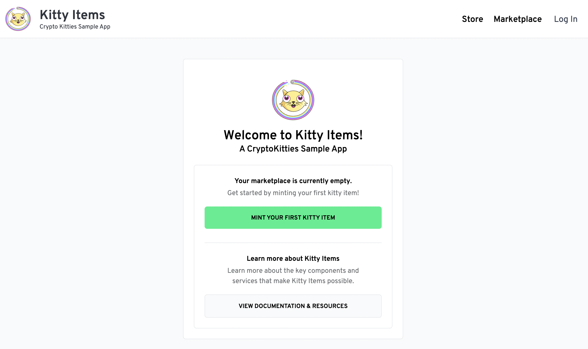

The steps below will help you deploy Cadence smart contracts to the testnet - a hosted Flow blockchain environment for testing. Once deployed, you will spin up local services that interact with your deployed contracts to the testnet.

## Video Walkthrough

<iframe width="100%" height="450" src="https://www.youtube.com/embed/XaOZII2SEpI" title="YouTube video player" frameborder="0" allow="accelerometer; autoplay; clipboard-write; encrypted-media; gyroscope; picture-in-picture" allowfullscreen></iframe>

## Start on testnet

To start the project, with all of its services, run the following in the root folder of the project:

```sh
npm run dev:testnet
```

The script will generate new keys and provide instructions to create and fund your new account:

```
Next steps:

1. Create a new account using the testnet faucet by visiting this URL:
https://testnet-faucet.onflow.org/?key=096..a85&source=ki

2. Copy the new account address from the faucet, and paste it below 👇
⚠️  Don't exit this terminal.
```

Open up the link to the testnet faucet page, complete the CAPTCHA challenge, and hit `Create Account`.

> **Note**: This process will take a few seconds. You should see a loading indicator confirming your account is being generated.

Once completed, you will see your new account address (similar to `0x2f915dafac3bd7bf`) next to a confirmation that you received 1,000 FLOW tokens. Hit the `Copy Address` button and return to the terminal and paste your address:

```sh
? Paste your new testnet account address here: 0x2f915dafac3bd7bf
```

Feel free to close the faucet page. Hit enter and the script will complete setting up the project for you. You will see several logs:

```
ℹ Testnet envronment config was written to: .env.testnet

✔ Contracts deployed
ℹ Contracts were deployed to: 0x9552bb890c4fc6ab (testnet)

✔ Admin account initialized
ℹ ./cadence/transactions/nftStorefront/setup_account.cdc was executed successfully.
ℹ ./cadence/transactions/kittyItems/setup_account.cdc was executed successfully.

✔ API server started
ℹ Kitty Items API is running at: http://localhost:3000
ℹ View log output: npx pm2 logs api

✔ Storefront web app started
ℹ Kitty Items Web App is running at: http://localhost:3001
ℹ View log output: npx pm2 logs web
```

As indicated in the logs, your account details are stored in a new file: `.env.testnet.local`. This file will be used whenever you start the service, so you don't have to handle account creation again.

> **Note**: Never commit this file to your version control system - it contains your private key!

Once all services are up and running, you will see the following:

```sh
KITTY ITEMS HAS STARTED


Visit: http://localhost:3001


View your account and transactions here:
https://testnet.flowscan.org/account/0xff61db3c65da2fd0

Explore your account here:
https://flow-view-source.com/testnet/account/0xff61db3c65da2fd0

? Would you like to view the logs for all processes? (Y/n)
```

You will be asked if you want to view logs. These can be helpful if you want to understand better what the processes do. These logs are especially helpful if you face any issues. For now, we can enter `n`.

> **Note**: If you face issues, you can run `npx pm2 logs` in a new terminal. The logs will help you troubleshoot any issues you might face. For example, if you already have services running on your machine that use the ports needed, you will be able to see it in the logs.

Congratulations! Your own instance of Kitty Items is now running locally and wired up to the Cadence contracts deployed to the testnet.

> **Note**: If you don't see the success message or if your script does not terminate, take a look at the [troubleshooting FAQs](https://github.com/onflow/kitty-items#troubleshooting).

## Open Kitty Items

Open up the web application by visiting [`http://localhost:3001`](http://localhost:3001). It should look like this:



As a first step, you can try minting your first NFT, aka a Kitty Item. Click on the "Mint your first Kitty Item" button. You will be prompted to enter a password:


Enter `KittyItems` and hit "Log In". You should see the [admin dashboard](http://localhost:3001/admin/mint/):


Now, hit the "Mint Item" button and see a new NFT being generated.

> **Note**: Not able to mint a Kitty Item? Take a look at the [troubleshooting FAQs](https://github.com/onflow/kitty-items#troubleshooting).
