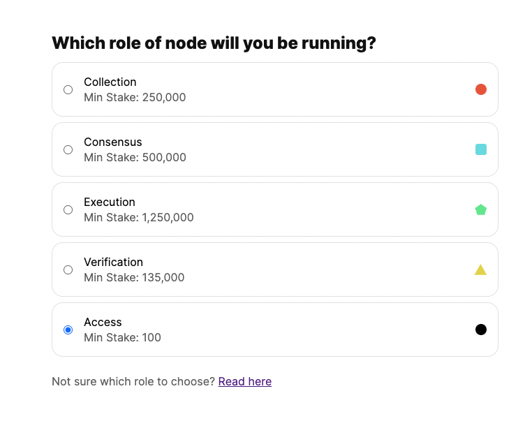
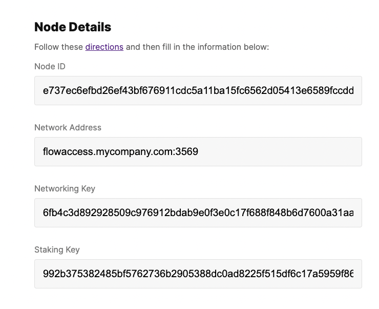
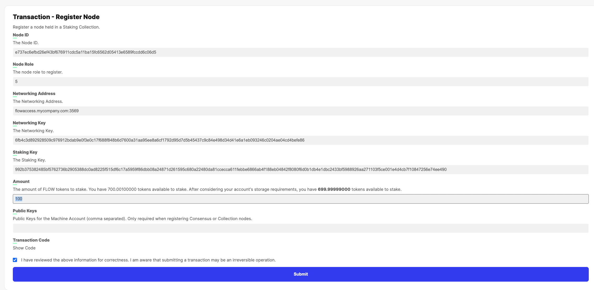
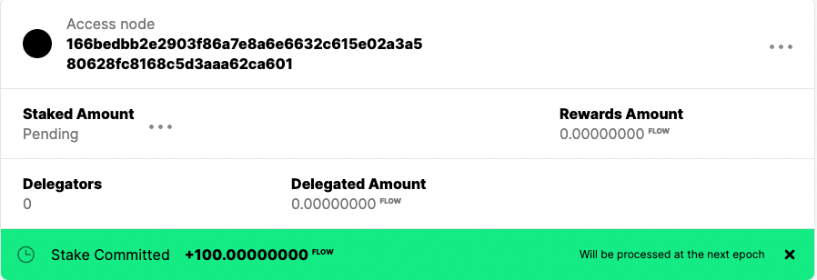
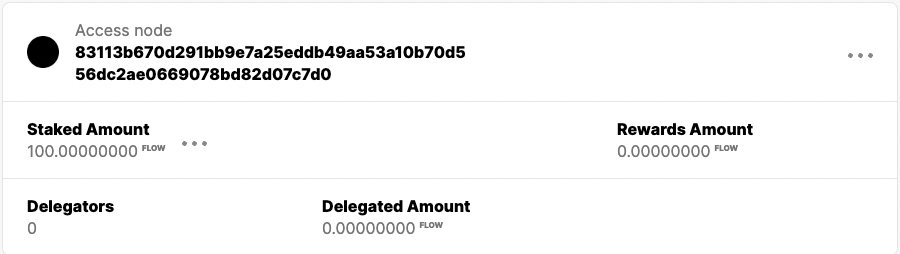
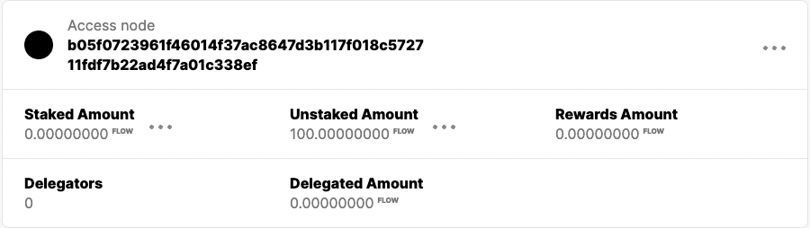

This guide is for running a permissonless Access node on Flow. If you are planning to run a different type of staked node then see [node bootstrap](node-bootstrap.mdx).

Permissionless Access nodes allow any operator to run a Flow Access node.
Unlike the other staked nodes, a permissionless access node does not have to be approved by the service account before it can join the network, hence the term "permissionless". The goal is to make all node types permissionless and this is the first step towards achieving that goal.

## Who should run a Permissionless Access node?
dApp developers can choose to run their own private permissionless access node and move away from using the community access nodes. This will also allow them to not be subjected to the API rate limits of the public access nodes.

Node operators can also run their own permissionless access node and provide access to that node as a service.

Chain analytics, audit and exploration applications can run such an access node and do not have to rely on third parties for the state of the network.


## Timing

New nodes are able to join the network each time a new epoch begins.
An epoch is a period of time (approximately one week) when the node operators in the network are constant.
At epoch boundaries, newly staked node operators are able to join the network and existing node operators which have unstaked may exit the network.
You can read more about epochs [here](https://developers.flow.com/nodes/staking/schedule).


In order to join the network at epoch N+1, the access node **must** be registered with at least 100 FLOW staked prior to the end of epoch N's Staking Auction Phase.

Currently on mainnet, the staking auction starts every Wednesday at around 20:00 UTC and ends on the next Wednesday at around 12:00 UTC. 
Since this deadline may shift slightly from epoch to epoch, we recommend the node be staked by _Wednesday, 8:00 UTC_ to be able to join the network in the next epoch.

Confirmation of a new node's inclusion in epoch N+1 is included in the [`EpochSetup` event](/staking/epoch-scripts-events/#epochsetup).


## Limitations
This is a preliminary implementation of the full permissionless node operation feature and there will be exactly **five** slots in total that will be opened for access nodes.
If there are more than five staked candidate access nodes at the end of the staking phase of the current epoch which ends on Wednesday, 15th Feb, five of those will be selected by an on-chain random selection process and no other permissionless ANs can join until others unstake in a future epoch.

More slots will be opened in the future.

Support for unlimited access nodes requires staking auctions to be implemented, which is still an upgrade planned for the future.

To summarize,

|  **Date**  |  **Time** | **Epoch** |     **Epoch Phase**    |                                                     |
|:----------:|:---------:|:---------:|:----------------------:|:---------------------------------------------------:|
| 02/08/2023 | 20:00 UTC | 63         | Staking auction starts | Stake your access nodes                             |
| 02/15/2023 | 08:00 UTC | 63         | Staking auction ends   | No more access nodes can be staked for epoch 64    |
| 02/15/2023 | 20:00 UTC | 64       | Epoch n+1 starts       | 5 randomly chosen access nodes can join the network |

> Please ensure that you have staked the access node by **15th Feb, 2023 Wednesday 08:00 UTC** if you wish to run the node in the next epoch.

## How to run a Permissionless Access node?

> Note: To run an access node you will need to provision a machine or virtual machine to run your node software. Please follow the [node-provisioning](node-provisioning.mdx) guide for it.
You can provision the machine before or after your node has been chosen.

At a high level, to run a permissionless Access node, you will have to do the following steps:
1. Generate the node identity (private and public keys, node ID etc.).
2. Stake the node with 100 FLOW by the end of the staking phase of the current epoch (see [timing](#timing)) by providing the node information generated in step 1.
3. You can verify if your node ID was selected by the on-chain random selection process on Wednesday at around 20:00 UTC when the next epoch starts.
4. If your node ID was selected, you can provision and start running the node. If your node wasn't selected, your tokens will have been refunded to your unstaked bucket in the staking smart contract. When the next epoch begins, you can try committing tokens again in a future epoch to get a new spot.

Following is a detail explanation of these four steps.
If you want to run multiple access nodes, you will have to run through these steps for each node.

## Step  1 - Generate node information

### Download the Bootstrapping Kit

```shell
curl -sL -O storage.googleapis.com/flow-genesis-bootstrap/boot-tools.tar
tar -xvf boot-tools.tar
```

```shell:title=CheckSHA256
sha256sum ./boot-tools/bootstrap
0d2cb2d0edb659880ae729e9d849a98535414af33690dad545d9892268167bcf  ./boot-tools/bootstrap
```

> If you have downloaded the bootstrapping kit previously, ensure the SHA256 hash for it still matches. If not, re-download to ensure you are using the most up-to-date version.

### Generate Your Node Identity

```shell
#########################################################
# Generate Keys
$ mkdir ./bootstrap
# YOUR_NODE_ADDRESS: FQDN associated to your instance
$ ./boot-tools/bootstrap key --address "<YOUR_NODE_ADDRESS_GOES_HERE>:3569" --role access -o ./bootstrap
```

```shell:title=Example
$./boot-tools/bootstrap key --address "flowaccess.mycompany.com:3569" --role access  -o ./bootstrap
<nil> DBG will generate networking key
<nil> INF generated networking key
<nil> DBG will generate staking key
<nil> INF generated staking key
<nil> DBG will generate db encryption key
<nil> INF generated db encryption key
<nil> DBG assembling node information address=flowaccess.mycompany.com:3569
<nil> DBG encoded public staking and network keys networkPubKey=f493a74704f6961ae7903e062ecd58d990672858eff99aece7bfbccf3aa02de8f1a624ecbf21a01e8b2f4a5854c231fbe218edd7762a34fea881f3958a215305 stakingPubKey=ae8dcf81f3a70d72036b7ba2c586ed37ed0eb82b9c0a4aab998a8420f98894f94c14f84fa716e93654d3940fc0c8ff4d19b504c90a5b4918b28f421e9d3659dc2b7e246025ebeffea0d83cceefe315d7ed346dbe412fdac51b64997d97d29f7e
<nil> INF wrote file bootstrap/public-root-information/node-id
<nil> INF wrote file bootstrap/private-root-information/private-node-info_e737ec6efbd26ef43bf676911cdc5a11ba15fc6562d05413e6589fccdd6c06d5/node-info.priv.json
<nil> INF wrote file bootstrap/private-root-information/private-node-info_e737ec6efbd26ef43bf676911cdc5a11ba15fc6562d05413e6589fccdd6c06d5/secretsdb-key
<nil> INF wrote file bootstrap/public-root-information/node-info.pub.e737ec6efbd26ef43bf676911cdc5a11ba15fc6562d05413e6589fccdd6c06d5.json

$tree ./bootstrap/
./bootstrap/
├── private-root-information
│        └── private-node-info_e737ec6efbd26ef43bf676911cdc5a11ba15fc6562d05413e6589fccdd6c06d5
│        ├── node-info.priv.json
│        └── secretsdb-key
└── public-root-information
    ├── node-id
    └── node-info.pub.e737ec6efbd26ef43bf676911cdc5a11ba15fc6562d05413e6589fccdd6c06d5.json

3 directories, 4 files
```

> ⚠️ _Use a fully qualified domain name for the network address. Please also include the port number in the network address e.g. `flowaccess.mycompany.com:3569`_

> ⚠️ _Do not include in `http://` in the network address._

> If you would like to stake multiple access nodes, please ensure you generate a unique identity for each node.

Your node identity has now been generated. Your <b>node ID</b> can be found in the file `./bootstrap/public-root-information/node-id`.

```shell:title=Example
$cat ./bootstrap/public-root-information/node-id
e737ec6efbd26ef43bf676911cdc5a11ba15fc6562d05413e6589fccdd6c06d5
```

> All your private keys should be in the `bootstrap` folder created earlier. Please take a back up of the entire folder.

## Step  2 - Stake the node

You need to now register the node on chain by staking the node via [Flow Port](https://port.onflow.org/).

[Here](https://developers.flow.com/nodes/flow-port/staking-guide) is a guide on how to use Flow port if you are not familiar with it.
If you are staking via a custody provider or would like to directly submit a staking transaction instead follow this [guide](/nodes/staking#how-do-i-stake).

Fund you Flow account with at least 100.01 FLOW tokens, which covers the required stake plus the storage deposit.

On Flow port, choose `Stake and Delegate` -> `Start Staking` or `Stake Again` and then choose Access node as the option.



On the next screen, provide the node details of you node.

Those node details (`Node ID`, `Network Address`, `Networking Key` and `Staking Key`) can be found in the file: `./bootstrap/public-root-information/node-info.pub.<node-id>.json`.

```shell:title=Example
$cat ./bootstrap/public-root-information/node-info.pub. e737ec6efbd26ef43bf676911cdc5a11ba15fc6562d05413e6589fccdd6c06d5.json
{
  "Role": "access",
  "Address": "flowaccess.mycompany.com:3569",
  "NodeID": "e737ec6efbd26ef43bf676911cdc5a11ba15fc6562d05413e6589fccdd6c06d5",
  "Weight": 0,
  "NetworkPubKey": "f493a74704f6961ae7903e062ecd58d990672858eff99aece7bfbccf3aa02de8f1a624ecbf21a01e8b2f4a5854c231fbe218edd7762a34fea881f3958a215305",
  "StakingPubKey": "ae8dcf81f3a70d72036b7ba2c586ed37ed0eb82b9c0a4aab998a8420f98894f94c14f84fa716e93654d3940fc0c8ff4d19b504c90a5b4918b28f421e9d3659dc2b7e246025ebeffea0d83cceefe315d7ed346dbe412fdac51b64997d97d29f7e"
}
```

#### Example



On the next screen, ensure that you stake 100 FLOW token.

#### Example



Submit the Transaction.

## Step 3 - Verify that your node ID was selected

On Wednesday at around 12:00 UTC, the staking auction for the current epoch will end and five nodes from candidate list of nodes will be chosen at random by the staking contract to be part of the next epoch.

>Note: If all 5 slots have been taken from the previous epoch, then no new access nodes will be chosen (see #limitations)

There are several ways to verify whether your node was chosen as explained below.

When you stake the node, the tokens will show up under the `tokensCommitted` bucket. After the staking auction ends, if the node is selected, the tokens remain in the `tokensCommitted` bucket and are moved to the `tokensStaked` bucket at the end of the epoch.
If the node is not selected, the tokens are moved to the `tokensUnstaked` bucket.

### Check using Flow Port
You can check these balances on Flow Port before and after the epoch transition that will occur on Wednesday (see [timing](#Timing)).

When you stake the node, you should see the following on Flow Port under `Stake & Delegate`



After the epoch transition, if you see you token balance under the Staked Amount then your node got chosen.



Instead, if you see that your token balance is under the Unstaked Amount, then your node did not get chosen.



### Check using FlowCli

You can also check these balance using [Flow Cli](https://github.com/onflow/flow-cli). Once you have downloaded and installed Flow Cli, you can query the account balance using the command,
```shell
flow accounts staking-info <your account address> -n mainnet
````

For Example, the following node was chosen as Tokens staked is 100.

```shell:title=Example
$ flow accounts staking-info 0xefdfb20806315bfa -n testnet

Account staking info:
	ID: 						 "e737ec6efbd26ef43bf676911cdc5a11ba15fc6562d05413e6589fccdd6c06d5"
	Initial Weight: 				 100
	Networking Address: 				 "flowaccess.mycompany.com:3569"
	Networking Key: 				 "f493a74704f6961ae7903e062ecd58d990672858eff99aece7bfbccf3aa02de8f1a624ecbf21a01e8b2f4a5854c231fbe218edd7762a34fea881f3958a215305"
	Role: 						 5
	Staking Key: 					 "ae8dcf81f3a70d72036b7ba2c586ed37ed0eb82b9c0a4aab998a8420f98894f94c14f84fa716e93654d3940fc0c8ff4d19b504c90a5b4918b28f421e9d3659dc2b7e246025ebeffea0d83cceefe315d7ed346dbe412fdac51b64997d97d29f7e"
	Tokens Committed: 				 0.00000000
	Tokens To Unstake: 				 100.00000000
	Tokens Rewarded: 				 0.00000000
	Tokens Staked: 					 100.00000000
	Tokens Unstaked: 				 0.00000000
	Tokens Unstaking: 				 0.00000000
	Node Total Stake (including delegators): 	 0.00000000
````

### Epoch setup event

Alternatively, if you can monitor events, look for [the epoch setup event](/staking/epoch-scripts-events/#epochsetup) that gets emitted by the epoch contract. That event is emitted at the end of epoch N's staking auction and contains a list of node IDs that are confirmed for the next epoch.

## Step 4 - Start your node

If your node was selected as part of Step 3, you can now start your node.

First you'll need to provision a machine or virtual machine to run your node software. Please see follow the [node-provisioning](node-provisioning.mdx) guide for it.

The access node can be run as a docker container with the following command by replacing `nodeid` with your node ID and adjusting the other parameters as per your setup.

```shell
docker run --rm \
  -v $PWD/bootstrap:/bootstrap:ro  \
  -v $PWD/data:/data:rw \
  --rm \
  --name flow-go \
  --network host \
  gcr.io/flow-container-registry/access:v0.29.8 \
  --nodeid=[Insert you NODE ID here] \
  --bootstrapdir=/bootstrap \
  --datadir=/data/protocol \
  --secretsdir=/data/secrets  \
  --rpc-addr=0.0.0.0:9000 \
  --http-addr=0.0.0.0:8000 \
  --rest-addr=0.0.0.0:80 \
  --rpc-metrics-enabled=true \
  --bind 0.0.0.0:3569 \
  --dynamic-startup-access-address=secure.mainnet.nodes.onflow.org:9001 \
  --dynamic-startup-access-publickey=28a0d9edd0de3f15866dfe4aea1560c4504fe313fc6ca3f63a63e4f98d0e295144692a58ebe7f7894349198613f65b2d960abf99ec2625e247b1c78ba5bf2eae \
  --dynamic-startup-epoch-phase=EpochPhaseStaking \
  --loglevel=error
```

Example, for the Node ID `e737ec6efbd26ef43bf676911cdc5a11ba15fc6562d05413e6589fccdd6c06d5`, the docker command be the following,
```shell:title=Example
docker run --rm \
  -v $PWD/bootstrap:/bootstrap:ro  \
  -v $PWD/data:/data:rw \
  --rm \
  --name flow-go \
  --network host \
  gcr.io/flow-container-registry/access:v0.29.8 \
  --nodeid=e737ec6efbd26ef43bf676911cdc5a11ba15fc6562d05413e6589fccdd6c06d5 \
  --bootstrapdir=/bootstrap \
  --datadir=/data/protocol \
  --secretsdir=/data/secrets  \
  --rpc-addr=0.0.0.0:9000 \
  --http-addr=0.0.0.0:8000 \
  --rest-addr=0.0.0.0:80 \
  --rpc-metrics-enabled=true \
  --bind 0.0.0.0:3569 \
  --dynamic-startup-access-address=secure.mainnet.nodes.onflow.org:9001 \
  --dynamic-startup-access-publickey=28a0d9edd0de3f15866dfe4aea1560c4504fe313fc6ca3f63a63e4f98d0e295144692a58ebe7f7894349198613f65b2d960abf99ec2625e247b1c78ba5bf2eae \
  --dynamic-startup-epoch-phase=EpochPhaseStaking \
  --loglevel=error
````

For a more mature setup, it is recommended that you run the container using systemd as described [here](node-setup#systemd)

> 🚀 The access node should now be up and running, and you should be able to query the node using Flow CLI or curl,

```shell:title=Example
flow blocks get latest --host localhost:9000
```

```shell:title=Example
curl http://localhost/v1/blocks?height=sealed
```

## Monitoring and Metrics

The node publishes several Prometheus metrics. See [Monitoring Node Health](monitoring-nodes) to setup node monitoring.

### Node Status

The metrics for the node should be able to provide a good overview of the status of the node. If we want to get a quick snapshot of the status of the node, and if it's properly participating in the network, you can check the `consensus_compliance_finalized_height` or `consensus_compliance_sealed_height` metric, and ensure that it is not zero and strictly increasing.

```shell
curl localhost:8080/metrics | grep consensus_compliance_sealed_height

# HELP consensus_compliance_sealed_height the last sealed height
# TYPE consensus_compliance_sealed_height gauge
consensus_compliance_sealed_height 1.132054e+06
```

## FAQs

### Will the access node receive rewards?

No, the access nodes do not receive any rewards.

### Why is there a 100 FLOW token minimum?

As mentioned in the [FLIP](https://github.com/onflow/flips/blob/main/protocol/20220719-automated-slot-assignment.md), the minimum is required to prevent certain vulnerabilities
in the smart contract that are a result of having a zero minimum stake requirement.

### Can the Access node be unstaked?

Yes, like any other staked node, the Access node can be unstaked. The staked tokens will be moved to the unstaked bucket in the subsequent epoch.

### How to see all the access nodes that have staked?

When the nodes are initially staked, they are all added to the candidate list of nodes before the end of the epoch staking phase.
The list can be retrieved from the chain by executing the [get_candidate_nodes](https://github.com/onflow/flow-core-contracts/blob/48ba17d3386023d70817197a20effbc5d16339b3/transactions/idTableStaking/scripts/get_candidate_nodes.cdc) script which returns the candidate list for the current epoch.

```shell
$ flow scripts execute  ./transactions/idTableStaking/scripts/get_candidate_nodes.cdc -n mainnet
```

### How to check the availability of open access nodes slots for the next epoch?

The limits for the open slots are defined in the staking contract and can be queried from the chain by executing the [get_slot_limits](https://github.com/onflow/flow-core-contracts/blob/master/transactions/idTableStaking/scripts/get_slot_limits.cdc) script.

Node types are defined [here](https://github.com/onflow/flow-core-contracts/blob/5696ec5e3e6aa5fc10762cbfeb42b9c5c0b8ddbe/contracts/FlowIDTableStaking.cdc#L114-L119)

```shell

$ flow scripts execute  ./transactions/idTableStaking/scripts/get_slot_limits.cdc --args-json  '[{ "type":"UInt8", "value":"5"}]'  -n mainnet
Result: 118
```

Currently, there are 113 access nodes already part of the network. Hence, the total number of new nodes that can join are 118 - 113 = 5.

