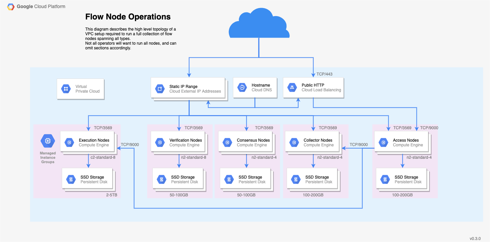

## Hardware Requirements

The hardware your Node will need varies depending on the role your Node will play in the Flow network. For an overview of the differences see the [Node Roles Overview](node-roles.mdx).

| Node Type | CPU | Memory | Disk | Example GCP Instance |
|:----------------:| ---------:| ------:| ------:|:--------------:|
| **Collection**   |  4 cores  | 32 GB  | 200 GB | n2-highmem-4   |
| **Consensus**    |  2 cores  | 16 GB  | 200 GB | n2-standard-4  |
| **Execution**    | 64 cores  | 800 GB |  9 TB  | n2-highmem-128 |
| **Verification** |  2 cores  | 16 GB  | 200 GB | n2-highmem-2   |
| **Access**       |  4 cores | 16 GB  | 750 GB | n2-standard-4   |
| **Observer**     |  2 cores  | 4 GB   | 300 GB | n2-standard-4  |
| **Archive**      | 32 cores  | 800 GB |  2 TB  | m3-ultramem-32 |

_Note: The above numbers represent our current best estimate for the state of the network. These will be actively updated as we continue benchmarking the network's performance._

## Networking Requirements

Most of the load on your nodes will be messages sent back and forth between other nodes on the network. Make sure you have a sufficiently fast connection; we recommend at _least_ 1Gbps, and 5Gbps is better.

Each node will require either a static IPv4 address or a fixed DNS name. Either works, and we'll refer to this more generally as your 'Node Address' from here on out.

<Callout type="info" title="Node Address Requirements">
    Your Node Address must be a publicly routable IPv4 address or valid DNS name
    that points to your node. This is how other nodes in the network will
    communicate with you.
</Callout>

While both a static IPv4 and a domain name are possible, we prefer and recommend that node operators register their node under a domain that they control. This gives the Flow network more options for resiliency and resistance to adverse network conditions.

<Callout type="warning" title="Registering a domain name for your Flow Node">
    Crash recovery and denial of service attacks are two concerns that operators can mitigate relying on each of DNS indirection and IP routing. The later requires more involvement.

    Running a node behind an operator-controlled hostname (rather than "just" an IP) is a simple and cheap measure that:

    - offers additional technical pathways to let operators improve resiliency and security,
    - lets them opt in to those measures as a reaction to an attack,
    - does not preclude any lower-level IP-based resiliency approaches.

</Callout>

Your firewalls must expose **TCP/3569** for Node communication. If you are running an Access Node, you must also expose the GRPC port **9000**.

## Operating System Requirements

The Flow node code is distributed as a Linux container image, so your node must be running an OS with a container runtime like [docker](https://docker.com) or [containerd](https://containerd.io).

The bootstrapping scripts we'll use later are compiled binaries targeting an `amd64` architecture, so your system must be 64-bit. Some of these scripts are bash based hence a shell interpreter that is bash compatible will also be needed.

Flow also provides `systemd` service and unit files as a template for installation, though `systemd` is not required to run Flow.

<Callout type="info" title="Choose Your Own Adventure">
    Flow is distributed in such a way that makes it very system agnostic. You are
    free to build your own orchestration around how you run your nodes and manage
    your keys.
     
     
    For the remainder of this guide, we cover the most simple case, a single node being
    hand deployed. This should give you a good sense of what's needed, and you can
    modify to suit your needs from there.
     
     
    The Flow team has tested running nodes on Ubuntu 18.04 and GCP's Container
    Optimized OS, which is based on Chromium OS. If you are unsure where to start,
    those are good choices.
</Callout>

## Time synchronization

You should also ensure you run **time synchronization** on the machine hosting the container, to avoid clock drift. In practice, this means configuring a client for the NTP protocol, and making sure it runs as a daemon. `ntpd` is one recommended example. To configure it, you just have to point it to an NTP server to query periodically. A default from your Linux distribution or cloud operator may already be set, and in the interest of decentralization, our recommendation would be to use it unless you have a specific reason to do otherwise.

<Callout type="info" title="Time synchronization FAQ">

    - **Leap-smearing**: Leap-smearing time servers and non-leap-smearing time servers are both acceptable for the magnitude of our time precision requirements - though considering very few providers offer leap smearing time servers, a "regular" time server helps ensure our pool of time providers is more diverse.

    - **Why not do it in the container itself? Why do we need to do this?**:  Without special privileges and in all major container runtimes, a container will not run with the `CAP_SYS_TIME` capability. For Flow, this means that the node software itself cannot change the time of the host machine, making the in-container use of standard time synchronization protocols ineffective.

    - **Why does time matter in Flow?**: Time information comes up in consensus and in smart contracts. The consensus algorithm of Flow allows nodes to exit the influence of a corrupt or ineffective "leader" node by collectively deciding to switch to the next "phase" of the protocol at the right time. The smart contract language also allows developer access to block time stamps, which provide an approximation of time. To resist manipulation in each case, honest nodes must compute timing values from an aggregate of the information provided by all nodes. That approach, though resilient, is still sensitive to inaccurate time information. In other words, a node subject to clock drift but otherwise honest will not stop the consensus, but might make it slower.

</Callout>

## Setup Data Directories & Disks

Flow stores protocol state on disk, as well as execution state in the case of execution nodes.

Where the data is stored is up to you. By default, the `systemd` files that ship with Flow use `/var/flow/data`.
This is where the vast majority of Flow's disk usage comes from, so you may wish to mount this directory on a separate disk from the OS.
The performance of this disk IO is also a major bottleneck for certain node types.
While all nodes need to make use of this disk, if you are running an execution node, you should make sure this is a high performing SSD.

As a rough benchmark for planning storage capacity, each Flow block will grow the data directory by 3-5KiB.

### Confidential Data & Files

Flow stores dynamically generated confidential data in a separate database. We strongly recommend enabling encryption
for this database - see [this guide](db-encryption-existing-operator) for instructions.

Confidential information used by Flow is stored in the `private-root-information` subtree of the `bootstrap` folder.
In particular:
* the staking private key (`node-info.priv.json`)
* the networking private key (`node-info.priv.json`)
* the encryption key for the secrets database (`secretsdb-key`)
* (if applicable) the initial random beacon private key (`random-beacon.priv.json`)

These files contain confidential data, and must be stored and accessed securely.

