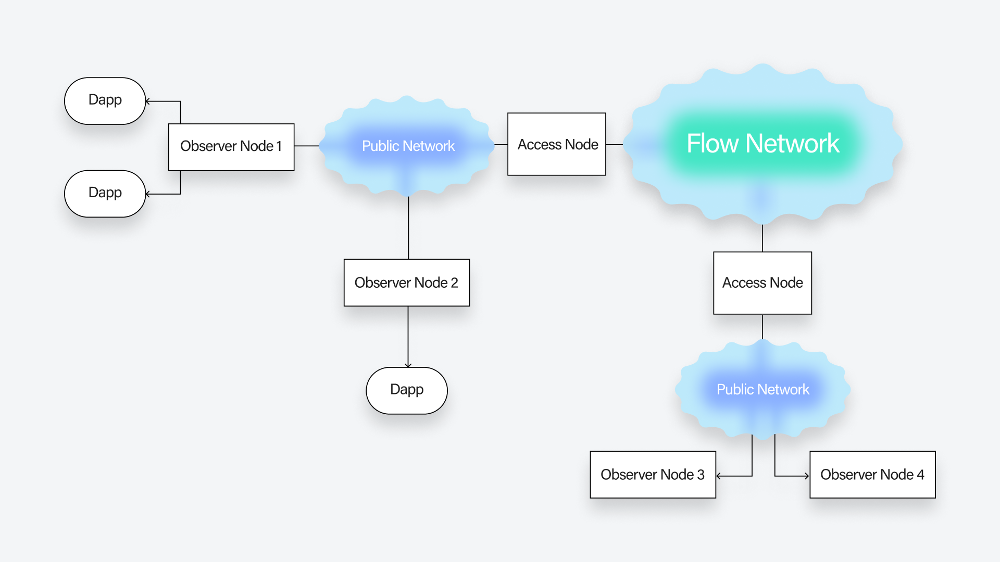

An observer node is similar to an access node and provides a locally accessible, continuously updated, verified copy of the block data. It serves the [gRPC Access API](https://developers.flow.com/nodes/access-api.md) but unlike an access node, an observer node does not need to be staked, and **anyone** can run it without being added to the approved list of nodes.

The observer node bootstraps by connecting to an access node and becoming part of the public network comprised of access nodes and other observer nodes. It then continuously receives blocks that are being added to the chain either directly from the access node or from other observer nodes that are part of the public network. However, it makes no trust assumption of the upstream access node or the observer node which is providing the block and locally verifies that the blocks that are received are the correct extension of the chain e.g. after receiving valid blocks A, B and C when it receives block D, it verifies that block D is indeed signed by the consensus nodes and is a valid next block. The received block data is indexed and made available via the Access API. For Collection, Transactions and Account queries, it delegates those requests to the upstream access node. Similarly, transactions and scripts sent to an observer node are also forwarded to the upstream access node. Future versions of the observer node will be able to serve this data locally as well.

Since the observer node is not staked, it does not produce or execute blocks but instead serves as an _unstaked access node_ that can be easily run on any consumer-grade computer which has enough disk space.



## Who should run an observer node?

The observer node provides an alternative to running an access node. Hence, it is ideal for Dapps that need access to the latest block data available locally e.g. a wallet application that needs to track the latest block ID and height. In addition to that, access node operators who want to scale their access node endpoints geographically can spin up geographically dispersed observer nodes which can talk to their staked access node and to each other.

## Running an observer node

### Hardware

In general, any consumer-grade computer with a decent network connection and sufficient disk space should be able to run an observer node.

Minimum requirements

- CPU with 2+ cores
- 4 GB RAM minimum
- 300 GB SSD disk
- 10Mbps network connection

### Steps to run an observer node

> [Here](https://www.loom.com/share/990a725531754106b91d8ccec6244219) is video walk-though of these 👇 steps.

#### Step 1 - Generate the node directory structure
The observer node requires the following directory structure,
```shell
$ tree flow_observer
flow_observer/
├── bootstrap
│         ├── network.key (file containing the node private network key)
│         └── public-root-information
│             └── root-protocol-state-snapshot.json (the genesis data of the current spork)
└── data (directory used by the observer node to store block data)
```

Create the parent and the sub-directories
e.g.
```shell
mkdir -p flow_observer/bootstrap/public-root-information
mkdir flow_observer/data
```

#### Step 2 - Generate the network key

Like any other Flow node, the observer also needs a networking [ECDSA key](https://github.com/onflow/flow-go/blob/master/cmd/bootstrap/utils/key_generation.go#L52-L54) to talk to the network.
Download the Bootstrapping kit, and generate the observer networking key.

```shell
curl -sL -O storage.googleapis.com/flow-genesis-bootstrap/boot-tools.tar
tar -xvf boot-tools.tar
./boot-tools/bootstrap observer-network-key  --output-file  ./flow_observer/bootstrap/network.key
```

_If you are running on a mac, download the boot-tools for mac to generate the key_
```shell
# For M1
curl -sL -O storage.googleapis.com/flow-genesis-bootstrap/boot-tools-m1.tar
# For Intel Mac
curl -sL -O storage.googleapis.com/flow-genesis-bootstrap/boot-tools-intel-mac.tar
```

#### Step 3 - Download the root-protocol-state-snapshot.json file for the current spork

The `root-protocol-state-snapshot.json` is generated for each [spork](https://developers.flow.com/nodes/node-operation/spork) and contains the genesis data for that spork.
It is published and made available after each spork. The download location is specified [here](https://github.com/onflow/flow/blob/master/sporks.json) under [rootProtocolStateSnapshot](https://github.com/onflow/flow/blob/master/sporks.json#L16) and can be downloaded as follows,

For mainnet find  the latest spork version from [sporks.json](https://github.com/onflow/flow/blob/master/sporks.json) and then download the `root-protocol-state-snapshot.json` and the signature file for it.

```shell
wget -P ./flow_observer/bootstrap/public-root-information https://storage.googleapis.com/flow-genesis-bootstrap/mainnet-<spork version>-execution/public-root-information/root-protocol-state-snapshot.json
wget -P ./flow_observer/bootstrap/public-root-information https://storage.googleapis.com/flow-genesis-bootstrap/mainnet-<spork version>-execution/public-root-information/root-protocol-state-snapshot.json.asc
```

Similarly, for testnet find  the latest spork version from [sporks.json](https://github.com/onflow/flow/blob/master/sporks.json) and then download the `root-protocol-state-snapshot.json` and the signature file for it.
```shell
wget -P ./flow_observer/bootstrap/public-root-information https://storage.googleapis.com/flow-genesis-bootstrap/testnet-<spork version>/public-root-information/root-protocol-state-snapshot.json
wget -P ./flow_observer/bootstrap/public-root-information https://storage.googleapis.com/flow-genesis-bootstrap/testnet-<spork version>/public-root-information/root-protocol-state-snapshot.json.asc
```

##### Verify the PGP signature

Add the `flow-signer@onflow.org` public key
```shell
gpg --keyserver keys.openpgp.org --search-keys flow-signer@onflow.org

gpg: data source: http://keys.openpgp.org:11371
(1)	Flow Team (Flow Full Observer node snapshot verification master key) <
	  256 bit ECDSA key CB5264F7FD4CDD27, created: 2021-09-15
Keys 1-1 of 1 for "flow-signer@onflow.org".  Enter number(s), N)ext, or Q)uit > 1
```

Verify the root-snapshot file
```shell
gpg --verify ./flow_observer/bootstrap/public-root-information/root-protocol-state-snapshot.json.asc

gpg: assuming signed data in 'bootstrap/public-root-information/root-protocol-state-snapshot.json'
gpg: Signature made Wed Sep 15 11:34:33 2021 PDT
gpg:                using ECDSA key 40CD95717AC463E61EE3B285B718CA310EDB542F
gpg: Good signature from "Flow Team (Flow Full Observer node snapshot verification master key) <flow-signer@onflow.org>" [unknown]
gpg: WARNING: This key is not certified with a trusted signature!
gpg:          There is no indication that the signature belongs to the owner.
Primary key fingerprint: 7D23 8D1A E6D3 2A71 8ECD  8611 CB52 64F7 FD4C DD27
     Subkey fingerprint: 40CD 9571 7AC4 63E6 1EE3  B285 B718 CA31 0EDB 542F
```

Alternately, if you don't care about the blocks before the current block, you can request the current root-snapshot file via the [Flow CLI](https://developers.flow.com/tools/flow-cli).

For mainnet
```shell
 flow snapshot save ./flow_observer/bootstrap/public-root-information/root-protocol-state-snapshot.json --host secure.mainnet.nodes.onflow.org:9001 --network-key 28a0d9edd0de3f15866dfe4aea1560c4504fe313fc6ca3f63a63e4f98d0e295144692a58ebe7f7894349198613f65b2d960abf99ec2625e247b1c78ba5bf2eae
```

For testnet
```shell
flow snapshot save ./flow_observer/bootstrap/public-root-information/root-protocol-state-snapshot.json --host secure.testnet.nodes.onflow.org:9001 --network-key ba69f7d2e82b9edf25b103c195cd371cf0cc047ef8884a9bbe331e62982d46daeebf836f7445a2ac16741013b192959d8ad26998aff12f2adc67a99e1eb2988d
```

#### Step 4 - Start the node

The observer node can be run as a docker container

##### Observer for Flow Mainnet

```shell
docker run --rm \
 -v $PWD/flow_observer/bootstrap:/bootstrap:ro  \
 -v $PWD/flow_observer/data:/data:rw \
 --name flow_observer \
 -p 8071:8071 \
 -p 3569:3569 \
 -p 9000:9000 \
 -p 9001:9001 \
 gcr.io/flow-container-registry/observer:v0.27.2 \
 --bootstrapdir=/bootstrap \
 --datadir=/data/protocol \
 --bind 0.0.0.0:3569  \
 --loglevel=error \
 --secretsdir=/data/secrets  \
 --upstream-node-addresses=access-008.mainnet20.nodes.onflow.org:9001 \
 --upstream-node-public-keys=11742552d21ac93da37ccda09661792977e2ca548a3b26d05f22a51ae1d99b9b75c8a9b3b40b38206b38951e98e4d145f0010f8942fd82ddf0fb1d670202264a \
 --bootstrap-node-addresses=access-008.mainnet20.nodes.onflow.org:3570  \
 --bootstrap-node-public-keys=11742552d21ac93da37ccda09661792977e2ca548a3b26d05f22a51ae1d99b9b75c8a9b3b40b38206b38951e98e4d145f0010f8942fd82ddf0fb1d670202264a \
 --observer-networking-key-path=/bootstrap/network.key
```

##### Observer for Flow Testnet

```shell
docker run --rm \
 -v $PWD/flow_observer/bootstrap:/bootstrap:ro  \
 -v $PWD/flow_observer/data:/data:rw \
 --name flow_observer \
 -p 8071:8071 \
 -p 3569:3569 \
 -p 9000:9000 \
 -p 9001:9001 \
 gcr.io/flow-container-registry/observer:v0.27.2 \
 --bootstrapdir=/bootstrap \
 --datadir=/data/protocol \
 --bind 0.0.0.0:3569  \
 --loglevel=error \
 --secretsdir=/data/secrets  \
 --upstream-node-addresses=access-003.devnet37.nodes.onflow.org:9001 \
 --upstream-node-public-keys=b662102f4184fc1caeb2933cf87bba75cdd37758926584c0ce8a90549bb12ee0f9115111bbbb6acc2b889461208533369a91e8321eaf6bcb871a788ddd6bfbf7 \
 --bootstrap-node-addresses=access-003.devnet37.nodes.onflow.org:3570  \
 --bootstrap-node-public-keys=b662102f4184fc1caeb2933cf87bba75cdd37758926584c0ce8a90549bb12ee0f9115111bbbb6acc2b889461208533369a91e8321eaf6bcb871a788ddd6bfbf7 \
 --observer-networking-key-path=/bootstrap/network.key
```

The observer node acts as a DHT client and bootstraps from upstream access nodes which run the DHT server.
The upstream bootstrap server is specified using the `bootstrap-node-addresses` which is the comma-separated list of hostnames of the access nodes.
The `bootstrap-node-public-keys` is the list of the corresponding networking public key of those nodes.

The observer node delegates many of the API calls to the upstream access nodes.
The `upstream-node-addresses` is the list of access node hostnames to which this observer node can delegate to. The list can be different from the bootstrap node list.
The `bootstrap-node-public-key` is the list of the corresponding networking public key of those nodes.

> In the above docker commands, the Flow community access nodes are being used as the upstream access nodes. However, any other Flow access node that supports an observer node can be used

_All parameters and their explanation can be found [here](https://github.com/onflow/flow-go/blob/82da35141ff095fbf75ce2c950efec240ad38565/cmd/access/node_builder/access_node_builder.go#L523-L558)_

🚀 **The node should now be up and running**

You can now query the node for blocks, transaction etc. similar to how you would query an access node.

e.g. querying the gRPC API endpoint using Flow CLI
```shell
flow blocks get latest --host localhost:9000
```

> REST API is currently not support (see [issue](https://github.com/onflow/flow-go/issues/3138))

The observer node, like the other type of Flow nodes, also produces Prometheus metrics that can be used to monitor node health. More on that [here](/nodes/node-operation/node-setup#monitoring-and-metrics)


## FAQs

### Does the observer node need to be staked?

No, the observer node is not a staked node.

### Can any access be used to bootstrap an observer node?

No, only Access nodes which have explicitly turned ON support for observer nodes can be used to bootstrap an observer node.

The public access nodes that support observer nodes are listed below. Apart from these, other public access nodes run by node operators other than DapperLabs may choose to support observer nodes.

### How can an access node turn ON support for observer node?

An access node can support an observer node by passing in the following two parameters when starting the access node
```shell
 --supports-observer=true --public-network-address=0.0.0.0:3570
```
`public-network-address` is the address the observer nodes will connect to.

### Are observer nodes subject to rate limits?

The observer serves all the [Block related queries](https://github.com/onflow/flow/blob/master/protobuf/flow/access/access.proto#L24-L42) from is local database. These are not subjected to any rate limits.

However, it proxies all the other requests to the access node and those will be rate limited as per the rate limits defined on that access node.


### Flow community access nodes that support connections from observer nodes

#### For mainnet

Access-007:
* Host: `access-007.[current mainnet spork].nodes.onflow.org`
* Public Key: `28a0d9edd0de3f15866dfe4aea1560c4504fe313fc6ca3f63a63e4f98d0e295144692a58ebe7f7894349198613f65b2d960abf99ec2625e247b1c78ba5bf2eae`

Access-008:
* Host: `access-008.[current mainnet spork].nodes.onflow.org`
* Public Key: `11742552d21ac93da37ccda09661792977e2ca548a3b26d05f22a51ae1d99b9b75c8a9b3b40b38206b38951e98e4d145f0010f8942fd82ddf0fb1d670202264a`

#### For testnet

Access-003:
* Host: `access-003.[current devnet spork].nodes.onflow.org`
* Public Key: `b662102f4184fc1caeb2933cf87bba75cdd37758926584c0ce8a90549bb12ee0f9115111bbbb6acc2b889461208533369a91e8321eaf6bcb871a788ddd6bfbf7`

Access-004:
* Host: `access-004.[current devnet spork].nodes.onflow.org`
* Public Key: `0d1523612be854638b985fc658740fa55f009f3cd49b739961ab082dc91b178ed781ef5f66878613b4d34672039150abfd9c8cfdfe48c565bca053fa4db30bec`

While the public keys remain the same, the hostnames change each spork to include the spork name. Substitute `[current mainnet spork]` and `[current devnet spork]` with the appropriate spork name (e.g. `mainnet20`).
See [Past Sporks](https://docs.onflow.org/node-operation/past-sporks/) for the current spork for each network.