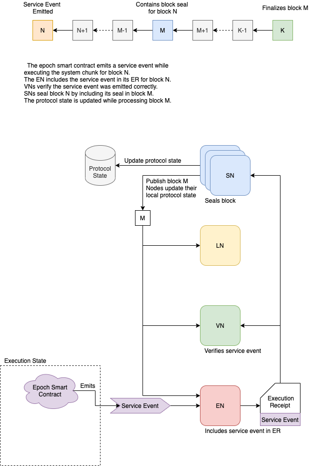

# Introduction

The epoch contract stores a lot of different state, and the state is constantly changing.
As an external party, there are two ways to keep track of these state changes. 
You can either use Cadence scripts to query the state of the contract at any given time,
or you can monitor events that are emitted by the epoch contract to be notified of any important occurances.

# Query Information with Scripts

TODO

# Monitor Epoch Service Events

These events can be queried using the Go or JavaScript SDKs to extract useful notifications and information about the
state of the epoch preparation protocol.

## What is a Service Event?

Service events are special messages that are generated by smart contracts and included in execution results.
They enable communication between system smart contracts and the Flow protocol.
In other words, they serve as a communication mechanism between the execution state and the protocol state. 

Concretely, service events are defined and emitted as events like any other in Cadence. An event is considered a service event when it is:

- emitted within the service chunk, and
- emitted from a smart contract deployed to the service account, and
- conformant to an event allowlist

Each block contains a system chunk. For each system chunk,
all service events emitted are included in the corresponding execution result. 

When verifying the system chunk, verifier nodes will only produce result approvals
when the system chunks included in the execution result are correct.
Thus, the security of this communication mechanism is enforced by the verification system.

When sealing a block containing a service event, the consensus committee will update the protocol state accordingly,
depending on the semantics of the event. 

For example, a service event may indicate that a node's stake has diminished to the point where they should be ejected,
in which case the consensus committee would mark that node as ejected in the protocol state.

Service events are fundamentally asynchronous, due the lag between block execution and sealing.
Consequently they are handled slightly differently than other protocol state updates.

The diagram below illustrates the steps each service event goes through to be included in the protocol state.

For a service event emitted in block `N`, associated state changes are applied at block `M` and become finalized at block `K`. 

For conciseness, we say a service event is `sealed` when the block in which it was emitted is sealed,
and we say a service event is `finalized` when the block containing the seal is finalized.

### Fork-Specificity

Service events are fork-specific. Let `s` be a service event included in block `B`.
Event `s` only applies in the fork which has block `B` as the root of its subtree.

## Event Descriptions

TODO