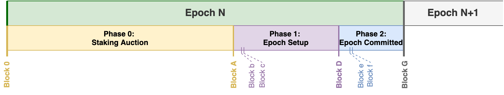

<Callout type="warning">

This information covers the current state of how epoch phases are ran and how
rewards are calculated and distributed to node operators and delegators. 
All of the information in the document is still being designed and is subject to change
based on research and discussion by the Flow core team and community.
If any changes are proposed, the Flow community will be notified in advance.
</Callout>

# Schedule



An Epoch is a period of time when the node operators in the network are constant. At epoch 
boundaries, newly staked node operators are able to join the network and existing node operators
which have unstaked may exit the network.

Each epoch lasts approximately a week, and the **Epoch Switchover** is defined as the point in time
when one epoch ends and the next epoch begins, marking a possible change in the list of valid nodes.

<Callout type="info">

The exact timing of each epoch end is influenced by the number of blocks proposed during the epoch.
Therefore, epoch phase timing can very and will likely drift over time.

**All quoted epoch end times are estimates and subject to some variance (up to several hours)**.
See [Epoch Preparation Protocol](/staking/epoch-preparation/#epoch-length) for details. 

</Callout>

**Staking Operations are disabled for approximately the last day of an epoch**,
typically around 12:00pm (7:00pm UTC) on Tuesday every week until the next day around the same time.
See [Epoch Setup](/staking/epoch-preparation#phase-1-epoch-setup) for more information on this phase.

**Epoch Switchovers will happen around 12:00 pm PT on Wednesday (7:00 pm UTC)** every week. 
Please note exact epoch ending time vary based on the performance of the network
& all staking operations that interact with staked tokens will be processed
by the protocol at the start of each epoch. 

## Rewards

**Rewards are usually paid around 12 pm PT on Wednesday (7:00 pm UTC)**, every week,
to all users that have tokens staked.
This is close to the same time as the Epoch Switchover. See the Rewards Distribution section below
for more information about rewards calculation and schedule.

## Staking Auction

The first, and longest phase of an epoch is the [staking auction](/staking/epoch-preparation#phase-0-staking-auction.
This phase is when nodes and delegators can register to stake and perform other staking operations
such as staking more tokens or unstaking their existing tokens.
None of these operations are fully executed until the **Epoch Switchover** though.

**The Staking Auction lasts for at least the first 90% of the length of an Epoch**

## Epoch Setup and Epoch Commit

The [Epoch Setup](/staking/epoch-preparation#phase-1-epoch-setup)
and [Epoch Commit](/staking/epoch-preparation#phase-2-epoch-committed)
phases are the final phases of the epoch, when node operators who have been included
in the next epoch perform important setup functionailty to prepare for the next epoch.

**The Epoch Setup and Epoch Committed phases usually last less than 10% of the time of an epoch.**

**Staking Operations will be rejected during the Epoch Setup and Epoch Commit phases.**
This is because the staking information has been finalized in preparation for the next epoch
and cannot be changed because these final phases rely on the staking information being constant.

**The Staking Auction Ends every Tuesday near 12:00pm PT (7:00 pm UTC).**
**This means that staking operations will be disabled for ALL users**
**in the period between the end of the staking auction and the beginning of the next epoch, currently 24hrs.**

## Rewards Distribution

The rewards distribution schedule has been designed to ensure 
there is enough liquid supply of FLOW available in the ecosystem 
to empower a wide variety of use cases and promote fair and diverse participation in the Flow ecosystem.

The numbers in this table represent the total amount of tokens that are paid 
as staking rewards at each epoch to the entire pool of participants in the Flow network. 
While the total staking reward amount is known and fixed per epoch,
rewards that individual stakers receive are variable depending on many factors. 

The total rewards for each epoch are fixed for that epoch, but where those rewards come from can change.
When the protocol pays rewards, it first pulls from the central pool of all the transaction fees
that have been paid by every user in the network since the last rewards payment.
Once that pool has been depleted, the protocol mints new tokens that are used as rewards.

Please see the next section on how to calculate an individual staking reward.

|                               | Dec 22, 2020        | Dec 29, Jan 5, 12, 19, 26 (2021) | Feb 2, 2021 weekly on Wednesdays indefinitely |
| ----------------------------- | ------------------- | -------------------------------- | --------------------------------------------- |
| Total Rewards % (Annual)      | 5%                  | 20%                              | 5%                                            |
| Total Rewards Amount Per Week | ~1.2M FLOW          | ~4.4M FLOW                       | ~1.3M FLOW                                    |

## Individual Calculation

Each user gets a percentage of the total rewards during each epoch 
that is proportional to their percentage of all the tokens that are staked by all participants.

The full reward calculation on a per-user basis is equal to:	

```	
New Reward(user) = Tr  * (Sn / St)	
```	

where:	
- `Tr` = Total staking rewards to be paid out during the current epoch. (See table above)
- `Sn` = Amount of FLOW Staked by the target user for the current Epoch. (Different for each staker)
- `St` = Sum of all the FLOW staked by all the participants in the network. (Changes every epoch)

Rewards for delegators are also calculated in the exact same way that rewards for node operators are calculated, 
with one difference in that 8% of the calculated reward amount is given to the node operator being delegated to 
(effected as a protocol layer fee, which is the same for all node operators). 
The remaining 92% is awarded to the delegator. 
Note: the 8% fee is only applied to the staking reward, not to the tokens delegated.

With this calculation, the node you choose to run or delegate to 
DOES NOT affect the amount of rewards you receive every week. 
The only variable that you can control is the number of tokens you have staked. 
The more tokens you stake, the more rewards you will receive.

Because of the variable nature of the rewards calculation, we cannot provide an expected weekly/yearly return 
for a single staker. You can plug your own numbers into the formula to see some sample calculations, 
but you won't be able to know exactly what you will earn until the beginning 
of the epoch in which you are participating in staking or delegation.

## Rewards History

For the first two years of its existence, the staking rewards payments
were handled with manual transactions. You can find the history of those transactions
including their arguments and IDs in the
[Pay Rewards Section](https://github.com/onflow/service-account/tree/main/transactions/pay-rewards
of the Flow Service Account Repo. The dates correspond to the date when the
rewards were paid at the end of an epoch and the network transitioned to a new epoch.

Future rewards payments and epoch switchovers happen automatically via a system chunk transaction,
which does not create regular transaction IDs.