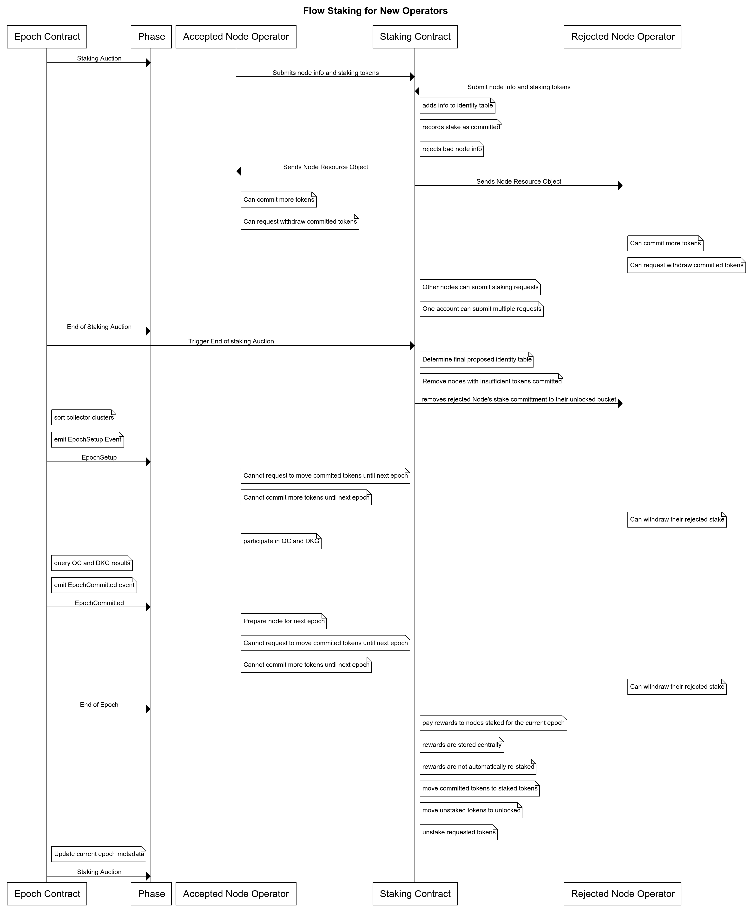
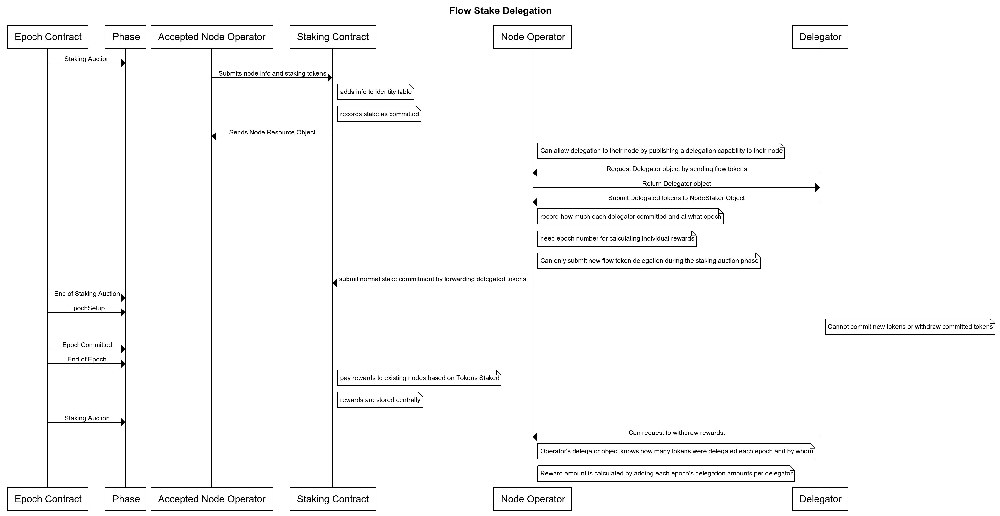

<Callout type="warning">
NOTE: The details of the transactions described in this document are for regular
interaction with the staking smart contracts. If you have locked tokens from the FLOW
token sale and want to stake them, please see the locked tokens section of the documentation
to learn the process for staking as a node operator.
</ Callout>

## Staking

This section describes the functionality of the [core identity table and staking smart contract](https://github.com/onflow/flow-core-contracts/blob/master/contracts/FlowIDTableStaking.cdc).
It also gives instructions for how users with unlocked Flow tokens can interact with
it to register as a node operator or delegator.

The transactions described in this document are contained in the [`flow-core-contracts/transactions/idTableStaking/`](https://github.com/onflow/flow-core-contracts/tree/master/transactions/idTableStaking)
directory. You can see the text of all the transactions used to interact with the smart contract there.

### Terminology

If any of the definitions are confusing, you can find more detail in the contract docs below the terminology section.

**Staker:** Any user who has staked tokens for the Flow network. A node operator is a staker, and a delegator is a staker as well.

**Node Operator:** A user who operates a node for the Flow network. Each node operator has a unique `NodeStaker` 
object they store in their account to perform staking operations.

**Delegator:** A user who delegates tokens to a node operator and receives rewards for their staked tokens, minus a fee
taken by the node operator. Each delegator stores a unique `NodeDelegator` object in their account
that allows them to perform staking operations.

**Identity Table:** The record of all the stakers in the network. 
The identity table keeps separate lists for the info about node operators and delegators,
which track the following info:

- **Node Operators:**
    * Node ID: 32 byte identifier for the node. Usually a hash of the node public key.
    * Role: Indicates what role the node operator is. (Collection, Consensus, Execution, Verification, Access)
    * Networking Address: The address that the node operator uses for networking.
    * Networking Key: The node operator public key for networking.
    * Staking Key: The public key for the account that manages staking.

- **Delegators:**
    * id: The ID associated with a delegator. These IDs are assigned to delegators automatically
    by the staking contract and are only unique within an individual node operators' record.
    * nodeID: The ID of the node operator a user delegates to.

- **Both:**
    * Tokens Committed: The tokens that a user has committed to stake in the next epoch.
    * Tokens Staked: The tokens that a user has staked in the current epoch.
    * Tokens Requested to Unstake: The amount of tokens that a user has requested to be unstaked
      at the end of the current epoch.
    * Tokens Unstaking: The tokens that were unstaked at the beginning of the current epoch and
      are being held for an additional epoch holding period before being released.
    * Tokens Unstaked: Tokens that used to be committed or staked and have been unstaked.
    * Tokens Rewarded: Tokens that the user has received via staking rewards.

**Epoch:** The period of time between reward payments and changes in the identity table. (Initially a week)
At the end of every epoch, insufficiently staked node operators are refunded their stake,
rewards are paid to those who are currently staked, committed tokens are marked as staked, 
unstaking tokens are marked as unstaked, and unstaking requests are changed from staked to unstaking.

**Delegation Rewards Cut:** The percentage of a delegator's rewards that the node operators take. Initially set to 10%.

**Epoch Payout:** The total amount of tokens paid in rewards at the end of an epoch. 
This value will change as the supply of FLOW changes.

**Minimum Stake Requirement:** Each node type has a requirement for the minimum number of FLOW
they have to commit to stake to be considered a valid node and receive rewards. If a node operator
does not meet the minimum stake, they will not be included in the next epoch and will not receive any rewards.
Delegators are not subject to minimum stake requirements.

- Collector Nodes: 250,000 FLOW
- Consensus Nodes: 500,000 FLOW
- Execution Nodes: 1,250,000 FLOW
- Verification Nodes: 135,000 FLOW

### Smart Contract Summary

The Flow staking smart contract manages a record of stakers who have staked tokens for the network. 
Users who want to stake can register with the staking contract at any time, and their tokens will
be locked for staking until they request to unstake them.

Before getting into the details of the contract, we need to discuss how time in Flow is organized.
The operation of the Flow network is divided into epochs, which are week-long periods where various
network maintenance operatios are performed. The schedule of each epoch is exactly the same, though
individual actions that users take in relation to the network will be different.

Epoch Schedule:

1. Start of Epoch: Generic metadata about the current epoch is updated and shared.
2. Staking Auction: Stakers can perform any action they want to manage their stake, like
    initially registering, staking new tokens, unstaking tokens, or withdrawing rewards.
    This phase takes up the vast majority of time in the epoch.
3. Remove Insufficiently Staked Nodes: All node operators who don't meet the minimum will be removed.
4. Rewards Payout: Pay rewards to all the node operators staked in the current epoch.
5. Move tokens between pools. (See the token pools section for the order of movements)

The `FlowIDTableStaking` contract manages the identity table, and all of these phases. 
Initially, control of these phases will be managed manually by the Flow Token Admin,
but control will eventually be completed decentralized and managed by the smart contracts
and democratically by all the stakers in the network.

## Staking as a node operator

To stake for a node, you first need to generate your staking key,
networking address, and networking key.
Please consult the [guide](https://docs.onflow.org/docs/node-operation-consolidated-guide) to read about how to do that.

To generate your node ID, simply hash your staking Key and submit that as the ID.

You then need to determine the role of node you'll be running (Collector, Consensus, Execution, Verification, or Access).

Once you have determined all of this information:
* Node role (Collector, Consensus, Execution, Verification, or Access)
* Node ID
* Networking Address
* Networking Key
* Staking Key

You are ready to submit a staking request.

To create and submit a regular staking request, the node operator calls the `addNodeInfo` function,
providing all the node info, and the tokens that they want to stake.

This will register your node in the Flow node identity table
and commit your tokens to stake during the next epoch.
This also stores a special node operator object in your account that is used for staking, unstaking,
and withdrawing rewards. 

Once you have registered and have the special node object, you will be able
to perform any of the valid staking options with it, assuming that you have
the required amount of tokens for each operation.

If a node operator has delegators, they cannot withdraw their own tokens 
such that their own staked tokens would fall below the minimum requirement for that node type.
This is enforced at the protocol level. If they have delegators 
and try to unstake that puts their stake below the minimum, it will fail. 

If they want to unstake below the minimum, they must unstake all of their tokens,
which also unstakes all of the tokens that have been delegated to them.

## Staking as a Delegator

Every staked node in the Flow network is eligible for delegation by any other user.
The user only needs to know the node ID of the node they want to delegate to.

To register as a delegator, the delegator should submit the `idTableStaking/del_register_delegator`
transaction, providing the id of the node operator they want to delegate to. 
This transactions calls the `registerNewDelegator` function and stores the `NodeDelegator` object
in the user's account, which is what they use to perform staking operations.

Users should be able to get these IDs off-chain, directly from the node operators. Flow is also planning
on listing node IDs in a public place.

The fee that node operators take from the rewards their delegators receive is 10%.
A node operator cannot be delegated to unless the total tokens they have committed to stake
are above the minimum requirement for their node types.

The delegation logic keeps track of the amount of tokens each delegator has delegated for the node operator.
When rewards are paid, the node operator takes the 10% cut of the delegator's rewards and the
delegators rewards are deposited in the delegator's reward pool.

## Staking Operations available to All Stakers

Regardless of whether they are a node operator or delegator, a staker has access
to all the same staking operations.

A staker can commit more tokens to stake for the next epoch at any time,
and there are three different ways to do it.
1. They can commit new tokens to stake by submitting the `stake_new_tokens.cdc` transaction,
which withdraws tokens from their account's flow token vault and commits them.
2. They can commit tokens that are in their unstaked token pool, which holds the tokens
that they have unstaked. Submit the `stake_unstaked_tokens.cdc`
transaction to move the tokens from the unstaked pool to the committed pool.
3. They can commit tokens that are in their rewarded token pool, which holds the tokens
you have been awarded. They submit the `stake_rewarded_tokens.cdc`
transaction to move the tokens from the rewards pool to the committed pool.

At anytime, a staker can also submit a request unstaking transaction
which will move their tokens to the unstaking pool at the end of the current epoch.
They will sit in this pool for one (1) additional epoch,
at which point they will be moved to the unlocked tokens pool, where
they are able to be freely withdrawn.

A staker can also withdraw their rewarded tokens at any time.

When a new epoch starts, if a staker has committed at least the minimum stake required,
the tokens they have committed will be marked as staked and held in the protocol state.
If a staker does not meet the minimum requirement, their committed tokens are 
moved to their unstaked pool, which they can withdraw from at any time.

Staking rewards are paid at the end of every epoch based on how many tokens
are in a users `tokensStaked` pool. Every staker's rewards
are deposited to their rewarded tokens pool. They can be withdrawn
at any time by submitting the `withdraw_reward_tokens.cdc` transaction.

This diagram shows a flow of actions for new node operators.



This diagram shows a flow of actions for a new delegator.



## Token Pools

Each node operator has five token pools allocated to them:

- Committed Tokens: Tokens that are committed for the next epoch. 
They are automatically moved to the staked pool when the next epoch starts.
- Staked Tokens: Tokens that are staked by the node operator for the current epoch.
They are only moved at the end of an epoch and if the staker 
has submitted an unstaking request.
- Unstaking Tokens: Tokens that have been unstaked,
but are not free to withdraw until the following epoch. 
- Unstaked Tokens: Tokens that are freely available to withdraw or re-stake.
Unstaked tokens go to this pool.
- Rewarded Tokens: Tokens that are freely available to withdraw or re-stake. 
Rewards are paid and deposited to the rewarded Pool after each epoch.

At the end of every epoch, tokens are moved between pools in this order:

1. All Committed Tokens will get moved either to the Staked Tokens pool, 
or to the Unstaked Tokens pool (depending on if the staked request has met the minimum stake requirements).
2. All Committed Tokens get moved to staked Tokens pool.
3. All unstaking tokens get moved to the unstaked tokens pool.
4. All requested unstaking tokens get moved from the staked pool to the unstaking pool.

## Rewards

### Schedule
All rewards are automatically distributed via the staking smart contract 
to the reward pools associated with each node.
Rewards are paid out according to the following schedule:

- Initial startup phase: no rewards
- Bootstrapping phase: rewards of 20% annualized
- After bootstrapping: rewards of 3.75% annually

### Reward Payouts
Rewards are paid out at the end of each epoch (roughly a week) to the
users that have tokens staked.

The paid rewards are proportional to the stake each node operator contributes to its node group. 
Node groups are assigned rewards based on their revenue ratio 
which is a coefficient assigned to them based on the security 
they contribute to the network. 
Please connect with the Flow team directly if you'd like to understand how these coefficients are derived.

A public paper will be shared in the future.

**The reward payout on a per node basis is equal to:**

```
Reward(n_node) = ((Tr) * (Tn)) * ((Sn) / (St))
```

where:

- Tr = Sum of all the rewards paid to all nodes per epoch.
- Tn = The node role's portion of total stake.
- Sn = Amount of FLOW Staked by the node for the current Epoch.
- St = Amount of FLOW staked by all the nodes of the selected node's type.

The rewards paid for the bootstrapping phase will be roughly
1.25 million FLOW per epoch (per week). This will sharply decrease in
the months following the release.

Each node role's portion of total stake has been determined based on
the amount of security they contribute to the network:

- Execution Nodes comprise 7.8% of total stake (TE= 0.078)
- Collection Nodes comprise 16.8% of total stake (TL= 0.168)
- Consensus Nodes comprise 51.8% of total stake (TS=0.518)
- Verification Nodes comprise 23.6% of total stake (TV=0.236)

At network launch, there will be no more than:

- 3 Execution Nodes
- 43 Consensus Nodes
- 29 Collection Nodes
- 73 Verification Nodes (100 when performance permits)

These numbers were chosen to ensure consistent returns for running a single node of any type. 
Over time, the number of nodes will increase to promote participation 
but we don't anticipate increasing the number of participating nodes by more than double 
in the first year of the network's operation.

## Slashing
So, who gets slashed? 
Severe slashing on Flow only takes place in the most nefarious of attacks. 
The protocol reserves slashing for maintaining the security of the protocol rather than its liveness.
You can find more details on the conditions under which a node is slashed in a different part of the docs.

While a node is in operation and during the unstaking period thereafter,
the staked tokens are held by the staking smart contract.
Slashable protocol violations must be adjudicated by a supermajority 
of more than 2/3 of the staked consensus nodes in order to take effect.
If a node is found guilty of committing a slashable protocol violation, 
the consensus nodes directly deduct a fine from the node's stake. 
Of course, only the remaining stake is deposited back into node's balance
at the end of the unstaking period.

## FAQ
**When will the User Accounts for Node Operators be created?**
Once the network is running, we'll issue a series of transactions 
to create accounts for all the users who are running nodes, building on Flow, and/or holding tokens. 
While the account-creation transactions will be co-signed by Dapper Labs for authorization and paying, 
your account will be fully owned and controlled by you immediately after creation. 

**What is the relationship between nodes and account addresses**
There is no formal relationship between nodes and account addresses.
When you register a node, you get an object that represents your node
and provides functionality to manage your staking, rewards, and delegation. 
This object can be stored in any account and multiple node objects can be stored 
in the same account.

It is possible for the rewards from operating multiple nodes to be deposited into the same account. 
Formally, we have a N Nodes-to-Single Account relationship, with N ≥ 1.
If you would like to subsequently disburse the received rewards to accounts of multiple parties, 
you have the full expressiveness of the Cadence smart contract language at your disposal 
to define any rules which fit your business model. 

We are happy to support you and your team with implementing the desired contracts.

## Staking Transaction Examples

### Create Staking Request

```cadence:title=create_staking_request.cdc
import FlowIDTableStaking from 0xIDENTITYTABLEADDRESS
import FlowToken from 0xFLOWTOKENADDRESS

// This transaction creates a new node struct object
// and updates the proposed Identity Table

transaction(id: String, 
            role: UInt8, 
            networkingAddress: String, 
            networkingKey: String, 
            stakingKey: String, 
            amount: UFix64,
            cutPercentage: UFix64) {

    let flowTokenRef: &FlowToken.Vault

    prepare(acct: AuthAccount) {

        self.flowTokenRef = acct.borrow<&FlowToken.Vault>(from: /storage/flowTokenVault)
            ?? panic("Could not borrow reference to FLOW Vault")

        let nodeStaker <- FlowIDTableStaking.addNodeRecord(id: id, 
                                                           role: role, 
                                                           networkingAddress: networkingAddress, 
                                                           networkingKey: networkingKey, 
                                                           stakingKey: stakingKey, 
                                                           tokensCommitted: <-self.flowTokenRef.withdraw(amount: amount),
                                                           cutPercentage: cutPercentage)

        
        if acct.borrow<&FlowIDTableStaking.NodeStaker>(from: FlowIDTableStaking.NodeStakerStoragePath) == nil {
            acct.save(<-nodeStaker, to: FlowIDTableStaking.NodeStakerStoragePath)
        } else {
            destroy nodeStaker
        }
    }
}
```

### Stake New Tokens

```cadence:title=stake_new_tokens.cdc
import FlowIDTableStaking from 0xIDENTITYTABLEADDRESS
import FlowToken from 0xFLOWTOKENADDRESS


transaction(amount: UFix64) {

    // Local variable for a reference to the node object
    let stakerRef: &FlowIDTableStaking.NodeStaker

    let flowTokenRef: &FlowToken.Vault

    prepare(acct: AuthAccount) {
        // borrow a reference to the node object
        self.stakerRef = acct.borrow<&FlowIDTableStaking.NodeStaker>(from: /storage/flowStaker)
            ?? panic("Could not borrow reference to staking admin")

        self.flowTokenRef = acct.borrow<&FlowToken.Vault>(from: /storage/flowTokenVault)
            ?? panic("Could not borrow reference to FLOW Vault")

    }

    execute {

        self.stakerRef.stakeNewTokens(<-self.flowTokenRef.withdraw(amount: amount))

    }
}
```

### Request Stake Unstaking

```cadence:title=request_unstake.cdc
import FlowIDTableStaking from 0xIDENTITYTABLEADDRESS


transaction(amount: UFix64) {

    // Local variable for a reference to the Node object
    let stakerRef: &FlowIDTableStaking.NodeStaker

    prepare(acct: AuthAccount) {
        // borrow a reference to the node object
        self.stakerRef = acct.borrow<&FlowIDTableStaking.NodeStaker>(from: /storage/flowStaker)
            ?? panic("Could not borrow reference to node object")

    }

    execute {

        self.stakerRef.requestUnStaking(amount: amount)

    }
}
```

### Withdraw Rewards

```cadence:title=withdraw_reward_tokens.cdc
import FlowIDTableStaking from 0xIDENTITYTABLEADDRESS
import FlowToken from 0xFLOWTOKENADDRESS


transaction(amount: UFix64) {

    // Local variable for a reference to the node object
    let stakerRef: &FlowIDTableStaking.NodeStaker

    let flowTokenRef: &FlowToken.Vault

    prepare(acct: AuthAccount) {
        // borrow a reference to the node object
        self.stakerRef = acct.borrow<&FlowIDTableStaking.NodeStaker>(from: /storage/flowStaker)
            ?? panic("Could not borrow reference to staking admin")

        self.flowTokenRef = acct.borrow<&FlowToken.Vault>(from: /storage/flowTokenVault)
            ?? panic("Could not borrow reference to FLOW Vault")

    }

    execute {

        self.flowTokenRef.deposit(from: <-self.stakerRef.withdrawRewardedTokens(amount: amount))

    }
}
```

The source code for the staking contract and more transactions 
can be found in the [Flow Core Contracts Github Repository](https://github.com/onflow/flow-core-contracts/tree/josh/staking).
