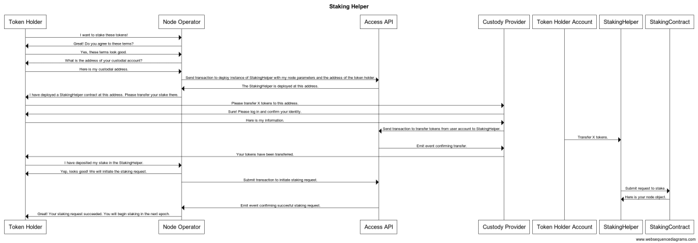
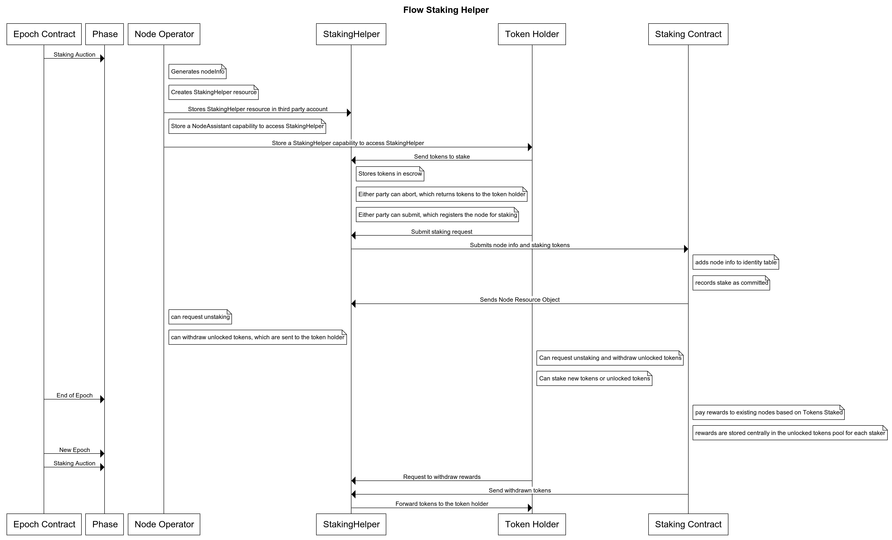

<Callout type="warning">
NOTE: The details of the transactions described in this document have not been finalized.
The overall flow of each process will stay the same, but the content and exact details
of each transaction WILL change.
</ Callout>

## Using the Staking Helper

If a node operator does not have Flow Tokens but wants to run a node, 
or if a token holder wants to stake, but doesn't want to have to manage
running their own node, these parties can enter into a staking agreement
by using the `StakingHelper` smart contract. This contract acts as a 
third party in a separate account that manages this relationship, according
to an off-chain agreement. The `StakingHelper` account has no keys and
is not controlled by any real people.

To set up this mechanism, the node operator first needs to submit the
`sh_create_staking_helper.cdc` transaction. This does not require tokens -
it creates a `StakingHelper` resource object and stores it in a third party account.

This transaction needs to be signed by both the node operator
and the token holder/custody provider because it also 
stores a capability in each account to access the third party `StakingHelper` resource.
This resource also defines the reward split between the node operator and token holder -
this is done via an `init` argument which is the percentage of rewards the node operator receives.

### Delegating with the Staking Helper

The `StakingHelper` resource allows the token holder securely transfer stake to the protocol
on behalf of the node operator without requiring the node operator 
to take custody of those funds at any time.

Once the `sh_create_staking_helper.cdc` transaction is complete,
the token holder needs to submit the `sh_send_staking_tokens.cdc` transaction
from wherever their tokens are held, before they can take any action.
This transaction withdraws tokens from the holder's account and deposits them
in escrow in the third-party `StakingHelper` account.

Once the token holder has escrowed their staking tokens and the node operator 
has generated the required node info (node ID, networking address, networking key, and staking key), 
either the node operator or the token holder can submit 
the `sh_create_staking_request.cdc` transaction. This registers the node operator 
in the Flow ID Table contract, commits the token holder's tokens
to be staked in the next epoch, and stores the `NodeStaker` object
in the `StakingHelper` account.

Alternatively, either party may choose to submit an `sh_abort_stake.cdc` transaction
which removes the tokens from escrow and returns them to the token holder's account.
This can only be called if the tokens haven't already been comitted.

If the `sh_create_staking_request.cdc` transaction has been submitted
and the tokens committed, the node operator and token holder 
can do a few different things.

Token Holder:
- Remove the token holder's stake via the `sh_request_unstaking.cdc` transaction
  (configuring this to require signatures from either or both parties is an available option).
  This unstaking is still subject to the weeklong unbonding period before
  the requested tokens are available to be withdrawn.
- Withdraw unstaked tokens via `sh_withdraw_unlocked_tokens.cdc` transaction,
  which will deposit them into the token holder's account regardless of who intiaited the transaction.
- Withdraw rewarded tokens via `sh_withdraw_rewarded_tokens.cdc` transaction,
  which will deposit them into the corresponding accounts regardless of who
  initiated the withdraw request.
  (this will automatically distribute the rewards to both the staker and node operator,
  as defined by the cut of rewards the node receives at creation of the `StakingHelper` resource).
- Commit additional tokens to stake via the `sh_stake_new_tokens.cdc` transaction.
- Commit unstaked tokens to stake via the `sh_stake_unlocked_tokens.cdc` transaction.
- Commit rewards tokens to stake via the `sh_stake_rewarded_tokens.cdc` transaction.

If either party wants to end the relationship and not manage the node or stake
they can simply unstake and withdraw all their tokens and the node operator
will no longer be registered with the protocol.

### High Level Staking Helper User Flow

### Technical Staking Helper Contract Flow

