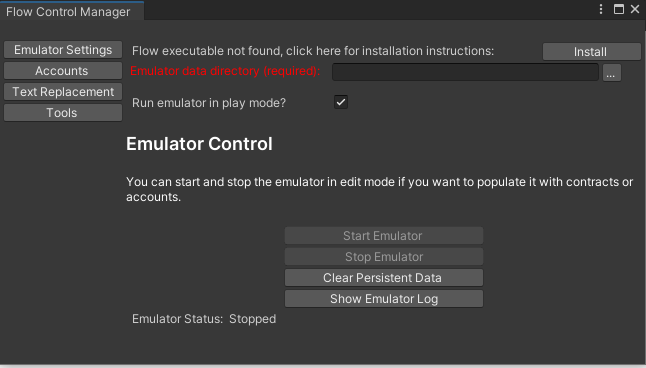
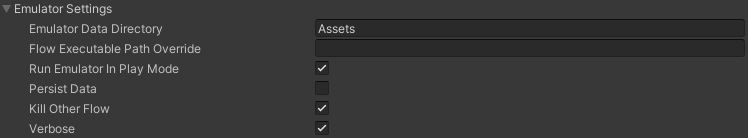
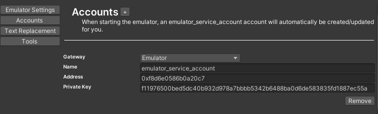
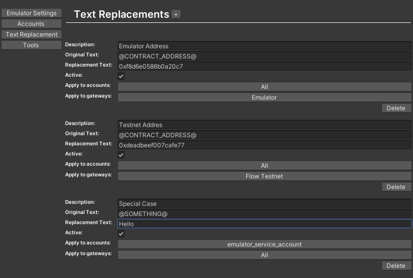
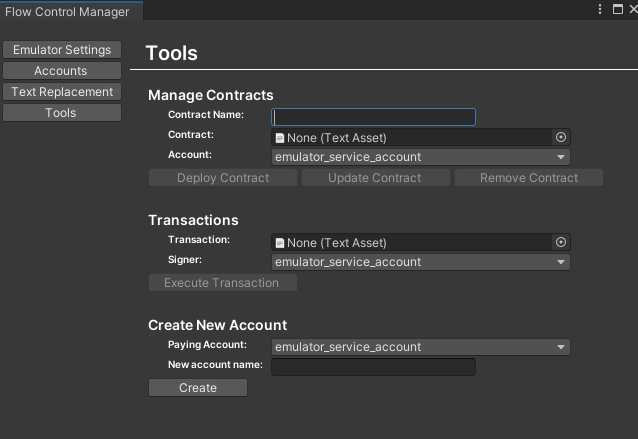
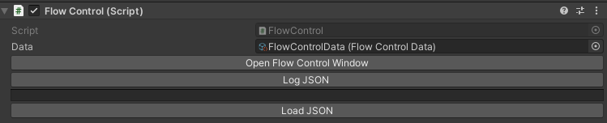

# FlowControl

FlowControl is a set of Unity tools and functions designed to streamline development and interactions with the Flow blockchain. 

After installing the Unity Flow SDK, open the FlowControl Manager window by clicking on Windows->Flow->Flow Control.

This will open the FlowControl Manager window.  It will also add a Flow Control object to your scene and create a FlowControlData resource to store your data if they are not already present.  You can have multiple FlowControlData resources to act as presets and switch between them as needed.

## FlowControl Emulator Settings

The first panel that displays will be your emulator settings.

**Installation Detection:**  FlowControl will attempt to find the flow binary in your path.  If it can't detect it, it will display a button linking you to the install instructions.

**Emulator Data Directory:**  This field is required if you wish to control the emulator from FlowControl.  Set this to the **directory** where you would like to store your persisted 
emulator state (flowdb), and your initial emulator configuration (flow.json).  This should typically be outside your project folder.  The folder must exist.

**Emulator endpoint:**  If you want to connect to an emulator running on a different computer, such as when testing on mobile devices or several clients all connecting
to the same emulator instance, you can specify an emulator endpoint address here.

**Run emulator in play mode?**  This determines if the emulator should automatically start when you enter play mode.

**Start Emulator** button:  This will start the emulator in the background to allow you to interact with it in edit mode.

**Stop Emulator** button:  This will stop a running emulator process.

**Clear Persistent Data** button:  The Flow emulator maintains the state of the emulated blockchain in a database.  This allows you to persist data between runs.  If you would like to reset the emulated blockchain to its initial state, use this button.  This will delete the flowdb directory located in the Emulator Data Directory.  It will be recreated the next time you start the emulator.

**Show Emulator Log** button:  This opens the Emulator Output window.  You can use this to verify that scripts you run against the emulator execute 
properly and will display debug messages if something goes wrong.  You can also open the log using Window->Flow->Emulator Output

## Advanced Options

Some options are not exposed in the Flow Control Manager, but can be changed directly in the FlowControlData asset.

**Flow Executable Path Override:**  This allows you to select the flow binary you would like to use.  This will override the auto detected flow binary.

**Persist Data:**  This allows you disable persisting the emulated blockchain to disk.  If this is disabled, all changes you make to the emulated blockchain will be lost when the emulator stops or restarts.

**Kill Other Flow:**  When starting or restarting the emulator, any running flow processes will be terminated.  If you wish to run your own emulator instance outside the control of Flow Control, uncheck this, as well as "Run Emulator in Play Mode" to ensure it doesn't get terminated. 

**Verbose:**  This controls the verbosity of emulator output.  Verbose output is usually desired, but if you would like non-verbose output for any reason, this allows you to control that setting.

## FlowControl Accounts

The Accounts panel allows you to store account information for easy access at runtime.
***Note:  Adding accounts to this panel does not create accounts on the blockchain***

The "+" button at the top will add a blank account entry for you to fill in.  The fields may differ depending on which Gateway is selected, but Gateway and Name are always required.

The emulator_service_account account will be created/updated each time you start the emulator so that it will always be valid.

If it is a Testnet account, a link to the Testnet Flowscan page for that account will be provided.  Clicking on it will open the page in your default browser.

## FlowControl Text Replacement

The Text Replacement panel allows you to manage string replacement inside your Cadence scripts.  If you're switching between emulator and Testnet, this makes it easy to replace account addresses and other strings without having to edit the scripts each time.

All instances of Original Text will be replaced with Replacement Text.  There is no required format, but it is recommended that you enclose the placeholder text in a separator character to ensure that there are no conflicting replacements.

The Description field is optional and is just used to make it easy to remember what each replacement is for.

The Active checkbox indicates if this text replacement should be performed.

"Apply to accounts" allows you to select specific accounts this replacement should apply to.  Any transactions or script executions performed via these accounts will have this replacement applied.

"Apply to gateways" allows you to select specific gateways this replacement should apply to.  Any transactions or script executions performed via an account utilizing these gateways will have this replacement performed.

Accounts must meet both the account and gateway requirements for a text replacement to take place.  If an account is listed in the accounts list, but uses a gateway that is not in the gateways list, the replacement will not be processed and vice-versa.

## FlowControl Tools

The FlowControl Tools panel can be used to deploy contracts and create accounts.

### Manage Contracts

The Contract Name is the name of the contract as it will appear on the blockchain.  It must match the contract name in the contract file.  Text replacements are done on the contract file before deploying.

Contract is the cadence contract file that you want to deploy.

Account is the account that should deploy the contract.  The contract will be deployed to the same network that the account gateway uses.

The Deploy Contract button will attempt to deploy the contract.  Check the emulator logs or flowscan.org to monitor the progress of deployment and check for errors.

The Update Contract button will attempt to update an existing contract.  There are rules as to what can change in a contract for an update to be accepted.  See https://docs.onflow.org/cadence/language/contract-updatability/ for more information.

The Remove Contract button will attempt to delete the contract with the given name from the specified account.  Once a contract is deleted, a new contract with the same name can not be created on the same account.  When using the emulator, clearing the database will allow you to recreate the contract.  When using testnet or mainnet, that contract name will become unavailable for the account.  This is done to prevent bypassing the contract update rules by deleting and recreating a contract with incompatible changes.

### Transactions

This section will allow you to execute a transaction against the gateway associated with the Signer account.  Currently it does not allow you to pass arguments to the transaction, but you can use a Text Replacement to work around this.

### Create New Account

The Paying account is the account that will initially fund the new account.  The new account name is not stored on the blockchain, and is only used to identify the new account in the Accounts panel.  After the account is created, the account information will be added to the Accounts panel.  Make sure to save a copy of this information somewhere.  If the private key is lost, that account will not be accessible.  You can change the account Name in the Accounts panel.  Note that changing the Address or Private Key fields will not change these on the blockchain.

## FlowControl inspector

Clicking the FlowControl object in your scene will give you access to the inspector.  This will allow you to select which FlowControlData resource you would like to use
as well as export to/import from JSON.  JSON is useful if you would like to modify FlowControl variables from a built project, since you will not be able to save the 
FlowControlData resource from a built project.  The Log JSON button will serialize the FlowControlData resource into a string and display it.  The Load JSON button will 
deserialize the displayed JSON into the selected FlowControlData resource.