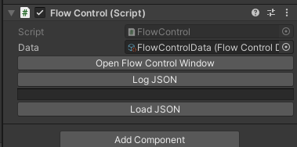
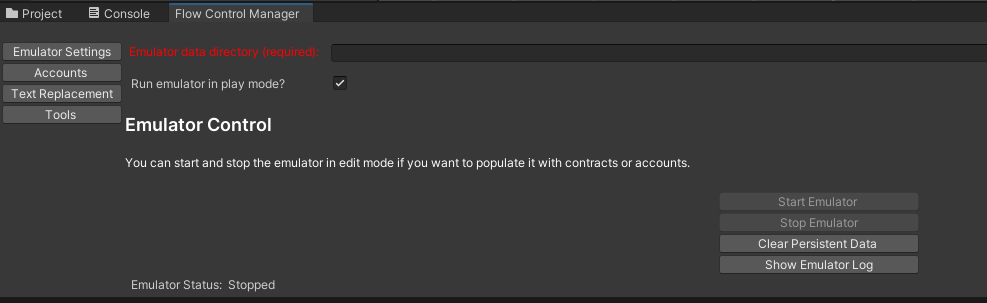

# Sample - FlowSDK Usage Demo

This sample demonstrates how to call each of the APIs within the SDK. It's a simple UI containing input fields and buttons for testing out each API call, and displays information that is returned by the APIs. You will need to set up an emulator with applicable test data to use this sample.

## Importing the Sample

To import the sample, first add the Flow SDK to your project, then follow these steps.

1.  Open Package Manager.
2.  Select the Flow SDK package.
3.  On the right, expand Samples and click Import next to FlowSDK Usage Demo.


This will import the sample into a Samples folder under your Assets:


## Installing the Flow Emulator

To install the Flow emulator, please follow the instructions for your platform here:

[https://developers.flow.com/tools/flow-cli/install](https://developers.flow.com/tools/flow-cli/install)

Note that the Flow CLI and Flow emulator are bundled into the same command-line executable.

To test that the Flow emulator is installed correctly, open a command line interface, type `flow` and press enter. You should see something like this:


## Configuring the Emulator

The directory that you run the emulator from must contain a flow.json file. A default one can be created by running the command `flow init`, but this sample contains a flow.json file which is specific to the sample:


Firstly, open the scene that comes with the sample:


Select the UI Canvas in the hierarchy:


In the inspector, scroll down to the bottom and click "Open Flow Control Window":



The Flow Control Window contains all the editor tools that come with the Flow SDK. It should look like this:



If you see a message asking you to install the Flow emulator, then Unity has not detected your Flow installation. Click the Install button and follow the directions to install the Flow CLI \\ emulator.

To run the emulator, we need to specify which directory to run it from, remembering that it requires a flow.json file. Click the browse button and select the folder in the sample that contains the flow.json file (it should be in **Assets/Samples/Flow SDK/\<version\>/FlowSDK Usage Demo/Scripts/Cadence**):


Click on Start Emulator. The message at the bottom of the window should say **Emulator Status: Running**. Click on Emulator Log. This will open another window showing the output of the emulator:


To test the emulator, open a command line interface and enter the command `flow blocks get latest`. You should see something like this:


The command retrieves information about the latest block on the blockchain. The latest block is currently block height 0, meaning that there is only one block on the blockchain, the root block (hence why Parent ID is null). Now we're going to add some more blocks.

In your file explorer, navigate to the folder that the emulator is running from. Execute the **emulator_test_data** script for your platform (**.bat** for windows, **.sh** for mac/linux). When the script has finished, go back to your command line interface and enter the command `flow blocks get latest` again. Now you should see something like this:


There are now 11 blocks on your blockchain emulator - the latest block is at block height 10 (remember the first one was block height 0). Every block has its own ID and the ID of its parent, the previous block in the chain.

You are now ready to run the sample app.

## Running the FlowSDK Usage Demo

Click the Play button in the editor. You will see the following:


The buttons along the bottom display different tabs which correspond to different API calls within the SDK. The tabs demonstrate the following API calls:

**Blocks**

*GetById*  
*GetByHeight*  
*GetLatest*

**Collections**

*GetById*

**Events**

*GetForBlockHeightRange*  
*GetForBlockIds*

**Scripts**

*ExecuteAtLatestBlock*

**Transactions**

*Submit*  
*GetById*  
*GetResult*

**Accounts**

*GetByAddress*

We will now discuss each of the tests throughout the sample. As you read through each of these, it's recommended to look at the code calling these APIs. All of the code is contained here:


### Blocks

Blocks are the foundation of blockchains, and Flow is no different. A Block primarily consists of two things - Collections and Block Seals. Collections contain Transactions that are yet to be executed, while Block Seals contain the results of Transactions that have been executed and verified, and are ready to be sealed.

**Get Block by ID**

*MainUIController.BlocksGetById()*

Enter a valid Block ID and click the button to retrieve information about the block.

**Get Block by Height**

*MainUIController.BlocksGetByHeight()*

Enter a valid Block Height to retrieve information about the block at that height.

**Get Latest Block**

*MainUIController.BlocksGetLatest()*

Simply click the button to retrieve information about the latest block.

### Collections

A Collection contains a list of Transactions to be executed.

**Get Collection by ID**

*MainUIController.CollectionsGetById()*

Enter a valid Collection ID to retrieve information about the collection.

### Events

Events are defined and emitted in your Smart Contracts. You would emit an event when you want to later query that something has happened.

**Get Events for Height Range**

*MainUIController.EventsGetForHeightRange()*

This will retrieve any events of the given type emitted in a given block height range. Enter the Type, Start Block Height and End Block Height and click the button.

**Get Events for Block Ids**

*MainUIController.EventsGetForBlockIds()*

Similar to the previous API, but instead of providing a block height range, you provide a comma separated list of Block Ids. Any events matching the Type that were emitted in those Block Ids will be returned.

For both of the API calls, the dropdown in the bottom left will populate with a list of blocks. Selecting a block in the list will populate the right-hand side with the event results.

#### Event Types

For both of these API calls, the Event Type is a fully qualified type in the following format:

```
A.{contract address}.{contract name}.{event name}
```

Contract address - the account that the Smart Contract which defines the event is deployed to.   
Contract name - the name of the Smart Contract which defines the event.   
Event name - the name of the event as defined in the Smart Contract.

Here is an example of an Event Type:

```
A.7e60df042a9c0868.FlowToken.TokensInitialized
```

#### Core Events

There are a few core events that are emitted directly by Flow and don't follow the standard naming convention. These event types are:

```
flow.AccountCreated  
flow.AccountKeyAdded  
flow.AccountKeyRemoved  
flow.AccountContractAdded  
flow.AccountContractUpdated  
flow.AccountContractRemoved
```

### Scripts

Scripts are cadence code that you write and are executed on the blockchain. They can contain arguments and return values, and can interact with Smart Contracts. Scripts are read-only - they cannot mutate anything on the blockchain. Anything held in local memory is discarded when the script finishes execution. For more information on programming with Cadence, see [https://developers.flow.com/cadence](https://developers.flow.com/cadence).

**Execute Simple Script At Latest Block**

*MainUIController.ExecuteSimpleScript()*

This executes a very simple script which returns a string message. The message is printed to the UI.

**Execute Script With Args At Latest Block**

*MainUIController.ExecuteScriptWithArgs()*

This demonstrates sending arguments with a simple script. Enter a number in each of the input fields and click the button. The script will add the numbers together and return the result, printing it to the UI.

**Execute Get Tokens At Latest Block**

*MainUIController.ExecuteGetTokens()*

The **emulator_test_data** script that you ran earlier deployed a Smart Contract for fungible tokens called FlowSDKSampleToken. It also created a few accounts and minted some of these tokens into a couple of accounts.

This test demonstrates passing an account address as an argument to a script, which returns a single value - the number of FlowSDKSampleTokens that account has.

In the Flow Control Window, click the Accounts tab. This shows a few accounts which you can get the address of to test the script.


If you would like to see the cadence script itself, it is located here:


**Execute Print NFTs At Latest Block**

*MainUIController.ExecutePrintNfts()*

The **emulator_test_data** script also deployed a contract called FlowSDKSampleNFT, an example implementation of an NFT. It also minted a few of these NFTs and deposited them into a couple of accounts.

This test is similar to the previous one - enter an account address into the input field and click the button to retrieve a list of NFTs that account owns. Instead of returning a single value, the script returns an array of values (NFT Ids).

The cadence script for this test is in the same location as the previous test, called **print-nfts.cdc**.

**Execute Get NFTs For Sale At Latest Block**

*MainUIController.ExecuteGetNftsForSale()*

This script does not have any arguments, but demonstrates returning a complex data structure - an array of structs. The struct, which has multiple properties, is defined in the script itself.

The data being returned is a list of NFTs that are for sale, and contains the Id, price and owner's address for each NFT. Right now it will not return anything, because there are no NFTs for sale. You will need to run the **Submit Transaction List NFT** test in the Transactions tab for this script to display anything.

The cadence script for this test is in the same location as the others, called **get-nfts-for-sale.cdc**.

### Transactions

Like Scripts, Transactions are cadence code that you write and are executed on the blockchain, but that is where the similarities end. The purpose of Transactions is to mutate data on the blockchain. To do this, the Transaction must be signed by the account/s that are going to be affected. The Transaction code can contain arguments, but can't return a value. This is because there is a delay for the Transaction to execute, because it has to go through the collection/consensus/execution/verification cycle.

For more information about Transactions, see [https://developers.flow.com/cadence/language/transactions](https://developers.flow.com/cadence/language/transactions).

For more information about Transaction signing, see [https://developers.flow.com/learn/concepts/transaction-signing](https://developers.flow.com/learn/concepts/transaction-signing).

For more information about Cadence programming, see [https://developers.flow.com/cadence](https://developers.flow.com/cadence).

**Signing In**

To sign transactions, you must sign-in to a wallet provider. This sample uses DevWallet, an example wallet provider specifically made for development. For more information about DevWallet, see [https://developers.flow.com/tools/unity-sdk/dev-wallet](https://developers.flow.com/tools/unity-sdk/dev-wallet).

Click the Sign In button. This will open a dialog asking to select an account to sign in with. The list of accounts is populated from the Accounts tab of the Flow Control Window. Select an account and click Ok. The address of the account you select will show underneath "Signed in as". You can now run the three transaction tests. 

**Submit Transaction**

*MainUIController.SubmitTxSinglePayerProposerAuthorizer()*

This is a very simple Transaction that logs out a message on the blockchain. Simply click the first Submit Transaction button on the left. Successfully submitting a Transaction will return a Transaction Id.

Now go to the Flow Emulator Output and scroll to the bottom. You should see several things - the transaction was submitted, executed, the log message in the cadence code was printed, and a new block was committed.


**Submit Transaction With Args**

*MainUIController.SubmitTxWithArgs()*

This is a very simple Transaction like the previous one which doesn't actually mutate anything, but simply demonstrates passing arguments to the Transaction. Enter a string argument and a number argument, then click the next Submit Transaction button. Like the previous test, the arguments are logged out on the blockchain.


**Submit Transaction List NFT**

*MainUIController.SubmitTxListNft()*

This Transaction demonstrates an actual use case of listing an account's NFT for sale. Enter the NFT Id and price, then click the last Submit Transaction button. To get a list of NFT Ids for a given account, go back to the Scripts tab and run the "Execute Print NFTs At Latest Block" script.

Note: The NFT Price must be a decimal number, eg 23.5 or 12.0

If you'd like to see the cadence code for this Transaction, it's located here:


**Get Transaction By Id**

*MainUIController.GetTransactionById()*

This API call will return all of the information that was submitted with the Transaction. For ease of use, the input field for this is automatically populated with the Transaction Id of the previous Transaction that was submitted. You can of course enter a different valid Transaction Id. Clicking the button will populate all the fields under the Transaction heading.

**Get Transaction Result**

*MainUIController.GetTransactionResult()*

This demonstrates how to retrieve the result of a Transaction. You must supply the Transaction Id using the same input as the previous test. As previously mentioned, the input is automatically populated with the Transaction Id of the last submitted Transaction.

The fields under the Result heading are populated when running this API call. The following information is returned.

Status: Current status of the Transaction. Can be Unknown, Pending, Finalized, Executed, Sealed or Expired.   
Error Message: If there was an error executing the Transaction (eg a cadence runtime error), this will be populated with the error message from the blockchain. When running against an emulator, you will also see the error in the Flow Emulator Output.   
Events: A list of events that were emitted during execution of the Transaction.

### Accounts

**Signing In**

Like the Transactions tab, you must be signed in to a wallet provider to run most of these tests. That's because they are actually transactions, and therefore require signing. If you already signed in on the Transactions tab, you will still be signed in as the same user here. Otherwise, Click Sign In and select an account, then click Ok. 

**Get Account**

*MainUIController.GetAccount()*

Retrieves details about the given account address, including Flow token balance, public keys and any deployed Smart Contracts. This is not a transaction, therefore you do not need to be signed in to run this test. 

**Create Account**

*MainUIController.CreateAccount()*

To create an account on Flow, it needs to be sponsored by another account. Every account on Flow must have a minimum of 0.001 Flow tokens in their balance, so the sponsor must pay this to the new account. To test this, enter a name for the new account, then click Create Account. The account you are signed in as will sign the transaction and pay the 0.001 Flow tokens to the new account. If it fails, ensure the account has enough Flow tokens to execute this transaction and still retain the minimum 0.001 Flow tokens. 

A new public\\private keypair will be generated and assigned to the new account.

Note: the Account Name is not actually stored on the blockchain. It is only used by the SDK.

**Deploy Contract**

*MainUIController.DeployContract()*

This demonstrates deploying a Smart Contract to an account. Enter the name of the contract and the path of its source file, then click Deploy Contract.

Note that the Contract Name must match the name of the contract in the source file.

The Contract Source File location is relative to the project's Assets directory.

**Remove Contract**

*MainUIController.RemoveContract()*

Removes a Smart Contract from an account. Enter the name of the contract then click Remove Contract.

**Update Contract**

*MainUIController.UpdateContract()*

Updates a Smart Contract which is already deployed to the signed-in account. Unlike Deploy Contract, the `init()` function of the contract is not executed. Enter the Contract Name and the path of the updated source file, then click Update Contract.

Note that the Contract Name must match the name of the contract in the source file, and must also match the name of the existing contract deployed to the account.

The Contract Source File location is relative to the project's Assets directory.

Only certain things in a Smart Contract can be modified. See this link about Contract Updatability: [https://developers.flow.com/cadence/language/contract-updatability](https://developers.flow.com/cadence/language/contract-updatability).
