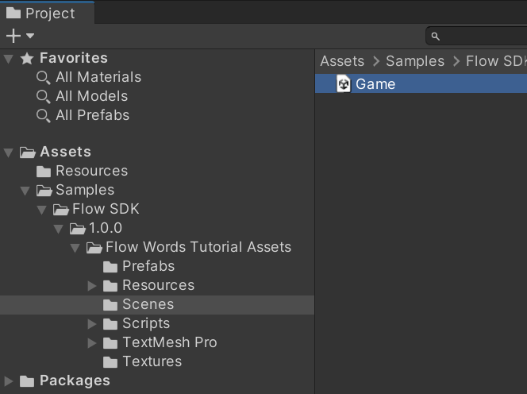
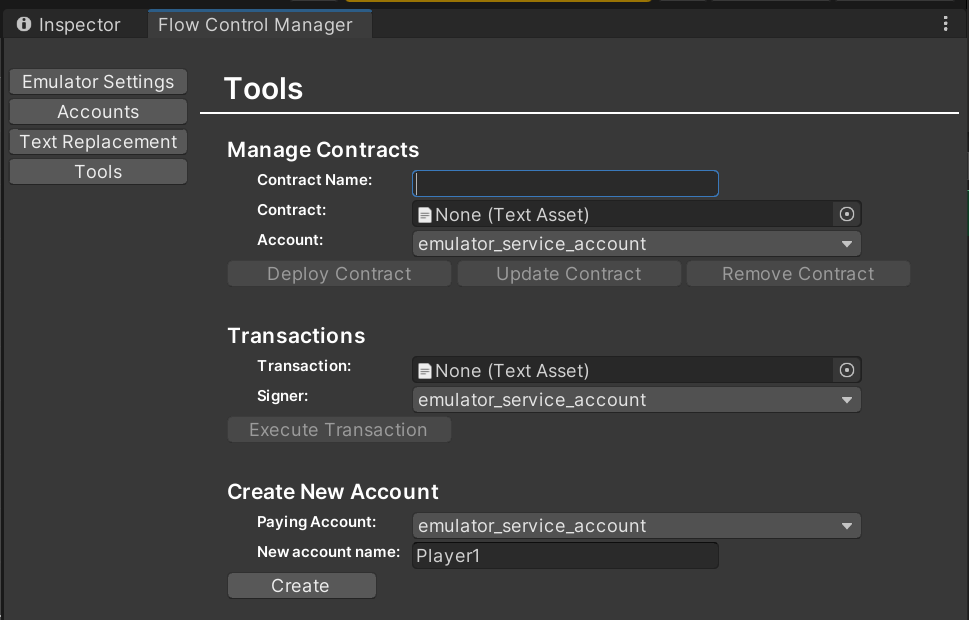
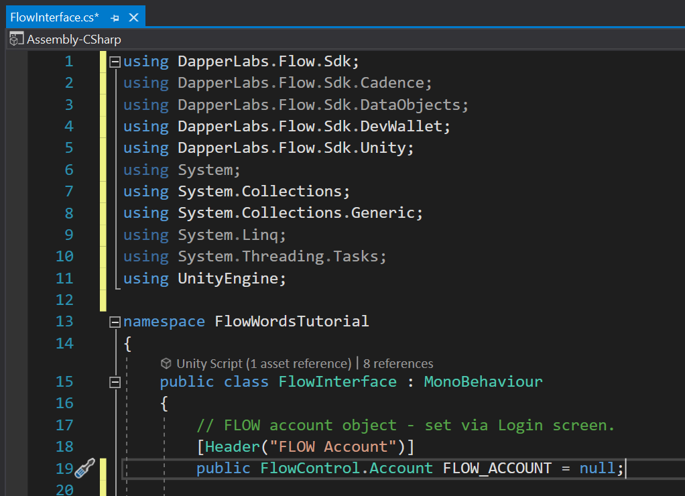
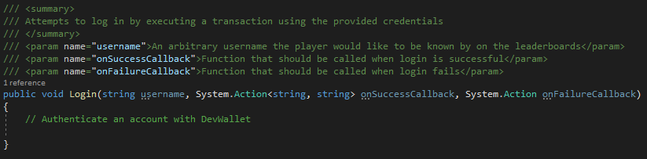
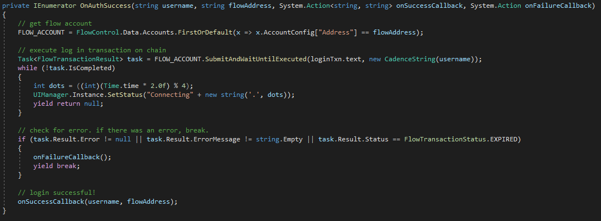
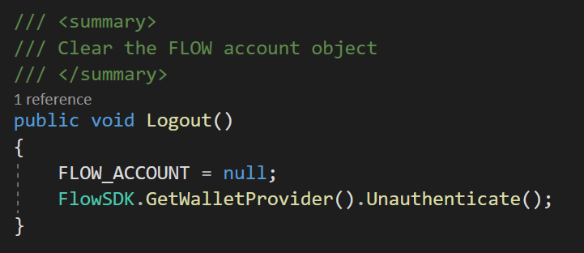
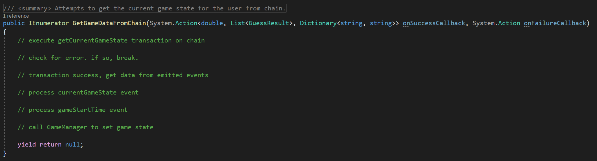
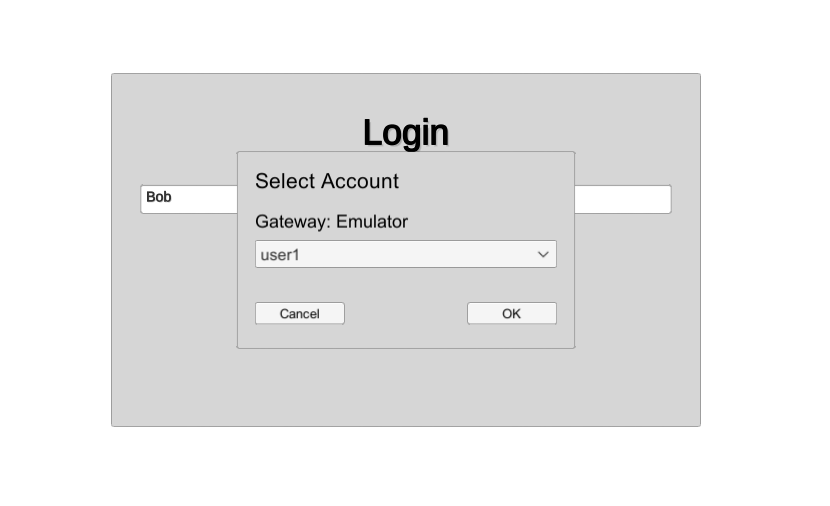

# Tutorial - How to Build FlowWords

## Outline

The FlowWords tutorial example project is the complete FlowWords game, with the FlowSDK and any SDK related code removed.

In this tutorial, you will learn how to;

1.  Configure the FlowSDK and local emulator for use with Unity
2.  Deploy contracts, create Accounts and run Transactions on the Flow emulator from within Unity.
3.  Incorporate Flow Accounts, Transactions and Scripts into Unity projects using Code

## Requirements

FlowWords Tutorial has been tested on Unity version 2021.3.6f1

This tutorial assumes you have created a blank project, and installed the FlowSDK package from the Unity Asset Store, and FlowWords Tutorial Sample.

## Step 1 – Configure the FlowSDK and local emulator

1.  Open the scene at Assets\\Samples\\Flow SDK\\&lt;version&gt;\\Flow Words Tutorial Assets\\Scenes\\Game.unity

    

2.  Open the Flow Control Manager window, at Window-\>Flow-\>Flow Control.  
    This will create a Flow Control GameObject in the Game scene, and a FlowControlData asset in the Resources folder if they do not already exist.

    

3.  Go to the Emulator Settings tab. If the manager states the Flow Executable cannot be found, use the Install button provided and follow the instructions to install the Flow CLI.  
    Note: If Unity still does not detect the emulator after installing the Flow CLI, you may need to restart your computer for the install to take effect.
4.  Set a directory for our Emulator data to reside in. This is where the emulator stores the state of the emulated Flow blockchain.  
    For the purposes of this tutorial, we will create a new folder called FlowEmulator inside our project folder.

    

5.  Click Start Emulator to start the emulator and create the emulator_service_account, and ensure “Run emulator in play mode” is checked.

    

    NOTE: If this is the first time you have run the emulator on Windows, you may be presented with a dialog to allow access through your firewall. This is safe to allow.  
	
6.  Go to the Accounts tab and verify that the service account has been created.  
    This is the account we will use to create more accounts, and deploy our game contract on to the emulator.

    

7.  Back on the Emulator Settings tab, you can click Show Emulator Log, to view the output.

    

## Step 2 – Deploy Contracts, create Accounts and run Transactions

We have provided you with the FlowWords game contract, but before we can interact with the contract, we have to deploy it to the blockchain.

We also have to set up some text replacements as, once deployed, our scripts will require hardcoded references to the contract name and deployed address.

### Set up Text Replacements

Text replacements allow us to set and update references across all of our local Cadence scripts, without having to update each file individually.

1.  Open the Flow Control Manager window, and navigate to the Text Replacements tab.
2.  Set up the text replacements as follows. You can add text replacements by clicking the ‘+’ button at the top of the panel.

    

    The anatomy of a text replacement is as follows;  
    **Description**: A friendly description, has no bearing on functionality.  
    **Original Text**: The original text, in your script files, which you want to replace.  
    **Replacement Text**: The text that you wish to replace the original text with. This is what gets submitted to the chain.  
    **Active**: This checkbox enables or disables the text replacement.  
    **Apply to Accounts**: Select which, if any, accounts this text replacement should apply to.  
    **Apply to Gateways**: Select which, if any, gateways (such as Emulator, or TestNet) this replacement should apply to.

### Create User Accounts

While it would be perfectly possible to play our game with the emulator service account, we will often want to test our contracts with multiple different user accounts.

To create a new user account;

1.  Open the Flow Control Manager window, and navigate to the Tools tab.
2.  In the Create New Account section;

    

    1.  Select the paying account. This will usually be the emulator_service_account
    2.  Enter a friendly name for the new account. This is just for your own reference and does not get written to the chain.
    3.  Click Create
3.  If successful, the new account will appear under the Flow Control Manager Accounts tab.

    

### Deploy the Contract

Before anyone can interact with a contract, it must be deployed to the blockchain.

We are going to deploy our game contract to the emulator, for local testing. But for deploying to Testnet, or Mainnet follow the same process.

1.  Go to the Emulator Settings tab, in the Flow Control Manager, and Start the Emulator if it is not already running.
2.  Go to the Tools tab. In the Manage Contracts section, enter the contract name of ‘FlowWords’ – this should match our CONTRACT_NAME text replacement precisely.
3.  Populate the Contract field with game-contract.cdc, which can be found in Resources/contracts
      
    
	
4.  Finally, ensure that the Account field contains emulator_service_account, and click the Deploy Contract button.

    

5.  To check if the contract has deployed successfully, open the Flow Emulator Output window. Successful deployment will look as follows;

    

### Submit Transactions

For administration purposes, it is sometimes useful to be able to directly submit transactions to the chain.

We can use a transaction to check out text replacements are set up correctly, and our game contract has successfully deployed.

1.  In Flow Control Manager, navigate to tools.
2.  In the Transactions section;

    

    1.  Populate the Transaction field with check-contract-deployed.cdc, located in Resources/transactions
	          
        
		
    2.  Set the Signer field to the new Account we just created earlier. ‘Player1’
    3.  Click Execute Transaction
3.  If you have successfully configured the SDK and deployed the game contract, you will see the following message;

    

## Step 3 – Incorporate Flow Accounts, Transactions and Scripts into Code

We have our SDK and emulator configured, and our game contract deployed.  
Now we are going to create the code which will allow our game to send and receive data from the blockchain.

Our FlowWords tutorial project contains a script called FlowInterface.cs, which can be found in the Scripts folder. This script contains all of our blockchain interfacing functions, which are called from GameManager.cs and UIManager.cs.

Our game FlowInterface has 5 main functions:

-   Login
-   Logout
-   GetGameDataFromChain
-   SubmitGuess
-   LoadHighScoresFromChain

Our functions are going to need to access a number of cadence scripts and transactions.  
These have been provided for you, and can be found in the Resources\\scripts folder and Resources\\transactions folder.


FlowInterface.cs has a number of Serialized TextAsset fields, which can be populated via the Unity inspector. Select the GameFlowInterface gameobject in the Game.unity scene, and populate the fields as follows, using the scripts and transactions in the aforementioned folders; (you may find these have already been populated for you)


### Login

The Login function’s role is to take the credentials entered by the user, create a FlowControl.Account object with which we can submit transactions to the chain, and run the login.cdc transaction.

We first need to declare our FlowControl.Account object.  
At the top of the file, add the following using statements to grant us easy access to the Flow SDK structures.

```cs
using DapperLabs.Flow.Sdk;
using DapperLabs.Flow.Sdk.Cadence;
using DapperLabs.Flow.Sdk.DataObjects;
using DapperLabs.Flow.Sdk.DevWallet;
using DapperLabs.Flow.Sdk.Unity;
```

Then declare our Flow account object on line 19. This will hold the credentials of the currently logged in player for use by all of our FlowInterface functons.

```cs
public FlowControl.Account FLOW_ACCOUNT = null;
```

Your file should now look like this:



We now have to register a wallet provider with the Flow SDK. We are going to use DevWallet, which comes with the Flow SDK, and is only intended for development purposes on emulator and testnet. Add the following to the `Start` function:

```cs
// Register DevWallet
FlowSDK.RegisterWalletProvider(ScriptableObject.CreateInstance<DevWalletProvider>());
```
Your Start function should now look like this:


> **NOTE:** Do not use DevWallet in production builds. It is only intended for development purposes and is NOT secure.  

Next, we will fill out the body of the Login function.



First, we have to invoke the wallet provider to authenticate the user and get their flow address. Add the following code to the Login function;

```cs
// Authenticate an account with DevWallet
FlowSDK.GetWalletProvider().Authenticate(
    "", // blank string will show list of accounts from Accounts tab of Flow Control Window
    (string flowAddress) => StartCoroutine(OnAuthSuccess(username, flowAddress, onSuccessCallback, onFailureCallback)), 
    onFailureCallback);
```

The Authenticate function takes parameters as follows;

-	The first parameter is a username which corresponds to the name of an account in the Accounts tab. If you leave this string blank (as above), a dialog will be shown to the user to select an account from the Accounts tab. 
-	The second parameter is a success callback for `Authenticate()`. We pass in a lambda function which starts a coroutine to run our async function `OnAuthSuccess`. This takes the flow address that we got from `Authenticate()`, as well as a few other parameters. 
-	The third parameter is a callback for if `Authenticate()` fails. We pass through the fail callback that was passed to Login. 

Your completed Login function should look as follows; 


Now we need to implement the `OnAuthSuccess` function for when we successfully authenticate our user and get their flow address. 


To sign transactions we need to assign a FlowControl.Account object, which we get from FlowControl using the flow address that the wallet provider's `Authenticate` gave us. 
With this information, we can now easily sign any transaction we like for the account in question.

```cs
// get FLOW account from address
FLOW_ACCOUNT = FlowControl.Data.Accounts.FirstOrDefault(x => x.AccountConfig["Address"] == flowAddress);
```

> **WARNING:** Having the Address and Private Keys to a blockchain account gives your application full access to all of that account’s funds and storage. They should be treated with extreme care.

Now that we have an Account object, we can use it to Submit our login.cdc transaction.  
Add the following code beneath the Flow Account object creation code;

```cs
// execute log in transaction on chain
Task<FlowTransactionResult> task = FLOW_ACCOUNT.SubmitAndWaitUntilExecuted(loginTxn.text, new CadenceString(username));
while (!task.IsCompleted)
{
    int dots = ((int)(Time.time * 2.0f) % 4);
    UIManager.Instance.SetStatus("Connecting" + new string('.', dots));
    yield return null;
}
```

Because transactions can take quite some time on chain, we create an asynchronous Task by calling SubmitAndWaitUntilExecuted on our newly created Flow Account object, to prevent blocking the main game thread.

Into SubmitAndWaitUntilExecuted, we pass the script that we want to execute, and any parameters.  
For our script, we refer to the serialized TextAsset field, loginTxn, to which we will assign login.cdc in the inspector.  
For parameters, the login.cdc script is expecting a single String parameter with the player’s display name in it. We pass in a new CadenceString object, which we create inline from the encapsulating function’s username string parameter.

Next, we simply wait until our asynchronous task.IsCompleted.  
While we wait, we update the UI with a simple animated ‘Connecting…’ text status, and yield to the Unity engine to prevent blocking the thread.

Once our transaction has completed, we want to check if it was successful on chain. Add the following code beneath the transaction submission code;

```cs
// check for error. if there was an error, break.
if (task.Result.Error != null || task.Result.ErrorMessage != string.Empty || task.Result.Status == FlowTransactionStatus.EXPIRED)
{
    onFailureCallback();
    yield break;
}
```

Here we must check the transaction Result for three conditions:

-   Error: Was there an error submitting the transaction to the blockchain?
-   ErrorMessage: Was there an error during processing on the blockchain?
-   Status: A status of EXPIRED means that the transaction did not execute on time and was discarded.

Any error here, and we are simply going to fail the login, and call our onFailureCallback.

Next, we process the result of our transaction.  
In this case, if there was no error, then we have achieved our goals.  
We have verified that the user owns the account, by virtue of them successfully signing a transaction, and we have, during the course of that transaction, created game related resources where required.

Add the following code to the bottom of the login function to call the onSuccess callback.

```cs
// login successful!
onSuccessCallback(username, flowAddress);
```

You may also remove the final `yield return null` if you wish.

Your entire OnAuthSuccess function should now look as follows;



### Logout

The Logout function’s role is to clear the FlowControl.Account object, to prevent any more transactions from being executed with those account credentials.

The Logout function is very simple. Simply add the following line;

```cs
FLOW_ACCOUNT = null;
FlowSDK.GetWalletProvider().Unauthenticate();
```

This clears the FlowAccount object, preventing any more transactions from being submitted with it, and unauthenticates the user from the wallet provider. 

Your completed Logout function should now look like this;



### GetGameDataFromChain

This function executes the get-current-gamestate.cdc transaction on the chain, and then processes the emitted events to get the CurrentGameState for the logged in account, and current GameStartTime for the game of the day, which we use to show time remaining.



As per the Login function, we are going to submit our transaction to chain using SubmitAndWaitUntilExecuted, and wait until our async Task is complete.  
Add the following code to the GetGameDataFromChain function;

```cs
// execute getCurrentGameState transaction on chain
Task<FlowTransactionResult> getStateTask = FLOW_ACCOUNT.SubmitAndWaitUntilExecuted(getCurrentGameStateTxn.text);
while (!getStateTask.IsCompleted)
{
    int dots = ((int)(Time.time * 2.0f) % 4);
    UIManager.Instance.SetStatus("Loading" + new string('.', dots));
    yield return null;
}

// check for error. if so, break.
if (getStateTask.Result.Error != null || getStateTask.Result.ErrorMessage != string.Empty || getStateTask.Result.Status == FlowTransactionStatus.EXPIRED)
{
    onFailureCallback();
    yield break;
}
```

This time, we are passing in the transaction referenced in the serialized TextAsset field getCurrentGameStateTxn, which we populated in the inspector with get-current-gamestate.cdc.  
This transaction requires no parameters, so we can simply exclude them.

This transaction is designed to return the game state for the user, and the time remaining on the word of the day, via emitted events.  
We can access these emitted events via the .Result.Events property on our task.  
To do so, add the following code below our submission logic;

```cs
// transaction success, get data from emitted events
List<FlowEvent> events = getStateTask.Result.Events;
FlowEvent currentStateEvent = events.Find(x => x.Type.EndsWith(".CurrentState"));
FlowEvent startTimeEvent = events.Find(x => x.Type.EndsWith(".LastGameStart"));

if (currentStateEvent == null || startTimeEvent == null)
{
    onFailureCallback();
    yield break;
}
```

This chunk accesses the returned Events list, and attempts to find events ending with “.CurrentState” and “.LastGameStart”. We use .EndsWith, as the transaction returns fully qualified event names, and the name of the deployed contract may change during development.  
Finally, we check that we do indeed have both of our required events, and if not, call the onFailure callback and break.

Next, we will parse the contents of each event. Add the following code to the function;

```cs
// process current game state event
// access event payload
CadenceComposite statePayload = currentStateEvent.Payload as CadenceComposite;
CadenceBase[] priorGuessResults = statePayload.CompositeFieldAs<CadenceArray>("currentState").Value;

// iterate over prior guess results in payload, add to results list, and populate letter statuses
List<GuessResult> results = new List<GuessResult>();
Dictionary<string, string> letterStatuses = new Dictionary<string, string>();
foreach (CadenceBase result in priorGuessResults)
{
    // add guess result to output
    GuessResult newResult = new GuessResult
    {
        word = (result as CadenceComposite).CompositeFieldAs<CadenceString>("Guess").Value.ToUpper(),
        colorMap = (result as CadenceComposite).CompositeFieldAs<CadenceString>("Result").Value
    };
    results.Add(newResult);

    // add letters to lettermap
    for (int i = 0; i < 5; i++)
    {
        bool letterAlreadyExists = letterStatuses.ContainsKey(newResult.word[i].ToString());
        string currentStatus = letterAlreadyExists ? letterStatuses[newResult.word[i].ToString()] : "";
        switch (currentStatus)
        {
            case "":
                letterStatuses[newResult.word[i].ToString()] = newResult.colorMap[i].ToString();
                break;
            case "p":
                break;
            case "w":
                if (newResult.colorMap[i] == 'p')
                {
                    letterStatuses[newResult.word[i].ToString()] = newResult.colorMap[i].ToString();
                }
                break;
            case "n":
                if (newResult.colorMap[i] == 'p' || newResult.colorMap[i] == 'w')
                {
                    letterStatuses[newResult.word[i].ToString()] = newResult.colorMap[i].ToString();
                }
                break;
        }
    }
}

// get game start time event
double gameStartTime = 0;
CadenceComposite timePayload = startTimeEvent.Payload as CadenceComposite;
CadenceNumber startTime = timePayload.CompositeFieldAs<CadenceNumber>("startTime");
gameStartTime = double.Parse(startTime.Value);
```

For the currentGameState event, we know that we are going to receive an Event object, containing an array of UserGuesses, which each contain two String objects.


Since Events are of the CadenceComposite type, we get the currentStateEvent.Payload, as CadenceComposite.

Now that we have the event structure, we can get the UserGuesses array, by calling CompositeFieldAs\<CadenceArray\>(“currentState”) on our event structure object.


This function retrieves the field “currentState”, which we can see in the event declaration above, and casts it to the CadenceArray type for us.  
We access the Value property of this, and assign it to CadenceBase[] priorGuessResults for easy iteration.

Next, we iterate over out priorGuessResults array.


Currently, the array elements are of type CadenceBase, but we know from our game contract that they are a struct, which is a CadenceComposite type, so for each iteration, we cast the element to CadenceComposite, and then once again use CompositeFieldAs\<CadenceString\> to access both the “Guess” and “Result” member strings from the struct, and store them in our own local result list.

The GameStartTime event is simpler.


This event contains a single variable of type UFix64, an unsigned 64 bit fixed point number. This is the standard data format on the Flow blockchain to store timestamps.


As with the guess results, we first cast our event payload to the CadenceComposite type, and then we simply get the startTime parameter using CompositeFieldAs\<CadenceNumber\>(“startTime”).  
CadenceNumber encompasses all numerical data types on chain. The value is stored as a string, and so we use double.Parse to convert this back to a number for our own use. Double being the closest data type to UFix64 supported in C\# natively, and close enough for our use case.

Finally, we call our onSuccess callback to return our results to our caller.  
Add the following lines to the bottom of the function;

```cs
// call GameManager to set game state
onSuccessCallback(gameStartTime, results, letterStatuses);
```

Your completed function should now look like this;


### SubmitGuess

This function has two phases. First, it checks that the entered word is valid by submitting the check-word.cdc script to chain, and processing the returned value.

If the word is deemed valid, it then submits the word guess to the game contract using the currently logged in user’s credentials, by executing the submit-guess.cdc transaction script on chain, and then processing the emitted events.

For phase one, enter the following code at the top of the SubmitGuess function;

```cs
// submit word via checkWord script to FLOW chain to check if word is valid
Task<FlowScriptResponse> checkWordTask = FLOW_ACCOUNT.ExecuteScript(checkWordScript.text, new CadenceString(word.ToLower()));

while (!checkWordTask.IsCompleted)
{
    int dots = ((int)(Time.time * 2.0f) % 4);
    UIManager.Instance.SetStatus("Waiting for server" + new string('.', dots));
    yield return null;
}

if (checkWordTask.Result.Error != null)
{
    onFailureCallback();
    UIManager.Instance.SetStatus("Error checking word validity.");
    yield break;
}

bool wordValid = ((checkWordTask.Result.Value as CadenceString).Value == "OK");
if (wordValid == false)
{
    onFailureCallback();
    yield break;
}
```

This code starts by calling ExecuteScript, passing in the checkWordScript and our guess word as a CadenceString object, to create an async Task using our Flow Account object.

Scripts on Cadence can be thought of as read-only transactions, which are performed very quickly.  
Since scripts are read only, they do not require signing, and are best to use when you need to quickly get publicly available data from chain.

As with our previous transactions, we then wait until our task.IsCompleted, and then check for any errors in the result. With scripts we only have to check the Result.Error, as this catches all possible failure modes.

We then process the return value of the script, which can be found in the Result.Value property on our completed task object. Scripts do not emit events like transactions, but have return values like a regular function.  
The return value is of the generic base type CadenceBase, which we cast to CadenceString, as we are expecting a string type return value.

If the word guess is deemed to be invalid we call the onFailure callback and break, otherwise we proceed onto the guess submission phase.

For the second phase of the function, add the following code below phase one;

```cs
// word is valid, submit guess via transaction to FLOW chain
Task<FlowTransactionResult> submitGuessTask = FLOW_ACCOUNT.SubmitAndWaitUntilExecuted(submitGuessTxn.text, new CadenceString(word.ToLower()));

while (!submitGuessTask.IsCompleted)
{
    int dots = ((int)(Time.time * 2.0f) % 4);
    UIManager.Instance.SetStatus("Waiting for server" + new string('.', dots));
    yield return null;
}

if (submitGuessTask.Result.Error != null || submitGuessTask.Result.ErrorMessage != string.Empty || submitGuessTask.Result.Status == FlowTransactionStatus.EXPIRED)
{
    onFailureCallback();
    yield break;
}

// get wordscore
string wordScore = "";
FlowEvent ourEvent = submitGuessTask.Result.Events.Find(x => x.Type.EndsWith(".GuessResult"));
if (ourEvent != null)
{
    CadenceComposite payload = ourEvent.Payload as CadenceComposite;
    wordScore = payload.CompositeFieldAs<CadenceString>("result").Value;

    // check if we are out of guesses
    if (wordScore == "OutOfGuesses")
    {
        onFailureCallback();
        UIManager.Instance.SetStatus("Out Of Guesses. Try again tomorrow.");
        yield break;
    }

    // process result
    onSuccessCallback(word, wordScore);
}
else
{
    onFailureCallback();
}
```

This phase begins by submitting the submit-guess.cdc transaction, passing in our guess word as a new CadenceString parameter. We then wait for the task to complete as usual, and check for any errors.  
As this is a transaction, we once again check the three possible failure modes, and call the onFailure callback if the transaction failed.

Next we parse our transaction’s emitted events.


We are expecting an event called GuessResult, with a single string parameter called result.


We first find our event in the Result.Events list on our task object.  
If our event is found, we then cast the event.Payload to our CadenceComposite type, as Events are composite types, and then call CompositeFieldAs\<CadenceString\>(“result”) on our cast payload, to retrieve our string ‘result’ field. We then pass the guess word, and the result back to our caller via the onSuccess callback.

If the GuessResult event cannot be found in the Result.Events list, we call the onFailure callback.

Once complete, your SubmitGuess function should look like this;


### LoadHighScoresFromChain

This function fires off a number of small scripts simultaneously, which pull publicly available high score data from the game contract on chain using;

-   get-highscores.cdc
-   get-player-cumulativescore.cdc
-   get-player-guess-distribution.cdc
-   get-player-maxstreak.cdc
-   get-player-scores.cdc
-   get-player-streak.cdc.

It then processes their returned values, and passes them out to the onSuccess call for the high scores UI to render.

For this function, we are going to first fire off a number of simultaneous scripts on the blockchain. This is something you want to avoid with transactions, as transaction order of execution cannot be guaranteed due to the distributed nature of blockchain, however as scripts are read-only, and do not mutate the chain, order of execution is far less likely to matter.

To execute the scripts, add the following code to the top of the function;

```cs
// execute scripts to get highscore data
Dictionary<string, Task<FlowScriptResponse>> tasks = new Dictionary<string, Task<FlowScriptResponse>>();
tasks.Add("GetHighScores",              FLOW_ACCOUNT.ExecuteScript(GetHighScores.text));
tasks.Add("GetPlayerCumulativeScore",   FLOW_ACCOUNT.ExecuteScript(GetPlayerCumulativeScore.text, new CadenceAddress(FLOW_ACCOUNT.AccountConfig["Address"])));
tasks.Add("GetPlayerWinningStreak",     FLOW_ACCOUNT.ExecuteScript(GetPlayerWinningStreak.text, new CadenceAddress(FLOW_ACCOUNT.AccountConfig["Address"])));
tasks.Add("GetPlayerMaxWinningStreak",  FLOW_ACCOUNT.ExecuteScript(GetPlayerMaxWinningStreak.text, new CadenceAddress(FLOW_ACCOUNT.AccountConfig["Address"])));
tasks.Add("GetGuessDistribution",       FLOW_ACCOUNT.ExecuteScript(GetGuessDistribution.text, new CadenceAddress(FLOW_ACCOUNT.AccountConfig["Address"])));

// wait for completion
bool complete = false;
while (!complete)
{
    complete = true;
    foreach (KeyValuePair<string, Task<FlowScriptResponse>> task in tasks)
    {
        complete = complete && task.Value.IsCompleted;
    }
    yield return null;
}

// check for errors
foreach (KeyValuePair<string, Task<FlowScriptResponse>> task in tasks)
{
    if (task.Value.Result.Error != null)
    {
        onFailureCallback();
        yield break;
    }
}
```

This block of code creates a Dictionary\<string, Task\> to store our concurrent script tasks.  
We then sequentially create async Tasks for each script that we want to execute, using ExecuteScript, and add them to the Task dictionary.

In our use case, we want all of the tasks to complete before we display any results, so our wait for completion code block iterates over every Task in the dictionary, and only moves on once every task.IsComplete.

Checking for errors is similarly done using a foreach loop, where every task is checked to ensure the Error field is null. If even one task has an Error, we call the onFailure callback and break.

Next we need to process the returned values. Add the following code beneath the previous;

```cs
// load global highscores
CadenceBase[] highscores = (tasks["GetHighScores"].Result.Value as CadenceArray).Value;
List<ScoreStruct> GlobalScores = new List<ScoreStruct>();
foreach (CadenceComposite score in highscores)
{
    ScoreStruct parsedScore = new ScoreStruct("", 0);
    foreach (CadenceCompositeField field in score.Value.Fields)
    {
        switch (field.Name)
        {
            case "Name":
                parsedScore.Name = (field.Value as CadenceString).Value;
                break;
            case "Score":
                parsedScore.Score = int.Parse((field.Value as CadenceNumber).Value);
                break;
        }
    }

    GlobalScores.Add(parsedScore);
}
GlobalScores = GlobalScores.OrderByDescending(score => score.Score).Take(10).ToList();

// load player scores
uint PlayerCumulativeScore = uint.Parse((tasks["GetPlayerCumulativeScore"].Result.Value as CadenceNumber).Value);
uint PlayerWinningStreak = uint.Parse((tasks["GetPlayerWinningStreak"].Result.Value as CadenceNumber).Value);
uint PlayerMaximumWinningStreak = uint.Parse((tasks["GetPlayerMaxWinningStreak"].Result.Value as CadenceNumber).Value);
uint[] PlayerGuessDistribution = (tasks["GetGuessDistribution"].Result.Value as CadenceArray).Value.Select(value => uint.Parse((value as CadenceNumber).Value)).ToArray();

// callback
onSuccessCallback(GlobalScores, PlayerCumulativeScore, PlayerWinningStreak, PlayerMaximumWinningStreak, PlayerGuessDistribution);
```

Our global highscores are an array of Scores objects.


As such, we cast the Result.Value (return value) of our GetHighScores task to a CadenceArray object, and store the .Value of this in CadenceBase[] highscores.

We iterate over this highscores array, and cast each Scores struct element to a CadenceComposite object. We then iterate over each field in the CadenceComposite object, and assign the .Value of each to our own local ScoreStruct object, which we then add to a GlobalScores list for later display.

Next, we parse the detailed statistics for the current player.  
Each of these results are a simple cast of the Result.Value to a CadenceNumber, which we then parse to an unsigned integer. The final statistic follows the same idea, but uses some LINQ trickery to process all of the elements of a CadenceArray in a single line.

Finally, we call the onSuccess callback, passing in all of our parsed results.  
You may also remove the final `yield return null` statement at this point, if you wish.

Once complete, your function should look as follows;


## Step 5 – Play FlowWords!

If you have correctly followed all of the steps above, you will now have a working project.

1.  Return to the Unity editor, and press the Play button.
2.  Enter a friendly name - this will appear on the leaderboard. 
3.  Click Log In. 
4.  Select an account from the dialog that appears to authenticate with. 

You should see the login screen, say Connecting…, and then Loading…



Followed shortly thereafter by the game screen;


And the High Scores screen (if you click the button);


## Step 6 – Further Experimentation

For an extra challenge, try some of the following;

-   Add more accounts and play with some friends, hot seat style
-   Modify the game-contract.cdc to make a new game every 5 minutes instead of every 24 hours.
-   Try to remove and redeploy the contract  
    (hint: once removed, a contract’s name can never be used again on the same account)  
    (extra hint: delete-game-resources.cdc)
-   Poke about in the game contracts, scripts and transactions to see what they do!

If you ever get the emulator into a messy state, you can always hit the Clear Persistent Data button, which will wipe the emulator back to its blank state. This will of course lose all deployed contracts and high score and game history.
