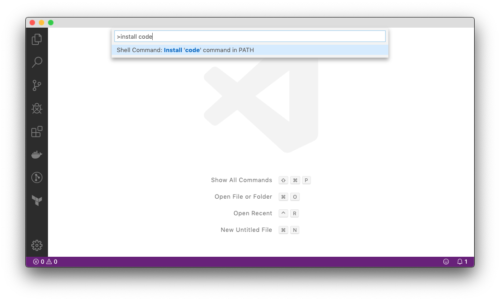
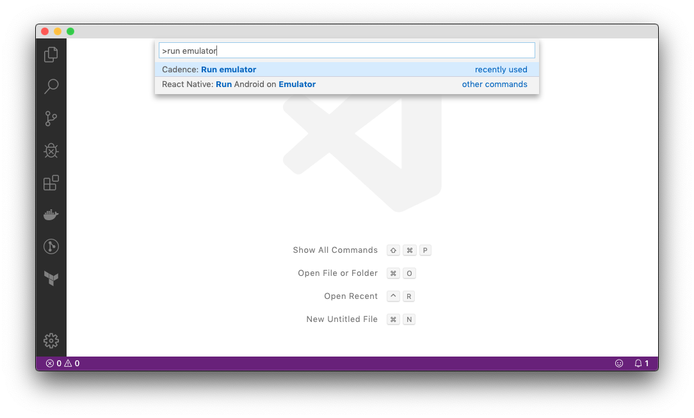
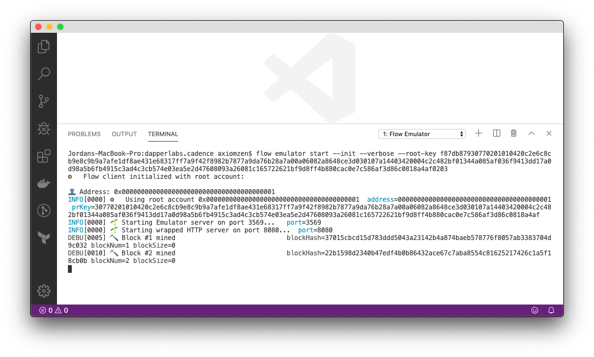
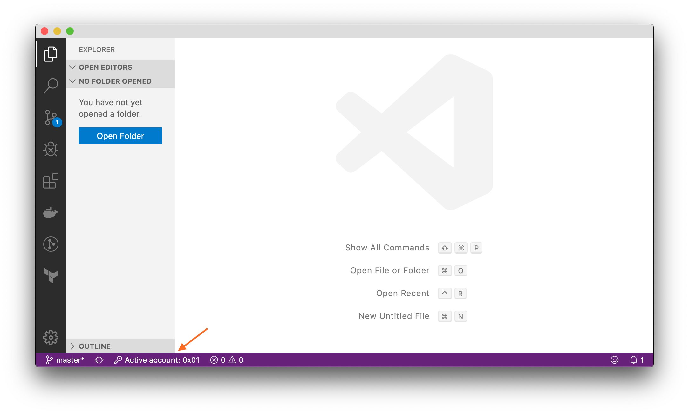
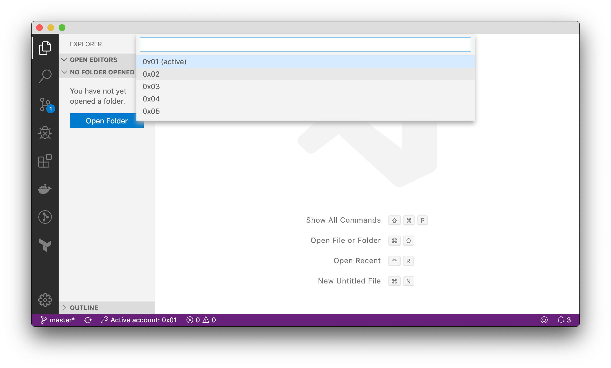
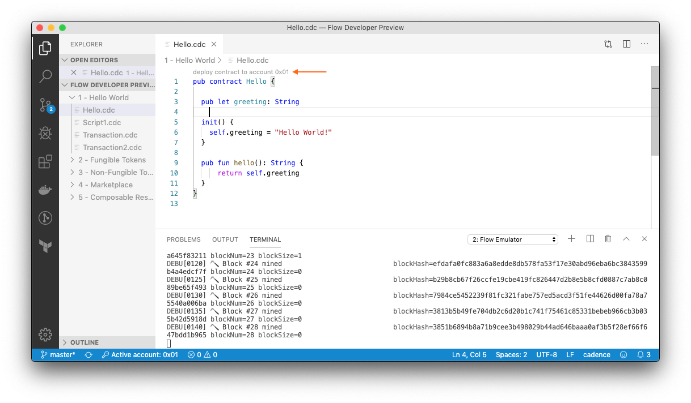
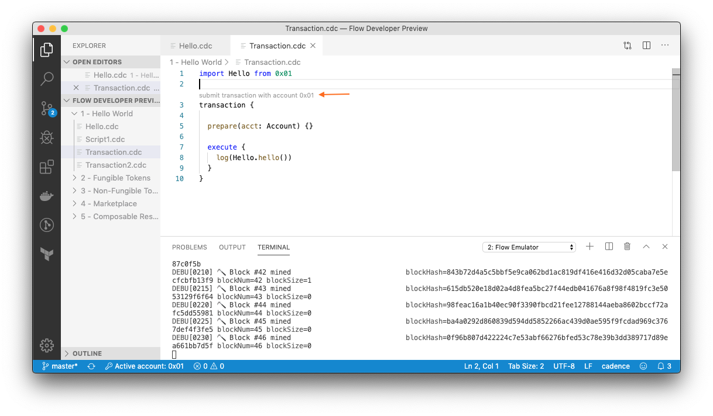

# Cadence Visual Studio Code Extension

> Version 0.4.0

To install the Visual Studio Code extension for Cadence,
you first need to [install Visual Studio Code](https://code.visualstudio.com/Download).

Once installed, open Visual Studio Code, open the command palette
(press `Shift+Command+P` on macOS and `Shift+Ctrl+P` on Linux/Windows),
then search for `Install code command` and press enter.




## Installing the extension using the Flow CLI

The Visual Studio Code extension is bundled with the [Flow CLI](cli.md),
a command-line interface for working with Flow.

To install the extension, run the following command in a terminal on macOS/Linux,
or in PowerShell on Windows:

```sh
flow cadence install-vscode-extension
```

Restart Visual Studio Code to complete the installation of the extension.

## Running the Emulator

The emulator can be run directly from Visual Studio Code.

To do so, open the command palette
(press `Shift+Command+P` on macOS and `Shift+Ctrl+P` on Linux/Windows),
and search for `Run emulator`.



This will open a new terminal and start an emulated version of the Flow blockchain.



Alternatively the emulator can also be run on the command line.

In a terminal on macOS/Linux, or in PowerShell on Windows, run:

```sh
flow emulator start --init
```

Once the emulator is running, you can start deploying code and submitting transactions.

## Active Account

When the emulator is running in VSCode, the active account is shown in the bottom right corner of the editor. This indicate which account contracts will be deployed to and which account is the signer for submitted transactions.



## Changing Accounts

To change accounts, click on the active account button on the bottom right of the screen. This will bring up a list of accounts to choose from. Click on one of the accounts, and that account will be selected as the active account.



You can also add a new account by opening up the command palette (press `Shift+Command+P` on macOS and `Shift+Ctrl+P` on Linux/Windows), and selecting `Create Account`.

## Deploying Contracts

When the emulator is running, you can deploy contracts to the active account. You should see a button appear above the definition for a contract in the editor that says, `Deploy contract to account 0x01`. Click that button to deploy the contract. This will overwrite any previous contract that had been deployed to the account.



## Submitting Transactions and Scripts

In the vscode extension, submitting transactions and scripts is similar to deploying contracts. When writing a transaction or script, you should see a button appear at the top of your definition prompting you to submit it. Click the button to send it, using the active account as the signer.



# Changelog

## Version 0.4.0
- Upgraded Cadence Language Server to [v0.4.0](https://github.com/onflow/cadence/releases/tag/v0.4.0)
- Upgraded Flow Emulator to [v0.4.0](https://github.com/onflow/flow/blob/master/docs/emulator.md#version-040)
- Changed from sequential (e.g. 0x01, 0x02, etc) to linear code address generation 


### ⚙️ Installing & Upgrading

Please re-run the following command to upgrade your existing VS Code extension:

```sh
flow cadence install-vscode-extension
```
