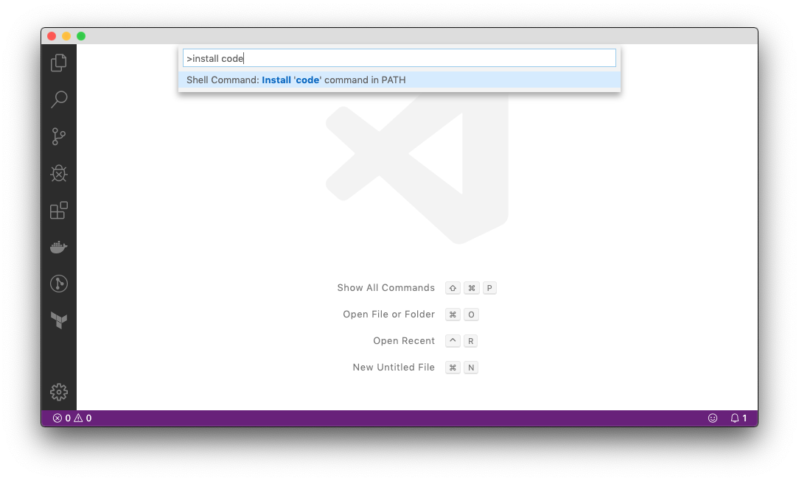
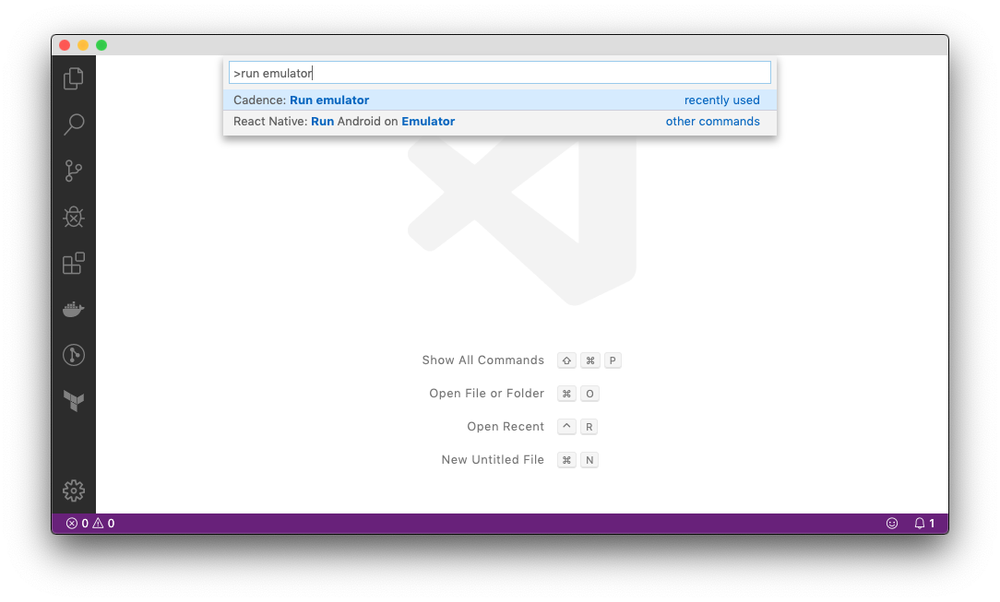
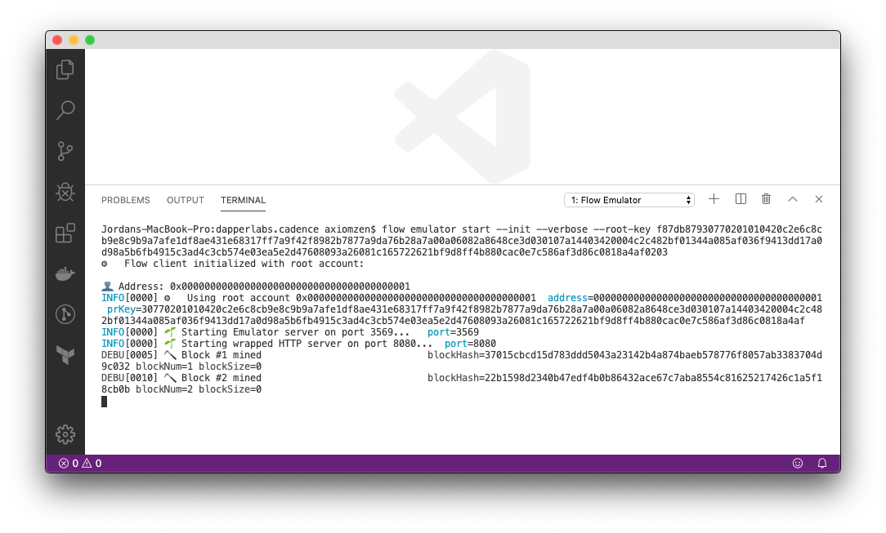

# Visual Studio Code Extension

To install the Visual Studio Code extension for Cadence,
you first need to [install Visual Studio Code](https://code.visualstudio.com/Download).

Once installed, open Visual Studio Code, open the command palette
(press `Shift+Command+P` on macOS and `Shift+Ctrl+P` on Linux/Windows),
then search for `Install code command` and press enter.




## Installing the extension using the Flow CLI

The Visual Studio Code extension is bundled with the [Flow CLI](cli.md),
a command-line interface for working with Flow.

To install the extension, run the following command in a terminal on macOS/Linux,
or in PowerShell on Windows:

```sh
flow cadence install-vscode-extension
```

Restart Visual Studio Code to complete the installation of the extension.

## Running the Emulator

The emulator can be run directly from Visual Studio Code.

To do so, open the command palette
(press `Shift+Command+P` on macOS and `Shift+Ctrl+P` on Linux/Windows),
and search for `Run emulator`.



This will open a new terminal and start an emulated version of the Flow blockchain.


