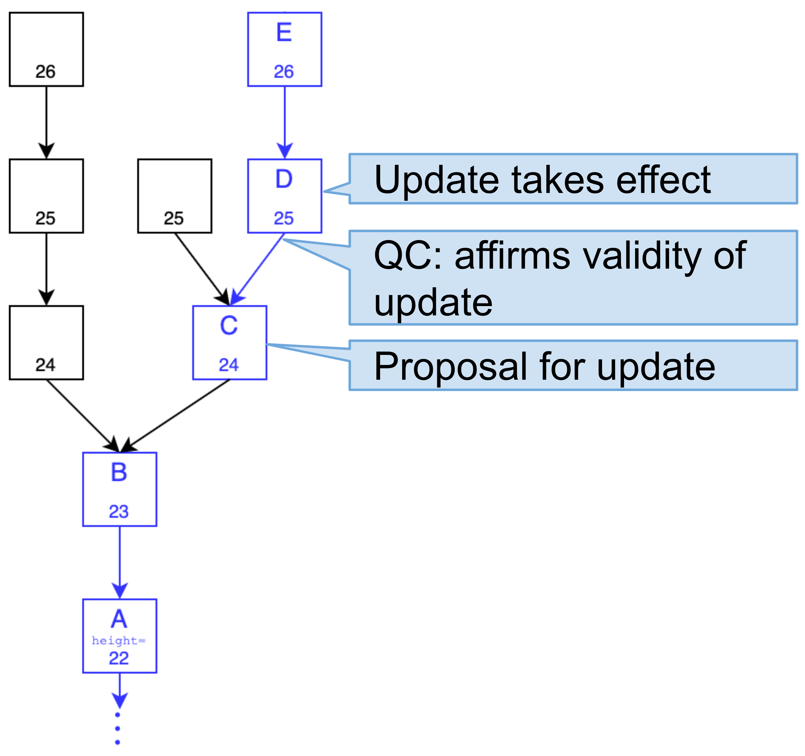

# Self-Ejection (core protocol)

| Status        | Proposed       |
:-------------- |:---------------------------------------------------- |
| **FLIP #**    | tbd (update when you have PR #)|
| **Author(s)** | Alex Hentschel (alex.hentschel@dapperlabs.com) |
| **Sponsor**   | Alex Hentschel (alex.hentschel@dapperlabs.com)             |
| **Updated**   | 2021-01-18                                           |

## Objective
Staked nodes running the core protocol are expected to participate for the duration of 
(at least) one Epoch and are subject to slashing challenges. An authorized Flow node is 
primarily authenticated via its `staking key`. 

This FLIP addresses the question of what a node operator can do in case she believes her 
node's operational keys (i.e. staking or networking key) has been compromised.
The established process for handling this case is (1) to revoke the compromised key and 
(2) issue new key(s). Changing a node's keys mid-epoch will _not_ be supported for the foreseeable future.
Therefore, the only available mitigation strategy is to remove the node as an authorized protocol participant 
(this is essentially just 1). 

Flow's technical term for revoking a node's participation privileges is `ejection` (from the protocol).
This FLIP proposes `self-ejection` as a measure a node operator can take in case
they believe their node's staking key has been compromised. Conceptually, self-ejection is very similar 
to ejecting a node as punishment for protocol violations (usually accompanied by slashing the node's stake).


## Motivation

In case a node's staking key has been compromised, the attacker might be able to spoof node messages.
For example, an attacker gaining knowledge of a consensus node's private staking and networking key 
could impersonate the node and equivocate (double-vote or propose conflicting blocks). As a consequence,
the node's stake will be slashed, and the node ejected. 

For safety of the network, the operational rewards for a node are generally significantly smaller compared to
a node's stake. Therefore, for an honest node operator, it is economically rational to forgo the 
operational rewards to protect the stake from being slashed.


## Benefits

Supporting `self-ejection` benefits the node operators as well as the safety of the core protocol:
* `self-ejection` allows the node operator to prevent significant economic losses through slashing
* `self-ejection` increases protocol safety as this might prevent a malicious party from entering the network 


## Design Proposal

Each authorized Flow node has the option to submit a `self-ejection request`. 

1. To request self-ejection, a node should broadcast a `self-ejection request` (message) to consensus nodes.
   The request must be signed the staking key of the node that is requesting its own ejection.
2. Consensus nodes include this request in blocks they produce. Specifically:

   (a) Consensus nodes should store self-ejection requests in a dedicated mempool.

   (b) For such request to be included, the node requesting self-ejection must be part of the protocol state. For nodes that are already ejected, self-ejection requests should not be included.

   (c) The request should be included in all forks (subject to possibility according to point b)

   (d) During block construction, a consensus node determines whether an ejection request should be included in the payload according to the following condition,
   - is the requesting node must be a valid network participant as of the parent block's protocol state
   - the parent block must *not* contain an ejection request for this node
  
   Only if both criteria are true, the request should be included

### Implementation steps:

As a first step, we'll focus on implementing the core logic on consensus nodes. Specifically, we start from the point, where self-ejection request has been put into the mempool

1. create a new struct in `model/flow`:

    ```go
    type SelfEjectionRequest struct {
    	NodeID Identifier          // ID of node requesting self-ejection
    	signature crypto.Signature // staking signature
    }
    ```

2. create a new mempool `SelfEjectionRequests` holding `SelfEjectionRequest`s
3. add a new field `StagedEjections` to struct `model.flow.Payload`
4. extend `module.consensus.Builder` to populate payload with `SelfEjectionRequest`s
5. extend `protocol.badger.mutator`:
   - when the protocol state is extended by a block, we need to apply the ejection requests from the block's parent (!caution! not the block itself)

#### Required preliminary work:

1. Currently, our `protocol.State` implementation statically returns the initial identities from the Epoch setup (→ [badger.Snapshot](https://github.com/onflow/flow-go/blob/5deff480971865cb6f677eff115f9d41dc4ed35a/state/protocol/badger/snapshot.go#L55-L58)). We would need to change this to
   - create a structure (e.g. `BlockProtocolState`) that holds the information for the protocol state which can vary from block to block:
     * currently, we can start with this `BlockProtocolState` only containing an `IdentityList` (more filed will be added in the future)
     * `BlockProtocolState` needs to have `ID` method
     * add persistent storage layer (with caching! See `badger.ExecutionResults` as example)
   - When extending the protocol state (for `MutableState` and `FollowerState`)
     * for each block, index the `ID` for the corresponding `BlockProtocolState`
       (example: indexing of Epoch-related information for each block → [code](https://github.com/onflow/flow-go/blob/5deff480971865cb6f677eff115f9d41dc4ed35a/state/protocol/badger/mutator.go#L849-L850))
   - When reading the protocol state (`badger.Snapshot`)
     * look up the  `BlockProtocolState`'s `ID` for the respective block
     * retrieve `BlockProtocolState` from storage
     * return *copy* of `IdentityList` from `BlockProtocolState` (prevents accidental modification of the cached Identities)
2. [Optional ?] Include `BlockProtocolState.ID` in block (ideally in `Header` but including it in `Payload` would be fine too)
3. Add Listener for changes of `BlockProtocolState.ID`  for *finalized* blocks to update Networking Layer. Only after the ejection is in a finalized block, we can cut off the node from all communication. (for more details see [here](https://www.notion.so/Protocol-Violations-and-Slashing-fc1b37ab41274e91abfb9ce1cb3f8d54))

#### Remaining implementation steps to be defined and scoped

- How does the node operator generate their self-ejection request? Suggestion: cmd tool that accompanies the node software 
- How does the ejection request get into the consensus node's mempool? Suggestion: new libP2P topic, e.g. for challenges and ejection requests?

#### Side considerations: When precisely take changes to the identity table effect?

As we now get to the point, where the Identity table can dynamically change from block to block, 
it is probably a good time to think about when precisely changes to the protocol state take effect.
Consider a block `B`, whose payload contains some components that change the identity of node `Alice` 
(for example, a slashing challenge whose adjudication results in Alice's ejection).

Generally, nodes check block correctness to different degrees:
* Consensus nodes are oblidged to check the block in its entirety including the payload.
* All other nodes roles can rely on consensus nodes to check payload validity. 
  They only check block headers for validity (specifically the QC). Once the block has been
  voted for by a supermajority of consensus nodes, other nodes can be certain that the payload 
  is protocol compliant. This means, as soon as a block `B` has a child with a valid header 
  (ignoring the validity of the child's payload), a non-consensus node can take the `B`'s
  payload as valid.
  - On the one hand, this means that non-consensus nodes don't have to validate slashing 
    challenges, which removes a huge amount of complexity.
  - On the other hand, this implies that an adjudication result in `B`'s payload cannot 
    take effect immediately, because non-consensus nodes can't verify its correctness. 
    Instead, non-consensus require a full round of votes (i.e. the existence of a child block 
    with valid header), to accept the identity table update.

**In summary, this implies the following two-step approach for slashing adjudications to take effect:**
1. **Identity table update is proposed in block `B`.** 
   (E.g. Alice's ejection, referencing a slashing adjudication published also in block `B`)
2. **The identity table update only takes effect in the fork, _after_ its validity is affirmed through a QC**.

I think it would be most consistent to apply this pattern to _all_ identity table changes..


  

### Drawbacks

Ideally, it would be nicer to exchange the node's key (out of scope as 
too many open questions are unsolved). 

### Alternatives Considered

Support for node to change its key. 
Nevertheless, we need ability to eject a slashed node for protocol violations. 

### Performance Implications
.

### Dependencies

* Dependencies: does this proposal add any new dependencies to Flow?
* Dependent projects: are there other areas of Flow or things that use Flow 
(Access API, Wallets, SDKs, etc.) that this affects? 
How have you identified these dependencies and are you sure they are complete? 
If there are dependencies, how are you managing those changes?

### Engineering Impact

.

### Best Practices

.
### Tutorials and Examples

A short how-to for node operators would be great.  

### Compatibility

This change affects the Flow core protocol only. Higher-level components are agnostic to this change.    


### User Impact

Extra feature for node operators. No user impact.  

## Related Issues

Would be great if we already considered the possibility for extending the implementation 
to ejections as a result of slashing. 


## Prior Art

.

## Questions and Discussion Topics

Looking forward to feedback.
