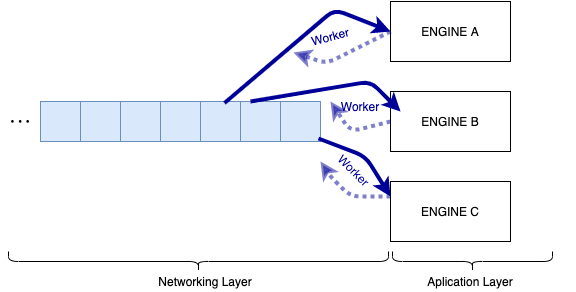
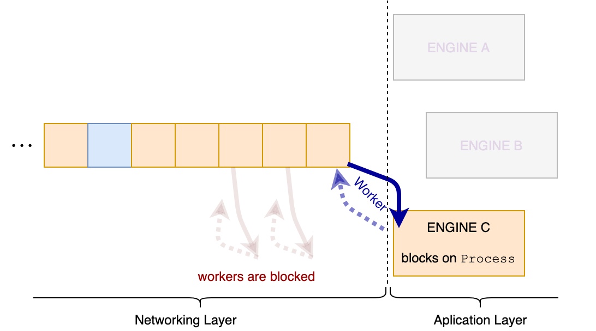
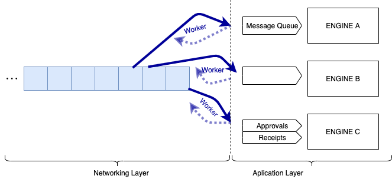
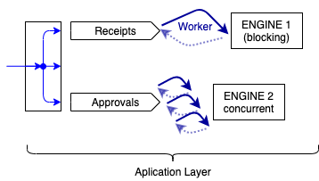
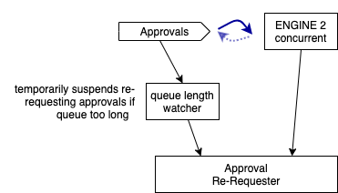

# Handing Messages from Networking Layer to Engines (Core Protocol)

| Status        | Proposed       |
:-------------- |:---------------------------------------------------- |
| **FLIP #**    | [343](https://github.com/onflow/flow/pull/343) |
| **Author(s)** | Alex Hentschel (alex.hentschel@dapperlabs.com) |
| **Sponsor**   | Alex Hentschel (alex.hentschel@dapperlabs.com)             |
| **Updated**   | 2021-02-03                                           |


## Objective

FLIP to generalize the API though which the Networking Layer hands messages to Engines

## Current Implementation

An [Engine](https://github.com/onflow/flow-go/blob/782c6d4c45007406fc708be22dcfaf9859a62991/module/engine.go)
subscribes to the incoming messages from a channel by
[registering](https://github.com/onflow/flow-go/blob/782c6d4c45007406fc708be22dcfaf9859a62991/module/network.go#L19)
themselves with the networking layer:
```golang
type Network interface {
   Register(channel network.Channel, engine network.Engine) (network.Conduit, error)
}
```

The networking layer serves messages from the channel directly to the engine
(-> [code](https://github.com/onflow/flow-go/blob/9be5cca2697e78f4b2d6c06210d4ac7a4bbfdb64/network/p2p/network.go#L445-L452)):
```golang
// eng is the Engine for the respective channel
err = eng.Process(qm.SenderID, qm.Payload)
if err != nil {
  n.logger.Error().
    ...
    Msg("failed to process message")
}
```
Note that we feed the [Engine](https://github.com/onflow/flow-go/blob/782c6d4c45007406fc708be22dcfaf9859a62991/network/engine.go#L27)
using the `Process` method:
```golang
// Process processes the given event from the node with the given origin ID
// in a blocking manner. It returns the potential processing error when done.
Process(originID flow.Identifier, event interface{}) error
```
which is **blocking** by API specification. 

#### Potential problems 

Currently, the networking layer has a single priority queue for all engines it serves. It has a limited number
of workers (e.g. 5) which is uses to serve the engines. 


As the networking layer as no detailed context about the messages it transmits to the application layer,
it can't effectively decide which messages to drop, or which messages can be processed concurrently
and which messages have to be processed in a blocking manner. 

If one of the engines (e.g. `Engine C`) gets overwhelmed with large number of messages, this engine will
likely delay messages for all other engines as the workers will soon all be blocked by the overwhelmed engine.   



Furthermore, the overwhelmed engine cannot drop messages or change its behaviour depending on its backlog, 
as the message queue is not within its component. 


## Design Proposal

The detailed semantics of the message types, and their processing modalities are only known to the application layer.
**Overall, I think it would be beneficial to generalize the API through which the networking layer hands the messages
to the application layer. For each channel, the application layer should inject the desired message consumer.**


Thereby, we could support the following desired use-cases:
* The application layer should have access to the queued messages, so it can drop stale messages and
  protect itself from getting overwhelmed.
  
* It should be the application layer's decision whether to process messages concurrently or one-by-one
  (depending on the message type).
  
* As engines might re-request entities, it would be beneficial if re-requesting could be temporarily suspended, 
  if the engine has queued up a lot of messages.
  

#### API Proposal
*  Generalize the API for the message sink from the viewpoint of the networking layer:
   ```golang
   // MessageConsumer represents a consumer of messages for a particular channel from 
   // the viewpoint of the networking layer. MessageConsumer implementations must handle 
   // large message volumes and consume messages in a non-blocking manner. 
   type MessageConsumer interface {
       // Consume submits the given event from the node with the given origin ID
	   // to the MessageConsumer. Implementation must be non-blocking and 
       // internally queue (or drop) messages.   
       Consume(originID [32]byte, event interface{})
    }
   ```
   Note that the `MessageConsumer` has no error return as opposed to the
   Engine's [`Process` method](https://github.com/onflow/flow-go/blob/782c6d4c45007406fc708be22dcfaf9859a62991/network/engine.go#L27).
   Motivation
    * What is the networking layer supposed to do with an error? Currently, the networking layer just logs an error
      (-> [code](https://github.com/onflow/flow-go/blob/9be5cca2697e78f4b2d6c06210d4ac7a4bbfdb64/network/p2p/network.go#L445-L452)).
    * Best suited to handle occurring errors is the application layer (i.e. the `MessageConsumer`), which has the necessary
      context about message semantics and potential errors.
*  change the `Network`'s [`Register` method](https://github.com/onflow/flow-go/blob/782c6d4c45007406fc708be22dcfaf9859a62991/module/network.go#L19) to
   ```golang
   Register(channel network.Channel, consumer MessageConsumer) (network.Conduit, error)
   ```
## Implementation Steps

The goal of the proposed implementation steps is to transition to the new API in iterative steps.
There are numerous `Engine` implementations. For some, it might be a good opportunity 
to implement message queuing tailored to the specific message type(s), which the Engine processes. 
For other Engines, a generic queueing implementation might be sufficient.  

1. In the first step, we will only change the interface, but the implementation will remain functionally unchanged.
   Specifically, we:
     - Add the `MessageConsumer interface` to `network` package.   
     - Move the `Engine interface` out of the networking layer into the `module` package.
     - Keep the priority queue in the networking layer and the workers feeding the messages to the engines.
     - To each engine, we add the `Consume` method, which directly calls into the engine's `Process` method.
       To only other function of `Consume` would be to logg potential error returns from `Process`
   
   This first step would create technical debt, as the `MessageConsumer` implementations are _not conforming to
   the API specification_: because they block on `Consume`!
2. We implement a generic priority queue (maybe reusing the existing implementation from the networking layer).
   - we could consider adding a generic inbound queue implementation to `engine/Unit`, as most engines have a `Unit` instance
3. Now, each `Engine` can be _independently_ refactored to include its own inbound message queue(s), 
   drop messages, or whatever fits best for their specific message type. 
4. After all engines are compliant with the `MessageConsumer interface` (i.e. their `Consume` implementation is non-blocking),
   we can remove the priority queue from the networking layer 

#### Implementation Step (1): minimally invasive transition to `MessageConsumer` interface
The implementation will remain functionally unchanged. The tech debt is cleaned up in subsequent steps 

1. Add the `MessageConsumer interface` to `network` package.
2. Move the `Engine interface` out of the networking layer into the `module` package.   
2. To each `Engine` implementation, add the following `Consume` method
    ```golang
    // MessageConsumer represents a consumer of messages for a particular channel from
    // the viewpoint of the networking layer. MessageConsumer implementations must
    // handle large message volumes and consume messages in a non-blocking manner.
    //
    // Consume is called by networking layer to hand a message from (the node with
    // the given origin ID) to the engine. It conforms to the MessageConsumer 
    // interface. However, the current implementation violates the
    // MessageConsumer's API spec as it uses the networking layer's routine to
    // process the inbound message.
    // TODO: change implementation to non-blocking
    func (e *Engine) Consume(originID flow.Identifier, event interface{}) {
        err := e.Process(originID, event)
        if err != nil {
            e.log.Error().
                Err(err).
                Hex("sender_id", logging.ID(originID)).
                Msg("failed to process inbound message")
        }
    }
    ```
    Note: The `MessageConsumer` implementations are _not conforming to
    the API specification_: because they block on `Consume`!
    While the tech debt created here is comparatively small, it allows 
    us to decouple and potentially parallelize updating the different engine implementations. 

This would be a single issue.

#### Implementation Step (2): add priority queue  
Implementation of a generic priority queue (maybe reusing the existing implementation from the networking layer). 
We could consider adding a generic inbound queue implementation to `engine/Unit`, as most engines have a `Unit` instance.

This would be a single issue and could go on in parallel to step (1)

#### Implementation Step (3): update engine implementations to non-blocking `Consume`  
Each `Engine` is refactored to include its own inbound message queue(s),
drop messages, or whatever fits best for their specific message type. 


For each individual `Engine` implementation, we have a dedicated issue:
  * determine which message processing strategy (queue, drop, etc) fits the engine's use case
  * implementation 
This step is blocked until step (1) and (2) are completed. 
All issues from this step could theoretically be worked on in parallel. 

By completing step (3), all `Engine` implementations are compliant with the `MessageConsumer interface`
(i.e. their `Consume` implementation is non-blocking).


#### Implementation Step (4): remove deprecated logic 
We remove the priority queue from the networking layer. 

This would be a single issue.


#### Implementation Step (5): buffer
Some buffer for technical complications and additional cleanup work.  

#### Optional 
We could remove the `network.Engine` interface and the `SubmitLocal`, `Process` functions that are copied in every engine
to satisfy it. These are rarely used and only exist because `network.Engine` was originally created with more methods
than it needed. 

The needed implementations of `SubmitLocal` or `Process` methods could be renamed with context-specific names
(e.g. `engine.HandleBlock(block)`)

