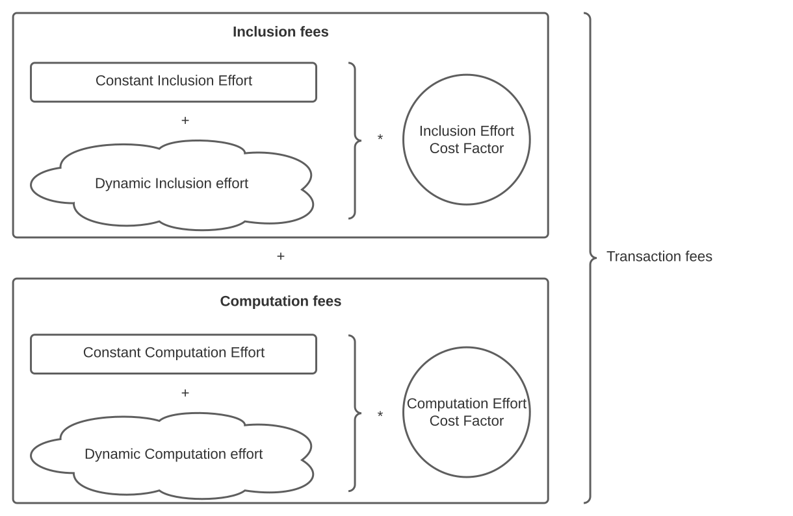

# Variable Transaction fees

| Status        | Proposed                                             |
:-------------- |:---------------------------------------------------- |
| **FLIP #**    | [NNN](https://github.com/onflow/flow/pull/660)|
| **Author(s)** | Janez Podhostnik (janez.podhostnik@dapperlabs.com)   |
| **Updated**   | 2021-10-07                                           |

## Objective

Change the calculation of transaction fees on the FLOW network to better secure and stabilise the network.

## Motivation

Transaction fees should allow the Flow blockchain to self regulate transaction throughput in a way where it would always tends to the optimum throughput, they should also discourage malicious actors from trying to destabilize the network by sending computationally or network heavy transactions, as the transaction fees on such transactions would be appropriately higher.

## Current design

Currently transaction fees are the same for all transactions and don't change over time [^2]. The transaction fee amount is defined in the `FlowServiceAccount` smart contract as the `transactionFee` field (this can be seen [here]( https://github.com/onflow/flow-core-contracts/blob/master/contracts/FlowServiceAccount.cdc) or [here](https://flow-view-source.com/mainnet/account/0xe467b9dd11fa00df/contract/FlowServiceAccount)).

[^2]: Except when an explicit decision is made to change them.

The fees are deducted from the transaction payer automatically. If the transaction fails the fees are still deducted and no other state change (except the fee deduction) is committed.

The transaction fees are collected on the [FlowFees](https://github.com/onflow/flow-core-contracts/blob/master/contracts/FlowFees.cdc) smart contract and are used as part of the staking rewards. If there were more fees collected during an epoch then there were staking rewards the leftover FLOW gets burnt. This part would not be changed with this proposal, but it is important to note, as this means collecting more fees leads to less inflation or even deflation.

There is an existing concept of a computation limit (a.k.a.: gas limit), but it is currently not tied to transaction fees. The computation limit is currently used only to prevent transactions from running for a very long time (or indefinitely).

## Design requirements

We can separate the requirements into two groups depending on perspective.

From the protocols perspective the following requirements can be set:

- Larger (byte size) transactions take more bandwidth and should be costlier than smaller transactions.
- Transactions that are computationally more demanding should be costlier than simpler transactions.
- If the protocol is experiencing a lot of traffic, all transactions should become more expensive, until the high traffic subsides.

The ultimate goal from the protocols perspective would be that transactions cost exactly the amount of FLOW needed to pay for the cost of the time needed by the nodes to process the transaction. However this would include so many variables that it would not be feasible. Instead the goal is to make a reasonably good approximation, and improve that approximation over time.

From the users perspective the transaction fees implementation should satisfy the following criteria:

- Fees should be easy to understand:
    - It should be made clear why they exist in the form they do.
    - It should be easy to explain how the fees are calculated.
- It should be possible to calculate the transaction fees (within a reasonable margin), before actually sending a transaction.
- The price of sending a specific transaction should not fluctuate over time so quickly that the user cannot respond to the fluctuation.
- It should be possible to see the details of the transaction fee calculation after the transaction is executed.

## Proposed design

The idea for this design is to the transaction fees break down into smaller parts that are easier to define, control, and implement.

The first separation of the transaction fees () is into inclusion fees () and computation fees (). The inclusion fees roughly represent the cost of getting the transaction included in a collection and the cost of the increase in network traffic created by including the transaction. The computation fees account for the approximate operational cost of executing the transaction script. 

This separation allows for finer control over the type of transactions that are desired. For example if the volume of transactions is high and is causing congestion on the the collection nodes but the execution nodes have no problem executing all of the transactions, the inclusion fees can be increased without changing the computation fees.

Each part of the fees can be further split into *effort*() and an *effort cost factor*() of FLOW per unit of effort. The *effort* required for a specific transaction should be independent of when the transaction is sent[^1] and should only depend on the properties of the transaction. On the other hand the *effort cost factor* would change over time depending on network activity.

[^1]: Assuming there weren't any changes to the state that would make the transactions script execute differently.

It is possible to drill down even further by imagining what work would be needed for a theoretical transaction that is completely empty (without any script, arguments, or signatures; a *nil transaction*). A transaction like this would still require some effort from the nodes to include it in a collection and go through the pre-execution and post-execution steps. This means that the *effort* needs to be further split into a constant part() and a dynamic part (). The dynamic parts depend on the transactions properties (how large it is, how long it takes to execute, ...) while the constant parts are the same for all transactions.

The final result in equation form looks like this:

- : Inclusion fees; Represent the cost of including the transaction in a collection.
    - : Inclusion effort cost factor; The current cost of one unit of inclusion effort.
    - : Inclusion effort; The time invariant effort required to include this transaction into a collection.
        - : Constant inclusion effort; The effort of including a *nil transaction* into a collection
        - : Dynamic inclusion effort; The increase in effort due to the particulars transaction properties (due to its size in bytes).
- : Computation fees; Represent the cost of executing the transaction.
    - : Computation effort cost factor; The current cost of one unit of computation effort.
    - : Computation effort; The time invariant effort required to execute this transactions script.
        - : Constant computation effort; The effort of executing a *nil transaction*.
        - : Dynamic computation effort; The effort of executing the transactions script.

### Fee effort cost factors

The effort cost factors  and  should be defined on a smart contract and adjustable via the service account admin resource and they should be accessible for everyone to read. 

The effort cost factors can be used in three different ways:

1. The main usage of the effort cost factors is adjusting them when the network is under load. If the execution or verification nodes are struggling to execute all of the transactions, the computation effort cost factor should be increased. If the network finds it difficult to create collections from all the transactions coming in, but the execution nodes are still fine, the computation effort cost factor should be increased. 

2. The second reason to tweak the effort cost factors is that over time some parts of the code will get optimized. This could cause the same amount of effort to be easier to handle. An example would be that if execution of transactions became 10% faster because of optimizations, the computation effort cost factor could be reduced by 10%.

3. A potential third use of the effort cost factors would be to keep the cost of transaction stable according to the USD value of flow. This would require a periodic job to run, check the USD value of FLOW and update the cost factors to account for any changes. This would allow for the average transaction fees to stay relatively close to a set USD value.

While the effort cost factors could be adjusted manually from the start, that would mean responding to network load would be very slow. A potential solution to adjusting the effort cost factors automatically would be a service that monitored the networks performance and sent a transaction to update the fee factors when there was a change in the network load.

### Inclusion effort

For the first iteration the dynamic inclusion effort can be defined to be equal to the byte length of the (rlp encoded) transaction. The maximum dynamic inclusion effort would be equal to the maximum allowed transaction size, which is currently 1,500,000 bytes.

The constant inclusion effort could be chosen by observing the impact of transactions with a different byte size and a similar computation effort. This data could be used to predict how much impact a transaction that is 0 bytes long would make.

Having a positive constant inclusion effort as well as a dynamic one means that splitting a transaction into smaller pieces does not make sense (considering only the inclusion part of the transaction fees). If this would be desired (from the protocols perspective) that the transactions are as small as possible or of a certain size, the dynamic inclusion effort could be defined to grow faster then linear with the byte size of the transaction.

### Computation effort

The computation effort represents the effort needed to execute the transaction script and to do pre and post execution steps (like checking signatures and storage limits and deducting transaction fees). 

Because the execution path of the script depends on the current execution state, it is impossible to definitively predict the computation effort before the actual on chain execution of the transaction.

The lower bound for computation fees (and thus transaction fees) () can still be calculated by assuming the dynamic computation effort is 0.

The upper bound of the computation fees (and thus transaction fees) is indirectly set in the transaction by setting the maximum computation limit () (currently known as the gas limit). 

If the transaction computation limit is reached during the execution of the transaction the execution stops and the state changes made up to that point are dropped. The transaction fees for this transaction are still collected.

Currently the dynamic computation effort is calculated by adding 1 for every loop or function call. This could  be sufficient for the first implementation. In the future the calculation of the dynamic computation effort would be changed so that function calls would have a different computational effort assigned to them according to the time complexity of the method.

### Failing transactions

There are a few reasons why a transaction fails, which can be split into four categories, according to who finally gets charged for the transaction fees and how much do they get charged.

1. Transaction failed because the payers signature was incorrect, or the payer does not have enough funds to cover maximum transaction costs (transaction costs with the dynamic computation effort set to the computation limit).
2. Transaction failed before the transaction script execution started (some non-payer signature was incorrect, or the sequence number was incorrect)
3. Transaction failed during transaction script execution, during fee deduction or during the storage used check. 
4. Transaction failed because the computation limit was reached.

As discussed below, in scenario 1. the transaction shouldn't have been included in a collection in the first place. However since it was included and there is no way to charge the payer, the collection node account is charged with the transaction fees. The transaction fees are computed with the dynamic computation effort set to 0.

In the second scenario the payer is charged for the transaction fees with the dynamic computation effort set to 0.

In the third case, the fees are charged normally with the dynamic computation effort set to the actual usage before the error was produced.

Finally in the last case the payer is charged with the transaction fees where the dynamic computation effort is set to the computation limit.

### Preventing malicious actors

The purpose of fees is to prevent malicious actors sending transactions with the purpose of overloading the network. To achieve that, we have to check that the payer of a transaction has the funds to pay for that transaction as soon as possible.

Tho achieve this the following checks should happen on the collection node, before the transaction is even included in a collection: 
- Is the payers signature valid.
- Can the payer pay for the transaction. The payers default FLOW vault should have at least  FLOW.  

It might still happen that this transaction will get included, either due to a bug or malicious behaviour from the collection node, or due to the collection node not having up to date information of the balance of the payer. In case does still get included in a collection, even though it does not meet the condition, this check should be repeated in the execution node, and in case the check fails on the execution node, the transaction fees should be deducted from the collection nodes account instead of the payers account.

### Calibrating the parameters

When turning on variable transaction fees the goal is to have a smooth transition to the new system. To help facilitate that the cost of transaction fees should be set so that ~95% of transactions should actually pay less transaction fees with variable transaction fees turned on.

To achieve this the 6 different parts of variable transaction fees need to be calibrated accordingly.

-  Dynamic inclusion effort would be the byte size of a transaction
- : Constant inclusion effort would be picked by using linear regression on the impact of different size transactions (with the same computational effort) on the network, and extrapolating for a 0 size transaction.
- : Inclusion effort cost factor would be picked so that for 95% of transactions that have been seen so far the inclusion fees would cost less then `TC/2`.

- : Dynamic computation effort can be kept as the computation effort that is currently in place. This can be later upgraded so the more expensive methods also cost more computation effort.
- : Constant computation effort would be picked by using a similar method as for the constant inclusion effort.
- : Computation effort cost factor would be picked so that the at the maximum computation limit the computation fees would be `TC/2`.

### Viewing the deducted fees

The breakdown of the transaction fee calculation for a transaction should be somehow visible after the transaction is executed.

The proposed solution is to allow anyone reconstruct the transaction fees breakdown from two sources of information.

Some data can be retrieved from querying the blockchain at that height:
- fee effort cost factors
- inclusion static effort 
- inclusion dynamic effort 

Some data will be on the fee deduction event emitted when the fees are deducted:
- dynamic inclusion effort
- dynamic computation effort

From this data the entire breakdown and the final price can be deducted.

The fee deduction event should also contain what the final fee price was. This is so the final fee value is more accessible and also for redundancy.
### Transaction Fee estimation

To estimate the minimum transaction fees () needed for a transaction some data needs to be retrieved from the state (access node):
- The effort cost factors.
- The constant inclusion effort.
- The constant dynamic effort.

This could be done by the SDK with a script or a possibly over a dedicated endpoint on the access nodes. 

Due to the effort cost factors changing over time, this calculation will inherently be an estimation. To estimate the upper bound of the transaction fees the user has to choose a good value for the computation limit.

If the user is unsure of what computation limit is good enough for their transaction an option is that they just go with the maximum computation limit as the transaction fees will only be deducted per computation usage.

## User impact

Users are already aware of the computation limit (a.k.a.: gas limit), the change is only that they will now need to pay more attention to it as setting the computation limit has a few implications:
- setting a high computation limit will mean that the payer needs to have more funds in their account before sending the transaction. 
- using more computation will result in more expensive transactions.

The second thing to keep in mind is that the transaction fees effort cost factors that will slowly change over time. If the price is currently high the user might want to to wait for a less busy (and cheaper) time to send a transaction.

## Implementation

### Step 1.

Decoupling the concept of effort and effort fee factors. The fee calculation would still not have any dynamic parts. The dynamic effort would be reported as 0 in the transaction fee event. The parts that would change are:

- The constant efforts would be set to a value that would approximate the effort of a nil transaction.
- The fee effort cost factors would be set so that there is no change to the final fees.
- the fee calculation would be done inside the `FlowFees` smart contract.

Implementing this step would have no impact on users, but they could start reading the fee breakdown from the emitted fee event.

This would also set up the stage nicely for the upcoming steps.

### Step 2.

Introduction of dynamic inclusion effort.

- the dynamic inclusion effort would be set to the byte size of the transaction
- other inclusion parameters would be adjusted so that 95% of transactions would be below the current transaction prices.

All of the code pieces would already be in place, so the main part of this task would be choosing good parameter values.

### Step 3.

Introduction of the basic dynamic computation effort.

- use the current computation usage calculation as the dynamic computation effort
- other computation parameters would be adjusted so that 95% of transactions would be below the current transaction prices.
- add checks listed in the [Failing transactions](#failing_transactions) chapter (excluding those needed on collection nodes)

This would mean that all the "happy path" and most of the failure paths are in place, but the computation metering is still very rudimentary.

### Step 4.

Make collection nodes ignore transactions that cannot be paid for.

- Add payer eligibility checks to the collection nodes.
- Add mechanism that the collection node pays for transactions it included in collections where the payer could not have paid.

### Next steps

- Improve dynamic computation effort calculation.
- Add mechanism for changing the fee effort cost factors to make fees higher when the traffic is high.
- Parameter fine tuning.

## Questions and Discussion Topics

Q: While there is an incentive for collection nodes not to include transactions from payers that potentially might not be able to pay for those transactions, what is the incentive in the opposite direction? If a payer was a bad payer and collection nodes stop including his transactions, what motivates the collection nodes to then start including transactions from that payer, if the payer has added funding to their account?

