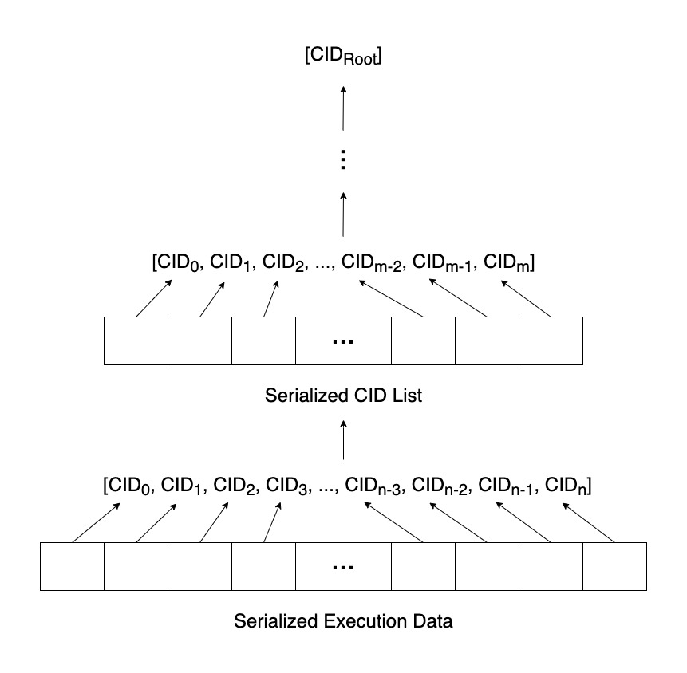
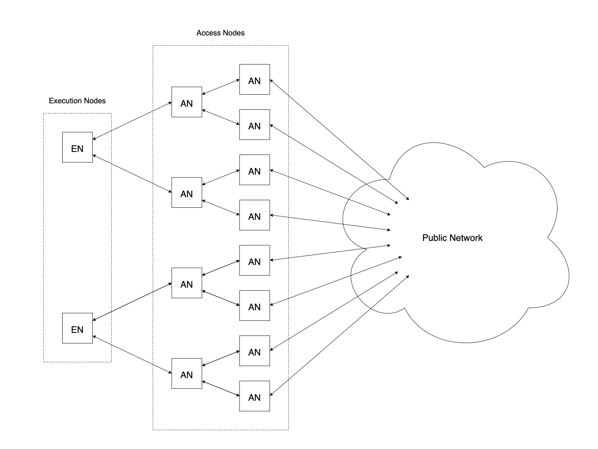

# Execution State Synchronization Protocol

| Status        | Proposed                                             |
:-------------- |:---------------------------------------------------- |
| **Author(s)** | Simon Zhu (simon.zhu@dapperlabs.com)                 |
| **Sponsor**   | Simon Zhu (simon.zhu@dapperlabs.com)                 |
| **Updated**   | 2021-12-07                                           |

## Context

Today, Access nodes act as the gateway to the Flow network, providing a query endpoint for users (REST, gRPC) and performing important admission control duties such as:
* Rate limiting of requests (script executions, Collection requests, account queries, etc.)
* Basic validation, proving a first level of filtering to prevent bad transactions from entering the network

Execution nodes and Collection nodes currently still expose public APIs, which are now mostly obsolete. Allowing users to bypass the Access layer and make direct requests to these nodes not only consumes valuable computational resources, which should be reserved for performing tasks crucial to the protocol (especially in the case of Execution nodes), but it also leaves them at risk of denial-of-service attacks. Going forward, in order to protect the other staked nodes of the network, the Access layer will become the *only* way for users to interact with the network.

At the moment, the [Access API](/docs/content/access-api.md) contains a few methods in particular that proxy requests behind the scenes to other nodes (possibly from previous sporks):

* [`GetCollectionByID`](/docs/content/access-api.md/#getcollectionbyid) forwards the request to a Collection node and returns the response.
* [`GetTransaction`](/docs/content/access-api.md/#gettransaction) / [`GetTransactionResult`](/docs/content/access-api.md/#gettransactionresult) forwards the request to a Collection / Execution node and returns the response.
* [`ExecuteScriptAtLatestBlock`](/docs/content/access-api.md/#executescriptatlatestblock) / [`ExecuteScriptAtBlockID`](/docs/content/access-api.md/#executescriptatblockid) / [`ExecuteScriptAtBlockHeight`](/docs/content/access-api.md/#executescriptatblockheight) forwards the request to an Execution node and returns the response.
* [`GetAccountAtLatestBlock`](/docs/content/access-api.md/#getaccountatlatestblock) / [`GetAccountAtBlockHeight`](/docs/content/access-api.md/#getaccountatblockheight) forwards the request to an Execution node and returns the response.

Ideally, Access nodes would be able to serve such requests from their own local state to avoid introducing additional traffic and putting excessive load on nodes within the network. To do this, they need the ability to obtain an up-to-date copy of the execution state and all transaction data (as well as retain a history of this data).

It is important for network-external entities as well as network-internal nodes to be able to acquire a full copy of the execution state. This is important to remove load from the Execution nodes. Furthermore, due to their (intentionally) low number, entities other than the Execution nodes should be able to hold (and potentially archive) the full state to further decentralization.

The [Flow Data Provisioning Service (DPS)](https://github.com/optakt/flow-dps) has been an important first step in this direction, providing a scalable and efficient way to access the history of the Flow execution state. It reads the protocol state by following block proposals via the [`ConsensusFollower`](https://github.com/onflow/flow-go/blob/master/follower/consensus_follower.go) library, and reads the execution-related data from records written to a Google Cloud Storage bucket by an Execution node. Going forward, we will want to incorporate this functionality into the Access node itself.

## Objective

We wish to phase out distributing state via cloud storage buckets and design a state synchronization protocol that does not rely on any third-party cloud providers, yet still enables the scalable transmission of execution state updates and transactions data from Execution nodes to Access nodes. 

Such a protocol should require a minimal amount of additional work from Execution nodes, and in particular it should not involve them fanning-out the data they generate to all Access nodes. Instead, Execution nodes should only need to answer a bounded number of initial state requests, after which the further exchange of this data should be delegated among Access nodes themselves. This allows us to leverage the scability of the Access node layer and gain increased data dissemination robustness and decentralization.

## Design

### Data Transfer

The core data exchange protocol we build on top of is called [Bitswap](https://docs.ipfs.io/concepts/bitswap/). At a high level, Bitswap's main responsibilities are to acquire chunks of data requested by the client from the network, and send chunks of data in its possession to other peers who want them.

Bitswap functions with a few fundamental concepts:
* A *block* represents a raw chunk of data.
* Each block is uniquely identified by a [*content identifier (CID)*](https://docs.ipfs.io/concepts/content-addressing/), which is based on a cryptographic hash of the block's contents.
* A *blockstore* is a data store for storing and retrieving blocks.
* A *session* orchestrates the flow of messages with other peers for discovering and retrieving the individual blocks which comprise a single high-level object.

The full details of the Bitswap protocol can be found [here](https://research.protocol.ai/publications/accelerating-content-routing-with-bitswap-a-multi-path-file-transfer-protocol-in-ipfs-and-filecoin/delarocha2021.pdf).

> **Note:** To avoid conflicting terminology, we will henceforth refer to blocks in Bitswap as *blobs*.

### State Computation

Execution nodes, upon executing the transactions in each block, will compute the following data:

```protobuf
message ExecutionData {
    repeated Collection collections = 1;
    repeated TransactionResult txResults = 2;
    repeated Event events = 3;
    repeated TrieUpdate trieUpdates = 4;
}
```

They will then serialize each of these fields separately<sup>[1](#footnotes)</sup> and compute a root CID from the serialized data for each field as follows:

1. Split the data into blobs of up to 1MB (the message size limit of the [underlying networking stack](https://docs.ipfs.io/concepts/libp2p/)).
2. Compute the CID of each blob and store it in the blobstore.
3. If the number of CIDs computed in the previous step is 1, then return this CID. Otherwise, serialize the CID list and repeat from step 1 with the new serialized data<sup>[2](#footnotes)</sup>.



At the end of this process, we are left with four root CIDs (one for each field in the Execution Data). These will be included in an [Execution Result](https://github.com/onflow/flow-go/blob/master/model/flow/execution_result.go) from which an [Execution Receipt](https://github.com/onflow/flow-go/blob/master/model/flow/execution_receipt.go) is generated and later broadcast to the network<sup>[3](#footnotes)</sup>.

### State Propagation

Each time an Access node receives a new Execution Receipt, it will initiate a Bitswap session and begin requesting the root CIDs in the underlying Execution Result. Once all of the blobs have successfully been retrieved and stored in the blobstore, the full Execution Data object can be assembled and used to update the Access node's local execution state index and Badger storage.

In order to preserve the bandwidth of Execution nodes, who are the only creators of new data, their Bitswap implementation will be configured with custom request prioritization logic so that queries for the Execution Data of newer blocks are answered first. The expectation here is that as new blocks are executed, the likelihood that requests for older Execution Data are answered by Access nodes (rather than Execution nodes) will increase. Execution nodes will also implement an expiration policy so that the Execution Data for blocks older than a certain threshold are purged entirely, leaving Access nodes with the full responsibility of providing this data to new nodes joining the network.



> There is a [data availability problem](https://github.com/ethereum/research/wiki/A-note-on-data-availability-and-erasure-coding#what-is-the-data-availability-problem) here, where Execution nodes could ignore Bitswap requests and refuse to send any data to Access nodes. It may be possible to solve this using similar techniques as those described in [Sharding](#sharding).

There are various reasons why a particular Execution Result may never end up being sealed:

* The block that was executed never gets finalized.
* The Execution Result is invalid.
* Certain conditions give rise to indeterminacy (e.g. Missing Collection Challenges), resulting in multiple valid Execution Results, of which only one is chosen to be sealed.

As a result, Access nodes will need to keep track of all of the Execution Result IDs for each block height that they download the Execution Data for. When an Execution Result is sealed, they should purge the Execution Data for all conflicting Execution Result IDs from their blobstore<sup>[4](#footnotes)</sup>. If the Execution Data for the sealed Execution Result hasn't already been downloaded, they should initiate a new Bitswap session and begin downloading the data<sup>[5](#footnotes)</sup>.

On the public network, the same architecture can be applied between Access nodes and Observer nodes.

### Verification

The protocol described above requires four new CID fields to be added to Execution Results, and these CIDs must be verifiable. We describe two different approaches to this below:

#### Access Nodes as Verifiers

Once an Access node downloads the Execution Data using the CIDs in an Execution Result, it can verify that the downloaded objects are correct by checking their hashes:

<dl>
  <dt>Trie Updates</dt>
  <dd>An Execution Result contains a list of <a href="https://github.com/onflow/flow-go/blob/e73e19a87860f470053b6a8b624d3dcd43ad23bf/model/flow/execution_result.go#L14">Chunks</a>, each of which contains commitments to the <a href="https://github.com/onflow/flow-go/blob/e73e19a87860f470053b6a8b624d3dcd43ad23bf/model/flow/chunk.go#L7">start state</a> and <a href="https://github.com/onflow/flow-go/blob/e73e19a87860f470053b6a8b624d3dcd43ad23bf/model/flow/chunk.go#L21">end state</a> of the execution. These can be compared with the state of the Ledger before and after applying each Trie Update.</dd>
  <dt>Events</dt>
  <dd>Each Chunk in an Execution Result also contains a <a href="https://github.com/onflow/flow-go/blob/e73e19a87860f470053b6a8b624d3dcd43ad23bf/model/flow/chunk.go#L8">hash of the Events generated during execution</a>. Since we know the <a href="https://github.com/onflow/flow-go/blob/e73e19a87860f470053b6a8b624d3dcd43ad23bf/model/flow/event.go#L25-L29">grouping</a> and <a href="https://github.com/onflow/flow-go/blob/e73e19a87860f470053b6a8b624d3dcd43ad23bf/model/flow/event.go#L32">ordering</a> of Events within transactions as well as the <a href="https://github.com/onflow/flow-go/blob/e73e19a87860f470053b6a8b624d3dcd43ad23bf/model/flow/chunk.go#L13">number of transactions</a> within a Chunk, it should be possible to reproduce the Event Collection hash for each Chunk and check that it is correct.</dd>
  <dt>Collections</dt>
  <dd>A block payload contains a list of <a href="https://github.com/onflow/flow-go/blob/e73e19a87860f470053b6a8b624d3dcd43ad23bf/model/flow/payload.go#L9">Collection Guarantees</a>, each of which contains <a href="https://github.com/onflow/flow-go/blob/e73e19a87860f470053b6a8b624d3dcd43ad23bf/model/flow/collectionGuarantee.go#L12">the ID of the Collection being guaranteed</a>. Since each Collection ID is simply a hash of the transaction IDs in the Collection, the Collection IDs can be compared with the downloaded Collections themselves.</dd>
  <dt>Transaction Results</dt>
  <dd>Transaction Results currently do not have on-chain commitments, but these will be added in the future, allowing the downloaded Transaction Results to be verified.</dd>
</dl>

If an Access node finds that any of the downloaded objects do not have the correct hash, then the Execution node must have put an incorrect CID in their Execution Result and should be slashed.

> **Note:** There is a Verifier's Dilemma here which needs to be addressed. We will not go into the details of how to solve this here.

#### Verification Nodes as Verifiers

Each Verification node is only responsible for a subset of the Chunks within a block. Therefore, instead of generating a single Execution Data per block, Execution nodes would instead need to generate an Execution Data and root CID for each individual Chunk and include all of these root CIDs in the Execution Result. Once Verification nodes have the [Chunk Data Pack](https://github.com/onflow/flow-go/blob/e73e19a87860f470053b6a8b624d3dcd43ad23bf/model/flow/chunk.go#L40), they can recompute the Execution Data and root CID for a Chunk and check that it is correct.

## Requirements

The Access node goes from being an optional node serving as a proxy, to being a relayer of execution state. As a result, the hardware requirements change significantly.

### Memory / Storage Estimate

Access nodes will need to store the full indexed state and the Execution Data for each block on disk. They also need to be able to load a state snapshot / complete trie in memory in order to apply updates.

**Execution state checkpoint (complete)**

```console
simon_zhu_dapperlabs_com@execution-001 /var/flow/data/execution $ ls -lh | tail -n 7
-rw------- 1 root root  27G Oct 24 12:18 checkpoint.00010182
-rw------- 1 root root  27G Oct 24 19:45 checkpoint.00010251
-rw------- 1 root root  27G Oct 25 03:25 checkpoint.00010315
-rw------- 1 root root  27G Oct 25 11:01 checkpoint.00010356
-rw------- 1 root root  27G Oct 25 18:43 checkpoint.00010405
drwxr-xr-x 2 root root 4.0K Oct  6 19:06 extralogs
-rw-r--r-- 1 root root  24G Oct  6 19:02 root.checkpoint
```

**Execution Data (individual)**

```console
smnzhu@mbp:~$ SORTED_BY_SIZE=$(gsutil du -h gs://flow_public_mainnet13_execution_state | sed -e 's/ MiB/M/g' -e 's/ KiB/K/g' | sort -h | sed -e 's/M/ MiB/g' -e 's/K/ KiB/g')
smnzhu@mbp:~$ echo $SORTED_BY_SIZE | head -n 1
3.57 KiB     gs://flow_public_mainnet13_execution_state/5d00b1ef2670d5987015c582727ab2308b19916ea4303ad56d600bb1fb4a12fc.cbor
smnzhu@mbp:~$ echo $SORTED_BY_SIZE | tail -n 1
377.18 MiB   gs://flow_public_mainnet13_execution_state/38db1ad86322fa81ff105328fd2812f2d5eed87ea4b7dba4e4095b1934fcec86.cbor
smnzhu@mbp:~$ echo $SORTED_BY_SIZE | awk '{ a[i++]=$0; } END { print a[int(i/2)]; }'
70.47 KiB    gs://flow_public_mainnet13_execution_state/4f6892c5b1b16e41ae1adda086b8aa241d254b780f44ceb5e45a5a1d5bb3d8aa.cbor
```

**Execution Data (~3 week spork)**

```console
smnzhu@mbp:~$ gsutil du -sh gs://flow_public_mainnet13_execution_state
446.14 GiB   gs://flow_public_mainnet13_execution_state
smnzhu@mbp:~$ gsutil ls gs://flow_public_mainnet13_execution_state | wc -l
  473590
```

**Execution state index (~3 week spork)**

```console
simon_zhu_dapperlabs_com@observer-001 /var/flow/data/mainnet-13 $ sudo du -sh index
103G    index
```

Based on the numbers above, we should require Access nodes to have >43GB of RAM (27GB + current 16GB requirement) and minimum 1.5-2TB of storage space for a 3 month spork. However, these requirements don't have to be met by a single machine, because the historic state does not change. The historic state can be easily distributed over many physical machines allowing for arbitrary horizontal scaling (see [Future Optimizations](#future-optimizations)).

## Future Optimizations

### Checkpointing

Having a checkpointing mechanism will allow new nodes to catch up more quickly, while also reducing the amount of data Access nodes need to store on disk.

Access nodes can periodically (e.g. at every 10000th block) generate a snapshot of the full state index and store it in their blobstore. Thereby, new Access nodes (and other external clients) could directly sync starting from the most recent snapshot and catch up via per-block Execution Data updates (before they sync the full state history if they desire to do so).

In order to download a snapshot via Bitswap, a new node can acquire the root CID by randomly selecting a couple of existing Access nodes and asking them for it. If the responses it receives are concordant, it can go ahead and download the data. Once the download is complete, it can generate the state trie for each block and compare its hash to the one found on-chain in the corresponding Execution Result. If it finds an inconsistency, it has all the evidence it needs to submit a slashing challenge against the nodes which provided it with the bad CID.

### Horizontal Scaling of Historical State Storage

Internally, the Access node can employ a classical micro-service architecture. In particular, the execution state index can be horizontally scaled across multiple machines, allowing Access node operators with external business incentives to store the full state history.

Any queries which access historical execution state can be handled by a service which is deployed and run separately from the Access node. This service can be sharded by block height, with each shard only responsible for queries within a specific height range. Each shard can be further scaled with multiple identical instances if necessary to handle higher load on more recent height ranges.

---

**<a name="footnotes">Footnotes:</a>**

1. We could also serialize the entire Execution Data instead, but serializing the fields separately potentially allows us to reuse the existing Badger storage in our blobstore implementation.
2. The largest Execution Data we've observed on Mainnet was ~400MB. Therefore, considering that CIDs are ~32 bytes, in practice this process will only need to be repeated at most once.
3. Execution Results *must* be deterministic (if two Execution nodes get the same result after executing a block, they must generate the same Execution Result). This implies that we need a protocol-level specification of how Trie Updates should be ordered. The current convention is that reads / writes are deterministically ordered by their respective register IDs.
4. Note that it's possible for the blob trees of two distinct Execution Data objects to contain overlapping nodes. We should be careful not to purge any blobs from the sealed Execution Data's blob tree.
5. We could avoid all of this by waiting until an Execution Result is sealed before initiating the download of its Execution Data, but we choose to eagerly download data in order to achieve lower latency.
