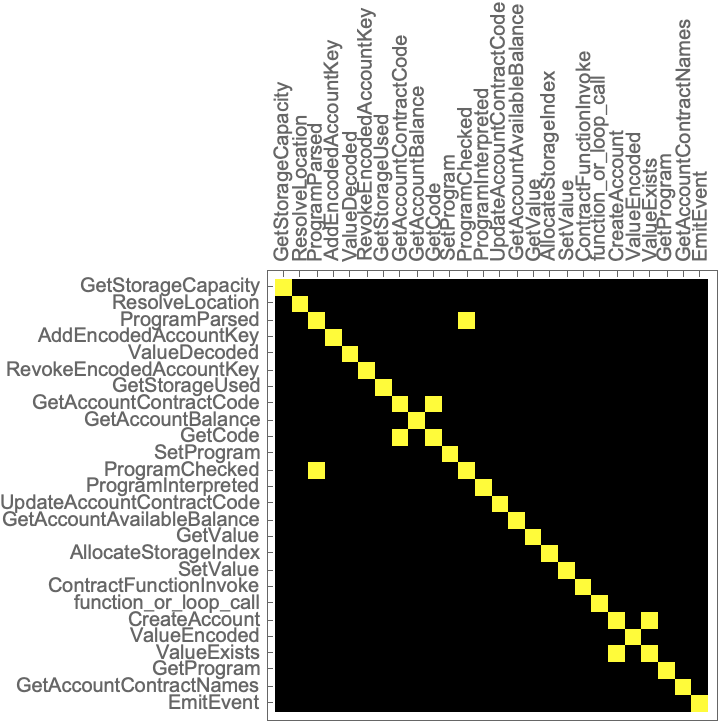
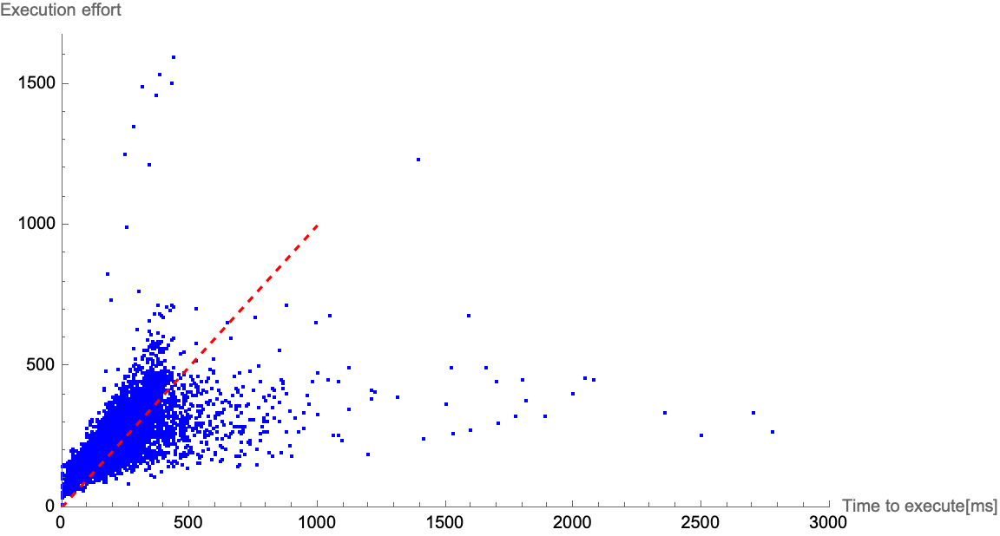
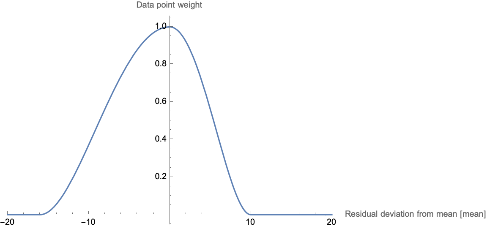
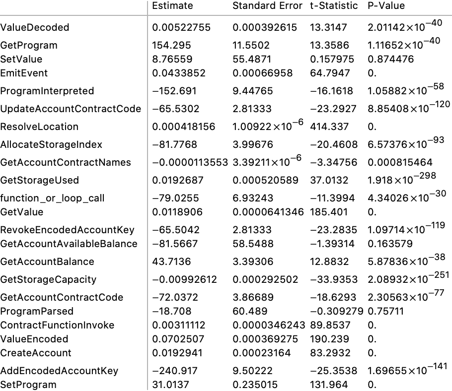
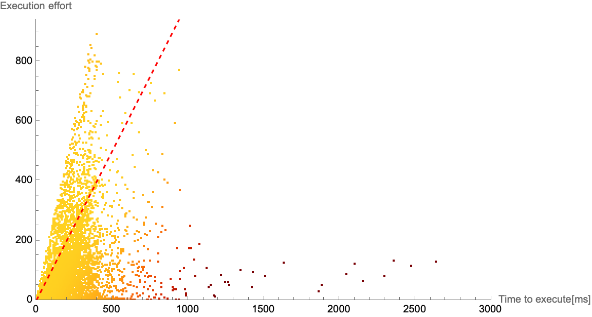
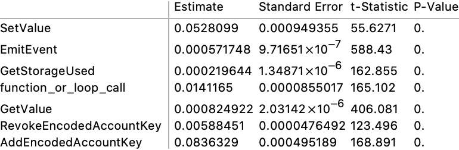
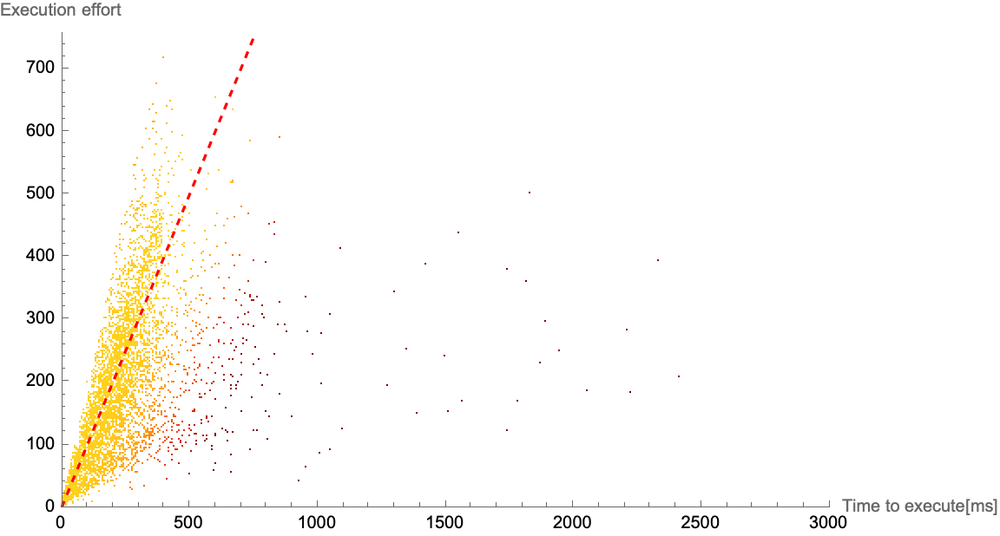

# Variable Transaction Fees - Execution Effort I.

| Status        | Proposed                                           |
| :------------ | :------------------------------------------------- |
| **FLIP #**    | [753](https://github.com/onflow/flow/pull/753)     |
| **Author(s)** | Janez Podhostnik (janez.podhostnik@dapperlabs.com) |
| **Updated**   | 2022-03-29                                         |


🚧 Under re-work. 🚧  The *Proposed Design* chapter will change a lot to reflect the improved math. Some numbers in the other chapters might also change slightly.

## Table of Contents

- [Variable Transaction Fees - Execution Effort I.](#variable-transaction-fees---execution-effort-i)
  - [Table of Contents](#table-of-contents)
  - [Abstract](#abstract)
  - [Objective](#objective)
  - [Impact](#impact)
  - [Current state](#current-state)
  - [Proposed Design](#proposed-design)
    - [Data Collection](#data-collection)
      - [Sample Transaction](#sample-transaction)
      - [Sample Transaction Data Collection procedure](#sample-transaction-data-collection-procedure)
      - [Testnet Data](#testnet-data)
    - [Feature Placement](#feature-placement)
    - [Data analysis](#data-analysis)
      - [Weight correlation](#weight-correlation)
      - [Outliers and robust linear model fitting](#outliers-and-robust-linear-model-fitting)
      - [Eliminating weights](#eliminating-weights)
      - [Comparison with the current system](#comparison-with-the-current-system)
    - [Final model proposal](#final-model-proposal)
  - [Final Execution Effort Feature Weights and Maximum Execution Effort Limit](#final-execution-effort-feature-weights-and-maximum-execution-effort-limit)
  - [Execution Effort cost](#execution-effort-cost)
  - [The future of the model](#the-future-of-the-model)
    - [Known missing feature](#known-missing-feature)
    - [Data collection](#data-collection-1)
    - [Outlier analysis](#outlier-analysis)
    - [Failing transactions](#failing-transactions)
  - [Implementation](#implementation)
    - [Code changes](#code-changes)
    - [Release plan](#release-plan)
  - [Performance Implications](#performance-implications)
  - [User Impact](#user-impact)
  - [Questions and Discussion Topics](#questions-and-discussion-topics)
  - [Appendices](#appendices)
    - [Appendix 1: varying sample transactions max loop length](#appendix-1-varying-sample-transactions-max-loop-length)
    - [Appendix 2: Table of changes for common transactions](#appendix-2-table-of-changes-for-common-transactions)

## Abstract

This FLIP builds on the foundations of the [Variable Transaction fees FLIP](20211007-transaction-fees.md) and proposes a model for measuring the execution effort of transactions by choosing certain functions/operations (features), that are called during the execution of a transaction, to have a related execution effort cost. This FLIP explores a choice of features and uses data collected from sample transactions and a linear model fit to determine the cost of each chosen features, so that on average the execution effort of a transaction is proportional to the execution time of the transaction. This FLIP also explores the FLOW cost of a unit of execution effort.

## Objective

In the [Variable Transaction fees FLIP](20211007-transaction-fees.md) the transaction execution fees are defined as the part of the transaction fees that account for the resources (bandwidth, computing power) needed to execute the transactions' script, to verify the transaction execution and to handle the propagation of transaction execution results. The execution fees () are defined as a execution effort cost function () of the execution effort () of the transaction .

The aim of this FLIP is to create a model for measuring the execution effort of transactions that satisfies the following criteria:

- The model must be better then the current model of measuring the execution effort.
- The model must be straightforward to understand and implement.
- The implementation of the model must not significantly degrade the execution time of transactions.
- The model must be deterministic across nodes, i.e. all execution and verification nodes must measure the same execution effort for a transaction.
- There must be a clear improvement path for the model.
- The model must be byzantine compatible, i.e. hard to game / circumvent.

This first iteration of the model will not account for any networking costs and will assume verification costs are the same as execution costs.

Having a model like that, the secondary goal of this FLIP is to look at how each unit on execution effort would be priced.

## Impact

By improving the model for the execution effort of transactions, transactions will be priced more fairly.

As a consequence transactions that do little (e.g. transferring a (non)fungible token) will cost less, while transactions that do a lot and require a lot of resources to execute (minting a large batch of NFTs) will cost more. Attacking the system with heavy transactions in order to overload it will become costlier and thus less viable.

## Current state

As of [v0.23.6 release](https://github.com/onflow/flow-go/tree/v0.23.6), execution effort is coarsely approximated, where we charge 1 unit of effort per every cadence statement, loop iteration or function call. 

If the execution effort exceeds the execution effort limit (also currently referenced to as gas limit or computation limit) the transaction fails. While the state changes of that transaction are discarded, the fees for that transaction are still deducted.

As of [v0.23.6 release](https://github.com/onflow/flow-go/tree/v0.23.6) there is also no connection from execution effort to transaction fees. Transaction fees are always a flat fee of `0.00001 FLOW` for all transactions, no matter the execution effort.

## Proposed Design

To improve the calculation of execution effort of transactions, this FLIP proposes to choose certain features (functions/operations) where weights <!-- $w_i$ -->  will be placed. By counting the number of times each weight is hit (and with what intensity) during the execution of a transaction <!-- $m_i$ --> , the execution effort of that transaction can be expressed as <!-- $E = \sum{m_i w_i}$ --> .

The assumption made here is that the processing cost of a running a single function <!-- $N$ -->  times scales linearly with <!-- $N$ --> . This assumption is made only for transactions where the execution effort of the transaction is not above the execution effort limit.

By choosing suitable weights for the most relevant features, we can approximate a linear correlation between transaction execution time (<!-- $t$ --> ) and the transaction's execution effort  <!-- $\frac{t}{E} = \texttt{const}$ --> .

Making the assumption that if one execution node on average runs one function <!-- $x$ -->  times slower it will run all functions <!-- $x$ -->  times slower, we can still say that the relationship <!-- $\frac{t}{E} = \texttt{const}$ -->  will  hold on all machines, but the constant will be different on each machine. This also means that we can chose a base machine (of certain specifications), where the constant will be 1.

### Data Collection

Two sets of data were used:

1. A large set of data from two different machines running generated transactions.
2. A small set of data from transactions on testnet.

All the data can be found can be found in the [flow repository](https://github.com/onflow/flow) next to this FLIP.

#### Sample Transaction

The generated transaction data was created by running a lot of sample transactions. Sample transactions were chosen with the following things in mind:

- Each transaction should be distinct (the code path they go through should be different).
- Transactions should not do a lot of different operations.
- The entire set of transaction should cover as many distinct operations as possible.

Some setup is done before any transactions are run so that more diverse transactions are possible:

- A list od 5 strings of 100 characters is put on the service account `acct.save(list, to: /storage/test)`
- A smart contract is deployed with some functions to be called by the transactions:

  ```cadence
  access(all) contract TestContract {
      pub var totalSupply: UInt64
      pub var nfts: @[NFT]

      access(all) event SomeEvent()
      access(all) fun empty() {
      }
      access(all) fun emit() {
          emit SomeEvent()
      }

      access(all) fun mintNFT() {
          var newNFT <- create NFT(
              id: TestContract.totalSupply,
              data: "AAAAAAAAAAAAAAAAAAAAAAAAAAAAAAAAAAAAAAAA",
          )
          self.nfts.append( <- newNFT)

          TestContract.totalSupply = TestContract.totalSupply + UInt64(1)
      }

      pub resource NFT {
          pub let id: UInt64
          pub let data: String

          init(
              id: UInt64,
              data: String,
          ) {
              self.id = id
              self.data = data
          }
      }

      init() {
          self.totalSupply = 0
          self.nfts <- []
      }
  }
  ```

All of the sample transactions have the same boilerplate body:

```cadence
import FungibleToken from 0xFUNGIBLETOKEN
import FlowToken from 0xFLOWTOKEN
import TestContract from 0xTESTCONTRACT

transaction(){
    prepare(signer: AuthAccount){
        var i = 0
        while i < $ITERATIONS {
            i = i + 1
            $BODY
        }
    }
}
```

The number of iterations (`$ITERATIONS`) is randomly chosen from one to _max loop length_ which is varied during the run so that the transaction does not exceed 500 ms (generally) (See [Appendix 1: varying sample transactions max loop length](#appendix_1:_varying_sample_transactions_max_loop_length) for details). This is done so its easier to compare different types of transaction to each other. 

<details>
<summary>The names and bodies of the 25 different transaction types is collapsed for better readability.</summary>
<p>
    ```py
    [{
        body:     "",
        name:     "reference tx",
    },
    {
        
        body:     "i.toString()",
        name:     "convert int to string",
    },
    {
        
        body:     '"x".concat(i.toString())',
        name:     "convert int to string and concatenate it",
    },
    {
        
        body:     'signer.address',
        name:     "get signer address",
    },
    {
        
        body:     'getAccount(signer.address)',
        name:     "get public account",
    },
    {
        
        body:     'getAccount(signer.address).balance',
        name:     "get account and get balance",
    },
    {
        
        body:     'getAccount(signer.address).availableBalance',
        name:     "get account and get available balance",
    },
    {
        
        body:     'getAccount(signer.address).storageUsed',
        name:     "get account and get storage used",
    },
    {
        
        body:     'getAccount(signer.address).storageCapacity',
        name:     "get account and get storage capacity",
    },
    {
        
        body:     'let vaultRef = signer.borrow<&FlowToken.Vault>(from: /storage/flowTokenVault)!',
        name:     "get signer vault",
    },
    {
        
        body: '''let receiverRef = getAccount(signer.address)
            .getCapability(/public/flowTokenReceiver)
            .borrow<&{FungibleToken.Receiver}>()!''',
        name: "get signer receiver",
    },
    {
        
        body: '''let receiverRef =  getAccount(signer.address)
            .getCapability(/public/flowTokenReceiver)
            .borrow<&{FungibleToken.Receiver}>()!
            let vaultRef = signer.borrow<&FlowToken.Vault>(from: /storage/flowTokenVault)!
            receiverRef.deposit(from: <-vaultRef.withdraw(amount: 0.00001))''',
        name: "transfer tokens",
    },
    {
        
        body: '''signer.load<String>(from: /storage/testpath)
            signer.save("", to: /storage/testpath)''',
        name: "load and save empty string on signers address",
    },
    {
        
        body: '''signer.load<String>(from: /storage/testpath)
            signer.save("AAAAAAAAAAAAAAAAAAAAAAAAAAAAAAAAAAAAAAAA", to: /storage/testpath)''',
        name: "load and save long string on signers address",
    },
    {
        
        body:     'let acct = AuthAccount(payer: signer)',
        name:     "create new account",
    },
    {
        
        body:     'TestContract.empty()',
        name:     "call empty contract function",
    },
    {
        
        body:     'TestContract.emit()',
        name:     "emit event",
    },
    {
        
        body: '''let strings = signer.borrow<&[String]>(from: /storage/test)!
            var j = 0
            var lenSum = 0
            while (j < strings.length) {
                    lenSum = lenSum + strings[j].length
                j = j + 1
            }''',
        name: "borrow array from storage",
    },
    {
        
        body: '''let strings = signer.copy<[String]>(from: /storage/test)!
            var j = 0
            var lenSum = 0
            while (j < strings.length) {
                    lenSum = lenSum + strings[j].length
                j = j + 1
            }''',
        name: "copy array from storage",
    },
    {
        
        body:     'signer.addPublicKey("f847b84000fb479cb398ab7e31d6f048c12ec5b5b679052589280cacde421af823f93fe927dfc3d1e371b172f97ceeac1bc235f60654184c83f4ea70dd3b7785ffb3c73802038203e8".decodeHex())',
        name:     "add key to account",
    },
    {
        
        body: '''
            signer.addPublicKey("f847b84000fb479cb398ab7e31d6f048c12ec5b5b679052589280cacde421af823f93fe927dfc3d1e371b172f97ceeac1bc235f60654184c83f4ea70dd3b7785ffb3c73802038203e8".decodeHex())
            signer.removePublicKey(1)
        ''',
        name: "add and remove key to/from account",
    },

	    body:     '''TestContract.mintNFT()''',
		name:     "mint NFT",
    },
    ]
    ```
</p>
</details>

In order to get more varied data, mixed transactions were also simulated. Mixed transactions are created by taking two different sample transactions and running both in one transaction. Each of the sample transaction bodies are run between 1 and _max loop length_/2 times.

#### Sample Transaction Data Collection procedure

The data was collected by simulating block execution. Each block had between 1 and 50 transactions (uniformly distributed).

Transactions were either:

- (2/3 of the time) picked from the set of sample transactions and the loop length was randomly picked from 1 to the `max loop length`.
- (1/3 ot the time) constructed by combining two different sample transactions each having a loop length from 1 to `max loop length/2` (`max loop length` is different for each transaction type).

After block was executed the weight data and the execution time was extracted from the logs for each transaction in that block.

The execution time of each sample transaction is then used to adapt that sample transactions _max loop length_ so that the execution time would stay below 500 ms

A new execution state was created for every 100 blocks, clearing all state changes done by the previous transactions.

The data was collected by running a total of 5000 blocks which contained a total of 144 901 transactions.

The collected data has the following form:

| Transaction type name     | Multiple columns of features                                                                                                                                                          | transaction execution time ("ms")                                                                                                              |
| ------------------------- | ------------------------------------------------------------------------------------------------------------------------------------------------------------------------------------- | ---------------------------------------------------------------------------------------------------------------------------------------------- |
| Type name per transaction | Total feature intensity per feature and transaction <!-- $m_i$ -->  | execution time <!-- $t$ -->  |

#### Testnet Data

Testnet data was collected by deploying modified code to one execution node, that logs all the feature intensities per transactions. This was done around March 19th 2022.
### Feature Placement

A total of 26 different features were used.
Of those 25 weights were placed in functions in `transactionEnv.go` which implements the interface between Cadence and the flow virtual machine (FVM).

The `function_or_loop_call` weight is an exception as that counts any cadence function (function calls in the cadence script) and any cadence loop. This is also the weight that is already currently in place, as discussed above.

The weights `GetValue` and `SetValue` are also different, as instead of just counting the number of times a transaction calls those functions, they instead count how many bytes were read or written, when they are called.

| Feature name               | Feature intensity (per feature call)                   | Intent of the code of the feature                                                                           |
| -------------------------- | ------------------------------------------------------ | ----------------------------------------------------------------------------------------------------------- |
| AddEncodedAccountKey       | 1                                                      | Add a public key to an account                                                                              |
| AllocateStorageIndex       | 1                                                      | Allocates a new storage index (for slab storage)                                                            |
| ContractFunctionInvoke     | 1                                                      | Called when a contract function is invoked by the FVM directly (fee deduction, getting account balance,...) |
| CreateAccount              | 1                                                      | Called to create a new account                                                                              |
| EmitEvent                  | 1                                                      | Called to emit an event                                                                                     |
| function_or_loop_call      | one per cadence invocation, function call or loop call | Called every time a cadence function is called a a loop is made in cadence                                  |
| GetAccountAvailableBalance | 1                                                      | Gets account available balance                                                                              |
| GetAccountBalance          | 1                                                      | Gets account balance                                                                                        |
| GetAccountContractCode     | 1                                                      | Gets accounts contract code (by name)                                                                       |
| GetAccountContractNames    | 1                                                      | Gets the names of all contracts deployed on an account                                                      |
| GetCode                    | 1                                                      | Gets accounts contract code (by name); called within GetAccountContractCode                                 |
| GetProgram                 | 1                                                      | Gets an interpreted program (contract)                                                                      |
| GetStorageCapacity         | 1                                                      | Gets the storage capacity of an account                                                                     |
| GetStorageUsed             | 1                                                      | Gets the storage used of an account                                                                         |
| GetValue                   | Number of bytes read from a register                   | Get the value of a storage register                                                                         |
| ProgramChecked             | 1                                                      | Cadence callback after a program (transaction/script/contract code) was checked                             |
| ProgramInterpreted         | 1                                                      | Cadence callback after a program (transaction/script/contract code) was interpreted                         |
| ProgramParsed              | 1                                                      | Cadence callback after a program (transaction/script/contract code) was parsed                              |
| ResolveLocation            | 1                                                      | Called to resolve a location (most notably to resolve an import to a specific contract location)            |
| RevokeEncodedAccountKey    | 1                                                      | Revokes an account's key                                                                                    |
| SetProgram                 | 1                                                      | Caches an interpreted program (contract)                                                                    |
| SetValue                   | Number of bytes saved to a register                    | Set a value to a storage register                                                                           |
| UpdateAccountContractCode  | 1                                                      | Updates an account's contract                                                                               |
| ValueExists                | 1                                                      | Checks if a certain register exists                                                                         |
| ValueDecoded               | 1                                                      | Cadence callback after a value was decoded into a cadence type                                              |
| ValueEncoded               | 1                                                      | Cadence callback after a cadence type was encoded into a cadence json                                       |

### Data analysis

The large amount of different weights chosen was intentional. This allows for better insight into which weights should actually be used.

The Following chapters describe how the linear model fitting was done due to a significant amount of outliers in the data and how certain weights were eliminated, because they were either redundant (correlated with other weights), insignificant (had small or no impact on the correlation), or had a lot of noise.

A note on the `time to execute [ms]` vs `Execution effort` graphs. The closer the data is to the red dashed line which represents `time to execute = Execution effort` the better the fit of the model. Data that is to the right side of the graph, represents transactions that took longer than expected, and were thus charged less than they should be (but some variance and outliers are expected here). Data to the left side of the graph represents transactions where the execution did not take as long as the model predicted, and as a consequence those transactions will be charged more then they should be.

#### Weight correlation

Before using the data in a linear model, its important to note that the rank of the matrix of all weight data <!-- $M$ -->  is smaller than the number of weights. This means that some wights are correlated to others. These are asy to spot by checking the correlation matrix where only the entries with 1 or -1 are highlighted.



The pairs that are correlated are:

- `ProgramChecked` / `ProgramParsed`
- `GetCode` / `GetAccountContractCode`
- `ValueExists` / `CreateAccount`

These pairs of weights were cross checked with the implementation to confirm that they are always called together.

The columns with weights `ProgramChecked`, `GetCode` and `ValueExists` were removed from the weight data matrix <!-- $M$ --> .

#### Outliers and robust linear model fitting

The following is a linear model fit on the data and plotting the data on a graph of execution time taken (in milliseconds) vs execution effort.



This data has a proportional relation, but also has a lot of noise especially to the right of the graph. Noise to the right of the graph means that sometimes transactions take longer than expected (which could be due to gc pauses, or the machine doing something else, or cache misses, ...).

The outliers cause the goodness of the linear model fit to degrade. A way how to remedy this is described in detail in the [Wolfram documentation](https://reference.wolfram.com/applications/eda/RobustFitting.html) and can be described in short as using the residual (error) of each data point to tweak the weight of that data point, and then re-fitting the data with regard to those weights. This is done until the model converges. In the wolfram documentation this is called robust fitting.

The function that converts the residual of a data point to its weight was chosen to be an asymmetrical function with a different cut-off to the left and to the right. This is because the outliers were mostly to the right of the graph, and the signal was to the left of the graph. The cut-off point was 16 times of the mean of the residuals while the cut-off point to the right was 10 times of the mean residual.



The following chart illustrates the improvement to the final model fit when using robust fitting. The color of each data point represents the weight of that data point. The darker the color the lower the weight of the data point.


#### Eliminating weights

Even with the weights with 1:1 correlation gone, the remaining weights still contained a lot of error.



Some weights also contain negative values. This is not unexpected as the data is noisy, but leaving weights as negative in the final model could be problematic, as there might be a way to construct transactions in a way to exploit that.

Through a process of trial an error, weights with high error, a negative value or a small value were removed and the data re-fitted until a good fit was found.

#### Comparison with the current system

The collected data can be used to make a comparison with the current system. The weight `function_or_loop_call` is exactly what is currently used. Plotting a fit of `function_or_loop_call` to the execution times of transactions allows us to directly compare this graph to the final model.



The goodness-of-fit (<!-- $r^2$ --> ) for this is `0.532394`. Considerably lower than the final model.

### Final model proposal

This FLIP proposes using 8 weights:



The goodness-of-fit for this model is `0.862235`, considerably better than the current system `0.532394`.

The graph of the model:



## Final Execution Effort Feature Weights and Maximum Execution Effort Limit

Changing the maximum execution effort limit (a.k.a. gas limit) for end users which is 9999 would cause a lot of braking changes in SDKs and current user code.
Instead we keep the maximum execution effort limit as is, and change the feature weights accordingly, so a desired estimated execution time is reached at 9999 execution effort.

The feature weights from the previous section represent an estimated execution time on a base execution node. 

🚧 The numbers in the following section might change 🚧

The chosen maximum estimate execution time a transaction can take was chosen to be `200 ms`. This was chosen to be high to make the transition to variable execution fees easier, as it is less likely that a transaction that would previously pass would now reach the limit. This limit will be tweaked in the future when more data is available. For reference on average there is currently (March 2022) about 1 transaction per hour on mainnet that is above the 200ms limit mark.

This gives us the following following feature weights that will be set on mainnet:

|                                                                                      | Cadence invocation,<br> function call or loop | GetValue (per byte) | SetValue (per byte) | Create Account |
| ------------------------------------------------------------------------------------ | --------------------------------------------- | ------------------- | ------------------- | -------------- |
| Feature weight <br> compared to the total maximum <br>execution effort limit of 9999 | 0.023                                         | 0.0123              | 0.0117              | 43.2994        |

See table in Appendix 2 for a overview of how that affects certain transactions.
<!-- TODO link to appendix 2 -->

## Execution Effort cost

Execution effort cost was picked to better secure the network against heavy transactions, while making light transactions (FT/NFT transfers) cheaper. The transaction costs of even the most heavy transactions will still be very small. The costs will continue to be tweaked in the future in order to better secure the network.

🚧 The numbers in the following section might change 🚧

This FLIP proposes to change the static inclusion fees from `1e-5` FLOW to `1e-6` FLOW and charging the execution effort cost from `0.0` FLOW per effort to `4.99E-08` FLOW per effort.

This will make the most expensive transaction 50 times more expensive then before, but most transactions will become cheaper, or stay in the same range as before.

See table in Appendix 2 for a overview of how that affects certain transactions.
<!-- TODO link to appendix 2 -->
## The future of the model

The model parameters will have to change if the execution code changes. Currently all code changes still happen during sporks. This means that before a spork new data collection and fitting will need to be done, to see if the feature weights need to be adjusted.

The proposed model is also the first iteration on the path to pricing transactions fairly. This model needs to be further improved in the future. The following chapters address possible upgrade paths.

### Known missing feature

More features could be added to the model by exploring the code further and seeing what could have an impact. Most features were selected on the FVM layer, but having features from the cadence layer in the model might capture something that the current features don't.

### Data collection

The majority of transaction measurements collected were simulated and might not represent transaction seen "in the wild". To improve the data set, more data could be collected from testnet and mainnet. To do this each transaction (or a sample of them) on mainnet would need to log feature intensities which is something that will be in place in the future.

### Outlier analysis

The model can be improved by looking at the execution path of outliers, and trying to discern if any features are missing on those execution paths to make the model better.

### Failing transactions

The model did not cover costs of the FVM recovering after a failure. These should be minimal, but the avenue should be explored in the future.

## Implementation

### Code changes

The high level view of the code changes needed is:

- Add metering to a lot of functions in the fvm
- The metering function takes a feature identifier and a unsigned intensity
- When metering take note of each intensity. Multiply the intensity by the feature's weight and add it to the total execution effort used. If the total execution effort used is more that the execution effort limit return an error from the meter.
- At the end of the transaction send the total metered execution effort to the fees calculation, but cap it at the transactions gas limit, so we never charge more than the gas limit.
- If a certain condition is met (i.e.: debug logging) also log all feature intensities.

The code should allow mimicking the current way of metering execution effort if the feature weights are not set, or are set to certain values. This should be the default

### Release plan

After a spork when this code reaches mainnet the fees and the execution effort metering/limiting will still be unchanged.
When the decision is made to apply the execution effort weights described in this FLIP, that will be done with a transaction from the service account.


After this first transaction the transaction execution effort limiting will change, and the `FlowFees.FeesDeducted` event will contain the new execution effort, but the execution effort will not yet influence fees (because the execution effort cost will still be set to 0).
<!-- TODO: put this transaction in flow -core contracts and link it here -->

Another [transaction](https://github.com/onflow/flow-core-contracts/blob/master/transactions/FlowServiceAccount/set_tx_fee_parameters.cdc) is then needed to update the inclusion effort cost and the execution effort cost.

## Performance Implications

The impact to performance is low. This only adds some addition and multiplication when certain functions are called.

## User Impact

There are two impacts to the users:

1. The transaction fees will change, and will no longer be static. Light transactions will be up to 10 times cheaper and heavy transactions will be up to 50 times more expensive. The most expensive transaction will be `0.0005 FLOW`.

2. The transaction execution limiting will change. Which might cause some transactions that were above the limit to now succeed. It will also cause some transactions that were previously below the limit to now fail. Limits were picked so that this will happen rarely.

## Questions and Discussion Topics

## Appendices

### Appendix 1: varying sample transactions max loop length

Sample transactions are run with a varying loop length that is randomly chosen between 1 and _max loop length_ for that transaction type. As an example a loop length of 100 means that the create account sample transaction will take about 2000 times longer than the reference sample transaction. This causes two problems:

1. The transaction types are difficult to compare and visualize in a graph because they are in completely different time scales.
2. The time resolution is 1 ms which means that if the whole span from 1 loop to _max loop length_ for a transaction type is under 10 ms there will be a lot of error in the measurement.

To address this problem the _max loop length_ (per sample transaction type) is adjusted during the data collection so that the transaction times generally span from 0 to 500 milliseconds.

This is achieved using the following method. Using the assumption that we are already making, that the time taken to execute a transaction (<!-- $t$ --> ) is proportional to transactions loop length (<!-- $l$ --> ), we can write the following relation.

<!-- $$
t \approx kl
$$ --> 

<div align="center"></div>

Given the desired maximum time of 500 ms (t_max), the maximum loop length (<!-- $l_\textbf{max}$ --> ) can be written as

<!-- $$
\frac{t_\textbf{max}}{k} = l_\textbf{max}
$$ --> 

<div align="center"></div>

The coefficient <!-- $k$ -->  can be expressed with the date from all the previous runs. <!-- $N$ -->  is the last run of this transaction type, <!-- $t_i$ -->  and <!-- $l_i$ -->  are the time taken and loop length of the i-th run of this transaction type.

<div align="center"></div>

So we don't have to keep track of all previous <!-- $t_i$ -->  and <!-- $l_i$ --> , we can express <!-- $k_{N+1}$ -->  with <!-- $k_{N}$ -->  in the following manner.

<div align="center"></div>

This means that we can update the _max loop length_ after every transaction of this type with this pseudocode

```py
# can be set to 0 starting out
k = 0
N = 0
# some starting max loop length that is not too high
l_max = 100
# the desired maximum transaction execution time
t_max = 500 # ms

def update_max_loop_length(loop_length, time_taken_to_execute):
    k = (N * k + time_taken_to_execute/loop_length)/(N + 1)
    N = N + 1
    l_max = t_max/k
```

### Appendix 2: Table of changes for common transactions

			
|                                    | Execution Effort Used Out of<br>  Maximum 9999 Available | Cost [1E-8 FLOW] | Cost compared to before |
| :--------------------------------- | -------------------------------------------------------: | ---------------: | :---------------------: |
| Empty Transaction                  |                                                        0 |              100 |           10%           |
| Create 1 Account                   |                                                       43 |              315 |           31%           |
| Create 10 accounts                 |                                                      433 |            2,261 |          226%           |
| Add key to an account              |                                                        0 |              100 |           10%           |
| FT transfer                        |                                                       17 |              185 |           18%           |
| Deploying a contract that is ~50kb |                                                      574 |            2,965 |          296%           |
| Mint a small NFT <br>(heavily depends on the NFT size)                          |                                                       18 |              190 |           19%           |