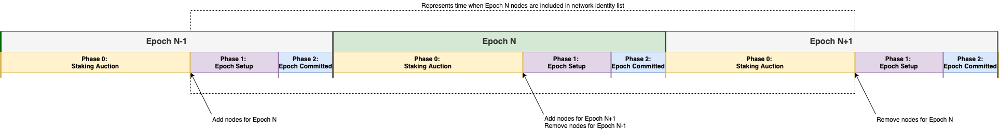

# Epochs Dynamic Node Startup

| Status        | (Proposed / Rejected / Accepted / Implemented)       |
:-------------- |:---------------------------------------------------- |
| **FLIP #**    | [752](https://github.com/onflow/flow/pull/752)       |
| **Author(s)** | Khalil Claybon (khalil.claybon@dapperlabs.com), Jordan Schalm (jordan@dapperlabs.com)       |
| **Sponsor**   | Khalil Claybon (khalil.claybon@dapperlabs.com), Jordan Schalm (jordan@dapperlabs.com)       |
| **Updated**   | 2022-01-11                                           |

## Objective

Define the tools provided the node software to facilitate starting a newly staked node at the appropriate
time during the epoch cycle.

## Background

Currently, node operators can only join or leave the network during network sporks. Epochs enable nodes to 
dynamically join and leave the network during the course of a spork, at epoch boundaries (once per week).

When a node joins the network, there is an optimal time window for that node to retrieve a root state snapshot
to initialize its protocol state, then begin following subsequent blocks. 

The root state snapshot is an inherently trusted input. Obtaining and validating this input in an efficient
and safe manner is an important but separate topic which this FLIP does not address. For the purposes of this FLIP
we make the assumption that an implementor of the Access API (eg. a trusted Access node) can provide this input. 

In order to follow progress on the network, new nodes must start up using a root snapshot in which they
are eligible to participate in network communications, so that they may receive subsequent blocks.
Nodes joining the network beginning Epoch N become eligible to participate in network communication in
the `EpochSetup` phase of the previous epoch (N-1). 

A new node wishing to join the network in Epoch N will go through these steps:
1. (Epoch N-1 / Staking Phase) Register the node to the staking contract with sufficient stake.
2. (Epoch N-1 / Staking Phase) Coordinate with service account administrators to have the new node included
in the allow-list.
3. (Epoch N-1 / Setup Phase) Obtain a root protocol state snapshot within the bounds of the Setup Phase.
4. (Epoch N-1 / Setup Phase) Initialize and start the new node. 

### Role-Specific Constraints

New nodes of any node role must be online with an up-to-date protocol state at the Epoch Switchover 
(beginning of Epoch N).

New collection nodes must submit a cluster QC vote during the EpochSetup Phase of Epoch N-1 -- 
they must be online with an up-to-date protocol state before the end of the EpochSetup Phase.

New consensus nodes must participate in the DKG during the EpochSetup Phase of Epoch N-1 -- 
they must be online with an up-to-date protocol state before the end of the first DKG phase 
(this translates to about 1 hour after the beginning of the EpochSetup Phase).

## Motivation

In order to simplify this process for operators, especially collection/consensus node operators where the timing
requirements are more strict, the node software should be able to detect when the EpochSetup phase begins and
bootstrap and start up the node. 

We need a mechanism that will allow node operators to configure their nodes to bootstrap and join the network 
at the appropriate epoch counter and phase. This mechanism will facilitate the process of joining the network 
at epoch boundaries as opposed to when sporks happen.

## User Benefit

Node operators will be able to join the network at any epoch boundary after staking operations have completed
without requiring manual intervention at the time when their node becomes eligible to participate in network communications.

## Design Proposal

### Dynamic-Join Node Startup Option

Implement an initialization hook which blocks regular component startup and: 
- Wait for specified epoch counter & phase.
- Retrieve protocol root snapshot using flow client.
- Continue with normal module initialization.

The following CLI arguments will be added:
- startup-epoch-counter: The epoch in which to start the node.
- startup-epoch-phase: The phase within the specified epoch in which to start the node.
- root-snapshot-dir: Directory where downloaded root snapshot should be saved when using
  the dynamic join functionality.
- dynamic-join: When enabled start node using mechanism described above.

### Flow-CLI Additions

For flexibility, add the ability to download a root protocol snapshot file via flow-cli which will enable 
operators to implement scripts and tooling for joining the network that fit their specific needs.

### Engineering Impact

The team coordinating each spork currently generates and distributes a root protocol snapshot 
to node operators over a trusted communication channel during sporks. These root spork snapshots
can be verified by comparing to the final snapshot of the prior spork.

A node joining the network using the process described in this FLIP must also 
allow the operator to download the root snapshot themselves either via flow-cli or part of the 
dynamic mechanism for starting a node. Because of this operators need to make sure that they are connecting 
to a trusted AN for the root snapshot.

### Drawbacks

None

### Best Practices

Operator documentation will be updated to reflect these changes.

### Tutorials and Examples

None

### Compatibility

Upgrades needed in the flow-cli:
- Option to connect to AN via secure GRPC connection.
- Command to download root protocol snapshot.

### User Impact

Operator documentation will be updated to reflect these changes.

## Related Issues

None

## Prior Art

None

## Questions and Discussion Topics

None
