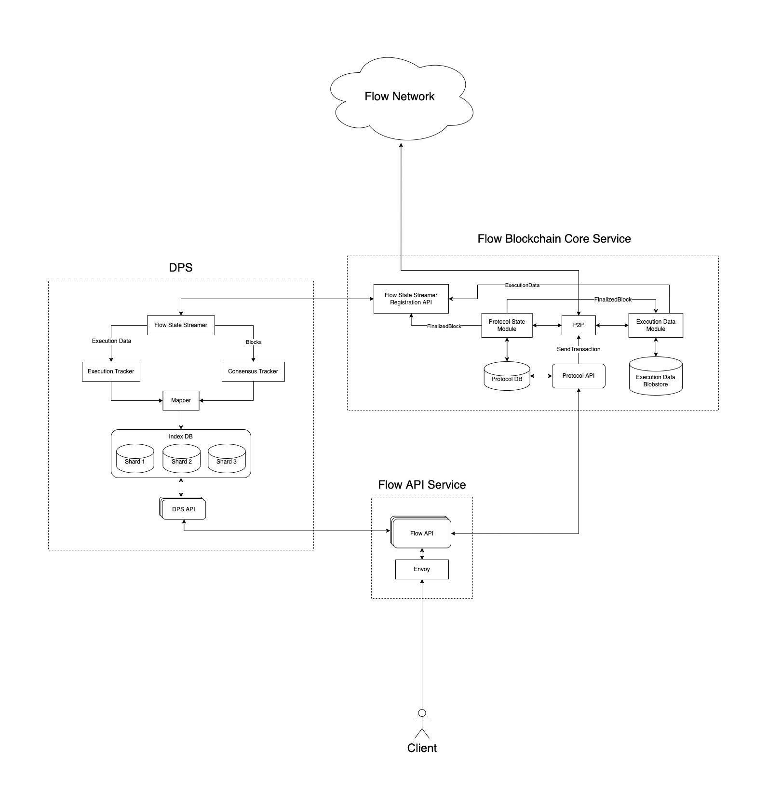

# Access Node Re-architecture

# Context

The Flow Access Node has not changed significantly since its launch, and has generally served its purpose as a gateway to Flow well. Even so, there are clear signs that the design of this part of Flow needs to evolve, whether to better support scalability or otherwise improve modularity of services and/or code. In addition, it has always been part of the vision to enable a permission-less and un-staked node type to simplify and democratize access to Flow for builders. 

In this document we propose a re-architecture of the Access Node to enable permission-less operation. We leverage DPS ([Flow Data Provisioning Service](https://github.com/optakt/flow-dps)) for state indexing and local script execution, greatly reducing load on Execution Nodes. The proposed changes also enable significantly improved horizontal scaling options for Flow operations.

This new architecture separates DPS and the Flow API Service into standalone, optional, components and enables more varied and flexible options for their assembly when deploying infrastructure. It makes possible the creation of an Access Node without a DPS and Flow API Service if needed, as well as other configurations enabling a wide range of use cases.

# Goals

- Completely separate the existing Access Node code into un-staked `Observer Service` and the staked `Access Node`
- Modularize the `Access API` from `Access Node` into its own process/service, which will be able to run against any `Blockchain Data Service`. We will refer to it as the `Flow API Service` going forward.
- The `Blockchain Data Service` encapsulates the live synchronization concerns provided through consensus follower and execution state sync. It provides access to that state through the `Protocol API` and the `State Streamer` interfaces.
- The `State Streamer` interface is a generic component which can allow any consumer, such as the `DPS`, to access the state tracked by the `Blockchain Data Service`.

# Non-goals

- Does not address long term historical access (see additional questions)
- Does not address operational issues for public node operators (rate-limiting, access control etc)

# Detail level objectives

- The handling of received raw protocol and execution state data is managed in the `Blockchain Data Service`. This state is provided to callers via the `Protocol API` and streamed to consumers of the `State Streamer`.
- `Blockchain Data Service` state is accessed using `State Streamer Registration API` and via `State Streamer` clients.
- `DPS` indexes execution state that has been delivered live from the protocol by `State Streamer`. The indexed state is used to answer script execution requests from the `DPS API`.

# Design

# In detail

To date the implementation of the Access Node has provided the following: 

- Participates as a *staked* node within the Flow network
- Participates in the private gossip network to follow protocol state
- Enforces rate limits and throttling of requests
- Handling of requests to the Access API from public callers for current live spork and
    - Performs basic request validation
    - Delegates script execution to upstream Execution Nodes
    - Delegates transactions to Collection Nodes for processing by the network

Script execution delegation to ENs is an obvious low hanging fruit limiting Access Node scalability and impacting transaction throughput capacity. In addition, scaling of Access API request handling is constrained by tight coupling of code within Access Node. The introduction of the DPS took the first step towards queryable locally held state that could be leveraged to scale Access Node, initially for protocol state only. Subsequently execution state sync provided the missing piece of the blockchain sync story. 

## Revised ownership and responsibility

By managing all chain synchronization concerns `Blockchain Data Service` provides a unified set of functionality that `Access Node` and `Observer Service` are built on, and which can be used as a standalone component for following trusted chain state more generally.

The new `Access Node` builds on the original node capabilities above: 

`Observer Service` is named as such due to it’s non-participation in the protocol

`DPS` has two limited changes proposed: extraction of consensus follower into `Blockchain Data Service`. Then deprecating GCP based execution state sync and switching all chain sync logic over to `State Streamer`. 

# Refactoring detailed diagrams
### Starting Point

### Refactor Step 1

### Build `Blockchain Core Service`

### Build `Flow API Service`

# Additional questions

- Historical access
    - This re-architecture does not support historical state since consensus follower is a live only concept. But this remains one of the most often mentioned requests.
    - This is also something we are hoping via Optakt in the longer term.
    - Effectively on ice.

### Original diagrams

Refactoring Phases: [https://app.diagrams.net/#G11AK8xmHLoiY0IfD2aZoWwvzi_5hVfm2r](https://app.diagrams.net/#G11AK8xmHLoiY0IfD2aZoWwvzi_5hVfm2r)
