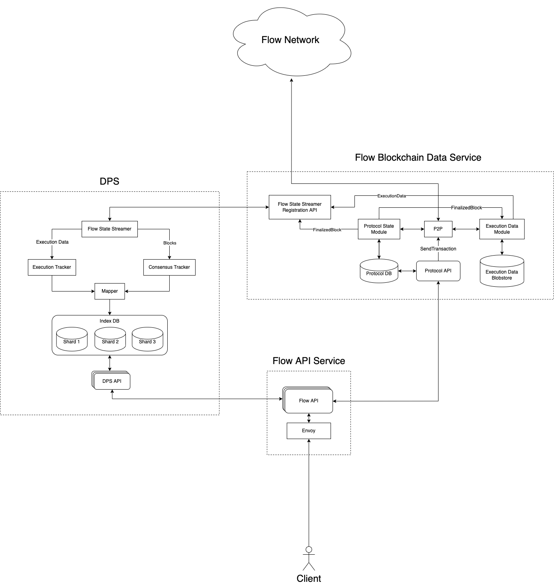
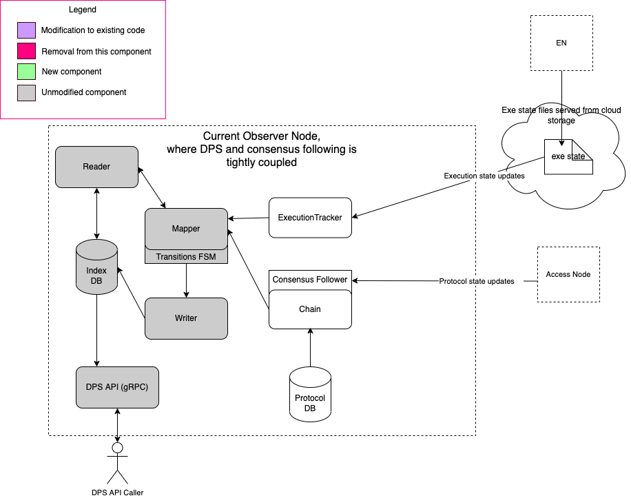
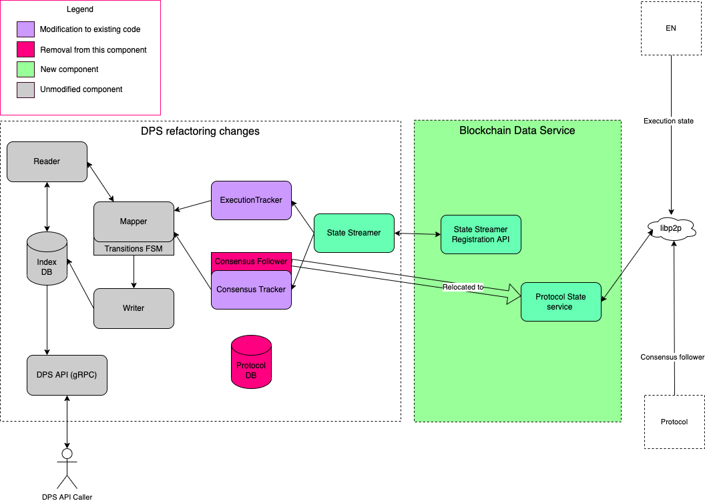
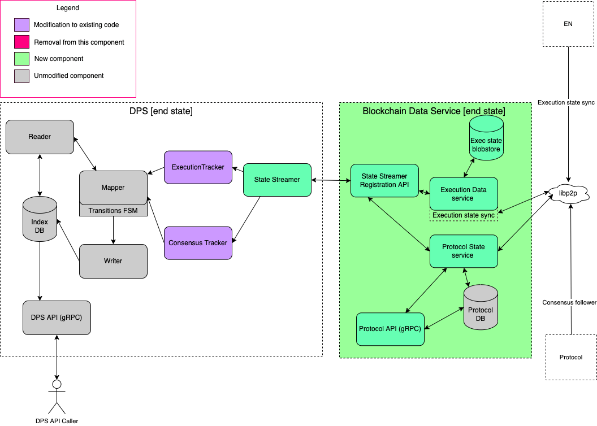
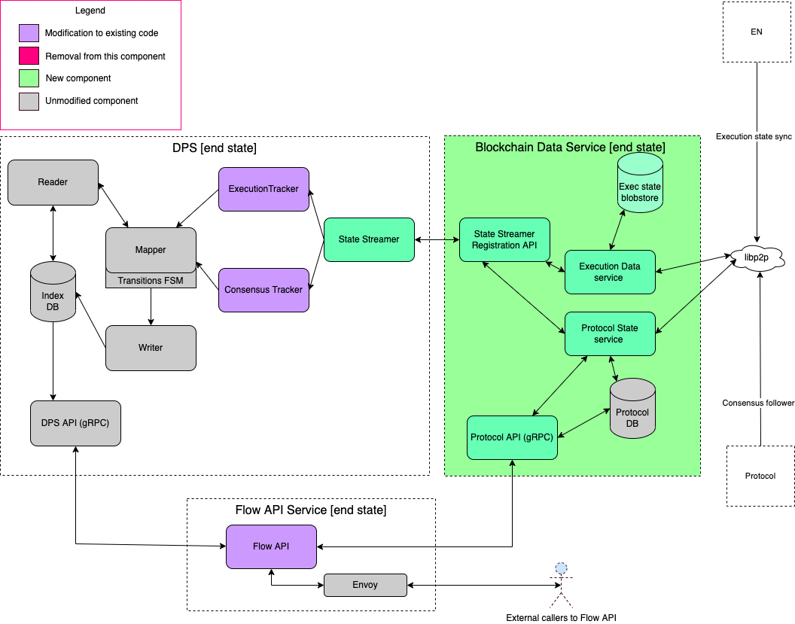

# Access Node Re-architecture

# Context

The Flow Access Node has not changed significantly since its launch, and has generally served its purpose well as the gateway to Flow. Even so, there are clear signs that the design of this part of Flow needs to evolve, to better support scalability and improve modularity of services and code. In addition, it has always been part of the vision to enable a permission-less and un-staked node type to simplify and democratize access to Flow for builders. 

In this document we propose a re-architecture of the Access Node to enable permission-less operation. We leverage DPS ([Flow Data Provisioning Service](https://github.com/optakt/flow-dps)) for state indexing and local script execution, greatly reducing load on Execution Nodes. The proposed changes also enable significantly improved horizontal scaling options for Flow operations.

This new architecture splits the existing Access Node monolith into the following components: 
- **Flow Blockchain Data Service** - encapsulates all direct interaction with the Flow network and participation in state synchronization protocols, and provides APIs that allow auxiliary components to query the blockchain state and subscribe to updates.
- **Flow Data Provisioning Service (DPS)** - consumes execution state updates from the Flow Blockchain Data Service to build a full execution state index that enables fast local script execution at arbitrary block heights.
- **Flow API Service** - provides a user-friendly way to query the blockchain state and send transactions to the network.

The Flow API Service and DPS become optional, auxiliary components, enabling more varied and flexible options for their assembly when deploying infrastructure.

# Goals

- Completely separate the existing Access Node code into un-staked `Observer Service` and the staked `Access Node`.
- Modularize the `Access API` from `Access Node` into its own process/service, which will be able to run against any `Blockchain Data Service`. We will refer to it as the `Flow API Service` going forward.
- The `Blockchain Data Service` encapsulates the live synchronization systems provided through consensus follower and execution state sync. It provides access to that state through the `Protocol API` and the `State Streamer` interfaces.
- The `State Streamer` interface is a generic component which can allow any consumer, such as the `DPS`, to access the state tracked by the `Blockchain Data Service`.

# Non-goals

- Does not address long term historical access (see additional questions)
- Does not address operational issues for public node operators (rate-limiting, access control etc)

# Detail level objectives

- The handling of raw protocol and execution state data received from the peer-to-peer network is managed in the `Blockchain Data Service`. This state is provided to callers via the `Protocol API` and streamed to consumers of the `State Streamer`.
- `Blockchain Data Service` state is accessed using `State Streamer Registration API` and via `State Streamer` clients.
- `DPS` indexes execution state that has been delivered live from the protocol by `State Streamer`. The indexed state is used to answer script execution requests from the `DPS API`.

# Design

# In detail

To date the implementation of the Access Node has provided the following: 

- Participates as a *staked* node within the Flow network
- Participates in the staked gossip network to follow protocol state
- Handling of requests to the Access API from public callers for current live spork and
    - Performs basic request validation
    - Delegates script execution to upstream Execution Nodes
    - Delegates transactions to Collection Nodes for processing by the network

Script execution delegation to ENs is an obvious low hanging fruit limiting Access Node scalability and impacting transaction throughput capacity. In addition, scaling of Access API request handling is constrained by tight coupling of code within Access Node. The introduction of the DPS took the first step towards queryable locally held state that could be leveraged to scale Access Node. Subsequently, execution state sync provided a decentralized way to share execution state across the network. 

## Revised ownership and responsibility

By managing all chain synchronization concerns `Blockchain Data Service` provides a unified set of functionality that `Access Node` and `Observer Service` are built on, and which can be used as a standalone component for following trusted chain state more generally. 

### Blockchain Data Service

- Follows protocol consensus and execution state sync
- Serves the `State Streamer API`
- Serves the `Protocol API`

The new `Access Node` builds on the original node capabilities above: 
### Access Node

- Participates as a *staked* node within the Flow network
- Stays up to date with protocol state and execution data
- Accepts new transactions, validates them, and forwards them to collection nodes
- Bridges the staked and public libp2p networks
    - Provides access to the Flow blockchain’s protocol and execution state via a public libp2p network that exposes the state sync and execution data sync protocols
    - Relays a subset of messages from the staked network to the public network

`Observer Service` is named as such due to its non-participation in the protocol
### Observer Service

- Participates in the Flow network as a consumer of public data without being staked or permissioned
- Stays up to date with protocol state and execution data
- Accepts new transactions, validates them, and forwards them to `Access Nodes`

### Flow API Service

- Deployed as a stand-alone service
- Exposes the external Flow `Access API`s (gRPC/REST)
- If `DPS` is deployed, it queries `DPS API` for execution state queries, otherwise returns an error
- Queries the downstream `Protocol API` on a node running `Blockchain Data Service` for protocol state
- Proxies send transaction requests
    - `Access Nodes` proxy transactions to the downstream `Protocol API`
    - `Observer Services` proxy transactions to a downstream `Access Node`

`DPS` has two limited changes proposed: extraction of consensus follower into `Blockchain Data Service`. Then deprecating GCP based execution state sync and switching all chain sync logic over to `State Streamer`. 

### Data Provisioning Service (DPS)

- Deployed as a stand-alone set of services
- Connects to an `Access Node` or `Observer Service` via the `State Streamer API`
- Uses `State Streamer API` to subscribe to protocol and execution state updates

### State Streamer and Streamer Registration API

- Provides an API for subscribing to protocol and execution state updates
- Served using 1:1 communication (likely gRPC over web sockets)
- Permissioned (not intended to be exposed to the public)
- Provides an abstraction layer so clients don’t need to interact with the Flow network directly
- The API accesses data from the `Execution Data Module` and `Protocol State Module`

# Refactoring detailed diagrams
### Starting Point

### Refactor Step 1

Non-structural considerations: 
- Formalize State Client and State API specification
- Establish correct libp2p network init at bootstrap based on configuration declaring either `Access Node` vs `Observer Service`

### Build `Blockchain Core Service`

### Build `Flow API Service`

# Additional questions

- Historical access
    - While this re-architecture doesn't support access to historical state directly in this initial architecture revision, it makes support possible in future and we are working with community partners to achieve this

